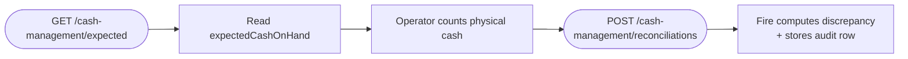

Returns the system-tracked sales and cash report for a store/day, used to determine what the cash drawer **should** contain before an operator counts. The response is dense — it covers all currencies, all payment methods (with cash-specific tendered/change/expected-on-hand values), per-channel and per-service totals, per-operator and per-device breakdowns, and a cancellation summary.

This is the primary input to [POST cash reconciliations](/en/api-reference/cash-reconciliations) — call this first, present `expectedCashOnHand` to the operator, then record their declared count.

## Authentication

<ParamField header="x-api-key" type="string" required>
  Your Fire API key with the `cash-management:read` scope. The key **must be vendor-scoped** — system-only keys are rejected with `403`.
</ParamField>

## Query parameters

<ParamField query="storeId" type="string" required>
  UUID of the store. Must belong to your API key's account/vendor.
</ParamField>

<ParamField query="businessDayDate" type="string">
  `YYYY-MM-DD`. The business day to report on. Defaults to the store's current operational day in its timezone.
</ParamField>

<ParamField query="operatorUid" type="string">
  Filter the report to a single cashier/operator. When omitted, the report covers all operators for the day.
</ParamField>

<RequestExample>
```http
GET https://api.fire.rest/v1/cash-management/expected?storeId=550e8400-e29b-41d4-a716-446655440000&businessDayDate=2026-05-06
x-api-key: <your_api_key>
```
</RequestExample>

## Response

<ResponseField name="store" type="object">
  Store-level metadata.

  <Expandable title="store">
    <ResponseField name="storeId" type="string">UUID.</ResponseField>
    <ResponseField name="storeCode" type="string | null">Store code (e.g. `BR-SP-001`).</ResponseField>
    <ResponseField name="storeName" type="string | null">Display name.</ResponseField>
    <ResponseField name="accountId" type="string">Account that owns the store.</ResponseField>
    <ResponseField name="vendorId" type="string | null">Vendor scope.</ResponseField>
    <ResponseField name="timezone" type="string | null">IANA timezone — used to compute the business day.</ResponseField>
  </Expandable>
</ResponseField>

<ResponseField name="businessDay" type="object">
  Status of the business day this report covers.

  <Expandable title="businessDay">
    <ResponseField name="date" type="string | null">`YYYY-MM-DD`.</ResponseField>
    <ResponseField name="state" type="string">`OPEN` or `CLOSED`.</ResponseField>
    <ResponseField name="openedAt" type="string | null">ISO 8601 UTC.</ResponseField>
    <ResponseField name="closedAt" type="string | null">ISO 8601 UTC. `null` while open.</ResponseField>
  </Expandable>
</ResponseField>

<ResponseField name="generatedAt" type="string">
  ISO 8601 UTC of when this report was computed. Snapshot — call again to refresh.
</ResponseField>

<ResponseField name="summary" type="object">
  Order counts at a glance.

  <Expandable title="summary">
    <ResponseField name="totalOrders" type="number">All orders for the scope.</ResponseField>
    <ResponseField name="completedOrders" type="number">`status=COMPLETED && paymentStatus=SUCCEEDED`.</ResponseField>
    <ResponseField name="openOrders" type="number">`status=OPEN`.</ResponseField>
    <ResponseField name="cancelledOrders" type="number">`status=CANCELLED`.</ResponseField>
    <ResponseField name="forceClosedOrders" type="number">Orders force-closed at day-close (system-driven).</ResponseField>
  </Expandable>
</ResponseField>

<ResponseField name="currencies" type="object[]">
  One entry per currency observed in the day. Most stores have one currency; multi-currency stores get one entry per.

  <Expandable title="currencies[n]">
    <ResponseField name="currency" type="string">ISO 4217.</ResponseField>
    <ResponseField name="sales" type="object">
      Aggregate revenue.
      <Expandable title="sales">
        <ResponseField name="gross" type="number">Total revenue before discounts/taxes.</ResponseField>
        <ResponseField name="net" type="number">After discounts.</ResponseField>
        <ResponseField name="taxes" type="number">Tax amount.</ResponseField>
        <ResponseField name="discounts" type="number">Total discount amount.</ResponseField>
        <ResponseField name="orderCount" type="number">Number of completed orders contributing.</ResponseField>
      </Expandable>
    </ResponseField>
    <ResponseField name="byPaymentMethod" type="object[]">
      One entry per payment processor used in the day.
      <Expandable title="byPaymentMethod[n]">
        <ResponseField name="processor" type="string">e.g. `cash`, `Kushki`, `MASTERCARD`, `voucher`.</ResponseField>
        <ResponseField name="transactionCount" type="number">All attempts.</ResponseField>
        <ResponseField name="approvedCount" type="number">`transactionStatus = APPROVED`.</ResponseField>
        <ResponseField name="rejectedCount" type="number">Declined / failed.</ResponseField>
        <ResponseField name="pendingCount" type="number">In-flight.</ResponseField>
        <ResponseField name="totalBilled" type="number">Sum of `totalBill` across approved transactions.</ResponseField>
        <ResponseField name="cashTendered" type="number | null">**Cash only** — total cash handed over by customers.</ResponseField>
        <ResponseField name="changeGiven" type="number | null">**Cash only** — total change returned.</ResponseField>
        <ResponseField name="expectedCashOnHand" type="number | null">
          **Cash only** — `cashTendered - changeGiven`. This is the canonical value to compare against the operator's declared count.
        </ResponseField>
      </Expandable>
    </ResponseField>
    <ResponseField name="byChannelAndService" type="object[]">
      Sales broken down by channel (`KIOSK`, `IFOOD`, `RAPPI`, `APP`, …) with sub-breakdowns by fulfillment service (`DELIVERY`, `DINE_IN`, `TAKEAWAY`, `PICKUP`).
    </ResponseField>
    <ResponseField name="byOperator" type="object[]">
      Per cashier/operator: `operatorUid`, `operatorName`, `orderCount`, `total`. Useful for shift-end reports.
    </ResponseField>
    <ResponseField name="byDevice" type="object[]">
      Per device: `deviceUid`, `deviceName`, `orderCount`, `total`.
    </ResponseField>
    <ResponseField name="byOperatorAndPaymentMethod" type="object[]">
      Cross-cut: per operator, the same `byPaymentMethod` shape. Use this to compute the expected cash on hand **per cashier** when running a multi-cashier reconciliation.
    </ResponseField>
    <ResponseField name="cancelled" type="object">
      `count`, `totalLost` (revenue lost to cancellations), and `byReason` array (`reason`, `count`, `total`).
    </ResponseField>
    <ResponseField name="pendingRisk" type="object">
      Risk indicators: `openOrdersTotal`, `paymentPendingTotal`, `paymentFailedTotal`. Use to flag uncertain revenue at close.
    </ResponseField>
  </Expandable>
</ResponseField>

<ResponseExample>
```json 200 — abbreviated
{
  "store": {
    "storeId": "550e8400-e29b-41d4-a716-446655440000",
    "storeCode": "BR-SP-001",
    "storeName": "Loja Centro - SP",
    "accountId": "100",
    "vendorId": "v_blueco_br",
    "timezone": "America/Sao_Paulo"
  },
  "businessDay": {
    "date": "2026-05-06",
    "state": "OPEN",
    "openedAt": "2026-05-06T06:00:00.000Z",
    "closedAt": null
  },
  "generatedAt": "2026-05-06T16:50:00.000Z",
  "summary": {
    "totalOrders": 157,
    "completedOrders": 152,
    "openOrders": 3,
    "cancelledOrders": 2,
    "forceClosedOrders": 0
  },
  "currencies": [
    {
      "currency": "BRL",
      "sales": {
        "gross": 4523.50,
        "net": 4350.25,
        "taxes": 623.75,
        "discounts": 173.25,
        "orderCount": 152
      },
      "byPaymentMethod": [
        {
          "processor": "cash",
          "transactionCount": 95,
          "approvedCount": 95,
          "rejectedCount": 0,
          "pendingCount": 0,
          "totalBilled": 2250.00,
          "cashTendered": 2350.00,
          "changeGiven": 100.00,
          "expectedCashOnHand": 2250.00
        },
        {
          "processor": "MASTERCARD",
          "transactionCount": 57,
          "approvedCount": 55,
          "rejectedCount": 1,
          "pendingCount": 1,
          "totalBilled": 2100.25,
          "cashTendered": null,
          "changeGiven": null,
          "expectedCashOnHand": null
        }
      ],
      "byChannelAndService": [
        {
          "channel": "KIOSK",
          "orderCount": 95,
          "total": 2850.50,
          "services": [{ "service": "DINE_IN", "orderCount": 95, "total": 2850.50 }]
        }
      ],
      "byOperator": [
        { "operatorUid": "op-cashier-123", "operatorName": "Operator Name", "orderCount": 75, "total": 2200.00 }
      ],
      "byDevice": [
        { "deviceUid": "device-uuid-1", "deviceName": "Terminal 1", "orderCount": 152, "total": 4350.25 }
      ],
      "byOperatorAndPaymentMethod": [
        {
          "operatorUid": "op-cashier-123",
          "operatorName": "Operator Name",
          "byPaymentMethod": [
            {
              "processor": "cash",
              "transactionCount": 75,
              "approvedCount": 75,
              "rejectedCount": 0,
              "pendingCount": 0,
              "totalBilled": 2200.00,
              "cashTendered": 2300.00,
              "changeGiven": 100.00,
              "expectedCashOnHand": 2200.00
            }
          ]
        }
      ],
      "cancelled": {
        "count": 2,
        "totalLost": 95.50,
        "byReason": [
          { "reason": "Customer Request", "count": 1, "total": 45.00 },
          { "reason": "System Error",     "count": 1, "total": 50.50 }
        ]
      },
      "pendingRisk": {
        "openOrdersTotal": 189.75,
        "paymentPendingTotal": 150.00,
        "paymentFailedTotal": 39.75
      }
    }
  ]
}
```

```json 400 — invalid storeId
{
  "error": {
    "code": "validation_error",
    "message": "storeId must be a UUID"
  }
}
```

```json 403 — system-only key (account binding missing)
{
  "error": {
    "code": "forbidden",
    "message": "cash-management endpoints require a vendor-scoped API key"
  }
}
```

```json 404 — store not found / not in your scope
{
  "error": {
    "code": "not_found",
    "message": "Store not found"
  }
}
```
</ResponseExample>

## How to use this with reconciliation



The canonical `expectedCashOnHand` to compare against is per-currency, per-payment-method `cash`. For per-cashier closes, drill into `byOperatorAndPaymentMethod[i].byPaymentMethod` and find the `cash` entry — that's the operator-specific expected.

## Common patterns

- **Real-time end-of-shift dashboard.** Poll this endpoint every few minutes during a busy day to show running totals; freeze the snapshot at shift close.
- **Per-cashier close.** Filter with `operatorUid=...` to get just that cashier's totals; record their reconciliation against `byOperatorAndPaymentMethod[].byPaymentMethod[cash].expectedCashOnHand`.
- **Multi-currency stores.** Iterate over `currencies[]` — each entry is independent; reconcile each currency separately.
- **Pending risk.** Surface `pendingRisk.paymentFailedTotal` and `pendingRisk.openOrdersTotal` to operators before they close — these are amounts the system can't confirm.

## Related

<CardGroup cols={2}>
  <Card title="Cash reconciliations" icon="abacus" href="/en/api-reference/cash-reconciliations">
    Record the operator's count after reading expected cash here.
  </Card>
  <Card title="Authentication" icon="lock" href="/en/authentication">
    Vendor-scoped API keys and the `cash-management:read` scope.
  </Card>
</CardGroup>
