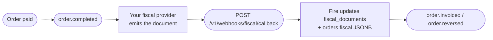

This endpoint is **inbound** — your fiscal provider POSTs to it whenever a fiscal document is authorized, rejected, denied, cancelled, or errors out. It is the **canonical, multi-country fiscal callback API** that accepts payloads from BR, CO, EC, CL, AR, VE. Fire validates the payload, stores the authority's verdict on the order, and dispatches `order.invoiced` / `order.reversed` to your Integration Flows — for every country. What you send here is what the event consumers read: see [From the callback to the events](#from-the-callback-to-the-events).

<Note>
  **This endpoint is asynchronous.** Fire authenticates, runs the source-of-truth + tenant guard, deduplicates, pre-marks the order as `processing`, and **enqueues** the callback — then returns **`202 Accepted`** with a `webhookEventId` (typically in under 100&nbsp;ms). The `fiscal_documents` / `orders.fiscal` update happens a moment later in a background worker (usually within ~2&nbsp;seconds). To check the processing outcome, poll [`GET /v1/webhooks/events/{webhookEventId}`](#checking-the-outcome). Client-fixable problems (bad payload, wrong `eventId`, wrong tenant, action reusing another event's id) are rejected **synchronously** with `4xx` **before** the `202`.
</Note>

## How it complements `order.completed` and `order.cancelled`

`order.completed` and `order.cancelled` carry an order's **business state**. The fiscal callback carries the **fiscal state** (SEFAZ / DIAN / SRI / SII / AFIP / SENIAT authorization). Together they form the lifecycle below:



After an `authorized` callback is processed, Fire emits [`order.invoiced`](/en/events/order-invoiced); after a `cancelled` one, [`order.reversed`](/en/events/order-reversed). Both fire **for every country** — the country travels in the event's fiscal block, not in its name. Later order events for the same `orderId` also reflect the new status in `data.lastKnown.fiscal`.

## Authentication

This endpoint requires an **API key with the `webhooks:fiscal` scope**, vendor-scoped to the account that owns the order. Unscoped or account-only keys are rejected with `403 Forbidden`.

<ParamField header="x-api-key" type="string" required>
  Your Fire API key. Generate one from the dashboard at **Settings → API Keys → Developer keys**, with scope `webhooks:fiscal` and a vendor binding for the account whose orders this key may update.
</ParamField>

<ParamField header="Authorization" type="string">
  Optional `Bearer <token>`. Not currently required for this endpoint, but reserved for future provider-issued tokens.
</ParamField>

## Request body

The body is a JSON object with these top-level fields. **Everything canonical lives up here**; `document` carries ONLY your country authority vocabulary, picked by `country` — see [Document by country](#document-by-country) below.

<ParamField body="country" type="string" required>
  ISO 3166-1 alpha-2 country code. One of `BR`, `CO`, `EC`, `CL`, `AR`, `VE`. Determines the validation rules for the `document` object.

  **Formerly named `countryCode`.**
</ParamField>

<ParamField body="eventType" type="string" required>
  Document state. One of:
  - `fiscal_graphic` — the provider is delivering the **representación gráfica** (the printable artifact) for the document. **It is not an approval** and not a terminal state — see [The `fiscal_graphic` state](#the-fiscal_graphic-state) below.
  - `authorized` — the fiscal authority approved the document
  - `cancelled` — a previously authorized document was cancelled
  - `rejected` — the document was rejected (validation, schema, signature)
  - `denied` — the authority denied the request (typically a permanent business rule failure)
  - `error` — a non-recoverable error occurred at the provider or authority

  When `eventType` is `fiscal_graphic`, `authorized` or `cancelled`, the `document` field is **required**. When it is `rejected`, `denied`, or `error`, the `failure` field is **required** instead.
</ParamField>

<ParamField body="providerEventId" type="string" required>
  Your provider's own id for this delivery. Stored for audit/forensics — **it is not the idempotency key**. Fire deduplicates on `(orderId, eventId)`, so you may safely send a fresh `providerEventId` on every retry without creating duplicates. Use the provider's native event id if available; otherwise a UUID.
</ParamField>

<ParamField body="occurredAt" type="string" required>
  ISO 8601 UTC timestamp of when the event happened at the fiscal authority (not when the provider sent the callback).
</ParamField>

<ParamField body="orderId" type="string" required>
  UUID of the order in Fire. Matches `data.orderId` in `order.completed` and `order.cancelled` events. Fire uses this to find the existing fiscal document.
</ParamField>

<ParamField body="eventId" type="string" required>
  Correlation UUID **and idempotency key** (together with `orderId`). It must be the `event.id` of a V4 envelope **Fire emitted for this order** — echo it exactly; never invent it.

  - **Source-of-truth check.** An `eventId` that does not reference a Fire event for that order is rejected with `400` before the `202`.
  - **Each action carries its own event.** Echo the `event.id` of the event that drove *this* action — the `order.invoiced` emission for an `authorized` callback, the cancellation/reversal event for a `cancelled` callback. Reusing one action's `eventId` for a different terminal `eventType` (e.g. a `cancelled` that echoes the `authorized`'s `eventId`) is rejected with **`409`** — a cancellation must reference its **own** event, not ride on the authorization's. See [Idempotency & scenarios](#idempotency-&-scenarios).
</ParamField>

<ParamField body="document" type="object">
  Your country authority vocabulary, and **nothing else**: `claveAcceso`, `cufe`, `chaveAcesso`, `folio`, `cae`… **Required** when `eventType` is `authorized`, `cancelled` or `fiscal_graphic`. See [Document by country](#document-by-country).

  The common fields —`documentType`, the number, the URLs, the amounts, the dates— **do not live in here**: they are at the root. Everything in `document` reaches the events as `authority.countryData`, with the same key names.
</ParamField>

### Canonical fields (root)

They mean the same thing in all six countries, so they live at the **root** of the payload rather than inside `document`. Same rule as the fiscal numbering response, so the same fact is never looked up at two different depths depending on which path it came in through.

<ParamField body="documentType" type="string">
  `SALE_INVOICE` or `CREDIT_NOTE` — the same vocabulary as the fiscal numbering. **Required when there is a document** (`authorized` / `cancelled`), and it must match the event: `authorized` is a `SALE_INVOICE`, `cancelled` is a `CREDIT_NOTE`. Any other combination returns `400`.

  **Formerly `docType: "invoice" | "cancellation"`.** The old name is **ignored**, not translated: an `authorized` or `cancelled` payload that carries only `docType` receives `400` on `documentType`.
</ParamField>

<ParamField body="docSubtype" type="string">
  What your regime calls it: `nfce`, `nfe`, `factura`, `boleta`, `factura_a`. Open: we do not validate it against a list and it **branches nothing** on our side — it is referential. **Required when there is a document.**
</ParamField>

<ParamField body="documentNumber" type="string">
  The document's **visible** number, as the authority composes it (`12388`, `001-020-000000123`, `C012001`). The pieces it is built from still travel in `document` with the country's names. **Required on `authorized`**: Fire no longer deduces it.
</ParamField>

<ParamField body="issuedAt" type="string">
  UTC date/time (ISO 8601) the document was **issued**. Same name as in the fiscal numbering response. **Required on `authorized`.**
</ParamField>

<ParamField body="authorizedAt" type="string">
  UTC date/time (ISO 8601) the authority **approved** the document — a different fact from `issuedAt`. They can be seconds apart (online authorization) or hours apart (contingency authorized when the connection returns). Optional; when absent, event consumers see `authority.authorizedAt: null`. On a cancellation use `cancelledAt` instead.
</ParamField>

<ParamField body="cancelledAt" type="string">
  UTC date/time the authority approved the cancellation. Send it on `cancelled`.
</ParamField>

<ParamField body="authorizationMode" type="string">
  `ONLINE`, `OFFLINE` or `BATCH`. `OFFLINE` is contingency: the document is valid but was issued without reaching the authority, and some regimes require the receipt to say so (the Ecuadorian RIDE prints `EMISION POR CONTINGENCIA`).
</ParamField>

<ParamField body="pdfUrl" type="string">
  Download link for the PDF (DANFE / RIDE). HTTPS, downloadable by direct GET, valid for at least 24 h — Fire archives it. **Required** for `authorized` and `cancelled`.
</ParamField>

<ParamField body="xmlUrl" type="string">
  Download link for the authority's legal XML. Same conditions as `pdfUrl`. **Required** for `authorized` and `cancelled`.
</ParamField>

<ParamField body="totalAmount" type="number">
  Gross total of the document, in real decimals (not scaled). **Required on `authorized`.**
</ParamField>

<ParamField body="taxAmount" type="number">
  Total tax of the document, in real decimals. **Required on `authorized`.**
</ParamField>

<ParamField body="currencyCode" type="string">
  ISO 4217 code — exactly 3 letters (`BRL`, `COP`, `USD`). **Required on `authorized`.**
</ParamField>

<ParamField body="providerDocId" type="string">
  The document's id in your system. It is what the PDF and XML are fetched by and what a cancellation is requested with. **Required on `authorized`.**
</ParamField>

<ParamField body="graphic" type="object">
  What gets printed: a map of key → exact string to encode (`{ "qr": "…" }`, `{ "ted": "…" }`). The key names the purpose; how it is drawn is the receipt template's choice. It sits at the root, next to `document`, as in the fiscal numbering response. **Required and non-empty on `fiscal_graphic`**; optional otherwise.
</ParamField>

<ParamField body="provider" type="object">
  Who issued it and with what version.

  <Expandable title="provider">
    <ParamField body="name" type="string">Provider name (`hio.fiscalization`, `plugnotas`).</ParamField>
    <ParamField body="version" type="string">Issuer version.</ParamField>
    <ParamField body="reference" type="string">Free-form reference.</ParamField>
  </Expandable>
</ParamField>

<ParamField body="failure" type="object">
  Why there is NO document. **Required** when `eventType` is `rejected`, `denied` or `error`.

  **Formerly named `error`**, and it now carries the same shape as the fiscal numbering response.

  <Expandable title="failure">
    <ParamField body="code" type="string">
      Optional provider/authority error code (e.g. `DIAN_42`, `cStat_204`).
    </ParamField>
    <ParamField body="scope" type="string">
      `TECHNICAL` or `FUNCTIONAL`. This is what the channel branches on: with `TECHNICAL` the document may still be issued and the receipt prints "pending"; with `FUNCTIONAL` the authority rejected its content and it will not be issued.
    </ParamField>
    <ParamField body="message" type="string" required>
      Human-readable message. At least 1 character.
    </ParamField>
    <ParamField body="details" type="array">
      Field-by-field detail, when the authority provides it.
    </ParamField>
  </Expandable>
</ParamField>

<ParamField body="metadata" type="object">
  Free-form bag for provider-specific extras (raw response, internal IDs, etc.). Not validated; it reaches the audit log and is **not** stored alongside the document.

  **Formerly named `providerSpecific`.**
</ParamField>

<Warning>
  **The root takes no extra keys.** Only the fields above are read; any other root key is **silently discarded** — it is not rejected. `orderCode` is not part of the contract — the order is resolved by `orderId`.
</Warning>

### What is required, per event

| Field | **Not part of the contract.** Accepted and carried into `countryData` untouched; Fire never reads it |
|---|---|---|---|---|
| `document` | required | required | required | — |
| `documentType` | `SALE_INVOICE` | `CREDIT_NOTE` | — | — |
| `docSubtype` | required | required | — | — |
| `pdfUrl`, `xmlUrl` | required | required | — | — |
| `documentNumber`, `providerDocId`, `issuedAt` | required | — | — | — |
| `totalAmount`, `taxAmount`, `currencyCode` | required | — | — | — |
| `graphic` | optional | optional | required, non-empty | — |
| `failure` | — | — | — | required |

`authorizedAt`, `cancelledAt`, `authorizationMode` and `provider` are always optional. A required field sent as `null` counts as missing.

## Document by country

The required shape of `document` depends on `country`. **`document` carries ONLY that country authority identifiers** — the fields common to all six live at the root of the payload, above.

<Warning>
  **`document` changed contents**

  Until now `document` mixed two things: what means the same in every country —`docType`,
  `pdfUrl`, `xmlUrl`, the amounts, the dates— and each authority own vocabulary. That mix
  propagated to everything that read the callback.

  Now **the canonical fields live at the root** and `document` keeps only the regime's. Same
  shape as the fiscal numbering response: the same fact, in the same place, regardless of
  which path it came in through.

  Other changes in the same batch: `countryCode` → `country`, `docType` → `documentType`
  (`SALE_INVOICE` / `CREDIT_NOTE`, no alias), `error` → `failure` (with `scope` and
  `details`), `providerSpecific` → `metadata`, and `emittedAt` → `issuedAt`. New at the root:
  `documentNumber`, `authorizedAt` and `graphic`.
</Warning>

<Tabs>
  <Tab title="Brazil (BR)">
    Brazilian fiscal documents (NF-e / NFC-e). Use this country code when sending callbacks from any BR fiscal provider.

    In addition to the [canonical root fields](#canonical-fields-root) (`documentType`, `docSubtype`, `documentNumber`, `pdfUrl`, `xmlUrl`, `issuedAt`, etc.), BR requires these specific identifiers:

    | Field | Type | Required | Notes |
    |---|---|---|---|
    | `chaveAcesso` | string | ✓ | Exactly 44 digits — SEFAZ access key |
    | `protocolo` | string | ✓ | SEFAZ authorization protocol |
    | `numero` | int / string | ✓ | Document number |
    | `serie` | int / string \| null | | Document series (encoded in chave) |
    | `modelo` | `55` / `65` \| null | | `55` = NF-e, `65` = NFC-e |
    | `cnpjEmitente` | string \| null | | **Not part of the contract.** Accepted and carried into `countryData` untouched; Fire never reads it |

    The example below is a complete `authorized` payload: every root field it shows is **required** for that event — see [What is required, per event](#what-is-required-per-event).

    ```json
    {
      "country": "BR",
      "eventType": "authorized",
      "providerEventId": "evt-br-1",
      "occurredAt": "2026-04-26T14:32:11.000Z",
      "orderId": "550e8400-e29b-41d4-a716-446655440000",
      "eventId": "7c9e6679-7425-40de-944b-e07fc1f90ae7",
      "documentType": "SALE_INVOICE",
      "docSubtype": "nfce",
      "documentNumber": "1",
      "issuedAt": "2026-04-26T14:32:10.000Z",
      "totalAmount": 142.90,
      "taxAmount": 18.57,
      "currencyCode": "BRL",
      "pdfUrl": "https://api.fiscal-provider.example/nfce/69fa97fe427d1240856e1282/pdf",
      "xmlUrl": "https://api.fiscal-provider.example/nfce/69fa97fe427d1240856e1282/xml",
      "providerDocId": "69fa97fe427d1240856e1282",
      "document": {
        "chaveAcesso": "35260229062609000177650500000000011000000010",
        "protocolo": "141210001176277",
        "numero": 1,
        "serie": 50,
        "modelo": 65
      }
    }
    ```
  </Tab>

  <Tab title="Colombia (CO)">
    Colombian fiscal documents (DIAN).

    | Field | Type | Required | Notes |
    |---|---|---|---|
    | `cufe` | string | ✓ | DIAN unique fiscal code |
    | `prefijo` | string | ✓ | Document prefix |
    | `numeroDian` | string | ✓ | DIAN document number |
    | `qrCode` | string (URL) \| null | | QR for the printed document |
    | `numeroComprobante` | string \| null | | The **visible** number, already assembled: `prefix + consecutive` |
    | `ambiente` | `"1"` \| `"2"` \| null | | **`1` production · `2` testing** — the opposite of the SRI |

    ```json
    {
      "country": "CO",
      "eventType": "authorized",
      "providerEventId": "evt-co-1",
      "occurredAt": "2026-04-26T14:32:11.000Z",
      "orderId": "550e8400-e29b-41d4-a716-446655440000",
      "eventId": "7c9e6679-7425-40de-944b-e07fc1f90ae7",
      "documentType": "SALE_INVOICE",
      "docSubtype": "factura",
      "documentNumber": "C012001",
      "issuedAt": "2026-04-26T14:32:10.000Z",
      "totalAmount": 95000.00,
      "taxAmount": 15170.17,
      "currencyCode": "COP",
      "pdfUrl": "https://api.fiscal-provider.example/dian/C012001/pdf",
      "xmlUrl": "https://api.fiscal-provider.example/dian/C012001/xml",
      "providerDocId": "C012001",
      "document": {
        "cufe": "633732c7a2a577bfa1828551e64d03f715f0",
        "prefijo": "C012",
        "numeroDian": "001",
        "numeroComprobante": "C012001",
        "ambiente": "1",
        "qrCode": "https://catalogo-vpfe.dian.gov.co/document/searchqr?documentkey=633732c7a2a577bfa1828551e64d03f715f0"
      }
    }
    ```

    <Note>
      **The names are the same as in the numbering**, deliberately: `cufe`, `prefijo`,
      `numeroDian`, `numeroComprobante`, `qrCode` and `ambiente` mean exactly the same here as
      in the prekey response. It is the same document told twice, and if the names diverged,
      reconciling both paths would stop being a matter of comparing fields.

      **`numeroDian` goes without the prefix** (`990000001`, not `SETP990000001`). The assembled
      number is `numeroComprobante`. Sending the assembled one in both makes reconciliation
      compare `SETP990000001` against `990000001`, and they never match.

      Both fields are **optional inside `document`**: whoever already sends callbacks without them
      keeps working. That does not extend to the root: the fields listed in
      [What is required, per event](#what-is-required-per-event) are required, and a callback missing
      them receives `400`.
    </Note>
  </Tab>

  <Tab title="Ecuador (EC)">
    Ecuadorian fiscal documents (SRI).

    | Field | Type | Required | Notes |
    |---|---|---|---|
    | `claveAcceso` | string | ✓ | Exactly 49 digits — SRI access key |
    | `numeroComprobante` | string \| null | | The **visible** number, already assembled: `estab-ptoEmi-secuencial` |
    | `ambiente` | `'1'` / `'2'` \| null | | `1` = test, `2` = production |
    | `establecimiento` | string \| null | | Establishment code (`001`) |
    | `puntoEmision` | string \| null | | Emission point code (`020`) |
    | `secuencial` | string \| null | | Document sequence number (`000000123`) |

    <Note>
      **`numeroAutorizacion` was removed from the contract.** Under the online authorization
      scheme the SRI returns **the access key itself** as the authorization number, so it was
      the same fact declared twice. If your system keeps sending it nothing breaks
      —undeclared fields are preserved— but we neither require nor interpret it. Read
      `claveAcceso` when you need the authorization number.

      **The three parts of the number** —`establecimiento`, `puntoEmision`, `secuencial`— now
      exist on both paths: pre-emission numbering and this callback. They are **optional**: if
      your provider does not emit them, do not send them. Fire does not derive them from
      `claveAcceso` —that rule belongs to the regime— and the receipt prints without them.
    </Note>

    ```json
    {
      "country": "EC",
      "eventType": "authorized",
      "providerEventId": "evt-ec-1",
      "occurredAt": "2026-04-26T14:32:11.000Z",
      "orderId": "550e8400-e29b-41d4-a716-446655440000",
      "eventId": "7c9e6679-7425-40de-944b-e07fc1f90ae7",
      "documentType": "SALE_INVOICE",
      "docSubtype": "factura",
      "documentNumber": "001-020-000000123",
      "issuedAt": "2026-04-26T14:32:10.000Z",
      "totalAmount": 24.50,
      "taxAmount": 3.15,
      "currencyCode": "USD",
      "pdfUrl": "https://api.fiscal-provider.example/sri/AUT-EC-001/pdf",
      "xmlUrl": "https://api.fiscal-provider.example/sri/AUT-EC-001/xml",
      "providerDocId": "AUT-EC-001",
      "document": {
        "numeroComprobante": "001-020-000000123",
        "claveAcceso": "0102030405060708091011121314151617181920212223242",
        "establecimiento": "001",
        "puntoEmision": "020",
        "secuencial": "000000123",
        "ambiente": "2"
      }
    }
    ```
  </Tab>

  <Tab title="Chile (CL)">
    Chilean fiscal documents (SII DTE).

    | Field | Type | Required | Notes |
    |---|---|---|---|
    | `folio` | int / string | ✓ | DTE folio number |
    | `ted` | string | ✓ | TED (Timbre Electrónico) — base64 or XML fragment |
    | `tipoDte` | int / string | ✓ | DTE type (e.g. `33` = factura electrónica) |
    | `trackId` | string \| null | | SII tracking ID for follow-up queries |

    ```json
    {
      "country": "CL",
      "eventType": "authorized",
      "providerEventId": "evt-cl-1",
      "occurredAt": "2026-04-26T14:32:11.000Z",
      "orderId": "550e8400-e29b-41d4-a716-446655440000",
      "eventId": "7c9e6679-7425-40de-944b-e07fc1f90ae7",
      "documentType": "SALE_INVOICE",
      "docSubtype": "factura",
      "documentNumber": "12345",
      "issuedAt": "2026-04-26T14:32:10.000Z",
      "totalAmount": 18900,
      "taxAmount": 3019,
      "currencyCode": "CLP",
      "pdfUrl": "https://api.fiscal-provider.example/sii/12345/pdf",
      "xmlUrl": "https://api.fiscal-provider.example/sii/12345/xml",
      "providerDocId": "12345",
      "document": {
        "folio": 12345,
        "ted": "<TED>...base64-or-xml...</TED>",
        "tipoDte": 33,
        "trackId": "SII-TRK-998877"
      }
    }
    ```
  </Tab>

  <Tab title="Argentina (AR)">
    Argentine fiscal documents (AFIP).

    | Field | Type | Required | Notes |
    |---|---|---|---|
    | `cae` | string | ✓ | Código de Autorización Electrónico |
    | `fechaVtoCae` | string | ✓ | CAE expiration date |
    | `puntoVenta` | int / string | ✓ | Point of sale number |
    | `numeroComprobante` | int / string | ✓ | Document number |
    | `tipoComprobante` | int / string | ✓ | Document type (`1` = factura A, …) |

    ```json
    {
      "country": "AR",
      "eventType": "authorized",
      "providerEventId": "evt-ar-1",
      "occurredAt": "2026-04-26T14:32:11.000Z",
      "orderId": "550e8400-e29b-41d4-a716-446655440000",
      "eventId": "7c9e6679-7425-40de-944b-e07fc1f90ae7",
      "documentType": "SALE_INVOICE",
      "docSubtype": "factura_a",
      "documentNumber": "0001-00012345",
      "issuedAt": "2026-04-26T14:32:10.000Z",
      "totalAmount": 12100.00,
      "taxAmount": 2100.00,
      "currencyCode": "ARS",
      "pdfUrl": "https://api.fiscal-provider.example/afip/0001-12345/pdf",
      "xmlUrl": "https://api.fiscal-provider.example/afip/0001-12345/xml",
      "providerDocId": "0001-12345",
      "document": {
        "cae": "74256178925412",
        "fechaVtoCae": "2026-05-31",
        "puntoVenta": 1,
        "numeroComprobante": 12345,
        "tipoComprobante": 1
      }
    }
    ```
  </Tab>

  <Tab title="Venezuela (VE)">
    Venezuelan fiscal documents (SENIAT).

    | Field | Type | Required | Notes |
    |---|---|---|---|
    | `numeroControl` | string | ✓ | Number from the control range issued by SENIAT |
    | `numeroFactura` | string | ✓ | Invoice number |
    | `rifEmisor` | string \| null | | Emitter RIF |

    ```json
    {
      "country": "VE",
      "eventType": "authorized",
      "providerEventId": "evt-ve-1",
      "occurredAt": "2026-04-26T14:32:11.000Z",
      "orderId": "550e8400-e29b-41d4-a716-446655440000",
      "eventId": "7c9e6679-7425-40de-944b-e07fc1f90ae7",
      "documentType": "SALE_INVOICE",
      "docSubtype": "factura",
      "documentNumber": "12345",
      "issuedAt": "2026-04-26T14:32:10.000Z",
      "totalAmount": 480.00,
      "taxAmount": 76.80,
      "currencyCode": "VES",
      "pdfUrl": "https://api.fiscal-provider.example/seniat/00-00012345/pdf",
      "xmlUrl": "https://api.fiscal-provider.example/seniat/00-00012345/xml",
      "providerDocId": "00-00012345",
      "document": {
        "numeroControl": "00-00012345",
        "numeroFactura": "12345",
        "rifEmisor": "J-12345678-9"
      }
    }
    ```
  </Tab>
</Tabs>

## The `fiscal_graphic` state

`fiscal_graphic` reports that your provider is delivering the **representación gráfica** — the printable artifact (PDF / RIDE / DANFE) for the document. It is a **state of its own**, not an outcome:

- **It is not an approval.** Receiving `fiscal_graphic` says nothing about whether the authority approved the document. Fire stores the graphic and the document stays non-terminal.
- **It is optional.** If your provider has no graphic for a document, send `authorized` (or any terminal state) **directly** — no `fiscal_graphic` is required first. Both flows are valid.
- **It can share the `eventId` with its outcome.** The graphic and the terminal result belong to the same action, so you may send `fiscal_graphic` and then `authorized` / `rejected` / `denied` / `cancelled` reusing the **same** `eventId`. That is not a conflict and never returns `409` — see [Idempotency & scenarios](#idempotency-&-scenarios).
- **It requires `document` and a non-empty `graphic`.** The graphic representation is what the till prints — the QR, the TED, the encoded access key — and it travels in the root `graphic`. The PDF and the XML are the files of the authorized document and arrive with `authorized`.
- **It triggers no outbound flow event.** `order.invoiced` and `order.reversed` remain tied to `authorized` and `cancelled` respectively. The graphic only changes the document's state.

```json fiscal_graphic (EC)
{
  "country": "EC",
  "eventType": "fiscal_graphic",
  "providerEventId": "evt-ec-graphic-1",
  "occurredAt": "2026-04-26T14:32:05.000Z",
  "orderId": "550e8400-e29b-41d4-a716-446655440000",
  "eventId": "7c9e6679-7425-40de-944b-e07fc1f90ae7",
  "document": {
    "claveAcceso": "0102030405060708091011121314151617181920212223242",
    "numeroComprobante": "001-020-000000123"
  },
  "graphic": {
    "qr": "0102030405060708091011121314151617181920212223242"
  }
}
```

### Negative outcomes (`rejected`, `denied`, `error`)

For non-authorized states, omit `document` and provide `failure`. `country` still applies (it validates routing); the document itself is not required because there is no authorized artifact — and neither are `documentType`/`docSubtype`, since there is no document to type.

```json Rejected
{
  "country": "CO",
  "eventType": "rejected",
  "providerEventId": "evt-co-2",
  "occurredAt": "2026-04-26T14:32:11.000Z",
  "orderId": "550e8400-e29b-41d4-a716-446655440000",
  "eventId": "7c9e6679-7425-40de-944b-e07fc1f90ae7",
  "document": null,
  "failure": {
    "code": "DIAN_42",
    "message": "CUFE inválido"
  }
}
```

## Response

On success the endpoint returns **`202 Accepted`** — the event was authenticated, validated, deduplicated, and **enqueued**. A `202` does **not** mean the fiscal document was updated yet; that happens asynchronously in a background worker. Use the [status endpoint](#checking-the-outcome) to confirm the final outcome.

The body carries **two distinct ids** so there is no ambiguity: `eventId` is the id **you** sent (echoed back), `webhookEventId` is **Fire's** id for the queued record.

<ResponseField name="received" type="boolean">
  Always `true` when the request was accepted and enqueued.
</ResponseField>

<ResponseField name="duplicate" type="boolean">
  `true` when this `(orderId, eventId)` was already ingested **with the same `eventType`** — the existing record is returned and nothing is re-enqueued. `false` for a fresh event.
</ResponseField>

<ResponseField name="eventId" type="string">
  Echo of the `eventId` you sent (the Fire emission's `event.id`). Use it to correlate this acknowledgement with your request.
</ResponseField>

<ResponseField name="webhookEventId" type="string">
  Fire's id for the queued record in `webhook_events`. Pass it to `GET /v1/webhooks/events/{webhookEventId}` to poll the processing outcome. On a duplicate it is the **same** id returned the first time.
</ResponseField>

<ResponseField name="status" type="string">
  Current queue status of the record — `queued` → `processing` → `processed` (and `retry` / `failed` / `dead` / `ignored`).
</ResponseField>

<ResponseField name="firstReceivedAt" type="string">
  ISO 8601 UTC timestamp of when Fire **first** received this event. Stable across retries — useful as a trace anchor.
</ResponseField>

<ResponseField name="message" type="string">
  Human-readable summary of what happened.
</ResponseField>

<ResponseExample>
```json 202 — accepted (new, queued)
{
  "received": true,
  "duplicate": false,
  "eventId": "1686fca1-0a26-4a89-b2f2-fe93b15a4434",
  "webhookEventId": "6d950243-6a0c-415c-b547-bddf9af8ad61",
  "status": "queued",
  "firstReceivedAt": "2026-06-11T15:00:34.729Z",
  "message": "Event accepted and queued for processing."
}
```

```json 202 — duplicate (same orderId + eventId + eventType)
{
  "received": true,
  "duplicate": true,
  "eventId": "1686fca1-0a26-4a89-b2f2-fe93b15a4434",
  "webhookEventId": "6d950243-6a0c-415c-b547-bddf9af8ad61",
  "status": "processed",
  "firstReceivedAt": "2026-06-11T15:00:34.729Z",
  "message": "Event already received; no action needed."
}
```

```json 409 — eventId reused for a different action
{
  "success": false,
  "error": "CONFLICT",
  "message": "eventId \"1686fca1-…\" is already bound to event_type=\"authorized\" for this order. A \"cancelled\" callback must reference its own event (a distinct eventId emitted by Fire for that action), not reuse another event's id."
}
```

```json 400 — wrong eventId / validation error
{
  "success": false,
  "error": "VALIDATION_ERROR",
  "message": "eventId does not reference an event emitted by Fire for this orderId. Echo the event.id from a V4 envelope you received for this order."
}
```

```json 401 — missing or invalid API key
{
  "success": false,
  "error": "UNAUTHORIZED",
  "message": "API key required. Use x-api-key: pk_live_... header"
}
```

```json 403 — wrong scope / not your tenant
{
  "success": false,
  "error": "FORBIDDEN",
  "message": "webhooks:fiscal requires a vendor-scoped API key (account + vendor binding). Generate one from /developers/firepos-api-management."
}
```

```json 503 — auth store temporarily unreachable (retry)
{
  "success": false,
  "error": "SERVICE_UNAVAILABLE",
  "message": "API key verification is temporarily unavailable (auth store unreachable). Retry the request."
}
```
</ResponseExample>

## Checking the outcome

Because processing is asynchronous, the `202` only confirms the event was **queued**. To see whether the fiscal document was actually updated, poll the companion status endpoint with the `webhookEventId` returned by the `202`:

```
GET https://app.fire.rest/api/v1/webhooks/events/{webhookEventId}
x-api-key: <your webhooks:fiscal key>
```

<ResponseField name="status" type="string">
  Queue lifecycle: `queued` → `processing` → `processed` (done) · `failed` / `dead` (gave up after retries) · `retry` (waiting for the next attempt) · `ignored`.
</ResponseField>
<ResponseField name="attempts" type="number">Processing attempts so far.</ResponseField>
<ResponseField name="result" type="object | null">On success, the worker outcome — e.g. `{ "kind": "updated", "documentId": "…", "receiptId": "…" }`.</ResponseField>
<ResponseField name="error" type="object | null">`{ "message": "…" }` when the last attempt failed; `null` otherwise.</ResponseField>

<Note>
  The `eventType` returned here is the one **you sent** for that queued record. If you sent `fiscal_graphic` and then the terminal state under the same `eventId`, each is its own queue record with its own `webhookEventId` — poll the one you care about.
</Note>

<ResponseExample>
```json 200 — processed
{
  "id": "9e6c8af8-af80-4967-9422-c096ab43c0e7",
  "source": "fiscal_generic",
  "eventType": "authorized",
  "status": "processed",
  "attempts": 1,
  "processedAt": "2026-04-26T14:32:13.000Z",
  "result": { "kind": "updated", "documentId": "1a2b3c4d-…", "receiptId": "9b2a3c4d-…" },
  "error": null
}
```
</ResponseExample>

A `404` is returned for unknown ids — or ids that belong to another tenant — with no existence leak. Authenticate with the same `webhooks:fiscal` key you used for the callback.

## Idempotency & scenarios

Fire deduplicates callbacks on **`(orderId, eventId, eventType)`** — *not* on `providerEventId` (which you may regenerate freely). The same `(orderId, eventId)` resent with the **same** `eventType` is a benign replay; the same `(orderId, eventId)` with a **different** terminal `eventType` is an attempt to ride one action on another's event, which Fire rejects.

**`fiscal_graphic` is the exception.** It is a step of the *same* action, not a competing outcome, so it may share the `eventId` with the terminal state that follows it — that combination is accepted, never a `409`.

This is the full behavior matrix — every combination you can send:

| Scenario | Result |
|---|---|
| New `(orderId, eventId)` | **`202`** · `duplicate: false` — enqueued |
| Same `(orderId, eventId, eventType)` resent (any `providerEventId`) | **`202`** · `duplicate: true` — existing record returned, **not** re-enqueued |
| `fiscal_graphic` then a terminal state on the **same `eventId`** | **`202`** both times — the graphic is a step of the same action, not a conflict |
| Same `(orderId, eventId)` but **different terminal `eventType`** (e.g. `cancelled` echoing the `authorized`'s `eventId`) | **`409`** — rejected. Use the event that belongs to *this* action |
| `eventId` not emitted by Fire for this `orderId` | **`400`** — wrong/invented `eventId` |
| Order/event not under your API key's account + vendor | **`403`** |
| Malformed payload (Zod), missing required fields | **`400`** |
| Missing / invalid API key | **`401`** |
| Auth store momentarily unreachable | **`503`** — transient, **retry** |

<Warning>
  **A cancellation needs its own event.** You cannot cancel a document by resending the authorization's `eventId` with `eventType: "cancelled"` — that returns `409`. Fire is the source of truth: a cancellation must reference the **cancellation/reversal event Fire emitted** (a distinct `eventId`). Returning a `202 duplicate` here would wrongly tell you the cancellation was accepted while Fire never cancelled — so Fire rejects it explicitly instead.
</Warning>

<Note>
  **`409` vs `202`.** A `409` is the only case where a *well-formed, authenticated* callback is refused at the idempotency layer — because accepting it would diverge state. A same-type replay is never an error: it returns `202` so your retries stay clean. A `503` is **ours** (transient infra), so it is safe and expected to retry.
</Note>

## Concurrency

Status transitions on `fiscal_documents` use **optimistic locking**. If two callbacks for the same document arrive concurrently, one succeeds and the other resolves to `idempotent` or `regression` depending on the order. The `orders.fiscal` JSONB merge is atomic.

## What happens after the 202

The `202` only enqueues the event. A background worker then picks it up — within ~2&nbsp;seconds via the instant wake-up, or on the next poll cycle as a fallback — and:

1. **The fiscal document is updated** with the new status and the authority's identifiers.
2. **The verdict is stored on the order**, structured: canonical fields, `amounts`, `countryData` and `graphic` — and appended to the order's fiscal history.
3. **An outbound event is dispatched, for every country**: `order.invoiced` for `eventType=authorized`, `order.reversed` for `eventType=cancelled`. Active Integration Flows for that event run and POST to your endpoint. `fiscal_graphic`, `rejected`, `denied` and `error` update the state but emit no event.

## From the callback to the events

Whoever consumes `order.invoiced` or `order.reversed` reads **exactly what you sent here**, reorganized into the event's fiscal block. The full reference of that block is in [`order.invoiced`](/en/events/order-invoiced#the-fiscal-block).

| Callback body | Event: `fiscal.authority` (or `cancellation.fiscal.authority`) |
|---|---|
| `documentType`, `docSubtype`, `documentNumber` | same names |
| `issuedAt`, `authorizedAt`, `cancelledAt`, `authorizationMode` | same names |
| `pdfUrl`, `xmlUrl`, `providerDocId` | same names |
| `totalAmount`, `taxAmount`, `currencyCode` | `amounts.total`, `amounts.tax`, `amounts.currencyCode` |
| `graphic` | `graphic` |
| `document.<key>` | `countryData.<key>` — same key, same value |
| `country` | `fiscal.countryCode` (outside `authority`); if the order already had a fiscal country, the stored one is kept |
| `occurredAt` | `fiscal.occurredAt` (outside `authority`) |
| `provider`, `metadata`, `failure`, `providerEventId` | not carried into the event |

**`document` and `countryData` are the same block.** Fire does not keep a list of each country's keys: anything in `document` that is not a canonical field reaches `countryData` untouched. A new identifier your authority starts requiring travels to the events with no change on Fire's side.

### Why this endpoint keeps its `/v1` path

The field renames above (`docType` → `documentType`, `countryCode` → `country`, `error` → `failure`, `providerSpecific` → `metadata`) break a sender that still uses the previous names: it receives `400` naming the field. The endpoint nonetheless kept its path. When the contract changed, this callback only carried test traffic in production, and Fire's own test client moved in the same release, so a parallel `/v2` would have kept two ways of saying the same thing for no sender. The event side is different — it has production consumers — and the three affected events each published a new documented version.

## Related

<CardGroup cols={2}>
  <Card title="order.completed" icon="receipt" href="/en/events/order-completed">
    See where the fiscal state lands inside the V4 order snapshot.
  </Card>
  <Card title="order.invoiced" icon="file-invoice" href="/en/events/order-invoiced">
    Outbound event triggered by an `authorized` callback, for every country.
  </Card>
  <Card title="Inject order" icon="paper-plane" href="/en/api-reference/orders">
    The order injection endpoint that creates the order this callback updates.
  </Card>
  <Card title="Authentication" icon="lock" href="/en/authentication">
    How API keys, scopes, and vendor binding work.
  </Card>
</CardGroup>
