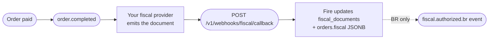

This endpoint is **inbound** — your fiscal provider POSTs to it whenever a fiscal document is authorized, rejected, denied, cancelled, or errors out. It is the **canonical, multi-country fiscal callback API** that accepts payloads from BR, CO, EC, CL, AR, VE. Fire validates the payload, updates the order's fiscal state in `fiscal_documents` and `orders.fiscal`, and dispatches downstream `fiscal.authorized.{cc}` / `fiscal.cancelled.{cc}` events to your Integration Flows.

## How it complements `order.completed` and `order.cancelled`

`order.completed` and `order.cancelled` carry an order's **business state**. The fiscal callback carries the **fiscal state** (SEFAZ / DIAN / SRI / SII / AFIP / SENIAT authorization). Together they form the lifecycle below:



After the callback is processed, the **next** `order.completed` or `order.cancelled` event for the same `orderId` reflects the updated fiscal state in:

- `data.store.storeFiscalConfig` — emitter context (CNPJ / NIT / RUC / RUT / CUIT / RIF…)
- `data.payments.metadata.fiscal` — aggregate fiscal totals (BR populated; other countries `null`)
- `data.orderLines[].metadata.fiscal` — per-line fiscal classification (BR populated; others `null`)

For Brazil specifically, a separate `fiscal.authorized.br` (or `fiscal.cancelled.br`) event is also emitted with the SEFAZ document references in `data.fiscal`.

<Note>
  **Today, only `fiscal.authorized.br` and `fiscal.cancelled.br` are wired as outbound flow events.** The endpoint validates and stores callbacks for all 6 countries (CO, EC, CL, AR, VE, BR), and the updated fiscal state shows up in the next `order.completed` / `order.cancelled` event regardless of country. The corresponding `fiscal.authorized.{cc}` / `fiscal.cancelled.{cc}` flow events for CO/EC/CL/AR/VE are coming.
</Note>

## Authentication

This endpoint requires an **API key with the `webhooks:fiscal` scope**, vendor-scoped to the account that owns the order. Unscoped or account-only keys are rejected with `403 Forbidden`.

<ParamField header="x-api-key" type="string" required>
  Your Fire API key. Generate one from the dashboard at **Settings → API Keys → Developer keys**, with scope `webhooks:fiscal` and a vendor binding for the account whose orders this key may update.
</ParamField>

<ParamField header="Authorization" type="string">
  Optional `Bearer <token>`. Not currently required for this endpoint, but reserved for future provider-issued tokens.
</ParamField>

## Request body

The body is a JSON object with these top-level fields. The `document` shape is **discriminated by `countryCode`** — see [Document by country](#document-by-country) below.

<ParamField body="countryCode" type="string" required>
  ISO 3166-1 alpha-2 country code. One of `BR`, `CO`, `EC`, `CL`, `AR`, `VE`. Determines the validation rules for the `document` object.
</ParamField>

<ParamField body="eventType" type="string" required>
  Document state. One of:
  - `authorized` — the fiscal authority approved the document
  - `cancelled` — a previously authorized document was cancelled
  - `rejected` — the document was rejected (validation, schema, signature)
  - `denied` — the authority denied the request (typically a permanent business rule failure)
  - `error` — a non-recoverable error occurred at the provider or authority

  When `eventType` is `authorized` or `cancelled`, the `document` field is **required**. When it is `rejected`, `denied`, or `error`, the `error` field is **required** instead.
</ParamField>

<ParamField body="providerEventId" type="string" required>
  Idempotency key. Must be unique per `(provider_code, providerEventId)` — duplicates return HTTP `200` with `outcome: "duplicate"` without re-processing. Use the provider's native event ID if available; otherwise a UUID.
</ParamField>

<ParamField body="occurredAt" type="string" required>
  ISO 8601 UTC timestamp of when the event happened at the fiscal authority (not when the provider sent the callback).
</ParamField>

<ParamField body="orderId" type="string" required>
  UUID of the order in Fire. Matches `data.orderId` in `order.completed` and `order.cancelled` events. Fire uses this to find the existing fiscal document.
</ParamField>

<ParamField body="eventId" type="string" required>
  UUID for emission-attempt correlation. Fire uses it to match the callback to a specific emission attempt and to deduplicate parallel attempts.
</ParamField>

<ParamField body="document" type="object">
  The authorized / cancelled fiscal document. **Required** when `eventType` is `authorized` or `cancelled`. Shape varies per country — see [Document by country](#document-by-country).
</ParamField>

<ParamField body="error" type="object">
  Error context for negative outcomes. **Required** when `eventType` is `rejected`, `denied`, or `error`.

  <Expandable title="error">
    <ParamField body="code" type="string">
      Optional provider/authority error code (e.g. `DIAN_42`, `cStat_204`).
    </ParamField>
    <ParamField body="message" type="string" required>
      Human-readable message. Min 1 character.
    </ParamField>
  </Expandable>
</ParamField>

<ParamField body="providerSpecific" type="object">
  Free-form bag for provider-specific extras (raw response, internal IDs, etc.). Not validated; passed through to the audit log.
</ParamField>

## Document by country

The `document` field's required shape depends on `countryCode`. **All variants share the base fields below** (common to all 6 countries) plus the country-specific identifiers required by that authority.

### Common base fields

These apply to any `countryCode`. `docType` and `docSubtype` are **required**; the rest are **optional** — send them whenever your fiscal provider has them available. Fire persists them in `fiscal_documents` / `orders.fiscal` and re-emits them in the outbound `fiscal.authorized.{cc}` / `fiscal.cancelled.{cc}` events and in the next `order.completed` / `order.cancelled`.

| Field | Type | Required | Notes |
|---|---|---|---|
| `docType` | `"invoice"` / `"cancellation"` | ✓ | Document class — `invoice` for issuance, `cancellation` for a cancellation |
| `docSubtype` | string | ✓ | Country/provider subtype (e.g. `nfce`, `nfe`, `factura`, `boleta`, `factura_a`) |
| `pdfUrl` | string (URL) \| null | | Download link for the document PDF (DANFE / graphical representation) |
| `xmlUrl` | string (URL) \| null | | Download link for the canonical XML from the fiscal authority |
| `emittedAt` | string (ISO 8601) \| null | | UTC timestamp when the authority authorized/emitted the document |
| `cancelledAt` | string (ISO 8601) \| null | | UTC timestamp of the cancellation — relevant when `eventType` is `cancelled` |
| `totalAmount` | number \| null | | Document gross total |
| `taxAmount` | number \| null | | Total tax amount |
| `currencyCode` | string \| null | | ISO 4217 currency code — exactly 3 letters (e.g. `BRL`, `COP`, `USD`) |

<Note>
  `pdfUrl` and `xmlUrl` are stored **exactly as you send them** — Fire does not download or re-host the file. If your provider signs these URLs with expiry, note that the stored link may expire; download and persist the artifact on your side if you need durable access.
</Note>

<Tabs>
  <Tab title="Brazil (BR)">
    Brazilian fiscal documents (NF-e / NFC-e). Use this country code when sending callbacks from any BR fiscal provider.

    In addition to the [common base fields](#common-base-fields) (`docType`, `docSubtype`, `pdfUrl`, `xmlUrl`, `emittedAt`, etc.), BR requires these specific identifiers:

    | Field | Type | Required | Notes |
    |---|---|---|---|
    | `chaveAcesso` | string | ✓ | Exactly 44 digits — SEFAZ access key |
    | `protocolo` | string | ✓ | SEFAZ authorization protocol |
    | `numero` | int / string | ✓ | Document number |
    | `serie` | int / string \| null | | Document series (encoded in chave) |
    | `modelo` | `55` / `65` \| null | | `55` = NF-e, `65` = NFC-e |
    | `cnpjEmitente` | string \| null | | Emitter CNPJ |

    The example below includes the optional base fields (`pdfUrl`, `xmlUrl`, `emittedAt`, `totalAmount`, `taxAmount`, `currencyCode`) — all may be omitted, but send them if your provider has them:

    ```json
    {
      "countryCode": "BR",
      "eventType": "authorized",
      "providerEventId": "evt-br-1",
      "occurredAt": "2026-04-26T14:32:11.000Z",
      "orderId": "550e8400-e29b-41d4-a716-446655440000",
      "eventId": "7c9e6679-7425-40de-944b-e07fc1f90ae7",
      "document": {
        "docType": "invoice",
        "docSubtype": "nfce",
        "chaveAcesso": "35260229062609000177650500000000011000000010",
        "protocolo": "141210001176277",
        "numero": 1,
        "serie": 50,
        "modelo": 65,
        "cnpjEmitente": "29062609000177",
        "emittedAt": "2026-04-26T14:32:10.000Z",
        "totalAmount": 142.90,
        "taxAmount": 18.57,
        "currencyCode": "BRL",
        "pdfUrl": "https://api.fiscal-provider.example/nfce/69fa97fe427d1240856e1282/pdf",
        "xmlUrl": "https://api.fiscal-provider.example/nfce/69fa97fe427d1240856e1282/xml"
      }
    }
    ```
  </Tab>

  <Tab title="Colombia (CO)">
    Colombian fiscal documents (DIAN).

    | Field | Type | Required | Notes |
    |---|---|---|---|
    | `cufe` | string | ✓ | DIAN unique fiscal code |
    | `prefijo` | string | ✓ | Document prefix |
    | `numeroDian` | string | ✓ | DIAN document number |
    | `qrCode` | string (URL) \| null | | QR for the printed document |

    ```json
    {
      "countryCode": "CO",
      "eventType": "authorized",
      "providerEventId": "evt-co-1",
      "occurredAt": "2026-04-26T14:32:11.000Z",
      "orderId": "550e8400-e29b-41d4-a716-446655440000",
      "eventId": "7c9e6679-7425-40de-944b-e07fc1f90ae7",
      "document": {
        "docType": "invoice",
        "docSubtype": "factura",
        "cufe": "633732c7a2a577bfa1828551e64d03f715f0",
        "prefijo": "C012",
        "numeroDian": "C012-001",
        "qrCode": "https://catalogo-vpfe.dian.gov.co/document/searchqr?documentkey=633732c7a2a577bfa1828551e64d03f715f0",
        "emittedAt": "2026-04-26T14:32:10.000Z",
        "totalAmount": 95000.00,
        "taxAmount": 15170.17,
        "currencyCode": "COP",
        "pdfUrl": "https://api.fiscal-provider.example/dian/C012-001/pdf",
        "xmlUrl": "https://api.fiscal-provider.example/dian/C012-001/xml"
      }
    }
    ```
  </Tab>

  <Tab title="Ecuador (EC)">
    Ecuadorian fiscal documents (SRI).

    | Field | Type | Required | Notes |
    |---|---|---|---|
    | `claveAcceso` | string | ✓ | Exactly 49 digits — SRI access key |
    | `numeroAutorizacion` | string | ✓ | SRI authorization number |
    | `ambiente` | `'1'` / `'2'` \| null | | `1` = test, `2` = production |

    ```json
    {
      "countryCode": "EC",
      "eventType": "authorized",
      "providerEventId": "evt-ec-1",
      "occurredAt": "2026-04-26T14:32:11.000Z",
      "orderId": "550e8400-e29b-41d4-a716-446655440000",
      "eventId": "7c9e6679-7425-40de-944b-e07fc1f90ae7",
      "document": {
        "docType": "invoice",
        "docSubtype": "factura",
        "claveAcceso": "0102030405060708091011121314151617181920212223242",
        "numeroAutorizacion": "AUT-EC-001",
        "ambiente": "2",
        "emittedAt": "2026-04-26T14:32:10.000Z",
        "totalAmount": 24.50,
        "taxAmount": 3.15,
        "currencyCode": "USD",
        "pdfUrl": "https://api.fiscal-provider.example/sri/AUT-EC-001/pdf",
        "xmlUrl": "https://api.fiscal-provider.example/sri/AUT-EC-001/xml"
      }
    }
    ```
  </Tab>

  <Tab title="Chile (CL)">
    Chilean fiscal documents (SII DTE).

    | Field | Type | Required | Notes |
    |---|---|---|---|
    | `folio` | int / string | ✓ | DTE folio number |
    | `ted` | string | ✓ | TED (Timbre Electrónico) — base64 or XML fragment |
    | `tipoDte` | int / string | ✓ | DTE type (e.g. `33` = factura electrónica) |
    | `trackId` | string \| null | | SII tracking ID for follow-up queries |

    ```json
    {
      "countryCode": "CL",
      "eventType": "authorized",
      "providerEventId": "evt-cl-1",
      "occurredAt": "2026-04-26T14:32:11.000Z",
      "orderId": "550e8400-e29b-41d4-a716-446655440000",
      "eventId": "7c9e6679-7425-40de-944b-e07fc1f90ae7",
      "document": {
        "docType": "invoice",
        "docSubtype": "factura",
        "folio": 12345,
        "ted": "<TED>...base64-or-xml...</TED>",
        "tipoDte": 33,
        "trackId": "SII-TRK-998877",
        "emittedAt": "2026-04-26T14:32:10.000Z",
        "totalAmount": 18900,
        "taxAmount": 3019,
        "currencyCode": "CLP",
        "pdfUrl": "https://api.fiscal-provider.example/sii/12345/pdf",
        "xmlUrl": "https://api.fiscal-provider.example/sii/12345/xml"
      }
    }
    ```
  </Tab>

  <Tab title="Argentina (AR)">
    Argentine fiscal documents (AFIP).

    | Field | Type | Required | Notes |
    |---|---|---|---|
    | `cae` | string | ✓ | Código de Autorización Electrónico |
    | `fechaVtoCae` | string | ✓ | CAE expiration date |
    | `puntoVenta` | int / string | ✓ | Point of sale number |
    | `numeroComprobante` | int / string | ✓ | Document number |
    | `tipoComprobante` | int / string | ✓ | Document type (`1` = factura A, …) |

    ```json
    {
      "countryCode": "AR",
      "eventType": "authorized",
      "providerEventId": "evt-ar-1",
      "occurredAt": "2026-04-26T14:32:11.000Z",
      "orderId": "550e8400-e29b-41d4-a716-446655440000",
      "eventId": "7c9e6679-7425-40de-944b-e07fc1f90ae7",
      "document": {
        "docType": "invoice",
        "docSubtype": "factura_a",
        "cae": "74256178925412",
        "fechaVtoCae": "2026-05-31",
        "puntoVenta": 1,
        "numeroComprobante": 12345,
        "tipoComprobante": 1,
        "emittedAt": "2026-04-26T14:32:10.000Z",
        "totalAmount": 12100.00,
        "taxAmount": 2100.00,
        "currencyCode": "ARS",
        "pdfUrl": "https://api.fiscal-provider.example/afip/0001-12345/pdf",
        "xmlUrl": "https://api.fiscal-provider.example/afip/0001-12345/xml"
      }
    }
    ```
  </Tab>

  <Tab title="Venezuela (VE)">
    Venezuelan fiscal documents (SENIAT).

    | Field | Type | Required | Notes |
    |---|---|---|---|
    | `numeroControl` | string | ✓ | Number from the control range issued by SENIAT |
    | `numeroFactura` | string | ✓ | Invoice number |
    | `rifEmisor` | string \| null | | Emitter RIF |

    ```json
    {
      "countryCode": "VE",
      "eventType": "authorized",
      "providerEventId": "evt-ve-1",
      "occurredAt": "2026-04-26T14:32:11.000Z",
      "orderId": "550e8400-e29b-41d4-a716-446655440000",
      "eventId": "7c9e6679-7425-40de-944b-e07fc1f90ae7",
      "document": {
        "docType": "invoice",
        "docSubtype": "factura",
        "numeroControl": "00-00012345",
        "numeroFactura": "12345",
        "rifEmisor": "J-12345678-9",
        "emittedAt": "2026-04-26T14:32:10.000Z",
        "totalAmount": 480.00,
        "taxAmount": 76.80,
        "currencyCode": "VES",
        "pdfUrl": "https://api.fiscal-provider.example/seniat/00-00012345/pdf",
        "xmlUrl": "https://api.fiscal-provider.example/seniat/00-00012345/xml"
      }
    }
    ```
  </Tab>
</Tabs>

### Negative outcomes (`rejected`, `denied`, `error`)

For non-authorized states, omit `document` and provide `error`. The `countryCode` still applies (validates routing); the document itself is not required because there is no authorized artifact.

```json Rejected
{
  "countryCode": "CO",
  "eventType": "rejected",
  "providerEventId": "evt-co-2",
  "occurredAt": "2026-04-26T14:32:11.000Z",
  "orderId": "550e8400-e29b-41d4-a716-446655440000",
  "eventId": "7c9e6679-7425-40de-944b-e07fc1f90ae7",
  "document": null,
  "error": {
    "code": "DIAN_42",
    "message": "CUFE inválido"
  }
}
```

## Response

<ResponseField name="received" type="boolean">
  Always `true` when the request reached the handler.
</ResponseField>

<ResponseField name="receiptId" type="string">
  UUID of the row written to `fiscal_event_logs`. Use it to correlate with internal Fire logs when debugging.
</ResponseField>

<ResponseField name="outcome" type="string">
  Final outcome:
  - `updated` — fiscal document found and status transitioned successfully
  - `idempotent` — the document is already in the requested state; no change applied
  - `regression` — the requested transition would move the document to an earlier state; rejected (still `200`)
  - `notFound` — no fiscal document existed yet; one was autocreated using the callback as the source of truth
  - `duplicate` — `providerEventId` was already processed; cached response returned
  - `error` — processed with errors (only for unexpected internal failures; HTTP still `200` to prevent retry storms)
</ResponseField>

<ResponseField name="documentId" type="string">
  UUID of the affected `fiscal_documents` row. Returned when `outcome` is `updated`, `idempotent`, `regression`, or `notFound`.
</ResponseField>

<ResponseField name="processingMs" type="number">
  Server-side processing time in milliseconds.
</ResponseField>

<ResponseExample>
```json 200 — success
{
  "received": true,
  "receiptId": "9b2a3c4d-7e8f-4a1b-9c2d-3e4f5a6b7c8d",
  "outcome": "updated",
  "documentId": "1a2b3c4d-5e6f-7a8b-9c0d-1e2f3a4b5c6d",
  "processingMs": 47
}
```

```json 200 — duplicate
{
  "received": true,
  "outcome": "duplicate",
  "processingMs": 3
}
```

```json 400 — validation error
{
  "error": {
    "code": "validation_error",
    "message": "BR chaveAcesso must be 44 digits"
  }
}
```

```json 401 — missing or invalid API key
{
  "error": {
    "code": "unauthorized",
    "message": "Invalid or missing API key"
  }
}
```

```json 403 — wrong scope
{
  "error": {
    "code": "forbidden",
    "message": "webhooks:fiscal scope requires a vendor-scoped API key (accountId binding missing). Generate one from /developers/firepos-api-management."
  }
}
```
</ResponseExample>

## Idempotency

Fire deduplicates callbacks by `(provider_code, providerEventId)` — a unique partial index on `fiscal_event_logs`. Replays return `200` with `outcome: "duplicate"` and no further processing. Always send the same `providerEventId` for retries; never generate a new one for the same logical event.

## Concurrency

Status transitions on `fiscal_documents` use **optimistic locking**. If two callbacks for the same document arrive concurrently, one succeeds and the other resolves to `idempotent` or `regression` depending on the order. The `orders.fiscal` JSONB merge is atomic.

## What happens after a successful call

1. **`fiscal_documents` row is upserted** with the new status and document references (`chaveAcesso`, `protocolo`, `cufe`, `cae`, etc., per country).
2. **`orders.fiscal` JSONB column is merged** with the same data — making it visible in the next `order.completed` / `order.cancelled` event for the same `orderId`, regardless of country.
3. **An outbound flow trigger is dispatched** with `triggerType = 'fiscal.authorized.{cc}'` (for `eventType=authorized`) or `'fiscal.cancelled.{cc}'` (for `eventType=cancelled`). Active Integration Flows for that trigger run and POST to your endpoint.

  - **Today**, only `fiscal.authorized.br` and `fiscal.cancelled.br` are wired. They fire when an authorized/cancelled callback for a BR store is processed.
  - **For CO/EC/CL/AR/VE**, the equivalent outbound events are not yet wired — callbacks are validated and stored, and the fiscal state is reflected in the next `order.completed` / `order.cancelled` event for the same order.

## Related

<CardGroup cols={2}>
  <Card title="order.completed" icon="receipt" href="/en/events/order-completed">
    See where the fiscal state lands inside the V4 order snapshot.
  </Card>
  <Card title="fiscal.authorized.br" icon="file-invoice" href="/en/events/fiscal-authorized-br">
    Brazil-only outbound event triggered by this callback.
  </Card>
  <Card title="Inject order" icon="paper-plane" href="/en/api-reference/orders">
    The order injection endpoint that creates the order this callback updates.
  </Card>
  <Card title="Authentication" icon="lock" href="/en/authentication">
    How API keys, scopes, and vendor binding work.
  </Card>
</CardGroup>
