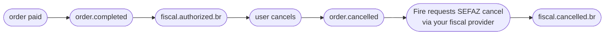

`fiscal.cancelled.br` fires when SEFAZ confirms the cancellation of a fiscal document (NFC-e or NF-e) that had been previously authorized. It is the SEFAZ-confirmed counterpart to [`order.cancelled`](/en/events/order-cancelled): the order is cancelled first inside Fire (firing `order.cancelled`), Fire then requests cancellation at SEFAZ via your fiscal provider, and `fiscal.cancelled.br` fires only when SEFAZ stamps the cancellation protocol.

## Trigger condition

Fire emits `fiscal.cancelled.br` once per fiscal cancellation, the first time **all** of these are true:

- The order is in a Brazilian store with `storeFiscalConfig.enabled === true`
- A fiscal document had been previously authorized (i.e. `fiscal.authorized.br` was emitted earlier)
- A cancellation request was submitted to your fiscal provider
- your fiscal provider reports SEFAZ confirmation of the cancellation

| | |
|---|---|
| Coverage | **Brazil only** |
| Idempotency key | `event.id` |
| Fires more than once | No, unless retried |
| Latency relative to `order.cancelled` | Usually seconds; can be minutes if SEFAZ is degraded |
| Precondition | A previous `fiscal.authorized.br` for the same `orderId` |

## What's in `trigger.data`

Same V4 order snapshot as [`order.cancelled`](/en/events/order-cancelled) — including the same `cancellation` audit block — with an extra **`sefazCancellation`** sub-object inside `cancellation.metadata.fiscal`. That's the only structural difference.

`status` is `"CANCELLED"`. The order is the same one referenced by the earlier `order.cancelled` event for the same `orderId`.

## Example — real production payload (BR, sanitized)

```json
{
  "event": {
    "id": "...",
    "type": "fiscal.cancelled.br",
    "createdAt": "2026-05-05T23:08:42.123Z"
  },
  "data": {
    "orderId": "e98f5725-0d1e-4f93-ac18-40f1068cae89",
    "orderCode": "OC-br-001",
    "status": "CANCELLED",
    "paymentStatus": "SUCCEEDED",
    "store": { /* same as order.completed */ },
    "client": { /* ... */ },
    "payments": { /* ... */ },
    "orderLines": [ /* ... */ ],
    "fulfillment": { /* ... */ },
    "device": { /* ... */ },
    "channel": { /* ... */ },
    "operator": { /* ... */ },
    "kds": { /* ... */ },
    "marketing": null,
    "metadata": {},

    "cancellation": {
      "cancellationId": "abcf3781-c327-4df1-84ef-5efbacc1d387",
      "cancelledAt": "2026-05-05T23:06:08.883Z",
      "cancelledBy": "00000000-0000-0000-0000-000000000000",
      "cancellationReason": "Customer requested cancellation",
      "cancellationSource": "backoffice",
      "metadata": {
        "fiscal": {
          "serie": null,
          "numero": "1000013",
          "pdfUrl":   "https://api.fiscal-provider.example/nfce/<docId>/pdf",
          "xmlUrl":   "https://api.fiscal-provider.example/nfce/<docId>/xml",
          "protocolo": "141200000956123",
          "docSubtype": "nfce",
          "chaveAcesso": "41201008187168000160558050010000131609769080",
          "providerDocId": "69fa77aa2a48c20329be4604",
          "dataAutorizacao": "2026-05-05T23:05:15.590Z",

          "sefazCancellation": {
            "date": "2026-05-05T23:08:30.000Z",
            "cStat": "135",
            "protocolo": "141201234567890",
            "xmlUrl": "https://api.fiscal-provider.example/nfce/<docId>/cancelamento/xml",
            "justificativa": "Cancelamento por solicitação do cliente — pedido não retirado"
          }
        }
      }
    }
  },
  "_meta": { "executionId": "...", "flowId": "...", "attempt": "1" }
}
```

## `data.cancellation.metadata.fiscal.sefazCancellation` reference

This is the only block that's unique to `fiscal.cancelled.br`. Every other field is shared with [`order.cancelled`](/en/events/order-cancelled) — see that page for the cancellation audit fields.

<ResponseField name="sefazCancellation" type="object">
  SEFAZ confirmation of the cancellation. Present only after SEFAZ has stamped the cancellation protocol.

  <Expandable title="sefazCancellation">
    <ResponseField name="date" type="string | null">
      ISO 8601 UTC timestamp when SEFAZ stamped the cancellation. May be `null` for sandbox flows that don't propagate the timestamp.
    </ResponseField>
    <ResponseField name="cStat" type="string | null">
      Raw SEFAZ status code for the cancellation event. `135` is the canonical "cancellation accepted" code for NFC-e/NF-e. May be `null` when the provider does not surface it.
    </ResponseField>
    <ResponseField name="protocolo" type="string | null">
      SEFAZ cancellation protocol number — distinct from the original authorization protocol. Required for any audit reference to the cancellation.
    </ResponseField>
    <ResponseField name="xmlUrl" type="string">
      URL to download the canonical SEFAZ XML for the cancellation event (the "cancelamento" XML, separate from the authorization XML).
    </ResponseField>
    <ResponseField name="justificativa" type="string | null">
      Reason text submitted to SEFAZ. Must be at least 15 characters per SEFAZ rules. May be `null` only for sandbox flows.
    </ResponseField>
  </Expandable>
</ResponseField>

## Lifecycle



For a Brazilian fiscal-enabled order, expect the four events above. For Brazilian orders **without** fiscal authorization (because the order was cancelled before fiscal emission, or fiscal was disabled), only `order.cancelled` fires — no `fiscal.cancelled.br`.

## Handler example

```js
async function onFiscalCancelled(data) {
  const { orderId, cancellation } = data;
  const fiscal = cancellation.metadata?.fiscal;
  const sefaz = fiscal?.sefazCancellation;

  if (!sefaz) {
    // Defensive: the event implies sefazCancellation is present, but
    // your handler should not crash if your fiscal provider ever ships a null shape.
    return;
  }

  // 1. Update the fiscal doc record with the SEFAZ confirmation
  await db.fiscalDocs.update({
    where: { providerDocId: fiscal.providerDocId },
    data: {
      status: "cancelled",
      cancellationProtocolo: sefaz.protocolo,
      cancelledAtSefaz: sefaz.date ? new Date(sefaz.date) : null,
      cancellationXmlUrl: sefaz.xmlUrl,
    },
  });

  // 2. Archive the cancellation XML (legally required in BR)
  if (sefaz.xmlUrl) {
    const xml = await fetch(sefaz.xmlUrl).then(r => r.text());
    await archive.put(`xml-cancel/${fiscal.providerDocId}.xml`, xml);
  }

  // 3. Close the reconciliation ticket opened by order.cancelled
  await reconciliation.close(orderId);
}
```

## Common pitfalls

- **Don't process `fiscal.cancelled.br` without `order.cancelled` first.** They fire in order in normal flow, but out-of-order delivery is possible. If you receive `fiscal.cancelled.br` for an `orderId` you don't have a cancellation record for, log it and create the record from this event's `cancellation` block — don't drop the event.
- **`sefazCancellation.date` and `cStat` may be `null` in sandbox.** Don't make production-readiness depend on them being present in dev environments.
- **The cancellation XML URL is distinct from the original document XML.** Make sure your archival logic stores both — you'll need them for audit.
- **Same `cancellation.cancellationId` as `order.cancelled`.** Both events for the same cancellation share the cancellation ID — useful as a join key when correlating the two events in your system.
- **No event for failed SEFAZ cancellation.** If SEFAZ rejects the cancellation request, no event fires. Monitor the dashboard's executions log for those cases.

## Related events

<CardGroup cols={2}>
  <Card title="order.cancelled" icon="ban" href="/en/events/order-cancelled">
    Fires before this event — the cancellation itself.
  </Card>
  <Card title="fiscal.authorized.br" icon="file-invoice" href="/en/events/fiscal-authorized-br">
    The earlier event that established the fiscal document being cancelled here.
  </Card>
</CardGroup>
