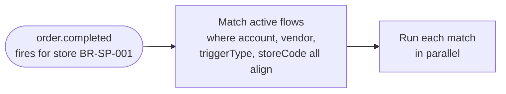
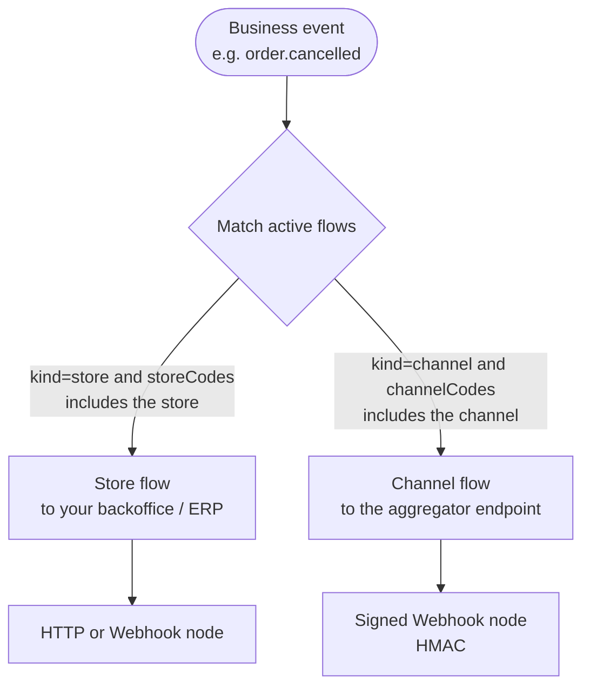
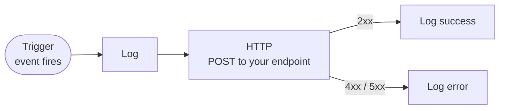

An **Integration Flow** is the subscription mechanism for Fire events. Instead of a single global webhook URL, you configure one or more flows in the dashboard, each scoped to a specific account/vendor/store and listening for a specific trigger type. When a matching event fires, Fire runs every active flow in parallel.

This page covers matching rules, how you build a flow, what the HTTP node controls, and how the body template references trigger data.

## How matching works

When a business event fires inside Fire, every active flow whose criteria match the event is selected:



A flow is selected when **all** of these are true:

| Field | Match rule |
|---|---|
| `accountId` | Equals the account that owns the entity |
| `vendorId` | Equals the brand/vendor that owns the store |
| `triggerType` | Equals the event type (`order.completed`, `order.cancelled`, `fiscal.authorized.br`, `fiscal.cancelled.br`) |
| `kind` | `'store'` (scoped by `storeCodes`) or `'channel'` (scoped by `channelCodes`) |
| `storeCodes` | `kind='store'` only: empty (matches all stores) or contains the event's store code |
| `channelCodes` | `kind='channel'` only: contains the channel code of the event's order |
| `isActive` | `true` |

You can have **multiple active flows for the same trigger** — they run independently. Use this to fan out events to several downstream services without code changes (e.g. one flow per consumer: ERP, analytics, fiscal cache, message broker).

## Scope: store vs channel

The same event is published through one of **two scoping mechanisms**, depending on the flow's `kind`:

- **Store flow (`kind='store'`)** — matches by `storeCodes` (empty = all stores of the vendor). The classic choice for backoffice integrations: ERP, analytics, printing, fiscal.
- **Channel flow (`kind='channel'`)** — matches by `channelCodes`, the order's originating channel. Use it to **echo back to the channel/aggregator**: when an order from a channel (a kiosk, a marketplace) changes state, the event returns to that channel's endpoint.



Both use the same flow engine; only **how the flow is selected** (by store or by channel) and who it delivers to changes. A channel flow typically uses the **signed Webhook node** (below) because the receiver is a third party that needs to verify the origin.

## Building a flow

A flow runs like a small pipeline: the trigger starts it when a matching event fires, then each connected node runs in turn — log a step, call your endpoint over HTTP, branch on a condition, or reshape data — until the flow finishes.

You build a flow visually in the dashboard: start from a trigger node and connect the nodes that should run after it. Each node has a type and its own configuration, and downstream nodes can read the trigger context.



### Trigger node

The starting point. Its only relevant config is `triggerType`:

```json
{
  "id": "trigger",
  "type": "trigger",
  "data": { "triggerType": "order.completed" }
}
```

### HTTP node

This is the node that reaches your endpoint. Its config controls the entire request:

```json
{
  "id": "send_to_webhook",
  "type": "http",
  "data": {
    "method": "POST",
    "url": "https://your-service.example.com/fire/events",
    "headers": {
      "Content-Type": "application/json",
      "Authorization": "Bearer {{secret.fire_webhook_token}}"
    },
    "body": "{{your body template}}",
    "auth": { "type": "bearer", "token": "..." },
    "timeout": 30000,
    "retryOnFailure": true,
    "retryCount": 3,
    "statusRoutes": [
      { "id": "ok",  "statusCode": 200, "label": "OK",   "responseMapping": [...] },
      { "id": "err", "statusCode": 5,   "label": "Server error" }
    ]
  }
}
```

Every field is optional except `method` and `url`. `body`, `headers`, and `auth` are evaluated as templates against the [trigger context](#trigger-context).

### Signed Webhook node (HMAC)

The **Webhook** node is an HTTP node that also **signs the body** with HMAC-SHA256. Use it when the receiver (typically a channel/aggregator) needs to verify the payload comes from Fire and was not tampered with. It has the same configuration as the HTTP node (URL, method, headers, body, status routes, transport auth) plus a **shared secret**.

The signature is **independent** of transport auth (Bearer / API key / OAuth2): auth identifies the transport; the HMAC signature guarantees body integrity and anti-replay. They are complementary.

**Headers Fire adds:**

| Header | Value |
|---|---|
| `X-Fire-Signature` | `v1=` + `hex(HMAC-SHA256(secret, "{timestamp}.{rawBody}"))` |
| `X-Fire-Timestamp` | Unix timestamp in **seconds** |

**How to verify (on your side):**

<Steps>
  <Step title="Read the headers">Take `X-Fire-Timestamp` and `X-Fire-Signature`.</Step>
  <Step title="Anti-replay">Reject if `abs(now - timestamp)` exceeds 300 seconds (5-minute window).</Step>
  <Step title="Recompute">Compute `v1=hex(HMAC-SHA256(secret, timestamp + "." + rawBody))` over the **raw body** (do not re-serialize the JSON).</Step>
  <Step title="Compare">Use a **constant-time** comparison (`crypto.timingSafeEqual`), never `===`.</Step>
</Steps>

```js
import crypto from "crypto";

function verifyFireSignature(rawBody, signatureHeader, timestampHeader, secret, toleranceSec = 300) {
  const ts = parseInt(timestampHeader, 10);
  if (!Number.isFinite(ts)) return false;
  if (Math.abs(Math.floor(Date.now() / 1000) - ts) > toleranceSec) return false; // anti-replay

  const m = /^v1=([a-f0-9]+)$/i.exec(signatureHeader || "");
  if (!m) return false;

  const expected = crypto
    .createHmac("sha256", secret)
    .update(`${ts}.${rawBody}`)
    .digest("hex");

  const a = Buffer.from(m[1], "hex");
  const b = Buffer.from(expected, "hex");
  return a.length === b.length && crypto.timingSafeEqual(a, b);
}
```

<Warning>
  Sign over the **exact raw body** you received (the same bytes). If you parse and re-serialize the JSON before verifying, the signature will not match.
</Warning>

<Note>
  The secret is shared out-of-band: you configure it on the flow node and on your receiver. On an invalid signature, respond `401`; on success, `200`.
</Note>

### Other node types

Beyond trigger and HTTP, flows can include:

| Type | Purpose |
|---|---|
| `condition` | Branch on a `{{trigger.data.*}}` expression — different paths for different cases |
| `log` | Emit a log line for traceability (visible in **Settings → Integration Flows → Executions**) |
| `transform` | Reshape data with JavaScript before passing to a downstream node |

A typical "send to webhook" flow has: trigger → log → HTTP → log (success/error). See the dashboard's **Webhook Test — Full Order Data** example for a runnable starting point.

## Trigger context

Every node template can reference the **trigger context**, available when the flow runs:

```ts
{
  trigger: {
    event: {
      id: string,         // flow execution UUID — your idempotency key
      type: string,       // "order.completed" | "order.cancelled" | "fiscal.authorized.br" | "fiscal.cancelled.br"
      createdAt: string,  // ISO 8601 UTC
    },
    data: V4Snapshot,     // event-specific payload — see each event reference page
  },
  execution: { id: string, /* execution metadata */ },
  flow:      { id: string, name: string },
  queue:     { id, attempt, triggerEntityId, triggerType },
}
```

You reference any path with the `{{}}` mustache syntax: `{{trigger.event.id}}`, `{{trigger.data.orderId}}`, `{{trigger.data.store.code}}`, `{{flow.name}}`, `{{queue.attempt}}`.

Path resolution walks the trigger context as a JavaScript object. Array indexing works (`{{trigger.data.payments.totals[0].total}}`). For arrays of unknown length, use `{{trigger.data.orderLines.length}}`.

## Body templates

The `body` field on the HTTP node is the **only** thing that determines what your endpoint receives. Fire substitutes `{{...}}` paths from the trigger context and POSTs the result.

There is **no fixed Fire envelope** enforced by the system. However, the dashboard ships with a canonical example template that most teams start from:

```json
{
  "event": {
    "id":        "{{trigger.event.id}}",
    "type":      "{{trigger.event.type}}",
    "createdAt": "{{trigger.event.createdAt}}"
  },
  "data": "{{trigger.data}}",
  "_meta": {
    "executionId":     "{{execution.id}}",
    "flowId":          "{{flow.id}}",
    "flowName":        "{{flow.name}}",
    "attempt":         "{{queue.attempt}}",
    "triggerEntityId": "{{queue.triggerEntityId}}"
  }
}
```

If you use this template, your endpoint receives exactly the body documented in [Events overview](/en/events/overview) and each event reference page. If you customize, the body is whatever your template renders.

<Note>
  When a template path resolves to an object or array (e.g. `"{{trigger.data}}"`), the runtime preserves the JSON type rather than serializing to a string. So `"data": "{{trigger.data}}"` produces a real nested JSON object on the wire, not a string blob.
</Note>

## Authentication

Authenticate by configuring credentials on the flow's HTTP node:

| Auth type | Use when |
|---|---|
| `bearer` | A static or rotating Bearer token your endpoint validates. |
| `api_key` | A header-based API key (e.g. `x-api-key`). |
| `oauth2_client_credentials` | Your endpoint is behind OAuth2; Fire fetches and caches access tokens automatically, refreshing on expiry. |
| `none` | No auth (only acceptable if your endpoint is otherwise protected, e.g. mTLS, VPC). |

See [Delivery & retries](/en/events/delivery#authentication) for setup.

## Status routes

The HTTP node can fan out to different downstream nodes based on the response status:

```json
"statusRoutes": [
  { "id": "ok",  "statusCode": 200, "label": "OK",
    "responseMapping": [ { "responsePath": "status", "outputField": "webhookStatus", "type": "string" } ] },
  { "id": "client", "statusCode": 4, "label": "Client error" },
  { "id": "server", "statusCode": 5, "label": "Server error" }
]
```

`statusCode` matches by digit prefix: `2` matches all `2xx`, `4` matches all `4xx`, `200` matches only `200`. Each route can pull values out of the response body via `responseMapping` and expose them to downstream nodes.

## Per-tenant isolation

Every flow is scoped to your account and vendor. Fire never runs a flow across tenants — when you configure a flow it is bound to your tenant by default, and you cannot subscribe to another account's events.

## Activation, versioning, and dry-run

- Flows can be toggled active or inactive — pause or resume receiving events without deleting the flow.
- Each save creates a new version; past versions are kept for audit, and only the latest active version runs.
- The dashboard's **Probar Flujo** (Test Flow) button runs a flow against a synthetic sample payload (a country-specific scenario) without affecting real data — perfect for verifying body templates before going live.

## Common patterns

- **One flow per consumer.** If you have three downstream services (ERP, analytics, message broker), use three flows with the same trigger and three HTTP nodes pointing to each. Adding/removing a consumer becomes a dashboard change, not a code change.
- **Conditional fan-out.** Use a `condition` node after the trigger to branch on `{{trigger.data.store.locationInfo.country.code}}` and route Brazilian orders to a fiscal-aware endpoint while sending other countries to a generic one.
- **Per-store routing.** Set `storeCodes` on the flow to scope it to specific stores, or use the dashboard's store filter to limit firing.
- **Event mapping.** If your system uses different event names, transform the type in the body template: `"event_name": "fire.{{trigger.event.type}}"`.

## Next

<CardGroup cols={2}>
  <Card title="Events overview" icon="bell" href="/en/events/overview">
    The full event-driven model and envelope.
  </Card>
  <Card title="Delivery & retries" icon="repeat" href="/en/events/delivery">
    Timeouts, retries, dead-letter, idempotency.
  </Card>
  <Card title="Handle order events" icon="bolt" href="/en/guides/handle-order-events">
    Walkthrough: build a webhook handler in 10 minutes.
  </Card>
  <Card title="order.completed" icon="receipt" href="/en/events/order-completed">
    The full V4 order snapshot reference.
  </Card>
</CardGroup>
