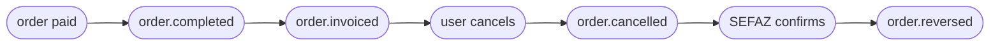

<Tabs>
  <Tab title="v2.2 · current">
    You are reading the **current (v2.2)** contract for `order.cancelled`. **v2.2 adds** `data.fiscalRepresentation`: the fiscal numbering the point of sale obtained before injecting the order. It is **omitted** when the sale was not numbered, and its presence does **not** mean the document is authorized. Additive only — nothing you already read changed.
  </Tab>
  <Tab title="v2.1 · previous">
    The **v2.1** contract is still valid: v2.2 only adds one block, nothing before it changed.
  </Tab>
  <Tab title="v2 · deprecated">
    <Warning>The **v2** contract is **deprecated** — kept as a historical reference. Open it here: [`order.cancelled` — v2](/en/events-v2/order-cancelled).</Warning>
  </Tab>
  <Tab title="v1 · deprecated">
    <Warning>The **v1** contract is **deprecated**. Open it here: [order-cancelled — v1](/en/events-v1/order-cancelled).</Warning>
  </Tab>
  <Tab title="v0 · deprecated">
    <Warning>The **v0** contract is **deprecated**. Open it here: [order-cancelled — v0](/en/events-v0/order-cancelled).</Warning>
  </Tab>
</Tabs>

`order.cancelled` fires when a previously injected order is cancelled — either from the Fire backoffice UI, an external adapter, or a cancellation API call. It does **not** retract a prior `order.completed` for the same order; both events are emitted independently.

## Trigger condition

Fire emits `order.cancelled` once when an order's status transitions to `CANCELLED`, regardless of the order's previous payment state. The cancellation is recorded with full audit context (who, when, why, source).

| | |
|---|---|
| Coverage | Global (every country, every channel) |
| Idempotency key | `event.id` |
| Fires more than once | No, unless retried |
| Ordering | Not guaranteed against `order.completed` for the same order — sort by event timestamps if you need it |
| Retries | Up to 5 attempts with exponential backoff (when `retryOnFailure` is enabled) |
| Brazilian fiscal context | Includes original fiscal data in `cancellation.metadata.fiscal` if the order had been fiscally authorized |

## What's in `trigger.data`

Same V4 order snapshot as [`order.completed`](/en/events/order-completed) — every field documented there is present here, with three differences:

1. `status` is **`"CANCELLED"`** (not `"COMPLETED"`).
2. `paymentStatus` is unchanged from when the order was completed (typically `"SUCCEEDED"` if the order had been paid before cancellation).
3. A new top-level **`cancellation`** block carries the audit metadata.

## Example — real production payload (BR, sanitized)

```json
{
  "event": {
    "id": "abcf3781-c327-4df1-84ef-5efbacc1d387",
    "type": "order.cancelled",
    "createdAt": "2026-05-05T23:06:08.883Z"
  },
  "data": {
    "orderId": "e98f5725-0d1e-4f93-ac18-40f1068cae89",
    "orderCode": "OC-br-001",
    "businessDayDate": "2026-03-31",
    "externalOrderId": "ac331b68-66fb-48ee-b110-a40181bfb379",
    "status": "CANCELLED",
    "paymentStatus": "SUCCEEDED",
    "redeemPoints": false,
    "accumulatePoints": false,
    "discount": false,
    "createdAt": "2026-05-05T23:05:00.438Z",
    "orderComment": "Comentario de prueba orden",
    "marketing": null,
    "store": { /* same as order.completed — see /en/events/order-completed */ },
    "device": { /* ... */ },
    "channel": { /* ... */ },
    "operator": { /* ... */ },
    "client": { /* ... */ },
    "payments": { /* ... */ },
    "kds": { /* ... */ },
    "metadata": {},
    "orderLines": [ /* ... */ ],
    "fulfillment": { /* ... */ },

    "cancellation": {
      "cancellationId": "abcf3781-c327-4df1-84ef-5efbacc1d387",
      "cancelledAt": "2026-05-05T23:06:08.883Z",
      "cancelledBy": "00000000-0000-0000-0000-000000000000",
      "cancellationReason": "Customer requested cancellation",
      "cancellationType": "CUSTOMER_REQUESTED",
      "cancellationGroup": "Cliente",
      "cancellationNote": "cliente pidió cancelar",
      "cancellationSource": "backoffice",
      "metadata": {
        "fiscal": {
          "serie": null,
          "numero": "1000013",
          "pdfUrl":   "https://api.fiscal-provider.example/nfce/<docId>/pdf",
          "xmlUrl":   "https://api.fiscal-provider.example/nfce/<docId>/xml",
          "protocolo": "141200000956123",
          "docSubtype": "nfce",
          "chaveAcesso": "41201008187168000160558050010000131609769080",
          "providerDocId": "69fa77aa2a48c20329be4604",
          "dataAutorizacao": "2026-05-05T23:05:15.590Z"
        }
      }
    }
  },
  "_meta": { "executionId": "...", "flowId": "...", "attempt": "1" }
}
```

## `data.cancellation` reference

<ResponseField name="cancellation" type="object">
  Audit block describing how, when, and by whom the order was cancelled.

  <Expandable title="cancellation">
    <ResponseField name="cancellationId" type="string">
      UUID for this cancellation event. Stable across retries.
    </ResponseField>
    <ResponseField name="cancelledAt" type="string">
      ISO 8601 UTC timestamp of the cancellation.
    </ResponseField>
    <ResponseField name="cancelledBy" type="string | null">
      UUID of the operator/user who cancelled the order. `null` for system-initiated cancellations (e.g. an automated flow).
    </ResponseField>
    <ResponseField name="cancellationReason" type="string | null">
      Free-text reason captured at cancellation time. May be empty or `null`.
    </ResponseField>
    <ResponseField name="cancellationSource" type="string">
      Where the cancellation originated. Values include `backoffice`, `adapter`, `api`. Use this to branch your handler logic.
    </ResponseField>
    <ResponseField name="cancellationType" type="string | null">
      Stable motive code. Internal catalog (e.g. `ITEM_OUT_OF_STOCK`) or aggregator/SAG numeric code (e.g. `1010`). **Always present** — `null` when no structured motive was set.
    </ResponseField>
    <ResponseField name="cancellationGroup" type="string | null">
      Motive category. Internal (e.g. `Inventario`, `Cliente`) or aggregator (e.g. `SAG (KEETA)`, `SAG (IFOOD)`). **Always present** — `null` when no structured motive was set.
    </ResponseField>
    <ResponseField name="cancellationNote" type="string | null">
      Optional free-text note entered at cancellation time. **Always present** — `null` when no note was entered.
    </ResponseField>
    <ResponseField name="metadata" type="object">
      Extra context. Today only includes `fiscal` (when applicable).

      <Expandable title="metadata">
        <ResponseField name="fiscal" type="object | null">
          **Brazil only — present when the order had been fiscally authorized before cancellation.** Contains the original fiscal document context so your downstream system can reconcile against the previously issued document.

          Fields: `serie`, `numero`, `pdfUrl`, `xmlUrl`, `protocolo`, `docSubtype` (e.g. `nfce`, `nfe`), `chaveAcesso` (44-digit SEFAZ access key), `providerDocId` (your fiscal provider internal ID), `dataAutorizacao` (ISO 8601 UTC of original authorization).

          <Note>
            This is the **original** fiscal data at the moment of cancellation, **not** the SEFAZ cancellation result. The SEFAZ cancellation outcome arrives in a separate [`order.reversed`](/en/events/order-reversed) event with `cancellation.metadata.fiscal.sefazCancellation` populated.
          </Note>
        </ResponseField>
      </Expandable>
    </ResponseField>
  </Expandable>
</ResponseField>

## Lifecycle relative to other events

For a Brazilian fiscal-enabled order that gets cancelled, expect this sequence:



- `order.cancelled` is emitted **immediately** when the cancellation happens, before any external fiscal authority is contacted.
- `order.reversed` is emitted **later** — once SEFAZ confirms via your fiscal provider. It can arrive seconds or minutes after `order.cancelled`, depending on SEFAZ response time.
- For non-Brazilian orders or stores without fiscal emission, only `order.cancelled` fires.

## Country variations

`order.cancelled` is **global** — it fires for every country and every channel when an order is cancelled (Argentina, Brazil, Chile, Colombia, Ecuador, Venezuela, and any other country with active Integration Flows). The cancellation audit block (`cancellation.{cancellationId, cancelledAt, cancelledBy, cancellationReason, cancellationSource}`) is identical across countries.

The only country-specific field is `cancellation.metadata.fiscal`, which is populated **only for Brazilian stores that had a previously authorized fiscal document** (i.e. a `order.invoiced` was emitted for this order earlier). For all other countries — and for BR orders cancelled before fiscal authorization — `cancellation.metadata.fiscal` is `null` and no [`order.reversed`](/en/events/order-reversed) event will follow.

For non-BR stores (Argentina, Chile, Colombia, Ecuador, Venezuela, others), the cancellation block looks like:

```json Non-BR cancellation
{
  "cancellation": {
    "cancellationId": "abcf3781-c327-4df1-84ef-5efbacc1d387",
    "cancelledAt": "2026-05-05T23:06:08.883Z",
    "cancelledBy": "00000000-0000-0000-0000-000000000000",
    "cancellationReason": "Customer requested cancellation",
    "cancellationType": "CUSTOMER_REQUESTED",
    "cancellationGroup": "Cliente",
    "cancellationNote": "cliente pidió cancelar",
    "cancellationSource": "backoffice",
    "metadata": { "fiscal": null }
  }
}
```

Store-level identifiers in `data.store` still vary by country — see [`order.completed` → Country variations](/en/events/order-completed#country-variations) for `country.code`, `currencyCode`, and `storeFiscalConfig.govIdType` (`CNPJ` / `CUIT` / `RUT` / `NIT` / `RUC` / `RIF`) per country.

## `data.policy` and `data.lastKnown`

Every order event carries these two blocks — not just this one. They were added
together with the deferred-payment cycle and are **added in v2.1**, additive: existing
consumers keep working unchanged.

| Block | What it is | Trust it? |
|---|---|---|
| `policy.deferredPayment` | Whether the order may be acted on **before** payment. Resolved once at injection and stamped immutably — every later event echoes the same value. | Yes. It is a decision, not a state. |
| `lastKnown` | Advisory snapshot of kitchen (`kds`) and fiscal state when the event was emitted. May be `null` or stale. | **No.** Never gate an irreversible action on it. |

```json
"policy": { "deferredPayment": { "eligible": true, "resolvedAt": "2026-08-02T15:55:42.407Z",
    "configVersion": "fnv1a:3144c6fb",
    "resolvedFrom": { "channelCode": "APP", "fulfillmentCode": "DELIVERY", "paymentMethod": "CASH" } } },
"lastKnown": { "kds": null, "fiscal": { "status": "processing", "sourceEvent": "fiscal.callback" } }
```

Field-by-field detail lives in [`order.opened`](/en/events/order-opened#deferred-payment-policy),
the event where these blocks matter most.

## Handler example

```js
async function onOrderCancelled(data) {
  const { orderId, store, cancellation } = data;

  // 1. Mark the order cancelled in your system (idempotent)
  await db.orders.update({
    where: { fireOrderId: orderId },
    data: {
      status: "CANCELLED",
      cancelledAt: new Date(cancellation.cancelledAt),
      cancellationReason: cancellation.cancellationReason,
      cancellationSource: cancellation.cancellationSource,
    },
  });

  // 2. If the store is fiscal-enabled and there was a fiscal doc,
  //    open a reconciliation ticket — the SEFAZ cancellation will
  //    follow in order.reversed.
  if (cancellation.metadata?.fiscal) {
    await reconciliation.open({
      orderId,
      country: store.locationInfo.country.code,
      originalDoc: cancellation.metadata.fiscal,
      pendingSefazCancel: true,
    });
  }

  // 3. Roll back downstream side-effects (release stock, refund, etc.)
  await downstream.rollback(orderId);
}
```

## Common pitfalls

- **`status === "CANCELLED"`, not `paymentStatus`.** Cancelled paid orders keep `paymentStatus === "SUCCEEDED"`; the cancellation lives in the `status` field plus the `cancellation` block.
- **`order.cancelled` ≠ refund.** Fire reports the cancellation; the refund (if any) is initiated by the source channel/processor and is not in this payload.
- **Don't assume `order.completed` arrived first.** Out-of-order delivery is possible — your handler should be tolerant to receiving `order.cancelled` for an `orderId` it doesn't yet know about (e.g. log + create a placeholder; reconcile when `order.completed` arrives).
- **`cancellation.metadata.fiscal` is the original doc, not the cancellation result.** For the SEFAZ confirmation, listen for [`order.reversed`](/en/events/order-reversed).

## Related events

<CardGroup cols={2}>
  <Card title="order.completed" icon="receipt" href="/en/events/order-completed">
    The event you'll see for the same order before cancellation.
  </Card>
  <Card title="order.reversed" icon="file-circle-xmark" href="/en/events/order-reversed">
    Brazil only — fires when SEFAZ confirms the cancellation.
  </Card>
</CardGroup>

## `data.fiscalRepresentation`

The **fiscal numbering** the point of sale obtained *before* injecting the order:
it charges, requests the identifiers, prints the receipt, and only then injects.
That is why it travels on the order and not in a separate fiscal event — by the
time the order is born, this already happened.

<Warning>
  **The presence of this block does NOT mean the document is authorized.** These
  are the numbers printed at the till; the tax authority's verdict is in
  `lastKnown.fiscal.status`. A ticket that says "authorized" just because the
  block is present states something that may never have happened.
</Warning>

**It is omitted** — the key is absent, not `null` — when the sale was not
numbered: aggregators, countries without fiscal representation, or merchants with
numbering turned off. Branch on whether the key is there.

| Field | What it is |
|---|---|
| `documentNumber` | Visible receipt number, composed per country (`005-004-000000042`). Presentation only: reconcile with `serie` + `sequential`. |
| `sequential` | Sequential assigned by the authority. |
| `serie` | Document series. `null` where the country does not use one. |
| `issuedAt` | When it was **numbered**. Not the authorization date. |
| `authorizationMode` | `ONLINE`, `OFFLINE` or `BATCH`. A provider concept, not universal. |
| `providerCode` | Identifier of the adapter that numbered. |
| `claveAcceso` | Authority access key. Absent where the country does not issue one. |
| `numeroControl` | Control number. Replaces the access key where it applies. |
| `providerMetadata` | **Opaque.** Defined by the provider; do not program against its keys. |

```json
"fiscalRepresentation": {
  "serie": "005004",
  "sequential": "000000042",
  "documentNumber": "005-004-000000042",
  "claveAcceso": "1208202601000000000000110050040000000421234567810",
  "authorizationMode": "ONLINE",
  "issuedAt": "2026-08-13T08:11:29.744Z",
  "providerCode": "hio",
  "providerMetadata": { "externalDeviceId": "1", "externalStoreCode": "K004" }
}
```

**It never changes.** The same block travels identically across every event of the
order: what the customer took home printed is not altered because the authority
later authorizes or rejects. What does change is `lastKnown.fiscal`.

<Note>
  **`lastKnown.fiscal.sourceEvent` now reports real provenance.** It used to be
  derived from the status, so a `processing` seeded at injection was reported as
  `fiscal.callback` even though no callback had occurred. That case now says
  `order.injected`. If you branch on this field, account for the new value.
</Note>
