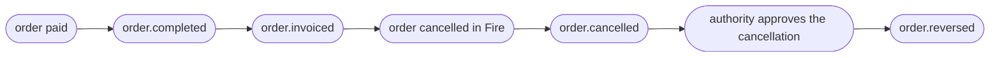

import FiscalEventBlock from '/snippets/fiscal-event-block.mdx';

<Tabs>
  <Tab title="v3 · current">
    You are reading the **current (v3)** contract for `order.cancelled`. **v3 is a breaking change in the fiscal context only**: `cancellation.metadata.fiscal` becomes **`cancellation.fiscal`**, structured as `{ status, authority }`, and it now applies to every country with an authorized document, not only Brazil. `cancellation.metadata` is no longer emitted. The rest of the event is unchanged. See [Path changes from the previous version](#path-changes-from-the-previous-version).
  </Tab>
  <Tab title="v2.2 · deprecated">
    <Warning>The **v2.2** contract is **deprecated** — kept as a historical reference. Open it here: [`order.cancelled` — v2.2](/en/events-v2/order-cancelled).</Warning>
  </Tab>
  <Tab title="v1 · deprecated">
    <Warning>The **v1** contract is **deprecated**. Open it here: [order-cancelled — v1](/en/events-v1/order-cancelled).</Warning>
  </Tab>
  <Tab title="v0 · deprecated">
    <Warning>The **v0** contract is **deprecated**. Open it here: [order-cancelled — v0](/en/events-v0/order-cancelled).</Warning>
  </Tab>
</Tabs>

`order.cancelled` fires when a previously injected order is cancelled — from the Fire backoffice (`cancellationSource: backoffice`), or through an adapter or the cancellation API (`cancellationSource: adapter`). It does **not** retract a prior `order.completed` for the same order; both events are emitted independently.

<Warning>
  **This event does not mean the fiscal document is annulled.** It is emitted when the **order** is cancelled, before the authority is asked. When the order had an authorized document, `cancellation.fiscal` describes that document **as it was at that moment** — still `SALE_INVOICE`, with `cancelledAt: null`. The authority's confirmation arrives later in [`order.reversed`](/en/events/order-reversed).
</Warning>

## Trigger condition

Fire emits `order.cancelled` once when an order transitions to `CANCELLED`, regardless of its previous payment state, with full audit context.

| | |
|---|---|
| Coverage | Global — every country, every channel |
| Idempotency key | `event.id` |
| Fires more than once | Once per active Integration Flow subscribed to the event; retried on delivery failure |
| Ordering | Not guaranteed against `order.completed` — sort by timestamps if you need it |
| Fiscal context | `cancellation.fiscal` when the order had an authorized document |

## What's in `trigger.data`

The same V4 order snapshot as [`order.completed`](/en/events/order-completed), with four differences:

1. `status` is **`"CANCELLED"`**.
2. `paymentStatus` is unchanged (typically `"SUCCEEDED"` if the order had been paid).
3. A top-level **`cancellation`** block carries the audit metadata and, when applicable, the fiscal document.
4. There is **no top-level `data.fiscal`**. On this event the authority's document lives only in `cancellation.fiscal`.

`policy` and `lastKnown` travel exactly as on `order.completed`. `fiscalRepresentation` has the same shape, but when a credit note was numbered for the cancellation it carries that note on top and the invoice in `history`. In Brazil (PlugNotas) `fiscalRepresentation` is `null`: there is no numbering step. `authority.providerIdentity` and `authority.providerMetadata` appear on documents stored under this contract; on earlier orders the keys may be missing — treat a missing key like `null`.

## Example — Brazil, with an authorized document (sanitized)

```json
{
  "event": { "id": "…", "type": "order.cancelled", "createdAt": "2026-09-15T05:06:45.562Z" },
  "data": {
    "orderId": "15801bd1-83d3-4d70-bb1b-793fd30b7bec",
    "orderCode": "OC-br-001",
    "status": "CANCELLED",
    "paymentStatus": "SUCCEEDED",
    "store": { /* same as order.completed */ },
    "orderLines": [ /* same as order.completed */ ],
    "policy": { "deferredPayment": { "eligible": false, "resolvedAt": "2026-09-15T05:00:45.760Z", "configVersion": "fnv1a:a0c02d27", "resolvedFrom": { "channelCode": "KIOSK", "fulfillmentCode": "DINE-IN", "paymentMethod": null } } },
    "lastKnown": { "kds": { "status": "preparing", "sourceEvent": "order.status_updated" }, "fiscal": { "status": "authorized", "sourceEvent": "order.invoiced" } },
    "fiscalRepresentation": null,

    "cancellation": {
      "cancellationId": "6fcb0a30-cfde-4ffe-96ef-545dde3fa87c",
      "cancelledAt": "2026-09-15T05:06:44.359Z",
      "cancelledBy": "4fadc5f3-d9da-4756-978d-5a8cffc25d40",
      "cancellationType": "OTHER",
      "cancellationGroup": "Other",
      "cancellationReason": "Customer requested cancellation",
      "cancellationNote": null,
      "cancellationSource": "backoffice",

      "fiscal": {
        "status": "authorized",
        "authority": {
          "documentType": "SALE_INVOICE",
          "docSubtype": "nfce",
          "documentNumber": "12388",
          "issuedAt": "2026-09-15T05:00:48.003Z",
          "authorizedAt": "2026-09-15T03:00:00.000Z",
          "cancelledAt": null,
          "authorizationMode": "ONLINE",
          "providerDocId": "6aa8d10117b687522d90ae0a",
          "pdfUrl": "https://api.fiscal-provider.example/nfce/6aa8d10117b687522d90ae0a/pdf",
          "xmlUrl": "https://api.fiscal-provider.example/nfce/6aa8d10117b687522d90ae0a/xml",
          "amounts": { "total": 11.9, "tax": 1.65, "currencyCode": "BRL" },
          "countryData": {
            "chaveAcesso": "41201008187168000160558050010000131609769080",
            "numero": "12388",
            "serie": "2",
            "modelo": 65,
            "protocolo": "135266298552102"
          },
          "graphic": { "qr": "41201008187168000160558050010000131609769080" },
          "providerIdentity": null,
          "providerMetadata": null
        }
      }
    }
  },
  "_meta": { "executionId": "…", "flowId": "…", "attempt": "1" }
}
```

## Example — without an authorized document

When the order had no authorized document (the authority had not answered yet, the store does not issue documents, or the document has no provider id), the **`fiscal` key is absent** — not `null`. Here, a store that does not number at the till, cancelled before the authority answered: `fiscalRepresentation` is `null`, `lastKnown.fiscal` still says `processing`, and `cancellation` has no `fiscal`. No `order.reversed` follows.

In countries that number at the till, an order cannot be cancelled while its invoice is still in force: Fire answers `409` (`FISCAL_REPRESENTATION_NOT_VOIDED`) until the credit note is requested. Once it is, the event carries `fiscalRepresentation` with the `CREDIT_NOTE` on top and the invoice in `history`.

```json
{
  "event": { "id": "…", "type": "order.cancelled", "createdAt": "2026-09-15T14:12:03.114Z" },
  "data": {
    "orderId": "…",
    "orderCode": "OC-cl-001",
    "status": "CANCELLED",
    "paymentStatus": "SUCCEEDED",
    "store": { /* same as order.completed */ },
    "orderLines": [ /* same as order.completed */ ],
    "policy": { /* same as order.completed */ },
    "lastKnown": { "kds": null, "fiscal": { "status": "processing", "sourceEvent": "order.injected" } },
    "fiscalRepresentation": null,

    "cancellation": {
      "cancellationId": "abcf3781-c327-4df1-84ef-5efbacc1d387",
      "cancelledAt": "2026-09-15T14:12:02.870Z",
      "cancelledBy": "4fadc5f3-d9da-4756-978d-5a8cffc25d40",
      "cancellationType": "CUSTOMER_CALLED_TO_CANCEL",
      "cancellationGroup": "Customer",
      "cancellationReason": "Customer requested cancellation",
      "cancellationNote": null,
      "cancellationSource": "backoffice"
    }
  },
  "_meta": { "executionId": "…", "flowId": "…", "attempt": "1" }
}
```

Check it with `if (data.cancellation.fiscal)`.

<Note>Blocks elided as *same as `order.completed`* are byte-for-byte the snapshot `order.completed` carries. See the [`order.completed` field reference](/en/events/order-completed#field-reference).</Note>

## `data.cancellation` reference

<ResponseField name="cancellation" type="object">
  Audit block describing how, when and by whom the order was cancelled.

  <Expandable title="cancellation">
    <ResponseField name="cancellationId" type="string">
      UUID of this cancellation. Stable across retries, and shared with the `order.reversed` of the same cancellation.
    </ResponseField>
    <ResponseField name="cancelledAt" type="string">
      ISO 8601 UTC timestamp of the order cancellation in Fire. It is not the authority's `authority.cancelledAt`.
    </ResponseField>
    <ResponseField name="cancelledBy" type="string">
      Who cancelled the order: the user's UUID when `cancellationSource` is `backoffice`; `api-key:<keyId>` when it is `adapter`. Never `null`.
    </ResponseField>
    <ResponseField name="cancellationType" type="string | null">
      Stable motive code: internal catalog (`ITEM_OUT_OF_STOCK`, `OTHER`) or aggregator code (`1010`). **Always present** — `null` when no structured motive was set.
    </ResponseField>
    <ResponseField name="cancellationGroup" type="string | null">
      Motive category, internal or aggregator (`SAG (IFOOD)`). **Always present** — `null` when not set.
    </ResponseField>
    <ResponseField name="cancellationReason" type="string">
      Free-text reason captured at cancellation time.
    </ResponseField>
    <ResponseField name="cancellationNote" type="string | null">
      Optional free-text note. **Always present** — `null` when none.
    </ResponseField>
    <ResponseField name="cancellationSource" type="string">
      Where the cancellation originated: `backoffice` or `adapter`.
    </ResponseField>
    <ResponseField name="fiscal" type="object">
      **Present only when the order had an authorized document** with a provider id. Carries `status` (`authorized`, or `cancelling` if an annulment was already in flight) and `authority` — see [The fiscal block](#the-fiscal-block). On this event it does **not** carry `history`, `compensates`, `countryCode`, `providerCode` or `occurredAt`; those arrive with `order.reversed`.
    </ResponseField>
  </Expandable>
</ResponseField>

<FiscalEventBlock />

## Lifecycle relative to other events



- `order.cancelled` is emitted **immediately**, before the authority is contacted.
- `order.reversed` follows once the authority confirms — seconds or minutes later.
- Without an authorized document, only `order.cancelled` fires.

## Handler example

```js
async function onOrderCancelled(data) {
  const { orderId, cancellation } = data;

  await db.orders.update({
    where: { fireOrderId: orderId },
    data: {
      status: "CANCELLED",
      cancelledAt: new Date(cancellation.cancelledAt),
      cancellationType: cancellation.cancellationType,
    },
  });

  // An authorized document existed: the fiscal annulment is still pending.
  if (cancellation.fiscal) {
    await reconciliation.open({
      orderId,
      document: cancellation.fiscal.authority,
      pendingAuthorityCancel: true, // closed by order.reversed
    });
  }

  await downstream.rollback(orderId);
}
```

## Common pitfalls

- **Read `cancellation.fiscal`, not `cancellation.metadata.fiscal`.** The previous path is empty on v3.
- **`cancellation.fiscal` is the document before the annulment.** For the authority's confirmation, listen for [`order.reversed`](/en/events/order-reversed).
- **Absent, not `null`.** Test the key's presence; do not compare to `null`.
- **`order.cancelled` is not a refund.** The refund, if any, is initiated by the channel or processor.
- **Don't assume `order.completed` arrived first.** Tolerate an `order.cancelled` for an order you don't know yet.

## Related events

<CardGroup cols={2}>
  <Card title="order.completed" icon="receipt" href="/en/events/order-completed">
    The event you'll see for the same order before cancellation.
  </Card>
  <Card title="order.reversed" icon="file-circle-xmark" href="/en/events/order-reversed">
    Fires when the authority confirms the document's cancellation.
  </Card>
</CardGroup>

## `data.fiscalRepresentation`

Unchanged in v3. It is the fiscal numbering printed at the till, a different block from `cancellation.fiscal`: it never says the document was authorized. When a cancellation numbers a credit note, that note sits on top and the invoice moves into `fiscalRepresentation.history`. It is the same block as on `order.completed` — field reference in [`order.completed` → `data.fiscalRepresentation`](/en/events/order-completed#data-fiscalrepresentation).

## `data.policy` and `data.lastKnown`

Unchanged in v3 and identical to every order event. `lastKnown.fiscal.status` is the order's current fiscal state and is advisory — never gate an irreversible action on it. Reference in [`order.completed` → `data.policy` and `data.lastKnown`](/en/events/order-completed#data-policy-and-data-lastknown).
