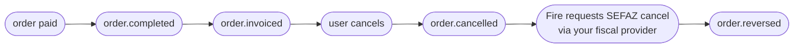

<Tabs>
  <Tab title="v2 · current">
    You're viewing the **current (v2)** contract. It adds a structured cancellation motive to the `cancellation` block — `cancellationType` (stable code), `cancellationGroup` (category) and `cancellationNote` (free text), **always present** (`null` when empty) — on top of the v1 order snapshot.
  </Tab>
  <Tab title="v1 · deprecated">
    <Warning>The **v1** contract is **deprecated**. Open it here: [order-reversed — v1](/en/events-v1/order-reversed).</Warning>
  </Tab>
  <Tab title="v0 · deprecated">
    <Warning>The **v0** contract is **deprecated**. Open it here: [order-reversed — v0](/en/events-v0/order-reversed).</Warning>
  </Tab>
</Tabs>

`order.reversed` fires when SEFAZ confirms the cancellation of a fiscal document (NFC-e or NF-e) that had been previously authorized. It is the SEFAZ-confirmed counterpart to [`order.cancelled`](/en/events/order-cancelled): the order is cancelled first inside Fire (firing `order.cancelled`), Fire then requests cancellation at SEFAZ via your fiscal provider, and `order.reversed` fires only when SEFAZ stamps the cancellation protocol.

## Trigger condition

Fire emits `order.reversed` once per fiscal cancellation, the first time **all** of these are true:

- The order is in a store with fiscal billing enabled (`storeFiscalConfig.enabled === true`)
- A fiscal document had been previously authorized (i.e. `order.invoiced` was emitted earlier)
- A cancellation request was submitted to your fiscal provider
- your fiscal provider reports the fiscal authority's confirmation of the cancellation

| | |
|---|---|
| Coverage | **All countries** — the country travels in `fiscal.countryCode` |
| Idempotency key | `event.id` |
| Fires more than once | No, unless retried |
| Latency relative to `order.cancelled` | Usually seconds; can be minutes if the fiscal authority is degraded |
| Precondition | A previous `order.invoiced` for the same `orderId` |

## What's in `trigger.data`

Same V4 order snapshot as [`order.cancelled`](/en/events/order-cancelled) — including the same `cancellation` audit block — with an extra **`sefazCancellation`** sub-object inside `cancellation.metadata.fiscal`. That's the only structural difference.

`status` is `"CANCELLED"`. The order is the same one referenced by the earlier `order.cancelled` event for the same `orderId`.

## Example — real production payload (BR, sanitized)

```json
{
  "event": {
    "id": "...",
    "type": "order.reversed",
    "createdAt": "2026-05-05T23:08:42.123Z"
  },
  "data": {
    "orderId": "e98f5725-0d1e-4f93-ac18-40f1068cae89",
    "orderCode": "OC-br-001",
    "status": "CANCELLED",
    "paymentStatus": "SUCCEEDED",
    "store": { /* same as order.completed */ },
    "client": { /* ... */ },
    "payments": { /* ... */ },
    "orderLines": [ /* ... */ ],
    "fulfillment": { /* ... */ },
    "device": { /* ... */ },
    "channel": { /* ... */ },
    "operator": { /* ... */ },
    "kds": { /* ... */ },
    "marketing": null,
    "metadata": {},

    "cancellation": {
      "cancellationId": "abcf3781-c327-4df1-84ef-5efbacc1d387",
      "cancelledAt": "2026-05-05T23:06:08.883Z",
      "cancelledBy": "00000000-0000-0000-0000-000000000000",
      "cancellationReason": "Customer requested cancellation",
      "cancellationType": "CUSTOMER_REQUESTED",
      "cancellationGroup": "Cliente",
      "cancellationNote": "cliente pidió cancelar",
      "cancellationSource": "backoffice",
      "metadata": {
        "fiscal": {
          "numero": "1000013",
          "pdfUrl":   "https://api.fiscal-provider.example/nfce/<docId>/pdf",
          "xmlUrl":   "https://api.fiscal-provider.example/nfce/<docId>/xml",
          "protocolo": "141200000956123",
          "docSubtype": "nfce",
          "chaveAcesso": "41201008187168000160558050010000131609769080",
          "providerDocId": "69fa77aa2a48c20329be4604",
          "dataAutorizacao": "2026-05-05T23:05:15.590Z",

          "sefazCancellation": {
            "date": "2026-05-05T23:08:30.000Z",
            "cStat": "135",
            "protocolo": "141201234567890",
            "xmlUrl": "https://api.fiscal-provider.example/nfce/<docId>/cancelamento/xml",
            "justificativa": "Cancelamento por solicitação do cliente — pedido não retirado"
          }
        }
      }
    }
  },
  "_meta": { "executionId": "...", "flowId": "...", "attempt": "1" }
}
```

## `data.cancellation.metadata.fiscal.sefazCancellation` reference

This is the only block that's unique to `order.reversed`. Every other field is shared with [`order.cancelled`](/en/events/order-cancelled) — see that page for the cancellation audit fields.

<ResponseField name="sefazCancellation" type="object">
  SEFAZ confirmation of the cancellation. Present only after SEFAZ has stamped the cancellation protocol.

  <Expandable title="sefazCancellation">
    <ResponseField name="date" type="string | null">
      ISO 8601 UTC timestamp when SEFAZ stamped the cancellation. May be `null` for sandbox flows that don't propagate the timestamp.
    </ResponseField>
    <ResponseField name="cStat" type="string | null">
      Raw SEFAZ status code for the cancellation event. `135` is the canonical "cancellation accepted" code for NFC-e/NF-e. May be `null` when the provider does not surface it.
    </ResponseField>
    <ResponseField name="protocolo" type="string | null">
      SEFAZ cancellation protocol number — distinct from the original authorization protocol. Required for any audit reference to the cancellation.
    </ResponseField>
    <ResponseField name="xmlUrl" type="string">
      URL to download the canonical SEFAZ XML for the cancellation event (the "cancelamento" XML, separate from the authorization XML).
    </ResponseField>
    <ResponseField name="justificativa" type="string | null">
      Reason text submitted to SEFAZ. Must be at least 15 characters per SEFAZ rules. May be `null` only for sandbox flows.
    </ResponseField>
  </Expandable>
</ResponseField>

## Lifecycle



For a Brazilian fiscal-enabled order, expect the four events above. For Brazilian orders **without** fiscal authorization (because the order was cancelled before fiscal emission, or fiscal was disabled), only `order.cancelled` fires — no `order.reversed`.

## Handler example

```js
async function onFiscalCancelled(data) {
  const { orderId, cancellation } = data;
  const fiscal = cancellation.metadata?.fiscal;
  const sefaz = fiscal?.sefazCancellation;

  if (!sefaz) {
    // Defensive: the event implies sefazCancellation is present, but
    // your handler should not crash if your fiscal provider ever ships a null shape.
    return;
  }

  // 1. Update the fiscal doc record with the SEFAZ confirmation
  await db.fiscalDocs.update({
    where: { providerDocId: fiscal.providerDocId },
    data: {
      status: "cancelled",
      cancellationProtocolo: sefaz.protocolo,
      cancelledAtSefaz: sefaz.date ? new Date(sefaz.date) : null,
      cancellationXmlUrl: sefaz.xmlUrl,
    },
  });

  // 2. Archive the cancellation XML (legally required in BR)
  if (sefaz.xmlUrl) {
    const xml = await fetch(sefaz.xmlUrl).then(r => r.text());
    await archive.put(`xml-cancel/${fiscal.providerDocId}.xml`, xml);
  }

  // 3. Close the reconciliation ticket opened by order.cancelled
  await reconciliation.close(orderId);
}
```

## Common pitfalls

- **Don't process `order.reversed` without `order.cancelled` first.** They fire in order in normal flow, but out-of-order delivery is possible. If you receive `order.reversed` for an `orderId` you don't have a cancellation record for, log it and create the record from this event's `cancellation` block — don't drop the event.
- **`sefazCancellation.date` and `cStat` may be `null` in sandbox.** Don't make production-readiness depend on them being present in dev environments.
- **The cancellation XML URL is distinct from the original document XML.** Make sure your archival logic stores both — you'll need them for audit.
- **Same `cancellation.cancellationId` as `order.cancelled`.** Both events for the same cancellation share the cancellation ID — useful as a join key when correlating the two events in your system.
- **No event for failed SEFAZ cancellation.** If SEFAZ rejects the cancellation request, no event fires. Monitor the dashboard's executions log for those cases.

## Related events

<CardGroup cols={2}>
  <Card title="order.cancelled" icon="ban" href="/en/events/order-cancelled">
    Fires before this event — the cancellation itself.
  </Card>
  <Card title="order.invoiced" icon="file-invoice" href="/en/events/order-invoiced">
    The earlier event that established the fiscal document being cancelled here.
  </Card>
</CardGroup>

## `data.fiscalRepresentation`

<Note>
  On `order.reversed` this block matters especially: these are the numbers of the
  receipt **being annulled**. The annulment does not change them — what changes is
  `lastKnown.fiscal.status`, which becomes `cancelled`.
</Note>


The **fiscal numbering** the point of sale obtained *before* injecting the order:
it charges, requests the identifiers, prints the receipt, and only then injects.
That is why it travels on the order and not in a separate fiscal event — by the
time the order is born, this already happened.

<Warning>
  **The presence of this block does NOT mean the document is authorized.** These
  are the numbers printed at the till; the tax authority's verdict is in
  `lastKnown.fiscal.status`. A ticket that says "authorized" just because the
  block is present states something that may never have happened.
</Warning>

**The key always travels.** It arrives as `null` when numbering was not
attempted — aggregators, countries without fiscal representation, or merchants
with numbering turned off — and carries the block when it was.

Carrying the block means **numbering was attempted, not that it succeeded**:
`numberingStatus` tells you how the attempt ended, and `failure` why, when it did
not end well.

Branch on the value, not on the key's presence:

```js
if (data.fiscalRepresentation) {
  // numbering was attempted — read numberingStatus to see how it went
}
```

| Field | What it is |
|---|---|
| `numberingStatus` | How the **numbering act** ended: `GENERATED`, `PENDING`, `FAILED_RETRYABLE`, `FAILED_FINAL`, `UNAVAILABLE`. **Not the authority's verdict** — that lives in `lastKnown.fiscal.status`. |
| `documentNumber` | The receipt's visible number, composed per country (`005-004-000000042`). It is presentation and **Fire builds it**, not the authority: reconcile with `countryData`. |
| `issuedAt` | When it was **numbered**. Not the authorization date. |
| `authorizationMode` | `ONLINE`, `OFFLINE` or `BATCH`. A provider concept, not universal. |
| `providerCode` | Identifier of the adapter that numbered. |
| `countryData` | The authority identifiers, in the vocabulary of the **country that numbered** — and only that country's. Ecuador: `numeroComprobante` (the human-readable document number, already assembled by the provider), `claveAcceso`, `establecimiento`, `puntoEmision`, `secuencial`, `ambiente`. Venezuela: `numeroControl`, `numeroFactura`, `serie`. **Iterate it; do not index blindly** — a new key here is not a breaking change. It is the same block the numbering endpoint returns and the authority callback carries. The per-country reference, with each regime's keys, is in [`countryData` by country](/en/api-reference/fiscal-documents#countrydata-by-country). |
| `graphic` | The printable artifact the provider returned (QR and the like), verbatim. `null` if it returned none. |
| `failure` | Why there is **no** receipt. `null` when numbering succeeded. |
| `providerIdentity` | **Who numbered, on the provider's side**: `{ "name": "hio.fiscalization", "version": "2026.08.1", "reference": "HIO-91f3c2" }`. Unlike the bag below, **it has a shape**: all three fields are part of the contract and always come through, with `null` when they do not apply. `reference` is **the provider's own support reference** — the identifier you quote back to them so they can find the operation in their records; it is not the `Idempotency-Key` the channel sent. It does not carry `providerCode`: that one is ours and travels at the top. |
| `providerMetadata` | **The provider's diagnostic bag**, exactly as it returned it: in Ecuador with HIO you get `{ "deviceUid": "4B8E…", "externalStoreCode": "K000" }`. It is **opaque** — the provider owns the keys and may change them without notice, so do not program against them; it is for pasting into a ticket, not for branching. **It is exactly the same field the numbering endpoint returns**, same name and same content: all three provider fields read the same at both ends. |
| `environment` | Which environment **Fire** numbered in: `SANDBOX` or `PRODUCTION`. It is ours, not the authority's — the authority's travels inside `countryData` with the country's own code. |
| `compensates` | Which document this one voids. Present **only** when `documentType` is `CREDIT_NOTE`. It is a **pointer**, not a copy: look its `documentNumber` up in `history` for the whole document. `reason` is the canonical code — the printed wording is authored per company and resolved in the numbering endpoint's response. |
| `history` | The order's **previous** documents, oldest first. Empty while there was only one; when a cancellation numbers, the invoice moves down here and the credit note sits on top. Every entry has **the same shape** as the block above, so they read alike. Documents only: a failed attempt does not appear. |

```json
"fiscalRepresentation": {
  "numberingStatus": "GENERATED",
  "documentNumber": "005-004-000000042",
  "countryData": {
    "numeroComprobante": "005-004-000000042",
    "claveAcceso": "1208202601000000000000110050040000000421234567810",
    "establecimiento": "005",
    "puntoEmision": "004",
    "secuencial": "000000042",
    "ambiente": "2"
  },
  "authorizationMode": "ONLINE",
  "issuedAt": "2026-08-13T08:11:29.744Z",
  "providerCode": "hio",
  "graphic": { "qr": "1208202601000000000000110050040000000421234567810" },
  "failure": null,
  "providerIdentity": { "name": "hio.fiscalization", "version": "2026.08.1", "reference": "HIO-91f3c2" },
  "providerMetadata": { "deviceUid": "4B8E21F9A0D35C7A", "externalStoreCode": "K004" },
  "environment": "PRODUCTION",
  "compensates": null,
  "history": []
}
```

**The authority's verdict does not alter it.** What the customer took home
printed does not change because the authority later authorizes or rejects — that
is what `lastKnown.fiscal` is for, and that is what does move.

**What does replace it is a new document.** The block carries the order's
**current** fiscal document. While there was only one, it was always the invoice;
when a cancellation produces a credit note, the note is what sits on top —
`documentType` says which one — and the invoice **moves down into `history`**,
whole and with its own authority identifiers. It is not lost: it moves.
`compensates` points at it by number, so the relationship stays explicit.

### When numbering fails

A sale can be charged and end up **with no fiscal receipt**. That case travels
too, and you must handle it: the identifiers come back `null` and the reason is
in `failure`.

```json
"fiscalRepresentation": {
  "numberingStatus": "FAILED_FINAL",
  "documentNumber": null,
  "issuedAt": null,
  "providerCode": "hio",
  "graphic": null,
  "failure": { "code": "RUC_INVALIDO", "scope": "FUNCTIONAL", "message": "Tax ID not enabled" }
}
```

Branch on `failure.scope`:

- **`TECHNICAL`** — print "pending" and carry on. It may resolve on its own.
- **`FUNCTIONAL`** — some data is wrong and retrying will not fix it. Needs correction.

<Note>
  **`lastKnown.fiscal.sourceEvent` now reports real provenance.** It used to be
  derived from the status, so a `processing` seeded at injection was reported as
  `fiscal.callback` even though no callback had occurred. That case now says
  `order.injected`. If you branch on this field, account for the new value.
</Note>

