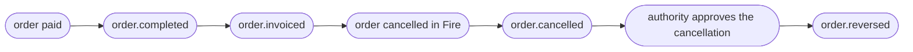

import FiscalEventBlock from '/snippets/fiscal-event-block.mdx';

<Tabs>
  <Tab title="v3 · current">
    You are reading the **current (v3)** contract for `order.reversed`. **v3 is a breaking change in the fiscal block only**: it moves from `cancellation.metadata.fiscal` to **`cancellation.fiscal`**, becomes structured (`authority`, `history`, `compensates`) and `sefazCancellation` is no longer emitted. The `cancellation` audit fields added in v2 (`cancellationType`, `cancellationGroup`, `cancellationNote`) are unchanged. See [Path changes from the previous version](#path-changes-from-the-previous-version).
  </Tab>
  <Tab title="v2 · deprecated">
    <Warning>The **v2** contract is **deprecated**. Open it here: [order-reversed — v2](/en/events-v2/order-reversed).</Warning>
  </Tab>
  <Tab title="v1 · deprecated">
    <Warning>The **v1** contract is **deprecated**. Open it here: [order-reversed — v1](/en/events-v1/order-reversed).</Warning>
  </Tab>
</Tabs>

`order.reversed` fires when the **fiscal authority confirms the cancellation** of a document it had previously authorized. It is the fiscal outcome of [`order.cancelled`](/en/events/order-cancelled): the order is cancelled inside Fire first (`order.cancelled`), the cancellation is requested at the authority through your fiscal provider, and `order.reversed` fires only when the authority approves it.

<Warning>
  **If you need to know that the document is annulled at the authority, listen to this event — not to `order.cancelled`.** `order.cancelled` is emitted when the order is cancelled, before the authority answers: its fiscal block still describes the authorized invoice. In a real Brazilian case, `order.cancelled` left at `05:06:45`, SEFAZ approved at `05:06:51`, and `order.reversed` left at `05:08:12`.
</Warning>

## Trigger condition

Fire emits `order.reversed` when a fiscal document for the order reaches `cancelled` — from its native provider integration or from the [fiscal callback](/en/api-reference/fiscal-callback) with `eventType: "cancelled"` — **and** the order has an operational cancellation record in Fire. Without that record the event is not emitted: the `cancellation` block is what tells consumers this is a void and not a sale.

| | |
|---|---|
| Coverage | **All countries** — the country travels in `cancellation.fiscal.countryCode` |
| Idempotency key | `event.id` |
| Fires more than once | Once per active Integration Flow subscribed to the event; retried on delivery failure |
| Latency relative to `order.cancelled` | Usually seconds; minutes if the authority is degraded |
| Precondition | A previous authorized document for the same `orderId` |

## What's in `trigger.data`

The same V4 order snapshot as [`order.completed`](/en/events/order-completed), with `status: "CANCELLED"`, plus the **`cancellation`** block: the same audit fields as `order.cancelled` and, inside it, the **fiscal block** with the cancelled document.

<Note>**Cash fields in `payments.paymentMethods[]`.** `customerCashAmount` and `changeAmount` are **numbers**. Orders injected before 24 September 2026 carry `customerCashAmount` as the string `"0"` and no `changeAmount`: if you replay or reprocess older events, read the field as a number. See the [`order.completed` field reference](/en/events/order-completed#field-reference).</Note>

## Example — Brazil (NFC-e, sanitized)

```json
{
  "event": { "id": "…", "type": "order.reversed", "createdAt": "2026-09-15T05:08:12.359Z" },
  "data": {
    "orderId": "15801bd1-83d3-4d70-bb1b-793fd30b7bec",
    "orderCode": "OC-br-001",
    "status": "CANCELLED",
    "paymentStatus": "SUCCEEDED",
    "store": { /* same as order.completed */ },
    "orderLines": [ /* same as order.completed */ ],

    "cancellation": {
      "cancellationId": "6fcb0a30-cfde-4ffe-96ef-545dde3fa87c",
      "cancelledAt": "2026-09-15T05:06:44.359Z",
      "cancelledBy": "4fadc5f3-d9da-4756-978d-5a8cffc25d40",
      "cancellationType": "OTHER",
      "cancellationGroup": "Other",
      "cancellationReason": "Customer requested cancellation",
      "cancellationNote": null,
      "cancellationSource": "backoffice",

      "fiscal": {
        "status": "cancelled",
        "countryCode": "BR",
        "providerCode": "plugnotas",
        "occurredAt": "2026-09-15T05:08:11.702Z",
        "authority": {
          "documentType": "CREDIT_NOTE",
          "docSubtype": "nfce",
          "documentNumber": "12388",
          "issuedAt": "2026-09-15T05:00:48.003Z",
          "authorizedAt": "2026-09-15T03:00:00.000Z",
          "cancelledAt": "2026-09-15T05:06:51.603Z",
          "authorizationMode": "ONLINE",
          "providerDocId": "6aa8d10117b687522d90ae0a",
          "pdfUrl": "https://api.fiscal-provider.example/nfce/6aa8d10117b687522d90ae0a/pdf",
          "xmlUrl": "https://api.fiscal-provider.example/nfce/6aa8d10117b687522d90ae0a/xml",
          "amounts": { "total": 11.9, "tax": 1.65, "currencyCode": "BRL" },
          "countryData": {
            "chaveAcesso": "41201008187168000160558050010000131609769080",
            "numero": "12388",
            "serie": "2",
            "modelo": 65,
            "protocolo": "135266298552102",
            "cStat": "135"
          },
          "graphic": { "qr": "41201008187168000160558050010000131609769080" },
          "providerIdentity": null,
          "providerMetadata": null
        },
        "history": [
          {
            "status": "authorized",
            "occurredAt": "2026-09-15T05:00:48.003Z",
            "providerCode": "plugnotas",
            "authority": { /* the invoice: documentType SALE_INVOICE, cancelledAt null */ }
          },
          {
            "status": "cancelled",
            "occurredAt": "2026-09-15T05:08:11.702Z",
            "providerCode": "plugnotas",
            "authority": { /* identical to authority above */ }
          }
        ],
        "compensates": {
          "documentNumber": "12388",
          "issuedAt": "2026-09-15T05:00:48.003Z"
        }
      }
    }
  },
  "_meta": { "executionId": "…", "flowId": "…", "attempt": "1" }
}
```

<Note>Note that in Brazil `authority.documentNumber` and `compensates.documentNumber` are the same (`12388`): SEFAZ annuls the document instead of issuing a new one. In regimes where a cancellation is a separate credit note, they differ.</Note>

## `data.cancellation` reference

The audit fields are the same as in [`order.cancelled`](/en/events/order-cancelled#data-cancellation-reference) — including `cancellationId`, which both events share for the same cancellation and you can use as a join key. The fiscal block is documented below.

<FiscalEventBlock />

## Lifecycle



An order cancelled **before** its document was authorized fires only `order.cancelled`: there is nothing to reverse at the authority.

## Handler example

```js
async function onOrderReversed(data) {
  const { orderId, cancellation } = data;
  const fiscal = cancellation.fiscal;
  const doc = fiscal.authority;

  await db.fiscalDocs.update({
    where: { providerDocId: doc.providerDocId },
    data: {
      status: "cancelled",
      documentType: doc.documentType,
      cancelledAt: doc.cancelledAt,
      reason: cancellation.cancellationType,
    },
  });

  // The replaced document, whole, is in history.
  const replaced = fiscal.history.find(
    (e) => e.authority.documentNumber === fiscal.compensates?.documentNumber
      && e.status !== "cancelled",
  );

  await reconciliation.close(orderId, { original: replaced?.authority });
}
```

## Common pitfalls

- **Read `cancellation.fiscal`, not `cancellation.metadata.fiscal`.** The previous path is empty on v3.
- **`sefazCancellation` is gone.** The cancellation date is `authority.cancelledAt`; the authority's identifiers are in `authority.countryData`.
- **Out-of-order delivery is possible.** If `order.reversed` arrives for an order you have no cancellation for, create it from this event's `cancellation` block instead of dropping the event.
- **No event for a failed cancellation.** If the authority rejects the cancellation, no event fires.

## Related events

<CardGroup cols={2}>
  <Card title="order.cancelled" icon="ban" href="/en/events/order-cancelled">
    Fires before this event — the order cancellation itself.
  </Card>
  <Card title="order.invoiced" icon="file-invoice" href="/en/events/order-invoiced">
    The event that reported the document being cancelled here.
  </Card>
  <Card title="Fiscal callback" icon="arrow-right-to-bracket" href="/en/api-reference/fiscal-callback">
    How a provider reports the cancellation that fires this event.
  </Card>
</CardGroup>

## `data.fiscalRepresentation`

Unchanged in v3. It holds the numbers of the receipt printed at the till — the one **being annulled** — and it is a different block from `cancellation.fiscal`: `fiscalRepresentation` is what was numbered, `authority` is what the authority decided. The field reference is in the [v2 page](/en/events-v2/order-reversed#data-fiscalrepresentation).
