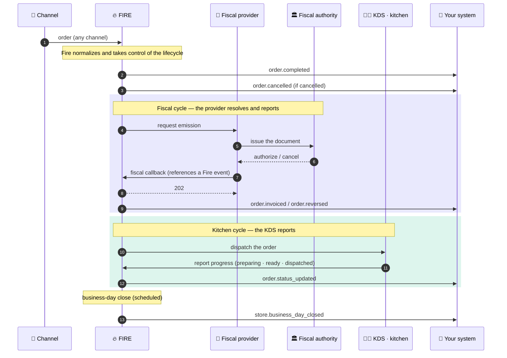
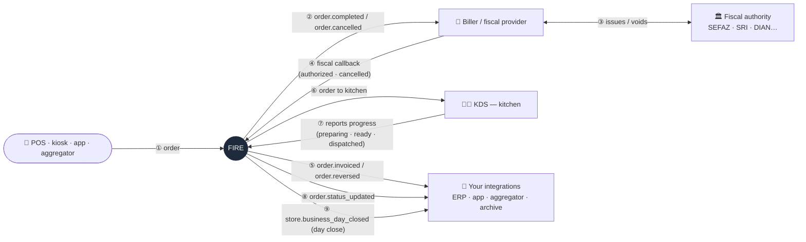
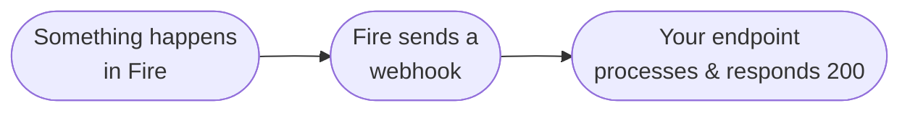

Fire emits **events** whenever a meaningful business transition happens — an order is completed, an order is cancelled, a fiscal document is authorized by the tax authority, the kitchen advances an order. Each event is delivered to your endpoint by an **Integration Flow** you configure in the Fire dashboard.

<Note>
  Fire emits **five** order event types today: [`order.completed`](/en/events/order-completed), [`order.cancelled`](/en/events/order-cancelled), [`order.invoiced`](/en/events/order-invoiced), [`order.reversed`](/en/events/order-reversed) and [`order.status_updated`](/en/events/order-status-updated), plus the scheduled [`store.business_day_closed`](/en/events/store-day-closed) event at business-day close.
</Note>

## Fire is the source of truth for the lifecycle

An order can be born in any channel — POS, kiosk, app, aggregator — but from the moment it enters, **Fire normalizes it and takes control of its entire lifecycle**. Everything that happens around that order is centralized in Fire: payment completes it, the kitchen advances it, the fiscal provider invoices or reverses it, and the business-day close consolidates it. Each of those milestones reaches your systems as an event carrying the same canonical order snapshot.

That centralization works in both directions: external systems **never write state on their own** — they report to Fire through inbound webhooks, and **every report must reference an event Fire emitted** (the `eventId` of the envelope you received). Fire validates that reference before accepting the report; a callback that does not point to an event Fire emitted for that order is rejected with `400`. This way an order's timeline has a single source of truth and never forks.

<Note>
  The **sequence diagram** shows the lifecycle over time — including the two *round-trips* where the fiscal provider and the KDS **resolve and report back to Fire**. The **structural diagram** sums it up as who talks to whom.
</Note>

### Lifecycle over time



### Who talks to whom



Notice the **two round-trip circuits**: Fire notifies the biller (②), the biller settles with the authority (③) and **reports back to Fire** via the callback (④) — only then does Fire emit `order.invoiced` / `order.reversed` (⑤). Same with the kitchen: Fire dispatches the order to the KDS (⑥), the KDS **reports progress back to Fire** (⑦) and Fire emits `order.status_updated` (⑧). Nothing learns anything "on its own": everything goes through Fire and out of Fire — including `store.business_day_closed` (⑨) at day close.

### One action, one event

Every business action is its **own** event with its **own** `event.id` — `order.invoiced` for a fiscal authorization, `order.reversed` for a cancellation, each `order.status_updated` for a kitchen transition. They are never collapsed: authorizing an order and later cancelling it are two distinct events with two distinct ids.

This shapes how Fire matches the **inbound reports** that drive those actions:

- **A report references the event for *that* action.** When you report a cancellation back to Fire, echo the `event.id` of the cancellation event — not the authorization's. Each `(orderId, eventId)` is ingested exactly once.
- **Resending the same report is safe.** The same `(orderId, eventId)` with the same type is an idempotent replay — Fire returns the existing record and processes nothing twice (`202`, `duplicate: true`). You may regenerate your own provider id freely.
- **You cannot ride one action on another's event.** Reporting a cancellation by reusing the authorization's `eventId` is rejected with **`409`** — accepting it would tell you the cancellation succeeded while Fire never cancelled. Each action must reference its own Fire-emitted event.

<Note>
  **One exception — the kitchen journey.** The KDS reports `preparing` → `ready` → `dispatched` against **one** `eventId` (the dispatch's), told apart by `eventType` — so the same `eventId` with a different type is a **new step**, not a conflict. The rule above (one `eventId` per action) is per **action type**: it holds for fiscal (one action = one event) and the KDS journey shares one dispatch event across its steps. Either way, a report must reference a Fire-emitted event, and the same `(orderId, eventId, eventType)` is ingested once.
</Note>

See the [fiscal callback](/en/api-reference/fiscal-callback#idempotency--scenarios) and the [KDS endpoint](/en/api-reference/kds-order-status#idempotency--the-journey) for the full inbound behavior matrices.

## How it works



When a meaningful business event happens, Fire dispatches it through a flow you configured in the dashboard. The flow renders an HTTP request body and POSTs it to your endpoint. You acknowledge with a `2xx` response.

The internal mechanics (queues, retries, template resolution) are covered in [Delivery & retries](/en/events/delivery). The flow configuration model is covered in [Integration Flows](/en/events/integration-flows).

## What your endpoint receives

When a flow fires, your endpoint receives an HTTP `POST`. The body has **three top-level fields** — `event`, `data`, and `_meta`:

```json
{
  "event": {
    "id": "0d6e8a1c-1e7a-4b4f-8a3a-74ab0e9a9b21",
    "type": "order.completed",
    "createdAt": "2026-05-06T13:42:11.812Z"
  },
  "data": {
    /* event-specific V4 snapshot — see each event reference */
  },
  "_meta": {
    "executionId":     "0d6e8a1c-1e7a-4b4f-8a3a-74ab0e9a9b21",
    "flowId":          "9a2b3c4d-7e8f-4a1b-9c2d-3e4f5a6b7c8d",
    "flowName":        "ERP integration",
    "attempt":         "1",
    "triggerEntityId": "f1e2d3c4-b5a6-4789-9012-3456789abcde"
  }
}
```

### `event`

<ResponseField name="event" type="object">
  Identifies this delivery.

  <Expandable title="event">
    <ResponseField name="id" type="string">
      Unique identifier of this delivery (the flow execution ID). **Use this as your idempotency key** — Fire may deliver the same event more than once during retries.
    </ResponseField>
    <ResponseField name="type" type="string">
      Event type. One of: `order.completed`, `order.cancelled`, `order.invoiced`, `order.reversed`, `order.status_updated`, `store.business_day_closed`.
    </ResponseField>
    <ResponseField name="createdAt" type="string">
      ISO 8601 UTC timestamp of the moment the event was materialized inside Fire (not the moment it reached your endpoint).
    </ResponseField>
  </Expandable>
</ResponseField>

### `data`

<ResponseField name="data" type="object">
  Event-specific payload. Shape varies per event:
</ResponseField>

| Event | What's in `data` |
|---|---|
| [`order.completed`](/en/events/order-completed) | V4 order snapshot — order, store (with optional `storeFiscalConfig`), customer, payments, fulfillment, KDS, lines |
| [`order.cancelled`](/en/events/order-cancelled) | V4 order snapshot + `cancellation` audit block |
| [`order.invoiced`](/en/events/order-invoiced) | V4 order snapshot with `order.fiscal` (chave, protocolo, número…) + `storeFiscalConfig` |
| [`order.reversed`](/en/events/order-reversed) | V4 order snapshot + `xmlCancelamento` + `sefazCancellation` |

### `_meta`

<ResponseField name="_meta" type="object">
  Execution-level traceability. Log it alongside the event to debug delivery problems and correlate retries.

  <Expandable title="_meta">
    <ResponseField name="executionId" type="string">
      Internal flow execution ID. Mirrors `event.id`.
    </ResponseField>
    <ResponseField name="flowId" type="string">
      UUID of the Integration Flow that produced this delivery.
    </ResponseField>
    <ResponseField name="flowName" type="string">
      Human-readable name of the flow (as configured in the dashboard).
    </ResponseField>
    <ResponseField name="attempt" type="string">
      Delivery attempt number, starting at `"1"`. Increments with each retry.
    </ResponseField>
    <ResponseField name="triggerEntityId" type="string">
      The business entity ID that originated the event (typically the order UUID, same as `data.orderId`).
    </ResponseField>
  </Expandable>
</ResponseField>

<Note>
  The `event`, `data`, and `_meta` keys come from the **canonical body template** the Fire dashboard ships with. They are a convention, not a fixed Fire envelope — if your flow's HTTP node defines a different body template, the wire shape changes accordingly. See [Customizing the body](#customizing-the-body) below.
</Note>

## Default HTTP delivery

| Field | Default |
|---|---|
| Method | `POST` (configurable per flow) |
| `Content-Type` | `application/json` (set by your flow's HTTP node headers) |
| Timeout | 30 seconds (configurable, 1–60s) |
| Auth | None / `Bearer` / `x-api-key` / OAuth2 client credentials — selected per flow |
| Signature | **Optional** HMAC-SHA256 (Webhook node) — `X-Fire-Signature` + `X-Fire-Timestamp` |
| Retries | Up to 5 with exponential backoff |
| Dead letter | After max retries, the execution lands in `flow_dead_letter` |

<Note>
  Outbound requests can be **HMAC-signed** when your flow uses the **Webhook node**: Fire adds `X-Fire-Signature` (`v1=hex(HMAC-SHA256(secret, "{timestamp}.{body}"))`) and `X-Fire-Timestamp` (Unix seconds). The signature is optional and **complements** transport auth (Bearer / API key / OAuth2). Details and verification in [the signed Webhook node](/en/events/integration-flows#signed-webhook-node-hmac).
</Note>

## Receiving events

```js
import express from "express";

const app = express();
const seen = new Map(); // swap for Redis / DB in production

app.post("/fire/events", express.json(), async (req, res) => {
  const { event, data, _meta } = req.body ?? {};
  if (!event?.id || !event?.type) return res.status(400).end();

  // 1. Acknowledge first to free Fire's connection
  res.status(200).end();

  // 2. Deduplicate by event.id (the flow execution ID)
  if (seen.has(event.id)) return;
  seen.set(event.id, Date.now());

  // 3. Log _meta for traceability — invaluable when debugging
  console.log("Fire event", { eventId: event.id, type: event.type, _meta });

  // 4. Dispatch by type
  switch (event.type) {
    case "order.completed":     return onOrderCompleted(data);
    case "order.cancelled":     return onOrderCancelled(data);
    case "order.invoiced":       return onOrderInvoiced(data);
    case "order.reversed":       return onOrderReversed(data);
    case "order.status_updated": return onKitchenAdvance(data);
    default: console.warn("Unknown Fire event type", event.type);
  }
});

app.listen(8080);
```

<Steps>
  <Step title="Acknowledge fast">
    Return `200 OK` (or any `2xx`) within 30 seconds — ideally under 1 second. Acknowledge **before** doing heavy work.
  </Step>
  <Step title="Authenticate the request">
    Validate the auth credential the flow sends (Bearer token, API key, or OAuth2 access token). Reject any request that doesn't match.
  </Step>
  <Step title="Deduplicate">
    Look up `event.id` in a short-TTL store (Redis with 24-hour expiry works). If you've already processed it, skip.
  </Step>
  <Step title="Validate the payload">
    Check `event.type` matches your handler and the `data` block has the fields you expect. Return `400` for malformed inputs so they don't enter your retry queue from Fire.
  </Step>
  <Step title="Process and persist">
    Apply your business logic, persist the result keyed by `event.id` for traceability. Return `5xx` for transient failures (Fire will retry); return `4xx` for unrecoverable bad input (Fire will dead-letter).
  </Step>
</Steps>

## Customizing the body

The body Fire delivers to your endpoint is **whatever your flow's HTTP node body template renders**. The canonical template (above) is the recommended default, but you can write any valid JSON template that references the runtime **trigger context**:

```ts
{
  trigger: {
    event: { id, type, createdAt },
    data: V4Snapshot,         // event-specific payload
  },
  execution: { id, ... },     // execution metadata
  flow:      { id, name },    // your flow's identity
  queue:     { id, attempt, triggerEntityId },
}
```

The canonical template uses these paths:

```json
{
  "event": {
    "id":        "{{trigger.event.id}}",
    "type":      "{{trigger.event.type}}",
    "createdAt": "{{trigger.event.createdAt}}"
  },
  "data": "{{trigger.data}}",
  "_meta": {
    "executionId":     "{{execution.id}}",
    "flowId":          "{{flow.id}}",
    "flowName":        "{{flow.name}}",
    "attempt":         "{{queue.attempt}}",
    "triggerEntityId": "{{queue.triggerEntityId}}"
  }
}
```

You can write a different template that omits `_meta`, flattens `data`, renames keys, sends only specific fields, etc. See [Integration Flows](/en/events/integration-flows) for the full reference.

## Next

<CardGroup cols={2}>
  <Card title="Integration Flows" icon="diagram-project" href="/en/events/integration-flows">
    How your system subscribes to events through flows configured in the dashboard.
  </Card>
  <Card title="Delivery & retries" icon="repeat" href="/en/events/delivery">
    Retry policy, dead-letter behavior, idempotency, and ordering guarantees.
  </Card>
  <Card title="order.completed" icon="receipt" href="/en/events/order-completed">
    The most common event — full V4 order snapshot.
  </Card>
  <Card title="order.invoiced" icon="file-invoice" href="/en/events/order-invoiced">
    Brazilian fiscal authorization through your fiscal provider.
  </Card>
</CardGroup>
