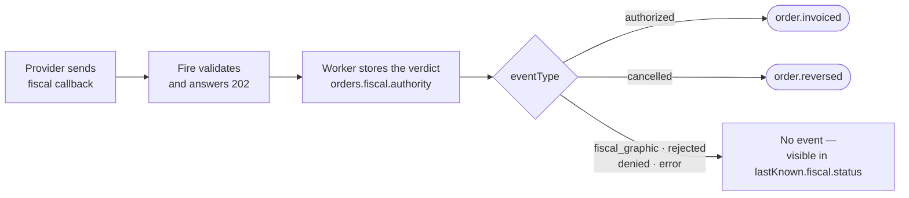

The fiscal callback does one thing: it **writes the tax authority's verdict on the order**. Events are not built from the callback — they are built from what the order stores. So the question "what does my consumer receive?" always has the same answer: `fiscal.authority`, with the shape described here.

If you have not read it yet, [How fiscal works in Fire](/en/fiscal/overview) explains the two acts and the two blocks this page assumes.

## What happens, step by step



1. Your provider posts the [fiscal callback](/en/api-reference/fiscal-callback). Fire validates it and answers `202 Accepted`. **A `202` means queued, not processed**, and never means an event was sent.
2. A background worker stores the verdict on the order, usually within a couple of seconds.
3. Depending on `eventType`, Fire emits an event to your Integration Flows — or not.

## Which event fires

| Callback `eventType` | Order fiscal status | Event emitted |
|---|---|---|
| `authorized` | `authorized` | [`order.invoiced`](/en/events/order-invoiced) |
| `cancelled` | `cancelled` | [`order.reversed`](/en/events/order-reversed) — only if the order has a cancellation recorded in Fire; otherwise nothing is emitted |
| `fiscal_graphic` | `fiscal_graphic` | none — the printable graphic is stored; the document is not yet authorized |
| `rejected`, `denied`, `error` | `rejected`, `denied`, `error` | none — in the events, visible only in `lastKnown.fiscal.status` of the next event for that order |

An event is emitted only when the callback actually changed the document. A resend of a state already applied (`idempotent`), a callback that would move the document backwards (`regression`) or one that matches no document (`notFound`) is still answered with `202`, and emits nothing.

<Warning>
  **`order.cancelled` does not come from the callback.** It fires when the order is cancelled in Fire, before the authority is asked. The authority's confirmation arrives later as a `cancelled` callback, which produces `order.reversed`.
</Warning>

## Where each field of the callback lands

Everything below lands in `orders.fiscal.authority`, and from there in the events.

| Fiscal callback (body) | `authority` (order and events) |
|---|---|
| `documentType`, `docSubtype`, `documentNumber` | same names |
| `issuedAt`, `authorizedAt`, `cancelledAt`, `authorizationMode` | same names |
| `pdfUrl`, `xmlUrl`, `providerDocId` | same names |
| `totalAmount`, `taxAmount`, `currencyCode` | `amounts.total`, `amounts.tax`, `amounts.currencyCode` |
| `document.<key>` | `countryData.<key>` — same key, same value |
| `graphic` | `graphic` |
| `provider` | `providerIdentity` — `{ name, version, reference }`; `null` if absent or empty |
| `metadata` | `providerMetadata` — opaque; `null` if absent or `{}` |
| `country` | `fiscal.countryCode` (outside `authority`); if the order already had one, it is kept |
| `occurredAt` | `fiscal.occurredAt` (outside `authority`) |
| `eventType`, `eventId`, `orderId`, `providerEventId`, `failure` | not carried into `authority` |

Three rules explain the table:

- **`document` becomes `countryData`.** Fire keeps no list of each country's keys: anything in `document` reaches `countryData` untouched. A new identifier your authority starts requiring travels without any change on Fire's side.
- **`provider` and `metadata` keep the numbering's names.** On the numbering side the provider also sends `provider` and `metadata`, and Fire exposes them as `providerIdentity` and `providerMetadata`. The callback does the same, so both blocks of the order read alike. `providerIdentity.reference` is what you quote to the provider to find the operation in their records.
- **Empty means `null`, not absent.** A callback without `provider` or `metadata` (or with `{}`) stores `providerIdentity: null` and `providerMetadata: null`.

## Where it appears in each event

| Event | Path | Carries |
|---|---|---|
| `order.invoiced` | `data.fiscal` | `status`, `countryCode`, `providerCode`, `occurredAt`, `authority`, `history`, `compensates` |
| `order.cancelled` | `data.cancellation.fiscal` | only `status` and `authority` — the document **as it was before** the cancellation. Present only if the order had an `authorized` or `cancelling` document with a `providerDocId`; otherwise the key is absent |
| `order.reversed` | `data.cancellation.fiscal` | the full block, with the cancelled document, `history` and `compensates` |

The field-by-field reference of that block is in [the fiscal block](/en/events/order-invoiced#the-fiscal-block).

## The path without a callback: Brazil (PlugNotas)

In Brazil there is no fiscal callback: Fire learns the SEFAZ verdict directly from PlugNotas. **The block your consumer receives has the same shape**, with these differences:

| | Fiscal callback | PlugNotas |
|---|---|---|
| `fiscal.providerCode` | `generic` | `plugnotas` |
| `authority.providerIdentity` | from `provider` | `null` — PlugNotas never sends it; a cancellation keeps the value of the previous document |
| `authority.providerMetadata` | from `metadata` | `null` — PlugNotas never sends it; a cancellation keeps the value of the previous document |
| `authority.countryData` | from `document` | `chaveAcesso`, `numero`, `serie`, `modelo`, `protocolo`, `cStat` |
| `data.fiscalRepresentation` | populated if the till numbered first | `null` — there is no numbering step |
| `authority.authorizedAt` | as the provider reports it | the SEFAZ date, with a conventional midnight time |

## One order, end to end

The same Brazilian order through the fiscal callback, trimmed to the fiscal parts.

<Steps>
  <Step title="Callback: authorized">
    ```json
    {
      "country": "BR",
      "eventType": "authorized",
      "orderId": "d2c66234-546d-414f-9b22-095402a68e33",
      "eventId": "ca7ffb66-3c5d-4346-8a1e-7663e82ed2d2",
      "occurredAt": "2026-09-15T16:30:56.000Z",
      "documentType": "SALE_INVOICE",
      "docSubtype": "nfce",
      "documentNumber": "7",
      "providerDocId": "BR-E2E-007",
      "issuedAt": "2026-09-15T16:30:55.921Z",
      "totalAmount": 55.5, "taxAmount": 7.2, "currencyCode": "BRL",
      "pdfUrl": "https://api.fiscal-provider.example/br-e2e.pdf",
      "xmlUrl": "https://api.fiscal-provider.example/br-e2e.xml",
      "document": { "chaveAcesso": "35260229062609000177650500000000071000000070", "protocolo": "141210001176999", "numero": 7, "serie": 50, "modelo": 65 },
      "provider": { "name": "hio.fiscalization", "version": "2026.09.1", "reference": "HIO-E2E-AUTH-007" },
      "metadata": { "providerTraceId": "e2e-auth-trace-007", "deviceUid": "POS-BR-01" }
    }
    ```
  </Step>
  <Step title="Fire answers 202, then stores the verdict">
    ```json
    "authority": {
      "documentType": "SALE_INVOICE",
      "docSubtype": "nfce",
      "documentNumber": "7",
      "issuedAt": "2026-09-15T16:30:55.921Z",
      "authorizedAt": null,
      "cancelledAt": null,
      "providerDocId": "BR-E2E-007",
      "pdfUrl": "https://api.fiscal-provider.example/br-e2e.pdf",
      "xmlUrl": "https://api.fiscal-provider.example/br-e2e.xml",
      "amounts": { "total": 55.5, "tax": 7.2, "currencyCode": "BRL" },
      "countryData": { "chaveAcesso": "35260229062609000177650500000000071000000070", "protocolo": "141210001176999", "numero": "7", "serie": "50", "modelo": 65 },
      "graphic": null,
      "providerIdentity": { "name": "hio.fiscalization", "version": "2026.09.1", "reference": "HIO-E2E-AUTH-007" },
      "providerMetadata": { "providerTraceId": "e2e-auth-trace-007", "deviceUid": "POS-BR-01" }
    }
    ```
  </Step>
  <Step title="order.invoiced carries it">
    ```json
    "fiscal": {
      "status": "authorized",
      "countryCode": "BR",
      "providerCode": "generic",
      "occurredAt": "2026-09-15T16:30:56.000Z",
      "authority": { /* exactly the block above */ },
      "history": [
        { "status": "authorized", "occurredAt": "2026-09-15T16:30:56.000Z", "providerCode": "generic", "authority": { /* same block */ } }
      ],
      "compensates": null
    }
    ```
  </Step>
  <Step title="The order is cancelled in Fire">
    `order.cancelled` fires immediately with `data.cancellation.fiscal = { "status": "authorized", "authority": { … } }` — the invoice as it was. Nothing has been asked to the authority yet.
  </Step>
  <Step title="Callback: cancelled, then order.reversed">
    The provider sends `eventType: "cancelled"` with **its own `eventId`** (reusing the authorization's returns `409`). Fire emits `order.reversed` with `authority.documentType: "CREDIT_NOTE"`, `cancelledAt` set, both documents in `history`, and `compensates` pointing at the invoice.
  </Step>
</Steps>

## What does not happen

- **No event for `rejected`, `denied` or `error`.** They are stored; your consumer only sees them in `lastKnown.fiscal.status` of a later event.
- **A `202` is not an event.** Poll the [outcome endpoint](/en/api-reference/fiscal-callback#checking-the-outcome) if you need to know the callback was processed.
- **The callback does not change `fiscalRepresentation`.** What was printed at the till stays as it was.
- **There is no guard by provider.** An order holds a single document. When the order already has a document, an `authorized` whose `eventId` does not match it ends in `notFound` and changes nothing; when the order has no document, the `authorized` creates it. An `eventId` that Fire never emitted for that order is rejected with `400` before the `202`. A `cancelled` resolves the order's most recent document and updates it, whichever provider issued it — PlugNotas included.
