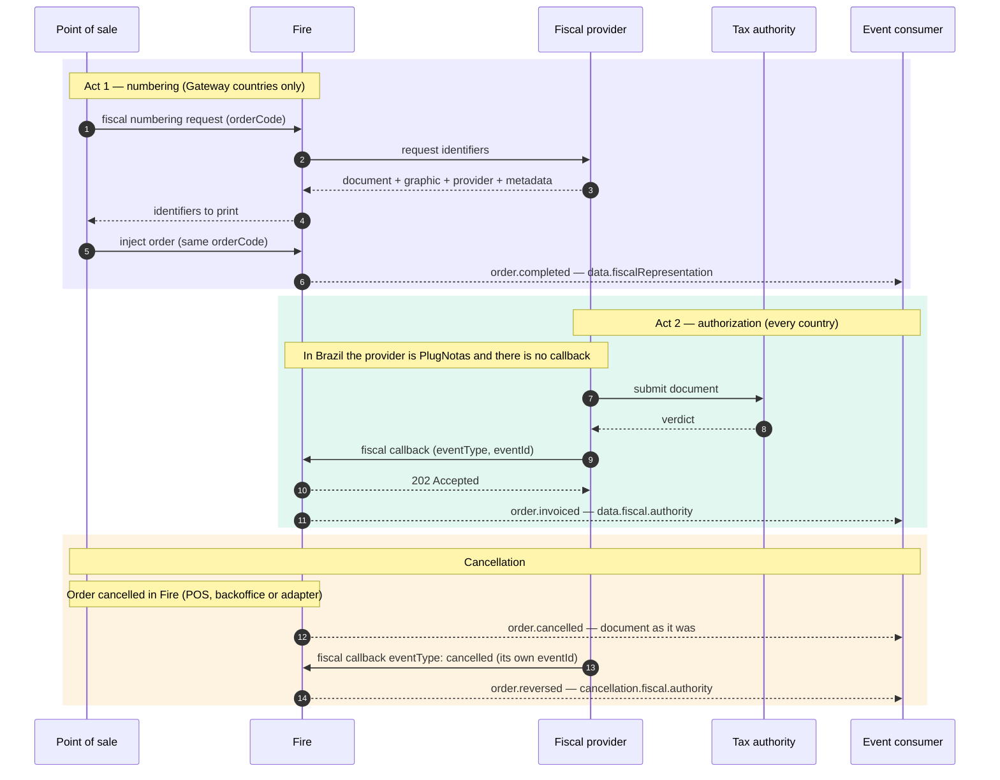

Every fiscal document in Fire goes through **two separate acts**, at different moments, and each one leaves its own block on the order. Most confusion comes from mixing them up, so this page names them once and every other fiscal page builds on it.

## The two acts

| | Act 1 — Numbering | Act 2 — Authorization |
|---|---|---|
| **When** | Before the order exists, at the till | Seconds or minutes after the sale |
| **Who starts it** | The point of sale asks Fire for identifiers | The fiscal provider reports the tax authority's verdict |
| **How it reaches Fire** | [Fiscal numbering](/en/api-reference/fiscal-documents-v2) request | [Fiscal callback](/en/api-reference/fiscal-callback) (or PlugNotas, in Brazil) |
| **Block on the order** | `data.fiscalRepresentation` | `data.fiscal.authority` |
| **Question it answers** | *What was printed?* | *What did the authority decide?* |
| **Changes later?** | Only when a new document is numbered (a credit note) | Yes: authorized, then cancelled |

<Warning>
  **`fiscalRepresentation` never says the document was authorized.** It holds the numbers printed at the till. The authority's verdict is `fiscal.authority`, and the current status is `fiscal.status` in the fiscal events, `lastKnown.fiscal.status` in every other event. The three can legitimately disagree for a while.
</Warning>

## Two ways a document reaches Fire

<Tabs>
  <Tab title="Gateway countries (today Ecuador and Colombia)">
    Both acts happen. The till numbers first through Fire, prints, injects the order, and the provider later reports the verdict through the fiscal callback.

    - `data.fiscalRepresentation` is populated from the moment the order exists.
    - `data.fiscal.authority` appears when the callback arrives.
    - `fiscal.providerCode` is `generic`.
  </Tab>
  <Tab title="PlugNotas (Brazil)">
    **There is no Act 1.** Fire issues the NFC-e / NF-e through PlugNotas after the sale and learns the SEFAZ verdict directly from PlugNotas — no fiscal callback, no numbering request.

    - `data.fiscalRepresentation` is `null`.
    - `data.fiscal.authority` appears when SEFAZ authorizes.
    - `fiscal.providerCode` is `plugnotas`.
    - `authority.providerIdentity` and `authority.providerMetadata` are `null`: PlugNotas sends neither. A cancellation keeps the values of the previous document.
  </Tab>
</Tabs>

Other countries can also report through the fiscal callback without numbering first. What matters for a consumer is the same in every case: **the verdict is always `fiscal.authority`, with the same shape**, whichever way it came in.

## The whole cycle

What happens between the callback and the events — which event fires for each outcome, and how every field travels — is in [From the callback to the events](/en/fiscal/callback-to-events).

## Four words for "status"

The same fact is named differently depending on where you read it. They are not interchangeable:

| Where | Field | Values | Describes |
|---|---|---|---|
| Fiscal numbering response | `numberingStatus` | `GENERATED`, `PENDING`, `FAILED_RETRYABLE`, `FAILED_FINAL`, `NOT_APPLICABLE`, `BLOCKED_BY_POLICY` | Whether **numbering** worked |
| Fiscal numbering response | `documentStatus` | `PENDING`, `AUTHORIZED`, `REJECTED`, `CANCELLED` | The document, as the gateway last knew it |
| Fiscal callback (you send it) | `eventType` | `fiscal_graphic`, `authorized`, `cancelled`, `rejected`, `denied`, `error` | What just happened at the authority |
| Fiscal events (`order.invoiced`, `order.cancelled`, `order.reversed`) | `fiscal.status` | `awaiting_payment`, `not_issued`, `pending`, `processing`, `fiscal_graphic`, `authorized`, `cancelling`, `cancelled`, `rejected`, `denied`, `error` | The order's fiscal state stored with the document |
| Every other order event | `lastKnown.fiscal.status` | `pending`, `processing`, `fiscal_graphic`, `authorized`, `cancelling`, `cancelled`, `rejected`, `denied`, `error` | The order's **current** fiscal state |

## Where to go next

<CardGroup cols={2}>
  <Card title="From the callback to the events" icon="arrow-right-arrow-left" href="/en/fiscal/callback-to-events">
    Which event fires for each callback, and where every field lands.
  </Card>
  <Card title="Fiscal callback" icon="arrow-right-to-bracket" href="/en/api-reference/fiscal-callback">
    The contract your provider sends.
  </Card>
  <Card title="Numbering from the till" icon="cash-register" href="/en/guides/fiscal-integration">
    Act 1, step by step, for points of sale and kiosks.
  </Card>
  <Card title="Becoming a fiscal provider" icon="plug" href="/en/fiscal-providers/overview">
    What a provider implements on both acts.
  </Card>
</CardGroup>
