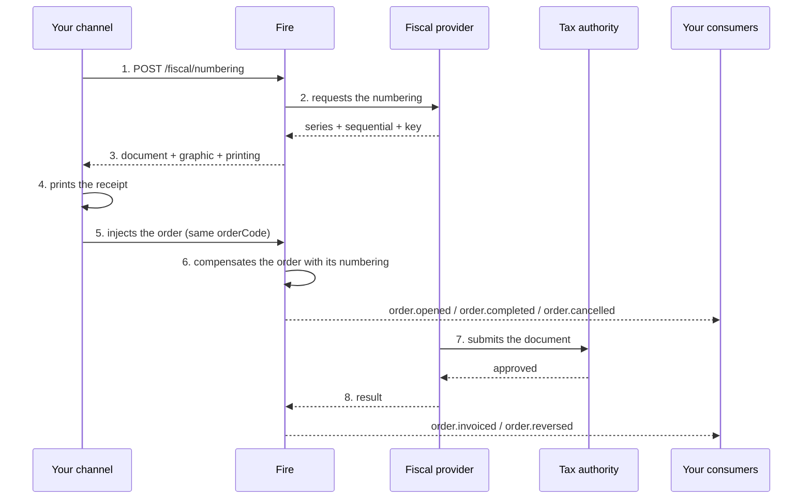

Fire does not issue receipts: it **numbers** them. That distinction explains almost every
design decision, so it is worth starting there.

## Who does what

<CardGroup cols={2}>
  <Card title="Your channel" icon="cash-register">
    Charges, requests the numbering, prints and injects the order. It knows no country's
    fiscal rules.
  </Card>
  <Card title="Fire" icon="server">
    Resolves the store, the issuer and the provider. Stores the request, asks for the
    numbers, and tells you what can be printed.
  </Card>
  <Card title="The fiscal provider" icon="stamp">
    Translates to the authority's codes, assigns series and sequential, and submits the
    document.
  </Card>
  <Card title="The tax authority" icon="landmark">
    Approves or rejects. Its verdict arrives **after** the customer has left with the
    receipt.
  </Card>
</CardGroup>

<Info>
  **One contract, every country.** Fire resolves internally which provider matches each
  country. Your integration is the same in Ecuador, Brazil or Venezuela: what changes is
  which fields come filled in the response, not how you ask for it.
</Info>

## The timeline



Steps 1 to 5 happen **with the customer waiting at the register**: seconds. From 6 onwards
your channel is no longer involved.

## Where the fiscal data shows up

The numbering does not stay locked inside this endpoint. It travels through the order
lifecycle at **two distinct moments**, and they should not be conflated.

### 1. What we compensate at injection

When you inject the order, Fire enriches it with the numbering you already obtained. That
data travels in the normal lifecycle events:

| Event | When |
|---|---|
| [`order.opened`](/en/events/order-opened) | The order was opened — carries its numbering if already requested |
| [`order.completed`](/en/events/order-completed) | Payment settled the full total |
| [`order.cancelled`](/en/events/order-cancelled) | The order was cancelled before or after payment |

At this point **there is still no verdict from the authority**: there are printed numbers and
a registered sale.

### 2. What the fiscal callback compensates

Minutes later, the provider tells Fire what the authority decided. That callback is what
triggers the two outcome events:

| Event | When |
|---|---|
| [`order.invoiced`](/en/events/order-invoiced) | The authority **approved** the document — arrives with key and protocol |
| [`order.reversed`](/en/events/order-reversed) | The authority **confirmed the cancellation** of an already authorized document |

<Info>
  That is the separation to keep clear end to end: **you request the numbering and it
  compensates the order; the authorization arrives on its own and compensates the outcome.**
  A numbered document may never reach `order.invoiced` if the authority rejects it.
</Info>

If you already consume order events, **you do not have to query anything**: the fiscal data
arrives through the same path as the rest of the sale. Direct querying is for support and for
when you lose the synchronous response.

### The field to read: `data.fiscalRepresentation`

The numbering arrives in that block, on **every** order event — all five in the two tables
above.

**The key always travels.** It arrives as `null` when numbering was not attempted —
aggregators, countries without fiscal representation, or merchants with numbering turned off
— and carries the block when it was. Branch on the value, never on the key's presence:

```js
if (data.fiscalRepresentation) {
  // numbering was attempted — numberingStatus tells you how it went
  print(data.fiscalRepresentation.documentNumber)
}
```

Carrying the block means **numbering was attempted, not that it succeeded**. A charged sale
left **with no fiscal receipt** arrives with `null` identifiers and the reason in `failure` —
handle that case, because it used to be invisible.

And carrying the block does **not** mean the document is authorized either: that is what
`lastKnown.fiscal.status` says, and it is the only one of the two that gets updated.

The full field-by-field reference lives in
[`order.opened`](/en/events/order-opened#data-fiscalrepresentation).

## The three rules to understand

<AccordionGroup>
  <Accordion title="Numbered is not authorized" icon="scale-balanced">
    The response carries **two states, and they are never merged**:

    - `requestStatus` — did I get numbers to print?
    - `documentStatus` — did the authority approve it?

    At numbering time the second one is **always** `PENDING`. That is not a problem: in most
    countries the receipt is handed over before the authority sees it. If your integration
    collapses both into one field, at some point you will tell a customer their invoice is
    authorized when it only has a number.
  </Accordion>

  <Accordion title="The sale is never blocked" icon="shield-check">
    If the provider does not answer in time, Fire does **not** return an error: it returns
    `202` with `printing.mode: "PROVISIONAL_RECEIPT"`. You print a non-fiscal ticket, inject
    the order anyway, and Fire completes the numbering on its own.

    **Do not retry in a loop and do not hold the sale.** The money is already charged; the
    receipt gets resolved afterwards.
  </Accordion>

  <Accordion title="Fire decides what gets printed, not you" icon="print">
    The `printing` block is not a deduction from whether there is a document: it is a
    **legal rule of the country**. In Ecuador under contingency the receipt exists and is
    printed even though the authority has not seen it yet; in a country that forbids printing
    before approval, `printable` would come as `false` with the document present.

    If each channel derived that rule on its own, one of them would get it wrong — and that
    mistake only surfaces in an audit.
  </Accordion>
</AccordionGroup>

## Idempotency: three layers

A sale charged twice is a money problem; **a sale numbered twice is a fiscal problem**, and
it cannot be fixed with a deploy. Hence three barriers:

<Steps>
  <Step title="Your Idempotency-Key">
    You generate it, one per sale, and reuse it on every retry of that same sale. It is what
    keeps a network failure from consuming a second sequential.

    If you reuse it with a different body, Fire answers `409`: those are two different
    operations.
  </Step>
  <Step title="The natural key">
    `country + orderCode + operation`. It protects you even if your channel regenerates the
    `Idempotency-Key` on every attempt — the most common implementation mistake.

    It is also why the `orderCode` **must be unique per account and country**: if two stores
    use the same one, Fire stops before issuing.
  </Step>
  <Step title="The provider's">
    The same triple, on the other side. Both keys being identical is what makes a collision
    surface on both ends at once, instead of showing up months later as two receipts for one
    sale.
  </Step>
</Steps>

## Cancelling

Requested with `operation: "CANCEL"` and **the original sale's `orderCode`**. Nothing else.

Your point of sale **does not need to store any identifier of ours**: Fire finds the original
document through the natural key. That is deliberate — a kiosk that gets reinstalled or a
register that gets replaced would lose that data, and the sale could never be voided. The
`orderCode`, on the other hand, is printed on the ticket.

Which instrument materializes the cancellation is decided by the country: in Ecuador it is a
credit note with its own sequential; in Brazil, a cancellation event that produces no new
document.

## If you lose the response

It happens: the network drops right after Fire numbered. The receipt exists and you do not
have it.

```
GET /api/v1/external/fiscal/numbering?orderCode=EC-K004-42-1786579046934
```

Returns `items[]` with every document of that order — possibly two, the invoice and its
cancellation. This is why the `orderCode` must be the same string in the numbering and in the
injection: it is the only thing left in your hand.

## Before going to production

<Check>Your `orderCode` is unique per account and country, and identical in numbering and injection.</Check>
<Check>You store the `Idempotency-Key` with the order and reuse it on retries.</Check>
<Check>Each device declares its own `device.externalId` — two registers in a store do not share one.</Check>
<Check>You branch on `printing.mode`, not on the HTTP status code.</Check>
<Check>You do not assume `countryIdentifiers.accessKey` always comes: in Venezuela it does not exist.</Check>
<Check>You iterate over the keys of `graphic` instead of looking for fixed fields.</Check>
<Check>On `202` you print provisional and inject anyway, without retrying in a loop.</Check>

<Card title="Endpoint reference" icon="code" href="/en/api-reference/fiscal-documents">
  Fields, responses and per-country examples.
</Card>
