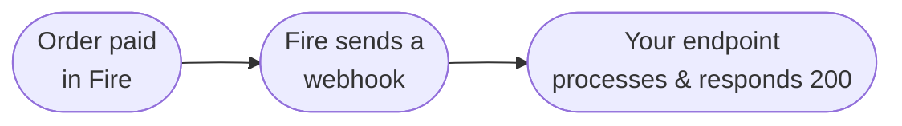

This guide walks you from "nothing" to a running webhook handler that receives a real `order.completed` event from Fire. You'll set up an HTTPS endpoint, configure an Integration Flow in the Fire dashboard, and verify end to end.

By the end you will:

- Have a Fire flow that fires on every completed order
- Have an HTTPS endpoint receiving the event body
- Be processing events idempotently and responding fast

<Note>
  This guide is for the four events Fire emits in production: `order.completed`, `order.cancelled`, `fiscal.authorized.br`, `fiscal.cancelled.br`. The walkthrough uses `order.completed`; the other three follow the same pattern with different `data` shapes.
</Note>

## What you'll build



Single endpoint, single Integration Flow. Once it works for `order.completed`, the same endpoint handles every other Fire event by branching on `event.type`.

## Prerequisites

- A Fire account with dashboard access (**Settings → Integration Flows**)
- A publicly reachable HTTPS URL (use [ngrok](https://ngrok.com) for local dev)
- A way to run a small Node/Python/Go service — anything that can serve `POST` and parse JSON

## Step 1 — Run a minimal endpoint

Start with the smallest viable handler. We'll add the production concerns (auth, dedup, persistence) in step 5.

```js Node.js
import express from "express";

const app = express();

app.post("/fire/events", express.json(), (req, res) => {
  console.log("event received:", req.body?.event);
  res.status(200).end();
});

app.listen(8080, () => console.log("listening on :8080"));
```

Expose it publicly:

```bash
ngrok http 8080
```

Copy the HTTPS URL ngrok gives you (`https://<random>.ngrok.app`). You'll paste it into the Fire flow in the next step.

## Step 2 — Configure an Integration Flow

In the Fire dashboard, go to **Settings → Integration Flows → New flow**.

<Steps>
  <Step title="Pick the trigger">
    Choose `order.completed` from the trigger dropdown.
  </Step>
  <Step title="Scope it">
    Pick the account, vendor, and (optionally) specific stores this flow should fire for. Leave stores empty to match all stores under the vendor.
  </Step>
  <Step title="Add an HTTP node">
    Drag an HTTP node onto the canvas. Connect it from the trigger.
    - **Method:** `POST`
    - **URL:** the ngrok URL from step 1, plus the path `/fire/events`
    - **Headers:** `Content-Type: application/json`
    - **Auth:** leave blank for now — we'll add it in step 5
  </Step>
  <Step title="Use the canonical body template">
    Paste the canonical body template into the **Body** field. It produces the standard `{ event, data, _meta }` envelope your handler expects.

    ```json
    {
      "event": {
        "id":        "{{trigger.event.id}}",
        "type":      "{{trigger.event.type}}",
        "createdAt": "{{trigger.event.createdAt}}"
      },
      "data": "{{trigger.data}}",
      "_meta": {
        "executionId":     "{{execution.id}}",
        "flowId":          "{{flow.id}}",
        "flowName":        "{{flow.name}}",
        "attempt":         "{{queue.attempt}}",
        "triggerEntityId": "{{queue.triggerEntityId}}"
      }
    }
    ```

    Most teams start from the **Webhook Test — Full Order Data** example template the dashboard ships with — it's the same shape with each `data.*` field expanded explicitly.
  </Step>
  <Step title="Activate the flow">
    Save and toggle the flow to **Active**.
  </Step>
</Steps>

## Step 3 — Fire a test event

Two ways to verify the wiring:

**Option A — Probar Flujo (dry run).** In the flow editor, click **Probar Flujo** and pick a sample scenario. Fire dispatches a synthetic event through your live flow. Your endpoint should log it within seconds.

**Option B — Real order.** Inject a real test order through your normal pipeline (POS, kiosk, or `POST /v1/orders`). Once it reaches `status=COMPLETED` and `paymentStatus=SUCCEEDED`, the flow runs and you'll see the request hit your endpoint.

If nothing arrives within 30 seconds, check **Settings → Integration Flows → Executions** for failed executions and the error message.

## Step 4 — Read the payload

Your handler now receives a request whose body looks like:

```json
{
  "event": {
    "id": "0d6e8a1c-1e7a-4b4f-8a3a-74ab0e9a9b21",
    "type": "order.completed",
    "createdAt": "2026-05-06T01:22:59.902Z"
  },
  "data": {
    "orderId": "21ec1f6c-c301-4528-b999-7836c1d21c6c",
    "orderCode": "OC-br-001",
    "status": "COMPLETED",
    "paymentStatus": "SUCCEEDED",
    "store": { /* ... */ },
    "client": { /* ... */ },
    "payments": { /* ... */ },
    "orderLines": [ /* ... */ ],
    "fulfillment": { /* ... */ }
    /* full V4 order snapshot */
  },
  "_meta": {
    "executionId": "...",
    "flowId": "...",
    "flowName": "...",
    "attempt": "1",
    "triggerEntityId": "..."
  }
}
```

The `data` object is the **V4 order snapshot** — the full record of the order. See [`order.completed`](/en/events/order-completed) for the field-by-field reference.

## Step 5 — Make it production-ready

The minimal handler from step 1 works for the demo. For production you need three more things.

### Acknowledge fast, process async

Fire times out after **30 seconds**. Acknowledge first; process in the background.

```js
app.post("/fire/events", express.json(), async (req, res) => {
  // 1. Ack immediately
  res.status(200).end();

  // 2. Process async — never await before res.end()
  queue.push(req.body).catch(console.error);
});
```

### Deduplicate by event.id

Fire retries on any non-`2xx` response. Use `event.id` (the flow execution ID) to skip duplicates.

```js
const seen = new Map(); // swap for Redis/DB in production

async function process({ event, data }) {
  if (seen.has(event.id)) return;
  seen.set(event.id, Date.now());

  switch (event.type) {
    case "order.completed":      return onOrderCompleted(data);
    case "order.cancelled":      return onOrderCancelled(data);
    case "fiscal.authorized.br": return onFiscalAuthorized(data);
    case "fiscal.cancelled.br":  return onFiscalCancelled(data);
  }
}
```

### Authenticate the request

Fire does not currently sign outbound webhooks with HMAC. Authenticate by adding a credential to your flow's HTTP node and validating it on your side. Three options:

- **Bearer token** — set `Authorization: Bearer <secret>` in the flow's headers; check it in your handler.
- **API key** — set `x-api-key: <secret>` in the flow's headers; check it.
- **OAuth2 client credentials** — for tenants that need rotating tokens; the flow auto-fetches the token.

```js
app.post("/fire/events", express.json(), (req, res) => {
  const auth = req.header("authorization");
  if (auth !== `Bearer ${process.env.FIRE_WEBHOOK_SECRET}`) {
    return res.status(401).end();
  }
  // ... rest of handler
});
```

<Note>
  HMAC signing (`X-Fire-Signature`) is on the roadmap and will be opt-in when it ships. For now, a shared secret in the flow header is the canonical authentication mechanism.
</Note>

## Common pitfalls

- **Money values are strings × 10000.** `payments.totals[0].total === "229000"` means 22.9. Parse with a decimal library; never `parseFloat`.
- **`event.id` is the flow execution ID, not the order ID.** Use `event.id` for idempotency keys; use `data.orderId` for business keys.
- **`fulfillment.delivery` may be present even on dine-in / pickup orders** with placeholder zeros. Branch on `fulfillment.service.code`, not on `delivery !== null`.
- **`payments.totals[]` and `paymentMethods[]` mix camelCase and snake_case.** Read both `currencyCode` and `currency_code` defensively in those objects.

## What's next

<CardGroup cols={2}>
  <Card title="order.completed reference" icon="receipt" href="/en/events/order-completed">
    Full payload reference, including the BR fiscal blocks.
  </Card>
  <Card title="order.cancelled reference" icon="ban" href="/en/events/order-cancelled">
    Cancellation payload with audit metadata.
  </Card>
  <Card title="Integration Flows" icon="diagram-project" href="/en/events/integration-flows">
    Deeper coverage of flow scoping, body templates, and node types.
  </Card>
  <Card title="Delivery & retries" icon="repeat" href="/en/events/delivery">
    Retry policy, dead-letter, and idempotency model.
  </Card>
</CardGroup>
