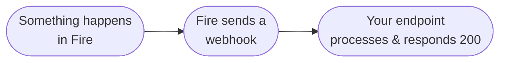

Fire is a restaurant management OS that handles stores, menus, products, and sales channels — including web, app, kiosks, and delivery aggregators (iFood, Keeta, 99, Rappi, and others).

## Integration model

Fire is event-driven and bidirectional:

- **Fire emits events** when meaningful business transitions happen — an order is completed, an order is cancelled, a fiscal document is authorized. You receive these events through **Integration Flows** you configure in the Fire dashboard.
- **Fire receives orders** injected by your system through the REST API.

Today Fire emits four event types in production: [`order.completed`](/en/events/order-completed), [`order.cancelled`](/en/events/order-cancelled), [`order.invoiced`](/en/events/order-invoiced), and [`order.reversed`](/en/events/order-reversed).

<Note>
  A common use case is an aggregator orchestrator — a system that connects Fire to multiple delivery aggregators (iFood, Keeta, 99, Rappi, etc.) and handles order flow between them. The integration model works the same way for any other type of client (POS, ERP, billing, analytics).
</Note>

## How events are delivered

Fire is **not** a single global webhook endpoint. Each customer configures one or more **Integration Flows** in the dashboard, scoped to their account, vendor, and (optionally) specific stores. When a business event fires, Fire runs every active flow that matches it. Each flow is a graph of nodes you define — typically an HTTP node that POSTs to your endpoint, but it can also transform, branch, or call internal Fire services.

See [Events overview](/en/events/overview) for the full event-driven model and [Integration Flows](/en/events/integration-flows) for how subscription works.

## What you build

Your integration needs to:

| Responsibility | Direction |
|---|---|
| Configure an Integration Flow scoped to your account/vendor/stores | Dashboard |
| Expose an HTTPS endpoint that the flow's HTTP node POSTs to | Fire → Your system |
| Authenticate incoming requests (Bearer token, API key, or OAuth2 — set per flow) | Fire → Your system |
| Process the events you care about (`order.completed`, `order.cancelled`, fiscal) | Fire → Your system |
| Inject orders into Fire using your API key | Your system → Fire |

Both receiving events and calling the API require authentication. See [Authentication](/en/authentication) for how credentials are issued and used on each side.

## Next steps

<CardGroup cols={2}>
  <Card title="Key concepts" icon="book" href="/en/key-concepts">
    Understand the core building blocks of the Fire integration.
  </Card>
  <Card title="Quickstart" icon="rocket" href="/en/quickstart">
    Get your integration running end to end.
  </Card>
  <Card title="Handle order events" icon="bolt" href="/en/guides/handle-order-events">
    Build a webhook handler in 10 minutes.
  </Card>
  <Card title="Events overview" icon="bell" href="/en/events/overview">
    The full event model — envelope, delivery, retries.
  </Card>
</CardGroup>
