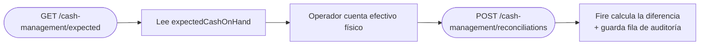

<Warning>
  **API de partner.** Este endpoint está pensado para integradores de plataforma. Los clientes estándar de Fire no tienen acceso directo — contactá a tu account manager si necesitás esta integración.
</Warning>

Devuelve el reporte de ventas y efectivo rastreado por el sistema para una tienda/día, usado para determinar lo que el cajón de efectivo **debería** contener antes de que un operador cuente. La respuesta es densa — cubre todas las monedas, todos los métodos de pago (con valores específicos para efectivo: tendered/change/expected-on-hand), totales por canal y servicio, desgloses por operador y dispositivo, y un resumen de cancelaciones.

Este es el input principal para [POST conciliaciones de efectivo](/es/api-reference/cash-reconciliations) — llama esto primero, presenta `expectedCashOnHand` al operador, después registra su conteo declarado.

## Autenticación

<ParamField header="x-api-key" type="string" required>
  Tu API key de Fire con scope `cash-management:read`. La key **debe ser vendor-scoped** — las keys system-only se rechazan con `403`.
</ParamField>

## Query parameters

<ParamField query="storeId" type="string" required>
  UUID de la tienda. Debe pertenecer al account/vendor de tu API key.
</ParamField>

<ParamField query="businessDayDate" type="string">
  `YYYY-MM-DD`. El día de negocio sobre el que reportar. Default es el día operacional actual de la tienda en su zona horaria.
</ParamField>

<ParamField query="operatorUid" type="string">
  Filtra el reporte a un solo cajero/operador. Cuando se omite, el reporte cubre todos los operadores del día.
</ParamField>

<RequestExample>
```http
GET https://app.fire.rest/api/v1/adapters/xmart/cash-management/expected?storeId=550e8400-e29b-41d4-a716-446655440000&businessDayDate=2026-05-06
x-api-key: <tu_api_key>
```
</RequestExample>

## Respuesta

<ResponseField name="store" type="object">
  Metadata a nivel tienda.

  <Expandable title="store">
    <ResponseField name="storeId" type="string">UUID.</ResponseField>
    <ResponseField name="storeCode" type="string | null">Código de tienda (p. ej. `BR-SP-001`).</ResponseField>
    <ResponseField name="storeName" type="string | null">Nombre para mostrar.</ResponseField>
    <ResponseField name="accountId" type="string">Account dueño de la tienda.</ResponseField>
    <ResponseField name="vendorId" type="string | null">Scope de vendor.</ResponseField>
    <ResponseField name="timezone" type="string | null">Zona horaria IANA — usada para calcular el día de negocio.</ResponseField>
  </Expandable>
</ResponseField>

<ResponseField name="businessDay" type="object">
  Estado del día de negocio que cubre este reporte.

  <Expandable title="businessDay">
    <ResponseField name="date" type="string | null">`YYYY-MM-DD`.</ResponseField>
    <ResponseField name="state" type="string">`OPEN` o `CLOSED`.</ResponseField>
    <ResponseField name="openedAt" type="string | null">ISO 8601 UTC.</ResponseField>
    <ResponseField name="closedAt" type="string | null">ISO 8601 UTC. `null` mientras está abierto.</ResponseField>
  </Expandable>
</ResponseField>

<ResponseField name="generatedAt" type="string">
  ISO 8601 UTC de cuándo se calculó este reporte. Snapshot — llama de nuevo para refrescar.
</ResponseField>

<ResponseField name="summary" type="object">
  Conteos de órdenes de un vistazo.

  <Expandable title="summary">
    <ResponseField name="totalOrders" type="number">Todas las órdenes en el scope.</ResponseField>
    <ResponseField name="completedOrders" type="number">`status=COMPLETED && paymentStatus=SUCCEEDED`.</ResponseField>
    <ResponseField name="openOrders" type="number">`status=OPEN`.</ResponseField>
    <ResponseField name="cancelledOrders" type="number">`status=CANCELLED`.</ResponseField>
    <ResponseField name="forceClosedOrders" type="number">Órdenes force-closed al cierre del día (system-driven).</ResponseField>
  </Expandable>
</ResponseField>

<ResponseField name="currencies" type="object[]">
  Una entrada por moneda observada en el día. La mayoría de tiendas tienen una moneda; tiendas multi-moneda tienen una entrada por cada una.

  <Expandable title="currencies[n]">
    <ResponseField name="currency" type="string">ISO 4217.</ResponseField>
    <ResponseField name="sales" type="object">
      Revenue agregado.
      <Expandable title="sales">
        <ResponseField name="gross" type="number">Revenue total antes de descuentos/impuestos.</ResponseField>
        <ResponseField name="net" type="number">Después de descuentos.</ResponseField>
        <ResponseField name="taxes" type="number">Monto de impuestos.</ResponseField>
        <ResponseField name="discounts" type="number">Monto total de descuentos.</ResponseField>
        <ResponseField name="orderCount" type="number">Número de órdenes completadas que aportan.</ResponseField>
      </Expandable>
    </ResponseField>
    <ResponseField name="byPaymentMethod" type="object[]">
      Una entrada por procesador de pago usado en el día.
      <Expandable title="byPaymentMethod[n]">
        <ResponseField name="processor" type="string">p. ej. `cash`, `Kushki`, `MASTERCARD`, `voucher`.</ResponseField>
        <ResponseField name="transactionCount" type="number">Todos los intentos.</ResponseField>
        <ResponseField name="approvedCount" type="number">`transactionStatus = APPROVED`.</ResponseField>
        <ResponseField name="rejectedCount" type="number">Declinados / fallidos.</ResponseField>
        <ResponseField name="pendingCount" type="number">En vuelo.</ResponseField>
        <ResponseField name="totalBilled" type="number">Suma de `totalBill` en transacciones aprobadas.</ResponseField>
        <ResponseField name="cashTendered" type="number | null">**Solo cash** — total de efectivo entregado por clientes.</ResponseField>
        <ResponseField name="changeGiven" type="number | null">**Solo cash** — total de cambio devuelto.</ResponseField>
        <ResponseField name="expectedCashOnHand" type="number | null">
          **Solo cash** — `cashTendered - changeGiven`. Es el valor canónico para comparar contra el conteo declarado del operador.
        </ResponseField>
      </Expandable>
    </ResponseField>
    <ResponseField name="byChannelAndService" type="object[]">
      Ventas desglosadas por canal (`KIOSK`, `IFOOD`, `RAPPI`, `APP`, …) con sub-desgloses por servicio de fulfillment (`DELIVERY`, `DINE_IN`, `TAKEAWAY`, `PICKUP`).
    </ResponseField>
    <ResponseField name="byOperator" type="object[]">
      Por cajero/operador: `operatorUid`, `operatorName`, `orderCount`, `total`. Útil para reportes de fin de turno.
    </ResponseField>
    <ResponseField name="byDevice" type="object[]">
      Por dispositivo: `deviceUid`, `deviceName`, `orderCount`, `total`.
    </ResponseField>
    <ResponseField name="byOperatorAndPaymentMethod" type="object[]">
      Cross-cut: por operador, la misma forma `byPaymentMethod`. Úsalo para calcular el efectivo esperado **por cajero** al correr una conciliación multi-cajero.
    </ResponseField>
    <ResponseField name="cancelled" type="object">
      `count`, `totalLost` (revenue perdido por cancelaciones), y array `byReason` (`reason`, `count`, `total`).
    </ResponseField>
    <ResponseField name="pendingRisk" type="object">
      Indicadores de riesgo: `openOrdersTotal`, `paymentPendingTotal`, `paymentFailedTotal`. Úsalo para flaggear revenue incierto al cierre.
    </ResponseField>
  </Expandable>
</ResponseField>

<ResponseExample>
```json 200 — abreviado
{
  "store": {
    "storeId": "550e8400-e29b-41d4-a716-446655440000",
    "storeCode": "BR-SP-001",
    "storeName": "Loja Centro - SP",
    "accountId": "100",
    "vendorId": "v_blueco_br",
    "timezone": "America/Sao_Paulo"
  },
  "businessDay": {
    "date": "2026-05-06",
    "state": "OPEN",
    "openedAt": "2026-05-06T06:00:00.000Z",
    "closedAt": null
  },
  "generatedAt": "2026-05-06T16:50:00.000Z",
  "summary": {
    "totalOrders": 157,
    "completedOrders": 152,
    "openOrders": 3,
    "cancelledOrders": 2,
    "forceClosedOrders": 0
  },
  "currencies": [
    {
      "currency": "BRL",
      "sales": {
        "gross": 4523.50,
        "net": 4350.25,
        "taxes": 623.75,
        "discounts": 173.25,
        "orderCount": 152
      },
      "byPaymentMethod": [
        {
          "processor": "cash",
          "transactionCount": 95,
          "approvedCount": 95,
          "rejectedCount": 0,
          "pendingCount": 0,
          "totalBilled": 2250.00,
          "cashTendered": 2350.00,
          "changeGiven": 100.00,
          "expectedCashOnHand": 2250.00
        },
        {
          "processor": "MASTERCARD",
          "transactionCount": 57,
          "approvedCount": 55,
          "rejectedCount": 1,
          "pendingCount": 1,
          "totalBilled": 2100.25,
          "cashTendered": null,
          "changeGiven": null,
          "expectedCashOnHand": null
        }
      ],
      "byChannelAndService": [
        {
          "channel": "KIOSK",
          "orderCount": 95,
          "total": 2850.50,
          "services": [{ "service": "DINE_IN", "orderCount": 95, "total": 2850.50 }]
        }
      ],
      "byOperator": [
        { "operatorUid": "op-cashier-123", "operatorName": "Operator Name", "orderCount": 75, "total": 2200.00 }
      ],
      "byDevice": [
        { "deviceUid": "device-uuid-1", "deviceName": "Terminal 1", "orderCount": 152, "total": 4350.25 }
      ],
      "byOperatorAndPaymentMethod": [
        {
          "operatorUid": "op-cashier-123",
          "operatorName": "Operator Name",
          "byPaymentMethod": [
            {
              "processor": "cash",
              "transactionCount": 75,
              "approvedCount": 75,
              "rejectedCount": 0,
              "pendingCount": 0,
              "totalBilled": 2200.00,
              "cashTendered": 2300.00,
              "changeGiven": 100.00,
              "expectedCashOnHand": 2200.00
            }
          ]
        }
      ],
      "cancelled": {
        "count": 2,
        "totalLost": 95.50,
        "byReason": [
          { "reason": "Customer Request", "count": 1, "total": 45.00 },
          { "reason": "System Error",     "count": 1, "total": 50.50 }
        ]
      },
      "pendingRisk": {
        "openOrdersTotal": 189.75,
        "paymentPendingTotal": 150.00,
        "paymentFailedTotal": 39.75
      }
    }
  ]
}
```

```json 400 — storeId inválido
{
  "error": {
    "code": "validation_error",
    "message": "storeId must be a UUID"
  }
}
```

```json 403 — key system-only (falta binding de account)
{
  "error": {
    "code": "forbidden",
    "message": "cash-management endpoints require a vendor-scoped API key"
  }
}
```

```json 404 — tienda no encontrada / no en tu scope
{
  "error": {
    "code": "not_found",
    "message": "Store not found"
  }
}
```
</ResponseExample>

## Cómo usarlo con conciliación



El `expectedCashOnHand` canónico contra el cual comparar es por moneda, por método de pago `cash`. Para cierres por cajero, entra a `byOperatorAndPaymentMethod[i].byPaymentMethod` y encuentra la entrada `cash` — ese es el esperado específico del operador.

## Patrones comunes

- **Dashboard de fin de turno en tiempo real.** Pollea este endpoint cada pocos minutos durante un día ocupado para mostrar totales corriendo; congela el snapshot al cierre del turno.
- **Cierre por cajero.** Filtra con `operatorUid=...` para sacar solo los totales de ese cajero; registra su conciliación contra `byOperatorAndPaymentMethod[].byPaymentMethod[cash].expectedCashOnHand`.
- **Tiendas multi-moneda.** Itera sobre `currencies[]` — cada entrada es independiente; concilia cada moneda por separado.
- **Riesgo pendiente.** Muestra `pendingRisk.paymentFailedTotal` y `pendingRisk.openOrdersTotal` a operadores antes de que cierren — son montos que el sistema no puede confirmar.

## Relacionado

<CardGroup cols={2}>
  <Card title="Conciliaciones de efectivo" icon="abacus" href="/es/api-reference/cash-reconciliations">
    Registra el conteo del operador después de leer el efectivo esperado acá.
  </Card>
  <Card title="Autenticación" icon="lock" href="/es/authentication">
    API keys vendor-scoped y el scope `cash-management:read`.
  </Card>
</CardGroup>
