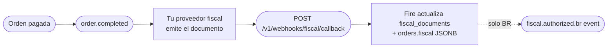

Este endpoint es **inbound** — tu proveedor fiscal le hace POST cada vez que un documento fiscal es autorizado, rechazado, denegado, cancelado o falla. Es la **API canónica multipaís de fiscal callback** que acepta payloads de BR, CO, EC, CL, AR, VE. Fire valida el payload, actualiza el estado fiscal de la orden en `fiscal_documents` y `orders.fiscal`, y despacha eventos outbound `fiscal.authorized.{cc}` / `fiscal.cancelled.{cc}` a tus Integration Flows.

<Note>
  **Este endpoint es asíncrono.** Fire autentica, valida, corre el guard de tenancy, pre-marca la orden como `processing` y **encola** el callback — luego devuelve **`202 Accepted`** con un `eventId` (típicamente en menos de 100&nbsp;ms). La actualización de `fiscal_documents` / `orders.fiscal` ocurre un instante después en un worker en segundo plano (normalmente en ~2&nbsp;segundos). Para ver el resultado del procesamiento, consultá [`GET /v1/webhooks/events/{eventId}`](#comprobar-el-resultado). Los problemas corregibles por el cliente (payload inválido, orden inexistente, tenant equivocado) se rechazan **sincrónicamente** con `4xx` **antes** del `202`.
</Note>

## Cómo complementa `order.completed` y `order.cancelled`

`order.completed` y `order.cancelled` llevan el **estado de negocio** de una orden. El callback fiscal lleva el **estado fiscal** (autorización SEFAZ / DIAN / SRI / SII / AFIP / SENIAT). Juntos forman este lifecycle:



Después de procesar el callback, el **siguiente** `order.completed` o `order.cancelled` para el mismo `orderId` refleja el estado fiscal actualizado en:

- `data.store.storeFiscalConfig` — contexto del emisor (CNPJ / NIT / RUC / RUT / CUIT / RIF…)
- `data.payments.metadata.fiscal` — agregados fiscales totales (BR populado; otros países `null`)
- `data.orderLines[].metadata.fiscal` — clasificación fiscal por línea (BR populado; otros `null`)

Para Brasil específicamente, también se emite un evento `fiscal.authorized.br` (o `fiscal.cancelled.br`) separado con las referencias del documento SEFAZ en `data.fiscal`.

<Note>
  **Hoy, solo `fiscal.authorized.br` y `fiscal.cancelled.br` están cableados como eventos outbound.** El endpoint valida y guarda callbacks para los 6 países (CO, EC, CL, AR, VE, BR), y el estado fiscal actualizado aparece en el siguiente evento `order.completed` / `order.cancelled` sin importar el país. Los eventos `fiscal.authorized.{cc}` / `fiscal.cancelled.{cc}` para CO/EC/CL/AR/VE están en camino.
</Note>

## Autenticación

Este endpoint requiere una **API key con scope `webhooks:fiscal`**, vendor-scoped al account dueño de la orden. Las keys sin scope o solo a nivel account se rechazan con `403 Forbidden`.

<ParamField header="x-api-key" type="string" required>
  Tu API key de Fire. Générala desde el dashboard en **Settings → API Keys → Developer keys**, con scope `webhooks:fiscal` y un binding de vendor para el account cuyas órdenes esta key puede actualizar.
</ParamField>

<ParamField header="Authorization" type="string">
  Opcional `Bearer <token>`. No se requiere para este endpoint hoy, pero está reservado para futuros tokens emitidos por proveedor.
</ParamField>

## Body de la petición

El body es un objeto JSON con estos campos top-level. La forma del `document` está **discriminada por `countryCode`** — ver [Documento por país](#documento-por-pais) abajo.

<ParamField body="countryCode" type="string" required>
  Código de país ISO 3166-1 alpha-2. Uno de `BR`, `CO`, `EC`, `CL`, `AR`, `VE`. Determina las reglas de validación del objeto `document`.
</ParamField>

<ParamField body="eventType" type="string" required>
  Estado del documento. Uno de:
  - `authorized` — la autoridad fiscal aprobó el documento
  - `cancelled` — un documento previamente autorizado fue cancelado
  - `rejected` — el documento fue rechazado (validación, schema, firma)
  - `denied` — la autoridad denegó la solicitud (típicamente fallo permanente de regla de negocio)
  - `error` — ocurrió un error no recuperable en el proveedor o autoridad

  Cuando `eventType` es `authorized` o `cancelled`, el campo `document` es **requerido**. Cuando es `rejected`, `denied` o `error`, el campo `error` es **requerido**.
</ParamField>

<ParamField body="providerEventId" type="string" required>
  Llave de idempotencia. Debe ser único por evento — un duplicado devuelve HTTP `202` con el `eventId` original y `duplicate: true`, sin re-encolar ni reprocesar. Usa el ID nativo del evento del proveedor si está disponible; si no, un UUID.
</ParamField>

<ParamField body="occurredAt" type="string" required>
  Timestamp ISO 8601 UTC de cuándo ocurrió el evento en la autoridad fiscal (no cuándo el proveedor envió el callback).
</ParamField>

<ParamField body="orderId" type="string" required>
  UUID de la orden en Fire. Coincide con `data.orderId` en los eventos `order.completed` y `order.cancelled`. Fire lo usa para encontrar el documento fiscal existente.
</ParamField>

<ParamField body="eventId" type="string" required>
  UUID para correlación de intentos de emisión. Fire lo usa para hacer match del callback con un intento específico de emisión y deduplicar intentos paralelos.
</ParamField>

<ParamField body="document" type="object">
  El documento fiscal autorizado / cancelado. **Requerido** cuando `eventType` es `authorized` o `cancelled`. La forma varía por país — ver [Documento por país](#documento-por-pais).
</ParamField>

<ParamField body="error" type="object">
  Contexto de error para resultados negativos. **Requerido** cuando `eventType` es `rejected`, `denied` o `error`.

  <Expandable title="error">
    <ParamField body="code" type="string">
      Código de error opcional del proveedor/autoridad (p. ej. `DIAN_42`, `cStat_204`).
    </ParamField>
    <ParamField body="message" type="string" required>
      Mensaje legible. Mínimo 1 carácter.
    </ParamField>
  </Expandable>
</ParamField>

<ParamField body="providerSpecific" type="object">
  Bag free-form para extras específicos del proveedor (respuesta raw, IDs internos, etc.). No validado; pasa al log de auditoría.
</ParamField>

## Documento por país

La forma requerida del campo `document` depende del `countryCode`. **Todas las variantes comparten los campos base de abajo** (comunes a los 6 países) más los identificadores específicos del país requeridos por esa autoridad.

### Campos base comunes

Aplican a cualquier `countryCode`. `docType` y `docSubtype` son **obligatorios**; el resto son **opcionales** — envíalos cuando tu proveedor fiscal los tenga disponibles. Fire los persiste en `fiscal_documents` / `orders.fiscal` y los reemite en los eventos outbound `fiscal.authorized.{cc}` / `fiscal.cancelled.{cc}` y en el siguiente `order.completed` / `order.cancelled`.

| Campo | Tipo | Requerido | Notas |
|---|---|---|---|
| `docType` | `"invoice"` / `"cancellation"` | ✓ | Clase del documento — `invoice` para emisión, `cancellation` para cancelación |
| `docSubtype` | string | ✓ | Subtipo según país/proveedor (p. ej. `nfce`, `nfe`, `factura`, `boleta`, `factura_a`) |
| `pdfUrl` | string (URL) \| null | | Enlace de descarga del PDF del documento (DANFE / representación gráfica) |
| `xmlUrl` | string (URL) \| null | | Enlace de descarga del XML canónico de la autoridad fiscal |
| `emittedAt` | string (ISO 8601) \| null | | Fecha/hora UTC en que la autoridad autorizó/emitió el documento |
| `cancelledAt` | string (ISO 8601) \| null | | Fecha/hora UTC de la cancelación — relevante cuando `eventType` es `cancelled` |
| `totalAmount` | number \| null | | Monto total bruto del documento |
| `taxAmount` | number \| null | | Monto total de impuestos |
| `currencyCode` | string \| null | | Código de moneda ISO 4217 — exactamente 3 letras (p. ej. `BRL`, `COP`, `USD`) |

<Note>
  `pdfUrl` y `xmlUrl` se guardan **tal cual los envías** — Fire no descarga ni re-hostea el archivo. Si tu proveedor firma estas URLs con expiración, ten en cuenta que el enlace almacenado puede caducar; descarga y persiste el artefacto por tu lado si necesitas acceso durable.
</Note>

<Tabs>
  <Tab title="Brasil (BR)">
    Documentos fiscales brasileños (NF-e / NFC-e). Usa este código de país al enviar callbacks desde tu proveedor fiscal o cualquier otro proveedor BR.

    Además de los [campos base comunes](#campos-base-comunes) (`docType`, `docSubtype`, `pdfUrl`, `xmlUrl`, `emittedAt`, etc.), BR requiere estos identificadores específicos:

    | Campo | Tipo | Requerido | Notas |
    |---|---|---|---|
    | `chaveAcesso` | string | ✓ | Exactamente 44 dígitos — chave de acceso SEFAZ |
    | `protocolo` | string | ✓ | Protocolo de autorización SEFAZ |
    | `numero` | int / string | ✓ | Número de documento |
    | `serie` | int / string \| null | | Serie del documento (codificada en chave) |
    | `modelo` | `55` / `65` \| null | | `55` = NF-e, `65` = NFC-e |
    | `cnpjEmitente` | string \| null | | CNPJ del emisor |

    El ejemplo de abajo incluye los campos base opcionales (`pdfUrl`, `xmlUrl`, `emittedAt`, `totalAmount`, `taxAmount`, `currencyCode`) — todos pueden omitirse, pero si tu proveedor los tiene, envíalos:

    ```json
    {
      "countryCode": "BR",
      "eventType": "authorized",
      "providerEventId": "evt-br-1",
      "occurredAt": "2026-04-26T14:32:11.000Z",
      "orderId": "550e8400-e29b-41d4-a716-446655440000",
      "eventId": "7c9e6679-7425-40de-944b-e07fc1f90ae7",
      "document": {
        "docType": "invoice",
        "docSubtype": "nfce",
        "chaveAcesso": "35260229062609000177650500000000011000000010",
        "protocolo": "141210001176277",
        "numero": 1,
        "serie": 50,
        "modelo": 65,
        "cnpjEmitente": "29062609000177",
        "emittedAt": "2026-04-26T14:32:10.000Z",
        "totalAmount": 142.90,
        "taxAmount": 18.57,
        "currencyCode": "BRL",
        "pdfUrl": "https://api.fiscal-provider.example/nfce/69fa97fe427d1240856e1282/pdf",
        "xmlUrl": "https://api.fiscal-provider.example/nfce/69fa97fe427d1240856e1282/xml"
      }
    }
    ```
  </Tab>

  <Tab title="Colombia (CO)">
    Documentos fiscales colombianos (DIAN).

    | Campo | Tipo | Requerido | Notas |
    |---|---|---|---|
    | `cufe` | string | ✓ | Código fiscal único DIAN |
    | `prefijo` | string | ✓ | Prefijo del documento |
    | `numeroDian` | string | ✓ | Número de documento DIAN |
    | `qrCode` | string (URL) \| null | | QR para el documento impreso |

    ```json
    {
      "countryCode": "CO",
      "eventType": "authorized",
      "providerEventId": "evt-co-1",
      "occurredAt": "2026-04-26T14:32:11.000Z",
      "orderId": "550e8400-e29b-41d4-a716-446655440000",
      "eventId": "7c9e6679-7425-40de-944b-e07fc1f90ae7",
      "document": {
        "docType": "invoice",
        "docSubtype": "factura",
        "cufe": "633732c7a2a577bfa1828551e64d03f715f0",
        "prefijo": "C012",
        "numeroDian": "C012-001",
        "qrCode": "https://catalogo-vpfe.dian.gov.co/document/searchqr?documentkey=633732c7a2a577bfa1828551e64d03f715f0",
        "emittedAt": "2026-04-26T14:32:10.000Z",
        "totalAmount": 95000.00,
        "taxAmount": 15170.17,
        "currencyCode": "COP",
        "pdfUrl": "https://api.fiscal-provider.example/dian/C012-001/pdf",
        "xmlUrl": "https://api.fiscal-provider.example/dian/C012-001/xml"
      }
    }
    ```
  </Tab>

  <Tab title="Ecuador (EC)">
    Documentos fiscales ecuatorianos (SRI).

    | Campo | Tipo | Requerido | Notas |
    |---|---|---|---|
    | `claveAcceso` | string | ✓ | Exactamente 49 dígitos — clave de acceso SRI |
    | `numeroAutorizacion` | string | ✓ | Número de autorización SRI |
    | `ambiente` | `'1'` / `'2'` \| null | | `1` = pruebas, `2` = producción |

    ```json
    {
      "countryCode": "EC",
      "eventType": "authorized",
      "providerEventId": "evt-ec-1",
      "occurredAt": "2026-04-26T14:32:11.000Z",
      "orderId": "550e8400-e29b-41d4-a716-446655440000",
      "eventId": "7c9e6679-7425-40de-944b-e07fc1f90ae7",
      "document": {
        "docType": "invoice",
        "docSubtype": "factura",
        "claveAcceso": "0102030405060708091011121314151617181920212223242",
        "numeroAutorizacion": "AUT-EC-001",
        "ambiente": "2",
        "emittedAt": "2026-04-26T14:32:10.000Z",
        "totalAmount": 24.50,
        "taxAmount": 3.15,
        "currencyCode": "USD",
        "pdfUrl": "https://api.fiscal-provider.example/sri/AUT-EC-001/pdf",
        "xmlUrl": "https://api.fiscal-provider.example/sri/AUT-EC-001/xml"
      }
    }
    ```
  </Tab>

  <Tab title="Chile (CL)">
    Documentos fiscales chilenos (SII DTE).

    | Campo | Tipo | Requerido | Notas |
    |---|---|---|---|
    | `folio` | int / string | ✓ | Número de folio del DTE |
    | `ted` | string | ✓ | TED (Timbre Electrónico) — base64 o fragmento XML |
    | `tipoDte` | int / string | ✓ | Tipo DTE (p. ej. `33` = factura electrónica) |
    | `trackId` | string \| null | | Track ID SII para queries de seguimiento |

    ```json
    {
      "countryCode": "CL",
      "eventType": "authorized",
      "providerEventId": "evt-cl-1",
      "occurredAt": "2026-04-26T14:32:11.000Z",
      "orderId": "550e8400-e29b-41d4-a716-446655440000",
      "eventId": "7c9e6679-7425-40de-944b-e07fc1f90ae7",
      "document": {
        "docType": "invoice",
        "docSubtype": "factura",
        "folio": 12345,
        "ted": "<TED>...base64-or-xml...</TED>",
        "tipoDte": 33,
        "trackId": "SII-TRK-998877",
        "emittedAt": "2026-04-26T14:32:10.000Z",
        "totalAmount": 18900,
        "taxAmount": 3019,
        "currencyCode": "CLP",
        "pdfUrl": "https://api.fiscal-provider.example/sii/12345/pdf",
        "xmlUrl": "https://api.fiscal-provider.example/sii/12345/xml"
      }
    }
    ```
  </Tab>

  <Tab title="Argentina (AR)">
    Documentos fiscales argentinos (AFIP).

    | Campo | Tipo | Requerido | Notas |
    |---|---|---|---|
    | `cae` | string | ✓ | Código de Autorización Electrónico |
    | `fechaVtoCae` | string | ✓ | Fecha de vencimiento del CAE |
    | `puntoVenta` | int / string | ✓ | Número de punto de venta |
    | `numeroComprobante` | int / string | ✓ | Número del documento |
    | `tipoComprobante` | int / string | ✓ | Tipo de documento (`1` = factura A, …) |

    ```json
    {
      "countryCode": "AR",
      "eventType": "authorized",
      "providerEventId": "evt-ar-1",
      "occurredAt": "2026-04-26T14:32:11.000Z",
      "orderId": "550e8400-e29b-41d4-a716-446655440000",
      "eventId": "7c9e6679-7425-40de-944b-e07fc1f90ae7",
      "document": {
        "docType": "invoice",
        "docSubtype": "factura_a",
        "cae": "74256178925412",
        "fechaVtoCae": "2026-05-31",
        "puntoVenta": 1,
        "numeroComprobante": 12345,
        "tipoComprobante": 1,
        "emittedAt": "2026-04-26T14:32:10.000Z",
        "totalAmount": 12100.00,
        "taxAmount": 2100.00,
        "currencyCode": "ARS",
        "pdfUrl": "https://api.fiscal-provider.example/afip/0001-12345/pdf",
        "xmlUrl": "https://api.fiscal-provider.example/afip/0001-12345/xml"
      }
    }
    ```
  </Tab>

  <Tab title="Venezuela (VE)">
    Documentos fiscales venezolanos (SENIAT).

    | Campo | Tipo | Requerido | Notas |
    |---|---|---|---|
    | `numeroControl` | string | ✓ | Número del rango de control emitido por SENIAT |
    | `numeroFactura` | string | ✓ | Número de factura |
    | `rifEmisor` | string \| null | | RIF del emisor |

    ```json
    {
      "countryCode": "VE",
      "eventType": "authorized",
      "providerEventId": "evt-ve-1",
      "occurredAt": "2026-04-26T14:32:11.000Z",
      "orderId": "550e8400-e29b-41d4-a716-446655440000",
      "eventId": "7c9e6679-7425-40de-944b-e07fc1f90ae7",
      "document": {
        "docType": "invoice",
        "docSubtype": "factura",
        "numeroControl": "00-00012345",
        "numeroFactura": "12345",
        "rifEmisor": "J-12345678-9",
        "emittedAt": "2026-04-26T14:32:10.000Z",
        "totalAmount": 480.00,
        "taxAmount": 76.80,
        "currencyCode": "VES",
        "pdfUrl": "https://api.fiscal-provider.example/seniat/00-00012345/pdf",
        "xmlUrl": "https://api.fiscal-provider.example/seniat/00-00012345/xml"
      }
    }
    ```
  </Tab>
</Tabs>

### Resultados negativos (`rejected`, `denied`, `error`)

Para estados no autorizados, omite `document` y provee `error`. El `countryCode` sigue aplicando (valida el routing); el documento no se requiere porque no hay artefacto autorizado.

```json Rechazado
{
  "countryCode": "CO",
  "eventType": "rejected",
  "providerEventId": "evt-co-2",
  "occurredAt": "2026-04-26T14:32:11.000Z",
  "orderId": "550e8400-e29b-41d4-a716-446655440000",
  "eventId": "7c9e6679-7425-40de-944b-e07fc1f90ae7",
  "document": null,
  "error": {
    "code": "DIAN_42",
    "message": "CUFE inválido"
  }
}
```

## Respuesta

En caso de éxito el endpoint devuelve **`202 Accepted`** — el evento fue autenticado, validado y **encolado**. Un `202` **no** significa que el documento fiscal ya se actualizó; eso ocurre de forma asíncrona en un worker en segundo plano. Usá el [endpoint de status](#comprobar-el-resultado) para confirmar el resultado final.

<ResponseField name="received" type="boolean">
  Siempre `true` cuando la petición fue aceptada y encolada.
</ResponseField>

<ResponseField name="eventId" type="string">
  UUID del evento encolado en `webhook_events`. Pasalo a `GET /v1/webhooks/events/{eventId}` para consultar el resultado del procesamiento.
</ResponseField>

<ResponseField name="status" type="string">
  Status de la cola al encolar — `queued` para un evento nuevo (o el status existente si fue un duplicado).
</ResponseField>

<ResponseField name="duplicate" type="boolean">
  `true` cuando este `providerEventId` ya estaba encolado — se devuelve el `eventId` existente y el evento **no** se re-encola. `false` para un evento nuevo.
</ResponseField>

<ResponseExample>
```json 202 — aceptado (encolado)
{
  "received": true,
  "eventId": "9e6c8af8-af80-4967-9422-c096ab43c0e7",
  "status": "queued",
  "duplicate": false
}
```

```json 202 — duplicado (ya encolado)
{
  "received": true,
  "eventId": "9e6c8af8-af80-4967-9422-c096ab43c0e7",
  "status": "queued",
  "duplicate": true
}
```

```json 400 — error de validación
{
  "error": {
    "code": "validation_error",
    "message": "BR chaveAcesso must be 44 digits"
  }
}
```

```json 401 — API key faltante o inválida
{
  "error": {
    "code": "unauthorized",
    "message": "Invalid or missing API key"
  }
}
```

```json 403 — scope incorrecto
{
  "error": {
    "code": "forbidden",
    "message": "webhooks:fiscal scope requires a vendor-scoped API key (accountId binding missing). Generate one from /developers/firepos-api-management."
  }
}
```
</ResponseExample>

## Comprobar el resultado

Como el procesamiento es asíncrono, el `202` solo confirma que el evento fue **encolado**. Para ver si el documento fiscal se actualizó, consultá el endpoint de status con el `eventId` devuelto por el `202`:

```
GET https://app.fire.rest/api/v1/webhooks/events/{eventId}
x-api-key: <tu key webhooks:fiscal>
```

<ResponseField name="status" type="string">
  Ciclo de vida en la cola: `queued` → `processing` → `processed` (listo) · `failed` / `dead` (se agotaron los reintentos) · `retry` (esperando el próximo intento) · `ignored`.
</ResponseField>
<ResponseField name="attempts" type="number">Intentos de procesamiento hasta ahora.</ResponseField>
<ResponseField name="result" type="object | null">En éxito, el resultado del worker — ej. `{ "kind": "updated", "documentId": "…", "receiptId": "…" }`.</ResponseField>
<ResponseField name="error" type="object | null">`{ "message": "…" }` cuando el último intento falló; `null` si no.</ResponseField>

<ResponseExample>
```json 200 — procesado
{
  "id": "9e6c8af8-af80-4967-9422-c096ab43c0e7",
  "source": "fiscal_generic",
  "eventType": "authorized",
  "status": "processed",
  "attempts": 1,
  "processedAt": "2026-04-26T14:32:13.000Z",
  "result": { "kind": "updated", "documentId": "1a2b3c4d-…", "receiptId": "9b2a3c4d-…" },
  "error": null
}
```
</ResponseExample>

Un `404` se devuelve para ids desconocidos — o ids de otro tenant — sin filtrar existencia. Autenticá con la misma key `webhooks:fiscal` que usaste para el callback.

## Idempotencia

Fire deduplica callbacks por `providerEventId` — una restricción única en `webhook_events`. Un replay **no** se re-encola: devuelve `202` con el `eventId` original y `duplicate: true`. Envía siempre el mismo `providerEventId` para reintentos; nunca generes uno nuevo para el mismo evento lógico.

## Concurrencia

Las transiciones de estado en `fiscal_documents` usan **locking optimista**. Si dos callbacks para el mismo documento llegan concurrentes, uno tiene éxito y el otro resuelve a `idempotent` o `regression` según el orden. El merge de `orders.fiscal` JSONB es atómico.

## Qué pasa después del 202

El `202` solo encola el evento. Un worker en segundo plano lo toma — en ~2&nbsp;segundos vía el wake-up instantáneo, o en el próximo ciclo de polling como fallback — y:

1. **La fila `fiscal_documents` se hace upsert** con el nuevo status y referencias del documento (`chaveAcesso`, `protocolo`, `cufe`, `cae`, etc., según país).
2. **La columna `orders.fiscal` JSONB se mergea** con la misma data — visible en el siguiente evento `order.completed` / `order.cancelled` para el mismo `orderId`, sin importar el país.
3. **Se despacha un trigger outbound** con `triggerType = 'fiscal.authorized.{cc}'` (para `eventType=authorized`) o `'fiscal.cancelled.{cc}'` (para `eventType=cancelled`). Los Integration Flows activos para ese trigger corren y hacen POST a tu endpoint.

  - **Hoy**, solo `fiscal.authorized.br` y `fiscal.cancelled.br` están cableados. Disparan cuando un callback authorized/cancelled para una tienda BR se procesa.
  - **Para CO/EC/CL/AR/VE**, los eventos outbound equivalentes aún no están cableados — los callbacks se validan y guardan, y el estado fiscal se refleja en el siguiente `order.completed` / `order.cancelled` para la misma orden.

## Relacionado

<CardGroup cols={2}>
  <Card title="order.completed" icon="receipt" href="/es/events/order-completed">
    Ve dónde aterriza el estado fiscal dentro del snapshot V4 de la orden.
  </Card>
  <Card title="fiscal.authorized.br" icon="file-invoice" href="/es/events/fiscal-authorized-br">
    Evento outbound BR-only disparado por este callback.
  </Card>
  <Card title="Inyectar orden" icon="paper-plane" href="/es/api-reference/orders">
    El endpoint de inyección que crea la orden que este callback actualiza.
  </Card>
  <Card title="Autenticación" icon="lock" href="/es/authentication">
    Cómo funcionan API keys, scopes y vendor binding.
  </Card>
</CardGroup>
