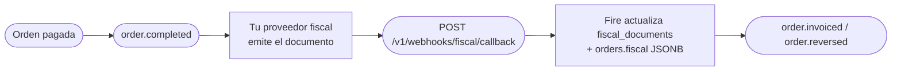

Este endpoint es **inbound** — tu proveedor fiscal le hace POST cada vez que un documento fiscal es autorizado, rechazado, denegado, cancelado o falla. Es la **API canónica multipaís de fiscal callback** que acepta payloads de BR, CO, EC, CL, AR, VE. Fire valida el payload, guarda el veredicto del ente en la orden y despacha `order.invoiced` / `order.reversed` a tus Integration Flows — para todos los países. Lo que mandás acá es lo que leen los consumidores de los eventos: ver [Del callback a los eventos](#del-callback-a-los-eventos).

<Note>
  **Este endpoint es asíncrono.** Fire autentica, corre el guard de source-of-truth + tenancy, deduplica, pre-marca la orden como `processing` y **encola** el callback — luego devuelve **`202 Accepted`** con un `webhookEventId` (típicamente en menos de 100&nbsp;ms). La actualización de `fiscal_documents` / `orders.fiscal` ocurre un instante después en un worker en segundo plano (normalmente en ~2&nbsp;segundos). Para ver el resultado del procesamiento, consultá [`GET /v1/webhooks/events/{webhookEventId}`](#comprobar-el-resultado). Los problemas corregibles por el cliente (payload inválido, `eventId` equivocado, tenant equivocado, una acción reusando el evento de otra) se rechazan **sincrónicamente** con `4xx` **antes** del `202`.
</Note>

## Cómo complementa `order.completed` y `order.cancelled`

`order.completed` y `order.cancelled` llevan el **estado de negocio** de una orden. El callback fiscal lleva el **estado fiscal** (autorización SEFAZ / DIAN / SRI / SII / AFIP / SENIAT). Juntos forman este lifecycle:



Después de procesar un callback `authorized`, Fire emite [`order.invoiced`](/es/events/order-invoiced); después de uno `cancelled`, [`order.reversed`](/es/events/order-reversed). Ambos salen **para todos los países** — el país viaja en el bloque fiscal del evento, no en su nombre. Los eventos posteriores de la orden para el mismo `orderId` también reflejan el nuevo estado en `data.lastKnown.fiscal`.

Para el panorama fiscal completo — numeración, callback y eventos, y cómo encajan — ver el [panorama fiscal](/es/fiscal/overview).

## Autenticación

Este endpoint requiere una **API key con scope `webhooks:fiscal`**, vendor-scoped al account dueño de la orden. Las keys sin scope o solo a nivel account se rechazan con `403 Forbidden`.

<ParamField header="x-api-key" type="string" required>
  Tu API key de Fire. Générala desde el dashboard en **Settings → API Keys → Developer keys**, con scope `webhooks:fiscal` y un binding de vendor para el account cuyas órdenes esta key puede actualizar.
</ParamField>

<ParamField header="Authorization" type="string">
  Opcional `Bearer <token>`. No se requiere para este endpoint hoy, pero está reservado para futuros tokens emitidos por proveedor.
</ParamField>

## Body de la petición

El body es un objeto JSON con estos campos top-level. **Todo lo canónico vive acá arriba**; `document` lleva SOLO el vocabulario del ente de tu país, elegido por `country` — ver [Documento por país](#documento-por-país) abajo.

<ParamField body="country" type="string" required>
  Código de país ISO 3166-1 alpha-2. Uno de `BR`, `CO`, `EC`, `CL`, `AR`, `VE`. Determina las reglas de validación del objeto `document`.

  **Antes se llamaba `countryCode`.**
</ParamField>

<ParamField body="eventType" type="string" required>
  Estado del documento. Uno de:
  - `fiscal_graphic` — el proveedor está entregando la **representación gráfica** (el artefacto imprimible) del documento. **No es una aprobación** ni un estado terminal — ver [El estado `fiscal_graphic`](#el-estado-fiscal_graphic) abajo.
  - `authorized` — la autoridad fiscal aprobó el documento
  - `cancelled` — un documento previamente autorizado fue cancelado
  - `rejected` — el documento fue rechazado (validación, schema, firma)
  - `denied` — la autoridad denegó la solicitud (típicamente fallo permanente de regla de negocio)
  - `error` — ocurrió un error no recuperable en el proveedor o autoridad

  Cuando `eventType` es `fiscal_graphic`, `authorized` o `cancelled`, el campo `document` es **requerido**. Cuando es `rejected`, `denied` o `error`, el campo `failure` es **requerido**.
</ParamField>

<ParamField body="providerEventId" type="string" required>
  El id propio de tu proveedor para esta entrega. Se guarda para auditoría/forense — **no es la llave de idempotencia**. Fire deduplica por `(orderId, eventId)`, así que podés enviar un `providerEventId` nuevo en cada reintento sin crear duplicados. Usa el ID nativo del evento del proveedor si está disponible; si no, un UUID.
</ParamField>

<ParamField body="occurredAt" type="string" required>
  Timestamp ISO 8601 UTC de cuándo ocurrió el evento en la autoridad fiscal (no cuándo el proveedor envió el callback).
</ParamField>

<ParamField body="orderId" type="string" required>
  UUID de la orden en Fire. Coincide con `data.orderId` en los eventos `order.completed` y `order.cancelled`. Fire lo usa para encontrar el documento fiscal existente.
</ParamField>

<ParamField body="eventId" type="string" required>
  UUID de correlación **y llave de idempotencia** (junto con `orderId`). Debe ser el `event.id` de un envelope V4 que **Fire emitió para esta orden** — ecoalo exacto; nunca lo inventes.

  - **Chequeo de fuente de verdad.** Un `eventId` que no referencie un evento de Fire para esa orden se rechaza con `400` antes del `202`.
  - **Cada acción lleva su propio evento.** Ecoa el `event.id` del evento que disparó *esta* acción — la emisión `order.invoiced` para un callback `authorized`, el evento de cancelación/reverso para un callback `cancelled`. Reusar el `eventId` de una acción para otro `eventType` (ej. un `cancelled` que ecoa el `eventId` del `authorized`) se rechaza con **`409`** — una cancelación debe referenciar su **propio** evento, no colgarse del de la autorización. Ver [Idempotencia y escenarios](#idempotencia-y-escenarios).
</ParamField>

<ParamField body="document" type="object">
  El vocabulario del ente de tu país, y **nada más**: `claveAcceso`, `cufe`, `chaveAcesso`, `folio`, `cae`… **Requerido** cuando `eventType` es `authorized`, `cancelled` o `fiscal_graphic`. Ver [Documento por país](#documento-por-país).

  Los campos comunes —`documentType`, el número, las URLs, los importes, las fechas— **no van acá adentro**: están en la raíz. Todo lo que va en `document` llega a los eventos como `authority.countryData`, con los mismos nombres de clave.
</ParamField>

### Campos canónicos (raíz)

Significan lo mismo en los seis países, así que viven en la **raíz** del payload y no dentro de `document`. Es la misma regla que la respuesta de numeración fiscal, para que el mismo hecho no se busque en dos profundidades distintas según por dónde entró.

<ParamField body="documentType" type="string">
  `SALE_INVOICE` o `CREDIT_NOTE` — el mismo vocabulario que la numeración fiscal. **Requerido cuando hay comprobante** (`authorized` / `cancelled`), y tiene que coincidir con el evento: `authorized` es un `SALE_INVOICE`, `cancelled` es un `CREDIT_NOTE`. Cualquier otra combinación devuelve `400`.

  **Antes era `docType: "invoice" | "cancellation"`.** El nombre viejo **se ignora**, no se traduce: un payload `authorized` o `cancelled` que trae solo `docType` recibe `400` en `documentType`.
</ParamField>

<ParamField body="docSubtype" type="string">
  Cómo lo llama tu régimen: `nfce`, `nfe`, `factura`, `boleta`, `factura_a`. Abierto: no lo validamos contra una lista y **no ramifica nada** de nuestro lado — es referencial. **Requerido cuando hay comprobante.**
</ParamField>

<ParamField body="documentNumber" type="string">
  El número **visible** del documento, tal como lo arma el ente (`12388`, `001-020-000000123`, `C012001`). Las piezas con las que se arma siguen viajando en `document` con los nombres del país. **Requerido en `authorized`**: Fire ya no lo deduce.
</ParamField>

<ParamField body="issuedAt" type="string">
  Fecha/hora UTC (ISO 8601) en que se **emitió** el documento. Mismo nombre que en la numeración fiscal. **Requerido en `authorized`.**
</ParamField>

<ParamField body="authorizedAt" type="string">
  Fecha/hora UTC (ISO 8601) en que el ente **aprobó** el documento — un hecho distinto de `issuedAt`. Pueden separarse por segundos (autorización en línea) o por horas (contingencia autorizada cuando vuelve la conexión). Opcional; si no viene, los consumidores de los eventos ven `authority.authorizedAt: null`. En una cancelación usá `cancelledAt`.
</ParamField>

<ParamField body="cancelledAt" type="string">
  Fecha/hora UTC en que el ente aprobó la cancelación. Mandalo en `cancelled`.
</ParamField>

<ParamField body="authorizationMode" type="string">
  `ONLINE`, `OFFLINE` o `BATCH`. `OFFLINE` es contingencia: el comprobante vale pero se emitió sin poder consultar al ente, y hay regímenes que exigen que el ticket lo diga (el RIDE ecuatoriano imprime `EMISION POR CONTINGENCIA`).
</ParamField>

<ParamField body="pdfUrl" type="string">
  Enlace de descarga del PDF (DANFE / RIDE). HTTPS, descargable con un GET directo, válido por al menos 24 h — Fire lo archiva. **Requerido** para `authorized` y `cancelled`.
</ParamField>

<ParamField body="xmlUrl" type="string">
  Enlace de descarga del XML legal del ente. Mismas condiciones que `pdfUrl`. **Requerido** para `authorized` y `cancelled`.
</ParamField>

<ParamField body="totalAmount" type="number">
  Total bruto del documento, en decimales reales (sin escalar). **Requerido en `authorized`.**
</ParamField>

<ParamField body="taxAmount" type="number">
  Total de impuestos del documento, en decimales reales. **Requerido en `authorized`.**
</ParamField>

<ParamField body="currencyCode" type="string">
  Código ISO 4217 — exactamente 3 letras (`BRL`, `COP`, `USD`). **Requerido en `authorized`.**
</ParamField>

<ParamField body="providerDocId" type="string">
  El id del documento en tu sistema. Es por lo que se buscan el PDF y el XML y con lo que se pide una cancelación. **Requerido en `authorized`.**
</ParamField>

<ParamField body="graphic" type="object">
  Lo que se imprime: un mapa clave → string exacto a codificar (`{ "qr": "…" }`, `{ "ted": "…" }`). La clave nombra el propósito; cómo se dibuja lo decide la plantilla del ticket. Va en la raíz, al lado de `document`, como en la respuesta de numeración fiscal. **Requerido y no vacío en `fiscal_graphic`**; opcional en el resto.
</ParamField>

<ParamField body="provider" type="object">
  Quién emitió y con qué versión. Llega a la orden y a los eventos como `authority.providerIdentity` — el mismo nombre que en la numeración fiscal — con las tres claves siempre presentes. Si no mandás `provider`, o lo mandás vacío, `providerIdentity` es `null`.

  <Expandable title="provider">
    <ParamField body="name" type="string">Nombre del proveedor (`hio.fiscalization`, `plugnotas`).</ParamField>
    <ParamField body="version" type="string">Versión del emisor.</ParamField>
    <ParamField body="reference" type="string">Referencia libre.</ParamField>
  </Expandable>
</ParamField>

<ParamField body="failure" type="object">
  Por qué NO hay comprobante. **Requerido** cuando `eventType` es `rejected`, `denied` o `error`.

  **Antes se llamaba `error`**, y ahora lleva la misma forma que la respuesta de numeración fiscal.

  <Expandable title="failure">
    <ParamField body="code" type="string">
      Código de error opcional del proveedor/autoridad (p. ej. `DIAN_42`, `cStat_204`).
    </ParamField>
    <ParamField body="scope" type="string">
      `TECHNICAL` o `FUNCTIONAL`. Es lo que el canal ramifica: con `TECHNICAL` el comprobante todavía puede salir y el ticket imprime «en trámite»; con `FUNCTIONAL` el ente lo rechazó por su contenido y no va a salir.
    </ParamField>
    <ParamField body="message" type="string" required>
      Mensaje legible. Mínimo 1 carácter.
    </ParamField>
    <ParamField body="details" type="array">
      Detalle campo por campo, cuando el ente lo da.
    </ParamField>
  </Expandable>
</ParamField>

<ParamField body="metadata" type="object">
  Bag free-form para extras específicos del proveedor (respuesta raw, IDs internos, etc.). No validado. Llega a la orden y a los eventos como `authority.providerMetadata`, tal cual y opaco — igual que en la numeración fiscal. Ausente o `{}` queda en `null`.

  **Antes se llamaba `providerSpecific`.**
</ParamField>

<Warning>
  **La raíz no admite claves extra.** Solo se leen los campos de arriba; cualquier otra clave de raíz se **descarta en silencio** — no se rechaza. `orderCode` no es parte del contrato — la orden se resuelve por `orderId`.
</Warning>

### Qué es requerido, por evento

| Campo | `authorized` | `cancelled` | `fiscal_graphic` | `rejected` · `denied` · `error` |
|---|---|---|---|---|
| `document` | requerido | requerido | requerido | — |
| `documentType` | `SALE_INVOICE` | `CREDIT_NOTE` | — | — |
| `docSubtype` | requerido | requerido | — | — |
| `pdfUrl`, `xmlUrl` | requerido | requerido | — | — |
| `documentNumber`, `providerDocId`, `issuedAt` | requerido | — | — | — |
| `totalAmount`, `taxAmount`, `currencyCode` | requerido | — | — | — |
| `graphic` | opcional | opcional | requerido, no vacío | — |
| `failure` | — | — | — | requerido |

`authorizedAt`, `cancelledAt`, `authorizationMode` y `provider` son siempre opcionales. Un campo requerido enviado como `null` cuenta como faltante.

## Documento por país

La forma requerida del campo `document` depende de `country`. **`document` lleva SOLO los identificadores del ente de ese país** — los campos comunes a los seis viven en la raíz del payload, arriba.

<Warning>
  **`document` cambió de contenido**

  Hasta ahora `document` mezclaba dos cosas: lo que significa lo mismo en todos los países
  —`docType`, `pdfUrl`, `xmlUrl`, los importes, las fechas— y el vocabulario del ente de cada
  uno. Esa mezcla se propagaba a todo lo que leía el callback.

  Ahora **lo canónico va en la raíz** y `document` queda solo con lo del régimen. Es la misma
  forma que la respuesta de numeración fiscal: el mismo hecho, en el mismo lugar, sin importar
  por qué camino entró.

  Otros cambios del mismo paquete: `countryCode` → `country`, `docType` → `documentType`
  (`SALE_INVOICE` / `CREDIT_NOTE`, sin alias), `error` → `failure` (con `scope` y
  `details`), `providerSpecific` → `metadata`, y `emittedAt` → `issuedAt`. Nuevos en la raíz:
  `documentNumber`, `authorizedAt` y `graphic`.
</Warning>

<Tabs>
  <Tab title="Brasil (BR)">
    Documentos fiscales brasileños (NF-e / NFC-e). Usa este código de país al enviar callbacks desde tu proveedor fiscal o cualquier otro proveedor BR.

    Además de los [campos canónicos de la raíz](#campos-canónicos-raíz) (`documentType`, `docSubtype`, `documentNumber`, `pdfUrl`, `xmlUrl`, `issuedAt`, etc.), BR requiere estos identificadores específicos:

    | Campo | Tipo | Requerido | Notas |
    |---|---|---|---|
    | `chaveAcesso` | string | ✓ | Exactamente 44 dígitos — chave de acceso SEFAZ |
    | `protocolo` | string | ✓ | Protocolo de autorización SEFAZ |
    | `numero` | int / string | ✓ | Número de documento |
    | `serie` | int / string \| null | | Serie del documento (codificada en chave) |
    | `modelo` | `55` / `65` \| null | | `55` = NF-e, `65` = NFC-e |

    El ejemplo de abajo es un payload `authorized` completo: cada campo de raíz que muestra es **requerido** para ese evento — ver [Qué es requerido, por evento](#qué-es-requerido-por-evento).

    ```json
    {
      "country": "BR",
      "eventType": "authorized",
      "providerEventId": "evt-br-1",
      "occurredAt": "2026-04-26T14:32:11.000Z",
      "orderId": "550e8400-e29b-41d4-a716-446655440000",
      "eventId": "7c9e6679-7425-40de-944b-e07fc1f90ae7",
      "documentType": "SALE_INVOICE",
      "docSubtype": "nfce",
      "documentNumber": "1",
      "issuedAt": "2026-04-26T14:32:10.000Z",
      "totalAmount": 142.90,
      "taxAmount": 18.57,
      "currencyCode": "BRL",
      "pdfUrl": "https://api.fiscal-provider.example/nfce/69fa97fe427d1240856e1282/pdf",
      "xmlUrl": "https://api.fiscal-provider.example/nfce/69fa97fe427d1240856e1282/xml",
      "providerDocId": "69fa97fe427d1240856e1282",
      "document": {
        "chaveAcesso": "35260229062609000177650500000000011000000010",
        "protocolo": "141210001176277",
        "numero": 1,
        "serie": 50,
        "modelo": 65
      }
    }
    ```
  </Tab>

  <Tab title="Colombia (CO)">
    Documentos fiscales colombianos (DIAN).

    | Campo | Tipo | Requerido | Notas |
    |---|---|---|---|
    | `cufe` | string | ✓ | Código fiscal único DIAN |
    | `prefijo` | string | ✓ | Prefijo del documento |
    | `numeroDian` | string | ✓ | Número de documento DIAN |
    | `qrCode` | string (URL) \| null | | QR para el documento impreso |
    | `numeroComprobante` | string \| null | | El número **visible**, ya armado: `prefijo + consecutivo` |
    | `ambiente` | `"1"` \| `"2"` \| null | | **`1` producción · `2` pruebas** — al revés que el SRI |

    ```json
    {
      "country": "CO",
      "eventType": "authorized",
      "providerEventId": "evt-co-1",
      "occurredAt": "2026-04-26T14:32:11.000Z",
      "orderId": "550e8400-e29b-41d4-a716-446655440000",
      "eventId": "7c9e6679-7425-40de-944b-e07fc1f90ae7",
      "documentType": "SALE_INVOICE",
      "docSubtype": "factura",
      "documentNumber": "C012001",
      "issuedAt": "2026-04-26T14:32:10.000Z",
      "totalAmount": 95000.00,
      "taxAmount": 15170.17,
      "currencyCode": "COP",
      "pdfUrl": "https://api.fiscal-provider.example/dian/C012001/pdf",
      "xmlUrl": "https://api.fiscal-provider.example/dian/C012001/xml",
      "providerDocId": "C012001",
      "document": {
        "cufe": "633732c7a2a577bfa1828551e64d03f715f0",
        "prefijo": "C012",
        "numeroDian": "001",
        "numeroComprobante": "C012001",
        "ambiente": "1",
        "qrCode": "https://catalogo-vpfe.dian.gov.co/document/searchqr?documentkey=633732c7a2a577bfa1828551e64d03f715f0"
      }
    }
    ```

    <Note>
      **Los nombres son los mismos que en la numeración**, a propósito: `cufe`, `prefijo`,
      `numeroDian`, `numeroComprobante`, `qrCode` y `ambiente` significan acá exactamente lo
      mismo que en la respuesta del prekey. Es el mismo documento contado dos veces, y si los
      nombres divergieran, conciliar los dos caminos dejaría de ser comparar campos.

      **`numeroDian` va sin el prefijo** (`990000001`, no `SETP990000001`). El número armado es
      `numeroComprobante`. Mandar el armado en los dos hace que la conciliación compare
      `SETP990000001` contra `990000001` y no cruce.

      Los dos campos son **opcionales dentro de `document`**: quien ya manda callbacks sin ellos sigue
      funcionando. Eso no se extiende a la raíz: los campos listados en [Qué es requerido, por evento](#qué-es-requerido-por-evento)
      son requeridos, y un callback al que le falten recibe `400`.
    </Note>
  </Tab>

  <Tab title="Ecuador (EC)">
    Documentos fiscales ecuatorianos (SRI).

    | Campo | Tipo | Requerido | Notas |
    |---|---|---|---|
    | `claveAcceso` | string | ✓ | Exactamente 49 dígitos — clave de acceso SRI |
    | `numeroComprobante` | string \| null | | El número **visible**, ya armado: `estab-ptoEmi-secuencial` |
    | `ambiente` | `'1'` / `'2'` \| null | | `1` = pruebas, `2` = producción |
    | `establecimiento` | string \| null | | Código del establecimiento (`001`) |
    | `puntoEmision` | string \| null | | Código del punto de emisión (`020`) |
    | `secuencial` | string \| null | | Secuencial del comprobante (`000000123`) |

    <Note>
      **`numeroAutorizacion` fue retirado del contrato.** En el esquema de autorización en
      línea el SRI devuelve como número de autorización **la misma clave de acceso**, así que
      era el mismo dato declarado dos veces. Si tu sistema lo sigue enviando no rompe nada
      —los campos no declarados se preservan— pero no lo pedimos ni lo interpretamos.
      Quien necesite el número de autorización lee `claveAcceso`.

      **Las tres piezas del número** —`establecimiento`, `puntoEmision`, `secuencial`— ahora
      existen en las dos rutas: la numeración previa y este callback. Son **opcionales**: si
      tu proveedor no las emite, no las mandes. Fire no las deriva de `claveAcceso` —esa
      regla es del régimen— y el comprobante se imprime sin ellas.
    </Note>

    ```json
    {
      "country": "EC",
      "eventType": "authorized",
      "providerEventId": "evt-ec-1",
      "occurredAt": "2026-04-26T14:32:11.000Z",
      "orderId": "550e8400-e29b-41d4-a716-446655440000",
      "eventId": "7c9e6679-7425-40de-944b-e07fc1f90ae7",
      "documentType": "SALE_INVOICE",
      "docSubtype": "factura",
      "documentNumber": "001-020-000000123",
      "issuedAt": "2026-04-26T14:32:10.000Z",
      "totalAmount": 24.50,
      "taxAmount": 3.15,
      "currencyCode": "USD",
      "pdfUrl": "https://api.fiscal-provider.example/sri/AUT-EC-001/pdf",
      "xmlUrl": "https://api.fiscal-provider.example/sri/AUT-EC-001/xml",
      "providerDocId": "AUT-EC-001",
      "document": {
        "numeroComprobante": "001-020-000000123",
        "claveAcceso": "0102030405060708091011121314151617181920212223242",
        "establecimiento": "001",
        "puntoEmision": "020",
        "secuencial": "000000123",
        "ambiente": "2"
      }
    }
    ```
  </Tab>

  <Tab title="Chile (CL)">
    Documentos fiscales chilenos (SII DTE).

    | Campo | Tipo | Requerido | Notas |
    |---|---|---|---|
    | `folio` | int / string | ✓ | Número de folio del DTE |
    | `ted` | string | ✓ | TED (Timbre Electrónico) — base64 o fragmento XML |
    | `tipoDte` | int / string | ✓ | Tipo DTE (p. ej. `33` = factura electrónica) |
    | `trackId` | string \| null | | Track ID SII para queries de seguimiento |

    ```json
    {
      "country": "CL",
      "eventType": "authorized",
      "providerEventId": "evt-cl-1",
      "occurredAt": "2026-04-26T14:32:11.000Z",
      "orderId": "550e8400-e29b-41d4-a716-446655440000",
      "eventId": "7c9e6679-7425-40de-944b-e07fc1f90ae7",
      "documentType": "SALE_INVOICE",
      "docSubtype": "factura",
      "documentNumber": "12345",
      "issuedAt": "2026-04-26T14:32:10.000Z",
      "totalAmount": 18900,
      "taxAmount": 3019,
      "currencyCode": "CLP",
      "pdfUrl": "https://api.fiscal-provider.example/sii/12345/pdf",
      "xmlUrl": "https://api.fiscal-provider.example/sii/12345/xml",
      "providerDocId": "12345",
      "document": {
        "folio": 12345,
        "ted": "<TED>...base64-or-xml...</TED>",
        "tipoDte": 33,
        "trackId": "SII-TRK-998877"
      }
    }
    ```
  </Tab>

  <Tab title="Argentina (AR)">
    Documentos fiscales argentinos (AFIP).

    | Campo | Tipo | Requerido | Notas |
    |---|---|---|---|
    | `cae` | string | ✓ | Código de Autorización Electrónico |
    | `fechaVtoCae` | string | ✓ | Fecha de vencimiento del CAE |
    | `puntoVenta` | int / string | ✓ | Número de punto de venta |
    | `numeroComprobante` | int / string | ✓ | Número del documento |
    | `tipoComprobante` | int / string | ✓ | Tipo de documento (`1` = factura A, …) |

    ```json
    {
      "country": "AR",
      "eventType": "authorized",
      "providerEventId": "evt-ar-1",
      "occurredAt": "2026-04-26T14:32:11.000Z",
      "orderId": "550e8400-e29b-41d4-a716-446655440000",
      "eventId": "7c9e6679-7425-40de-944b-e07fc1f90ae7",
      "documentType": "SALE_INVOICE",
      "docSubtype": "factura_a",
      "documentNumber": "0001-00012345",
      "issuedAt": "2026-04-26T14:32:10.000Z",
      "totalAmount": 12100.00,
      "taxAmount": 2100.00,
      "currencyCode": "ARS",
      "pdfUrl": "https://api.fiscal-provider.example/afip/0001-12345/pdf",
      "xmlUrl": "https://api.fiscal-provider.example/afip/0001-12345/xml",
      "providerDocId": "0001-12345",
      "document": {
        "cae": "74256178925412",
        "fechaVtoCae": "2026-05-31",
        "puntoVenta": 1,
        "numeroComprobante": 12345,
        "tipoComprobante": 1
      }
    }
    ```
  </Tab>

  <Tab title="Venezuela (VE)">
    Documentos fiscales venezolanos (SENIAT).

    | Campo | Tipo | Requerido | Notas |
    |---|---|---|---|
    | `numeroControl` | string | ✓ | Número del rango de control emitido por SENIAT |
    | `numeroFactura` | string | ✓ | Número de factura |
    | `rifEmisor` | string \| null | | RIF del emisor |

    ```json
    {
      "country": "VE",
      "eventType": "authorized",
      "providerEventId": "evt-ve-1",
      "occurredAt": "2026-04-26T14:32:11.000Z",
      "orderId": "550e8400-e29b-41d4-a716-446655440000",
      "eventId": "7c9e6679-7425-40de-944b-e07fc1f90ae7",
      "documentType": "SALE_INVOICE",
      "docSubtype": "factura",
      "documentNumber": "12345",
      "issuedAt": "2026-04-26T14:32:10.000Z",
      "totalAmount": 480.00,
      "taxAmount": 76.80,
      "currencyCode": "VES",
      "pdfUrl": "https://api.fiscal-provider.example/seniat/00-00012345/pdf",
      "xmlUrl": "https://api.fiscal-provider.example/seniat/00-00012345/xml",
      "providerDocId": "00-00012345",
      "document": {
        "numeroControl": "00-00012345",
        "numeroFactura": "12345",
        "rifEmisor": "J-12345678-9"
      }
    }
    ```
  </Tab>
</Tabs>

## El estado `fiscal_graphic`

`fiscal_graphic` reporta que tu proveedor está entregando la **representación gráfica** — el artefacto imprimible (PDF / RIDE / DANFE) del documento. Es un **estado propio**, no un resultado:

- **No es una aprobación.** Recibir `fiscal_graphic` no dice nada sobre si la autoridad aprobó el documento. Fire guarda la gráfica y el documento sigue en un estado no terminal.
- **Es opcional.** Si tu proveedor no tiene gráfica para un documento, envía `authorized` (o cualquier estado terminal) **directamente** — no hace falta un `fiscal_graphic` previo. Ambos flujos son válidos.
- **Puede compartir el `eventId` con su desenlace.** La gráfica y el resultado terminal pertenecen a la misma acción, así que podés enviar `fiscal_graphic` y luego `authorized` / `rejected` / `denied` / `cancelled` reusando el **mismo** `eventId`. Eso no es un conflicto y nunca devuelve `409` — ver [Idempotencia y escenarios](#idempotencia-y-escenarios).
- **Requiere `document` y un `graphic` no vacío.** La representación gráfica es lo que imprime la caja — el QR, el TED, la clave de acceso codificada — y viaja en el `graphic` de la raíz. El PDF y el XML son los archivos del documento autorizado y llegan con `authorized`.
- **No dispara ningún evento saliente.** `order.invoiced` y `order.reversed` siguen atados a `authorized` y `cancelled` respectivamente. La gráfica solo cambia el estado del documento.

```json fiscal_graphic (EC)
{
  "country": "EC",
  "eventType": "fiscal_graphic",
  "providerEventId": "evt-ec-graphic-1",
  "occurredAt": "2026-04-26T14:32:05.000Z",
  "orderId": "550e8400-e29b-41d4-a716-446655440000",
  "eventId": "7c9e6679-7425-40de-944b-e07fc1f90ae7",
  "documentType": "SALE_INVOICE",
  "docSubtype": "factura",
  "documentNumber": "001-020-000000123",
  "issuedAt": "2026-04-26T14:32:04.000Z",
  "providerDocId": "AUT-EC-001",
  "document": {
    "numeroComprobante": "001-020-000000123",
    "claveAcceso": "0102030405060708091011121314151617181920212223242",
    "establecimiento": "001",
    "puntoEmision": "020",
    "secuencial": "000000123",
    "ambiente": "2"
  },
  "graphic": {
    "qr": "0102030405060708091011121314151617181920212223242"
  },
  "provider": {
    "name": "hio.fiscalization",
    "version": "2026.09.1",
    "reference": "HIO-EC-GRAPHIC-001"
  },
  "metadata": {
    "providerTraceId": "ec-graphic-trace-001"
  }
}
```

### Resultados negativos (`rejected`, `denied`, `error`)

Para estados no autorizados, omite `document` y provee `failure`. El `country` sigue aplicando (valida el routing); el documento no se requiere porque no hay artefacto autorizado — y `documentType`/`docSubtype` tampoco, porque no hay comprobante que tipificar.

```json Rechazado
{
  "country": "CO",
  "eventType": "rejected",
  "providerEventId": "evt-co-2",
  "occurredAt": "2026-04-26T14:32:11.000Z",
  "orderId": "550e8400-e29b-41d4-a716-446655440000",
  "eventId": "7c9e6679-7425-40de-944b-e07fc1f90ae7",
  "document": null,
  "failure": {
    "code": "DIAN_42",
    "message": "CUFE inválido"
  }
}
```

## Respuesta

En caso de éxito el endpoint devuelve **`202 Accepted`** — el evento fue autenticado, validado, deduplicado y **encolado**. Un `202` **no** significa que el documento fiscal ya se actualizó; eso ocurre de forma asíncrona en un worker en segundo plano. Usá el [endpoint de status](#comprobar-el-resultado) para confirmar el resultado final.

El body trae **dos ids distintos** para que no haya ambigüedad: `eventId` es el id que **vos** enviaste (devuelto como echo), `webhookEventId` es el id de **Fire** para el registro encolado.

<ResponseField name="received" type="boolean">
  Siempre `true` cuando la petición fue aceptada y encolada.
</ResponseField>

<ResponseField name="duplicate" type="boolean">
  `true` cuando este `(orderId, eventId)` ya se ingresó **con el mismo `eventType`** — se devuelve el registro existente y no se re-encola nada. `false` para un evento nuevo.
</ResponseField>

<ResponseField name="eventId" type="string">
  Echo del `eventId` que enviaste (el `event.id` de la emisión de Fire). Usalo para casar este acuse con tu envío.
</ResponseField>

<ResponseField name="webhookEventId" type="string">
  El id de Fire para el registro encolado en `webhook_events`. Pasalo a `GET /v1/webhooks/events/{webhookEventId}` para consultar el resultado del procesamiento. En un duplicado es el **mismo** id que se devolvió la primera vez.
</ResponseField>

<ResponseField name="status" type="string">
  Status actual del registro en la cola — `queued` → `processing` → `processed` (y `retry` / `failed` / `dead` / `ignored`).
</ResponseField>

<ResponseField name="firstReceivedAt" type="string">
  Timestamp ISO 8601 UTC de cuándo Fire recibió **por primera vez** este evento. Estable entre reintentos — útil como ancla de traza.
</ResponseField>

<ResponseField name="message" type="string">
  Resumen legible de lo que pasó.
</ResponseField>

<ResponseExample>
```json 202 — aceptado (nuevo, encolado)
{
  "received": true,
  "duplicate": false,
  "eventId": "1686fca1-0a26-4a89-b2f2-fe93b15a4434",
  "webhookEventId": "6d950243-6a0c-415c-b547-bddf9af8ad61",
  "status": "queued",
  "firstReceivedAt": "2026-06-11T15:00:34.729Z",
  "message": "Event accepted and queued for processing."
}
```

```json 202 — duplicado (mismo orderId + eventId + eventType)
{
  "received": true,
  "duplicate": true,
  "eventId": "1686fca1-0a26-4a89-b2f2-fe93b15a4434",
  "webhookEventId": "6d950243-6a0c-415c-b547-bddf9af8ad61",
  "status": "processed",
  "firstReceivedAt": "2026-06-11T15:00:34.729Z",
  "message": "Event already received; no action needed."
}
```

```json 409 — eventId reusado para otra acción
{
  "success": false,
  "error": "CONFLICT",
  "message": "eventId \"1686fca1-…\" is already bound to event_type=\"authorized\" for this order. A \"cancelled\" callback must reference its own event (a distinct eventId emitted by Fire for that action), not reuse another event's id."
}
```

```json 400 — eventId incorrecto / error de validación
{
  "success": false,
  "error": "VALIDATION_ERROR",
  "message": "eventId does not reference an event emitted by Fire for this orderId. Echo the event.id from a V4 envelope you received for this order."
}
```

```json 401 — API key faltante o inválida
{
  "success": false,
  "error": "UNAUTHORIZED",
  "message": "API key required. Use x-api-key: pk_live_... header"
}
```

```json 403 — scope incorrecto / no es tu tenant
{
  "success": false,
  "error": "FORBIDDEN",
  "message": "webhooks:fiscal requires a vendor-scoped API key (account + vendor binding). Generate one from /developers/firepos-api-management."
}
```

```json 503 — auth store temporalmente inalcanzable (reintentá)
{
  "success": false,
  "error": "SERVICE_UNAVAILABLE",
  "message": "API key verification is temporarily unavailable (auth store unreachable). Retry the request."
}
```
</ResponseExample>

## Comprobar el resultado

Como el procesamiento es asíncrono, el `202` solo confirma que el evento fue **encolado**. Para ver si el documento fiscal se actualizó, consultá el endpoint de status con el `webhookEventId` devuelto por el `202`:

```
GET https://app.fire.rest/api/v1/webhooks/events/{webhookEventId}
x-api-key: <tu key webhooks:fiscal>
```

<ResponseField name="status" type="string">
  Ciclo de vida en la cola: `queued` → `processing` → `processed` (listo) · `failed` / `dead` (se agotaron los reintentos) · `retry` (esperando el próximo intento) · `ignored`.
</ResponseField>
<ResponseField name="attempts" type="number">Intentos de procesamiento hasta ahora.</ResponseField>
<ResponseField name="result" type="object | null">En éxito, el resultado del worker — ej. `{ "kind": "updated", "documentId": "…", "receiptId": "…" }`.</ResponseField>
<ResponseField name="error" type="object | null">`{ "message": "…" }` cuando el último intento falló; `null` si no.</ResponseField>

<ResponseExample>
```json 200 — procesado
{
  "id": "9e6c8af8-af80-4967-9422-c096ab43c0e7",
  "source": "fiscal_generic",
  "eventType": "authorized",
  "status": "processed",
  "attempts": 1,
  "processedAt": "2026-04-26T14:32:13.000Z",
  "result": { "kind": "updated", "documentId": "1a2b3c4d-…", "receiptId": "9b2a3c4d-…" },
  "error": null
}
```
</ResponseExample>

Un `404` se devuelve para ids desconocidos — o ids de otro tenant — sin filtrar existencia. Autenticá con la misma key `webhooks:fiscal` que usaste para el callback.

## Idempotencia y escenarios

Fire deduplica callbacks por **`(orderId, eventId)`** — *no* por `providerEventId` (que podés regenerar libremente). Un evento es único con su orden: el mismo `(orderId, eventId)` reenviado con el **mismo** `eventType` es un replay benigno; el mismo `(orderId, eventId)` con un `eventType` **distinto** es un intento de colgar una acción sobre el evento de otra, y Fire lo rechaza.


**`fiscal_graphic` es la excepción.** Es un paso de la *misma* acción, no un desenlace que compita, así que puede compartir el `eventId` con el estado terminal que llega después — esa combinación se acepta, nunca da `409`.

Esta es la matriz completa de comportamiento — cada combinación que podés enviar:

| Escenario | Resultado |
|---|---|
| `(orderId, eventId)` nuevo | **`202`** · `duplicate: false` — encolado |
| Mismo `(orderId, eventId, eventType)` reenviado (cualquier `providerEventId`) | **`202`** · `duplicate: true` — se devuelve el registro existente, **no** se re-encola |
| `fiscal_graphic` y luego un estado terminal con el **mismo `eventId`** | **`202`** ambas veces — la gráfica es un paso de la misma acción, no un conflicto |
| Mismo `(orderId, eventId)` pero **`eventType` distinto** (ej. `cancelled` con el `eventId` del `authorized`) | **`409`** — rechazado. Usá el evento que pertenece a *esta* acción |
| `eventId` no emitido por Fire para ese `orderId` | **`400`** — `eventId` incorrecto/inventado |
| Orden/evento fuera de la cuenta + vendor de tu API key | **`403`** |
| Payload malformado (Zod), faltan campos obligatorios | **`400`** |
| API key faltante / inválida | **`401`** |
| Auth store momentáneamente inalcanzable | **`503`** — transitorio, **reintentá** |

<Warning>
  **Una cancelación necesita su propio evento.** No podés cancelar un documento reenviando el `eventId` de la autorización con `eventType: "cancelled"` — eso devuelve `409`. Fire es la fuente de verdad: una cancelación debe referenciar el **evento de cancelación/reverso que Fire emitió** (un `eventId` distinto). Devolver un `202 duplicado` aquí te diría erróneamente que la cancelación fue aceptada mientras Fire nunca canceló — por eso Fire lo rechaza explícitamente.
</Warning>

<Note>
  **`409` vs `202`.** Un `409` es el único caso donde un callback *bien formado y autenticado* se rechaza en la capa de idempotencia — porque aceptarlo divergiría el estado. Un replay del mismo tipo nunca es un error: devuelve `202` para que tus reintentos queden limpios. Un `503` es **nuestro** (infra transitoria), así que es seguro y esperado reintentar.
</Note>

## Concurrencia

Las transiciones de estado en `fiscal_documents` usan **locking optimista**. Si dos callbacks para el mismo documento llegan concurrentes, uno tiene éxito y el otro resuelve a `idempotent` o `regression` según el orden. El merge de `orders.fiscal` JSONB es atómico.

## Qué pasa después del 202

<CardGroup cols={2}>
  <Card title="Del callback a los eventos" icon="arrow-right-arrow-left" href="/es/fiscal/callback-to-events">
    Cómo llega cada campo que mandás acá a `order.invoiced` y `order.reversed`.
  </Card>
  <Card title="Panorama fiscal" icon="file-invoice" href="/es/fiscal/overview">
    Numeración, callback y eventos en una sola imagen.
  </Card>
</CardGroup>

El `202` solo encola el evento. Un worker en segundo plano lo toma — en ~2&nbsp;segundos vía el wake-up instantáneo, o en el próximo ciclo de polling como fallback — y:

1. **Se actualiza el documento fiscal** con el nuevo status y los identificadores del ente.
2. **El veredicto se guarda en la orden**, estructurado: campos canónicos, `amounts`, `countryData` y `graphic` — y se agrega al historial fiscal de la orden.
3. **Se despacha un evento outbound, para todos los países**: `order.invoiced` para `eventType=authorized`, `order.reversed` para `eventType=cancelled`. Los Integration Flows activos para ese evento corren y hacen POST a tu endpoint. `fiscal_graphic`, `rejected`, `denied` y `error` actualizan el estado pero no emiten evento.

## Del callback a los eventos

Quien consume `order.invoiced` u `order.reversed` lee **exactamente lo que mandaste acá**, reorganizado en el bloque fiscal del evento. La referencia completa de ese bloque está en [`order.invoiced`](/es/events/order-invoiced#el-bloque-fiscal).

Los campos raíz caen en `fiscal.authority` (o `cancellation.fiscal.authority`) con los mismos nombres, salvo los tres importes, que se agrupan en `authority.amounts`. `document` pasa a ser `authority.countryData`, y `provider` y `metadata` pasan a ser `providerIdentity` y `providerMetadata` (`null` si están ausentes o vacíos). La tabla campo por campo está en [Del callback a los eventos](/es/fiscal/callback-to-events#dónde-cae-cada-campo-del-callback).

**`document` y `countryData` son el mismo bloque.** Fire no guarda una lista de las claves de cada país: todo lo que venga en `document` que no sea un campo canónico llega intacto a `countryData`. Un identificador nuevo que tu ente empiece a exigir viaja a los eventos sin ningún cambio del lado de Fire.

### Por qué este endpoint conserva su path `/v1`

Los renombres de campos de arriba (`docType` → `documentType`, `countryCode` → `country`, `error` → `failure`, `providerSpecific` → `metadata`) rompen a un emisor que siga usando los nombres anteriores: recibe `400` nombrando el campo. Aun así, el endpoint conservó su path. Cuando cambió el contrato, este callback solo llevaba tráfico de pruebas en producción, y el cliente de pruebas de Fire se movió en el mismo release, así que un `/v2` paralelo habría mantenido dos formas de decir lo mismo para ningún emisor. Del lado de los eventos es distinto — tienen consumidores en producción — y los tres eventos afectados publicaron cada uno una nueva versión documentada.

## Relacionado

<CardGroup cols={2}>
  <Card title="order.completed" icon="receipt" href="/es/events/order-completed">
    Ve dónde aterriza el estado fiscal dentro del snapshot V4 de la orden.
  </Card>
  <Card title="order.invoiced" icon="file-invoice" href="/es/events/order-invoiced">
    Evento outbound disparado por un callback `authorized`, para todos los países.
  </Card>
  <Card title="Inyectar orden" icon="paper-plane" href="/es/api-reference/orders">
    El endpoint de inyección que crea la orden que este callback actualiza.
  </Card>
  <Card title="Autenticación" icon="lock" href="/es/authentication">
    Cómo funcionan API keys, scopes y vendor binding.
  </Card>
</CardGroup>
