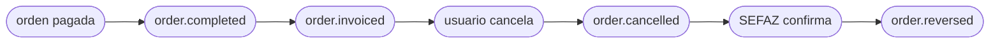

<Warning>
  **Descontinuada (v1).** Contrato anterior, se mantiene solo como referencia histórica. La versión actual es [`order.cancelled` — v2.1](/es/events/order-cancelled).
</Warning>

`order.cancelled` dispara cuando se cancela una orden previamente inyectada — desde la UI del backoffice de Fire, un adaptador externo o una llamada a la API de cancelación. **No** retrae un `order.completed` previo de la misma orden; ambos eventos se emiten independientes.

## Condición de disparo

Fire emite `order.cancelled` una vez cuando el status de una orden transiciona a `CANCELLED`, sin importar el estado de pago previo. La cancelación se registra con contexto completo de auditoría (quién, cuándo, por qué, fuente).

| | |
|---|---|
| Cobertura | Global (todos los países, todos los canales) |
| Llave de idempotencia | `event.id` |
| Dispara más de una vez | No, salvo en reintentos |
| Orden | No garantizado contra `order.completed` para la misma orden — ordena por timestamps si necesitas |
| Reintentos | Hasta 5 intentos con backoff exponencial (cuando `retryOnFailure` está habilitado) |
| Contexto fiscal brasileño | Incluye datos fiscales originales en `cancellation.metadata.fiscal` si la orden había sido autorizada fiscalmente |

## Qué hay en `trigger.data`

Mismo snapshot V4 que [`order.completed`](/es/events/order-completed) — todos los campos documentados ahí están presentes acá, con tres diferencias:

1. `status` es **`"CANCELLED"`** (no `"COMPLETED"`).
2. `paymentStatus` queda igual a cuando la orden se completó (típicamente `"SUCCEEDED"` si la orden había sido pagada antes de cancelar).
3. Un bloque top-level nuevo **`cancellation`** lleva la metadata de auditoría.

## Ejemplo — payload real de producción (BR, sanitizado)

```json
{
  "event": {
    "id": "abcf3781-c327-4df1-84ef-5efbacc1d387",
    "type": "order.cancelled",
    "createdAt": "2026-05-05T23:06:08.883Z"
  },
  "data": {
    "orderId": "e98f5725-0d1e-4f93-ac18-40f1068cae89",
    "orderCode": "OC-br-001",
    "businessDayDate": "2026-03-31",
    "externalOrderId": "ac331b68-66fb-48ee-b110-a40181bfb379",
    "status": "CANCELLED",
    "paymentStatus": "SUCCEEDED",
    "redeemPoints": false,
    "accumulatePoints": false,
    "discount": false,
    "createdAt": "2026-05-05T23:05:00.438Z",
    "orderComment": "Comentario de prueba orden",
    "marketing": null,
    "store": { /* igual que order.completed — ver /es/events/order-completed */ },
    "device": { /* ... */ },
    "channel": { /* ... */ },
    "operator": { /* ... */ },
    "client": { /* ... */ },
    "payments": { /* ... */ },
    "kds": { /* ... */ },
    "metadata": {},
    "orderLines": [ /* ... */ ],
    "fulfillment": { /* ... */ },

    "cancellation": {
      "cancellationId": "abcf3781-c327-4df1-84ef-5efbacc1d387",
      "cancelledAt": "2026-05-05T23:06:08.883Z",
      "cancelledBy": "00000000-0000-0000-0000-000000000000",
      "cancellationReason": "Cliente solicitó cancelación",
      "cancellationSource": "backoffice",
      "metadata": {
        "fiscal": {
          "serie": null,
          "numero": "1000013",
          "pdfUrl":   "https://api.fiscal-provider.example/nfce/<docId>/pdf",
          "xmlUrl":   "https://api.fiscal-provider.example/nfce/<docId>/xml",
          "protocolo": "141200000956123",
          "docSubtype": "nfce",
          "chaveAcesso": "41201008187168000160558050010000131609769080",
          "providerDocId": "69fa77aa2a48c20329be4604",
          "dataAutorizacao": "2026-05-05T23:05:15.590Z"
        }
      }
    }
  },
  "_meta": { "executionId": "...", "flowId": "...", "attempt": "1" }
}
```

## Referencia de `data.cancellation`

<ResponseField name="cancellation" type="object">
  Bloque de auditoría que describe cómo, cuándo y por quién se canceló la orden.

  <Expandable title="cancellation">
    <ResponseField name="cancellationId" type="string">
      UUID para este evento de cancelación. Estable a través de reintentos.
    </ResponseField>
    <ResponseField name="cancelledAt" type="string">
      Timestamp ISO 8601 UTC de la cancelación.
    </ResponseField>
    <ResponseField name="cancelledBy" type="string | null">
      UUID del operador/usuario que canceló la orden. `null` para cancelaciones iniciadas por el sistema (p. ej. un flow automatizado).
    </ResponseField>
    <ResponseField name="cancellationReason" type="string | null">
      Razón free-text capturada en el momento de cancelación. Puede ser empty o `null`.
    </ResponseField>
    <ResponseField name="cancellationSource" type="string">
      Dónde originó la cancelación. Valores incluyen `backoffice`, `adapter`, `api`. Úsalo para ramificar la lógica del handler.
    </ResponseField>
    <ResponseField name="metadata" type="object">
      Contexto extra. Hoy solo incluye `fiscal` (cuando aplica).

      <Expandable title="metadata">
        <ResponseField name="fiscal" type="object | null">
          **Solo Brasil — presente cuando la orden había sido fiscalmente autorizada antes de cancelar.** Contiene el contexto del documento fiscal original para que tu sistema downstream pueda reconciliar contra el documento previamente emitido.

          Campos: `serie`, `numero`, `pdfUrl`, `xmlUrl`, `protocolo`, `docSubtype` (p. ej. `nfce`, `nfe`), `chaveAcesso` (chave de acceso SEFAZ de 44 dígitos), `providerDocId` (ID interno de tu proveedor fiscal), `dataAutorizacao` (ISO 8601 UTC de la autorización original).

          <Note>
            Esta es la data fiscal **original** en el momento de cancelación, **no** el resultado de cancelación SEFAZ. El resultado SEFAZ llega en un evento separado [`order.reversed`](/es/events/order-reversed) con `cancellation.metadata.fiscal.sefazCancellation` populado.
          </Note>
        </ResponseField>
      </Expandable>
    </ResponseField>
  </Expandable>
</ResponseField>

## Lifecycle relativo a otros eventos

Para una orden brasileña fiscal-enabled que se cancela, espera esta secuencia:



- `order.cancelled` se emite **inmediatamente** cuando ocurre la cancelación, antes de contactar cualquier autoridad fiscal externa.
- `order.reversed` se emite **después** — una vez que SEFAZ confirma vía tu proveedor fiscal. Puede llegar segundos o minutos después de `order.cancelled`, según el tiempo de respuesta de SEFAZ.
- Para órdenes no brasileñas o tiendas sin emisión fiscal, solo dispara `order.cancelled`.

## Variaciones por país

`order.cancelled` es **global** — dispara para todos los países y todos los canales cuando una orden se cancela (Argentina, Brasil, Chile, Colombia, Ecuador, Venezuela y cualquier otro país con Integration Flows activos). El bloque de auditoría de cancelación (`cancellation.{cancellationId, cancelledAt, cancelledBy, cancellationReason, cancellationSource}`) es idéntico para todos los países.

El único campo específico por país es `cancellation.metadata.fiscal`, que se popula **solo para tiendas brasileñas que tenían un documento fiscal previamente autorizado** (es decir, se emitió un `order.invoiced` para esta orden antes). Para todos los demás países — y para órdenes BR canceladas antes de la autorización fiscal — `cancellation.metadata.fiscal` es `null` y no seguirá ningún evento [`order.reversed`](/es/events/order-reversed).

Para tiendas no-BR (Argentina, Chile, Colombia, Ecuador, Venezuela, otros), el bloque cancellation se ve así:

```json Cancelación no-BR
{
  "cancellation": {
    "cancellationId": "abcf3781-c327-4df1-84ef-5efbacc1d387",
    "cancelledAt": "2026-05-05T23:06:08.883Z",
    "cancelledBy": "00000000-0000-0000-0000-000000000000",
    "cancellationReason": "Cliente solicitó cancelación",
    "cancellationSource": "backoffice",
    "metadata": { "fiscal": null }
  }
}
```

Los identificadores a nivel tienda en `data.store` sí varían por país — consulta [`order.completed` → Variaciones por país](/es/events/order-completed#variaciones-por-pais) para `country.code`, `currencyCode` y `storeFiscalConfig.govIdType` (`CNPJ` / `CUIT` / `RUT` / `NIT` / `RUC` / `RIF`) por país.

## Handler de ejemplo

```js
async function onOrderCancelled(data) {
  const { orderId, store, cancellation } = data;

  // 1. Marca la orden cancelada en tu sistema (idempotente)
  await db.orders.update({
    where: { fireOrderId: orderId },
    data: {
      status: "CANCELLED",
      cancelledAt: new Date(cancellation.cancelledAt),
      cancellationReason: cancellation.cancellationReason,
      cancellationSource: cancellation.cancellationSource,
    },
  });

  // 2. Si la tienda tiene fiscal habilitado y había un doc fiscal,
  //    abre un ticket de reconciliación — la cancelación SEFAZ
  //    seguirá en order.reversed.
  if (cancellation.metadata?.fiscal) {
    await reconciliation.open({
      orderId,
      country: store.locationInfo.country.code,
      originalDoc: cancellation.metadata.fiscal,
      pendingSefazCancel: true,
    });
  }

  // 3. Revierte side-effects downstream (libera stock, refund, etc.)
  await downstream.rollback(orderId);
}
```

## Errores comunes

- **`status === "CANCELLED"`, no `paymentStatus`.** Las órdenes pagadas canceladas mantienen `paymentStatus === "SUCCEEDED"`; la cancelación vive en el campo `status` más el bloque `cancellation`.
- **`order.cancelled` ≠ refund.** Fire reporta la cancelación; el refund (si lo hay) lo inicia el canal/procesador y no está en este payload.
- **No asumas que `order.completed` llegó primero.** Es posible la entrega fuera de orden — tu handler debería tolerar recibir `order.cancelled` para un `orderId` que aún no conoce (p. ej. log + crea un placeholder; reconcilia cuando llegue `order.completed`).
- **`cancellation.metadata.fiscal` es el doc original, no el resultado de cancelación.** Para la confirmación SEFAZ, escucha [`order.reversed`](/es/events/order-reversed).

## Eventos relacionados

<CardGroup cols={2}>
  <Card title="order.completed" icon="receipt" href="/es/events/order-completed">
    El evento que verás para la misma orden antes de la cancelación.
  </Card>
  <Card title="order.reversed" icon="file-circle-xmark" href="/es/events/order-reversed">
    Solo Brasil — dispara cuando SEFAZ confirma la cancelación.
  </Card>
</CardGroup>
