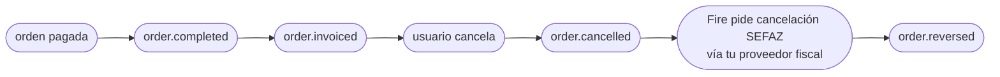

<Warning>
  **Descontinuada (v1).** Contrato anterior, se mantiene solo como referencia histórica. La versión actual es [order-reversed — v2](/es/events/order-reversed).
</Warning>

`order.reversed` dispara cuando SEFAZ confirma la cancelación de un documento fiscal (NFC-e o NF-e) que había sido previamente autorizado. Es la contraparte SEFAZ-confirmada de [`order.cancelled`](/es/events/order-cancelled): la orden se cancela primero dentro de Fire (disparando `order.cancelled`), Fire después pide la cancelación en SEFAZ vía tu proveedor fiscal, y `order.reversed` dispara solo cuando SEFAZ estampa el protocolo de cancelación.

## Condición de disparo

Fire emite `order.reversed` una vez por cancelación fiscal, la primera vez que **todo** lo siguiente es verdadero:

- La orden está en una tienda con facturación fiscal habilitada (`storeFiscalConfig.enabled === true`)
- Un documento fiscal había sido previamente autorizado (es decir, `order.invoiced` se emitió antes)
- Se envió una solicitud de cancelación a tu proveedor fiscal
- tu proveedor fiscal reporta que la autoridad fiscal confirmó la cancelación

| | |
|---|---|
| Cobertura | **Todos los países** — el país viaja en `fiscal.countryCode` |
| Llave de idempotencia | `event.id` |
| Dispara más de una vez | No, salvo en reintentos |
| Latencia relativa a `order.cancelled` | Usualmente segundos; puede ser minutos si la autoridad fiscal está degradada |
| Precondición | Un `order.invoiced` previo para el mismo `orderId` |

## Qué hay en `trigger.data`

Mismo snapshot V4 que [`order.cancelled`](/es/events/order-cancelled) — incluyendo el mismo bloque `cancellation` de auditoría — con un sub-objeto extra **`sefazCancellation`** dentro de `cancellation.metadata.fiscal`. Esa es la única diferencia estructural.

`status` es `"CANCELLED"`. La orden es la misma referenciada por el evento `order.cancelled` previo del mismo `orderId`.

## Ejemplo — payload real de producción (BR, sanitizado)

```json
{
  "event": {
    "id": "...",
    "type": "order.reversed",
    "createdAt": "2026-05-05T23:08:42.123Z"
  },
  "data": {
    "orderId": "e98f5725-0d1e-4f93-ac18-40f1068cae89",
    "orderCode": "OC-br-001",
    "status": "CANCELLED",
    "paymentStatus": "SUCCEEDED",
    "store": { /* igual que order.completed */ },
    "client": { /* ... */ },
    "payments": { /* ... */ },
    "orderLines": [ /* ... */ ],
    "fulfillment": { /* ... */ },
    "device": { /* ... */ },
    "channel": { /* ... */ },
    "operator": { /* ... */ },
    "kds": { /* ... */ },
    "marketing": null,
    "metadata": {},

    "cancellation": {
      "cancellationId": "abcf3781-c327-4df1-84ef-5efbacc1d387",
      "cancelledAt": "2026-05-05T23:06:08.883Z",
      "cancelledBy": "00000000-0000-0000-0000-000000000000",
      "cancellationReason": "Cliente solicitó cancelación",
      "cancellationSource": "backoffice",
      "metadata": {
        "fiscal": {
          "serie": null,
          "numero": "1000013",
          "pdfUrl":   "https://api.fiscal-provider.example/nfce/<docId>/pdf",
          "xmlUrl":   "https://api.fiscal-provider.example/nfce/<docId>/xml",
          "protocolo": "141200000956123",
          "docSubtype": "nfce",
          "chaveAcesso": "41201008187168000160558050010000131609769080",
          "providerDocId": "69fa77aa2a48c20329be4604",
          "dataAutorizacao": "2026-05-05T23:05:15.590Z",

          "sefazCancellation": {
            "date": "2026-05-05T23:08:30.000Z",
            "cStat": "135",
            "protocolo": "141201234567890",
            "xmlUrl": "https://api.fiscal-provider.example/nfce/<docId>/cancelamento/xml",
            "justificativa": "Cancelamento por solicitação do cliente — pedido não retirado"
          }
        }
      }
    }
  },
  "_meta": { "executionId": "...", "flowId": "...", "attempt": "1" }
}
```

## Referencia de `data.cancellation.metadata.fiscal.sefazCancellation`

Este es el único bloque que es único de `order.reversed`. Cada otro campo se comparte con [`order.cancelled`](/es/events/order-cancelled) — consulta esa página para los campos de auditoría de cancelación.

<ResponseField name="sefazCancellation" type="object">
  Confirmación SEFAZ de la cancelación. Presente solo después de que SEFAZ haya estampado el protocolo de cancelación.

  <Expandable title="sefazCancellation">
    <ResponseField name="date" type="string | null">
      Timestamp ISO 8601 UTC de cuando SEFAZ estampó la cancelación. Puede ser `null` para flows sandbox que no propagan el timestamp.
    </ResponseField>
    <ResponseField name="cStat" type="string | null">
      Código de status raw SEFAZ para el evento de cancelación. `135` es el código canónico "cancelación aceptada" para NFC-e/NF-e. Puede ser `null` cuando el proveedor no lo expone.
    </ResponseField>
    <ResponseField name="protocolo" type="string | null">
      Número de protocolo de cancelación SEFAZ — distinto del protocolo de autorización original. Requerido para cualquier referencia de auditoría a la cancelación.
    </ResponseField>
    <ResponseField name="xmlUrl" type="string">
      URL para descargar el XML canónico SEFAZ del evento de cancelación (el XML "cancelamento", separado del XML de autorización).
    </ResponseField>
    <ResponseField name="justificativa" type="string | null">
      Texto de razón enviado a SEFAZ. Debe ser de al menos 15 caracteres por reglas SEFAZ. Puede ser `null` solo para flows sandbox.
    </ResponseField>
  </Expandable>
</ResponseField>

## Lifecycle



Para una orden brasileña fiscal-enabled, espera los cuatro eventos arriba. Para órdenes brasileñas **sin** autorización fiscal (porque la orden se canceló antes de la emisión fiscal, o fiscal estaba deshabilitado), solo dispara `order.cancelled` — no `order.reversed`.

## Handler de ejemplo

```js
async function onFiscalCancelled(data) {
  const { orderId, cancellation } = data;
  const fiscal = cancellation.metadata?.fiscal;
  const sefaz = fiscal?.sefazCancellation;

  if (!sefaz) {
    // Defensivo: el evento implica que sefazCancellation está presente,
    // pero tu handler no debería crashear si tu proveedor fiscal alguna vez
    // envía una forma null.
    return;
  }

  // 1. Actualiza el registro del doc fiscal con la confirmación SEFAZ
  await db.fiscalDocs.update({
    where: { providerDocId: fiscal.providerDocId },
    data: {
      status: "cancelled",
      cancellationProtocolo: sefaz.protocolo,
      cancelledAtSefaz: sefaz.date ? new Date(sefaz.date) : null,
      cancellationXmlUrl: sefaz.xmlUrl,
    },
  });

  // 2. Archiva el XML de cancelación (legalmente requerido en BR)
  if (sefaz.xmlUrl) {
    const xml = await fetch(sefaz.xmlUrl).then(r => r.text());
    await archive.put(`xml-cancel/${fiscal.providerDocId}.xml`, xml);
  }

  // 3. Cierra el ticket de reconciliación abierto por order.cancelled
  await reconciliation.close(orderId);
}
```

## Errores comunes

- **No proceses `order.reversed` sin `order.cancelled` primero.** Disparan en orden en flujo normal, pero entrega fuera de orden es posible. Si recibes `order.reversed` para un `orderId` que no tienes registrado como cancelado, loguéalo y crea el registro desde el bloque `cancellation` de este evento — no botes el evento.
- **`sefazCancellation.date` y `cStat` pueden ser `null` en sandbox.** No hagas que la production-readiness dependa de que estén presentes en entornos dev.
- **El XML URL de cancelación es distinto del XML del documento original.** Asegúrate que tu lógica de archivado guarde ambos — los necesitarás para auditoría.
- **Mismo `cancellation.cancellationId` que `order.cancelled`.** Ambos eventos para la misma cancelación comparten el cancellation ID — útil como llave de join cuando correlacionas los dos eventos en tu sistema.
- **No hay evento para cancelación SEFAZ fallida.** Si SEFAZ rechaza la solicitud de cancelación, no dispara evento. Monitorea el log de ejecuciones del dashboard para esos casos.

## Eventos relacionados

<CardGroup cols={2}>
  <Card title="order.cancelled" icon="ban" href="/es/events/order-cancelled">
    Dispara antes de este evento — la cancelación misma.
  </Card>
  <Card title="order.invoiced" icon="file-invoice" href="/es/events/order-invoiced">
    El evento previo que estableció el documento fiscal que se cancela acá.
  </Card>
</CardGroup>
