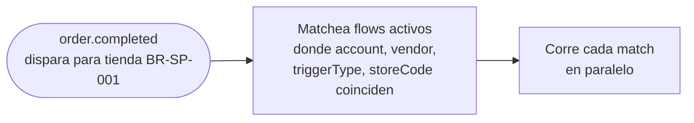
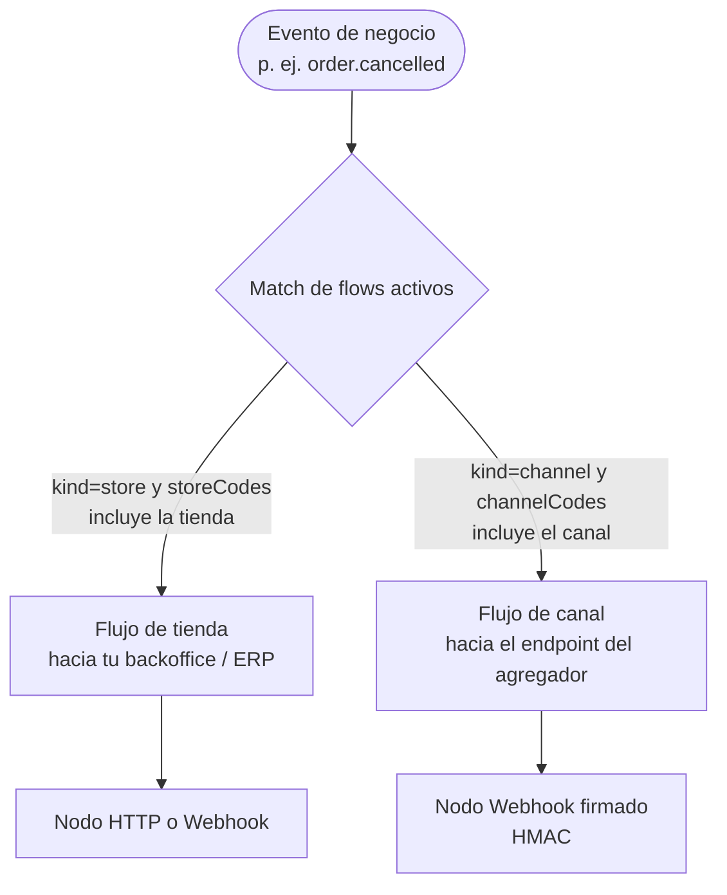
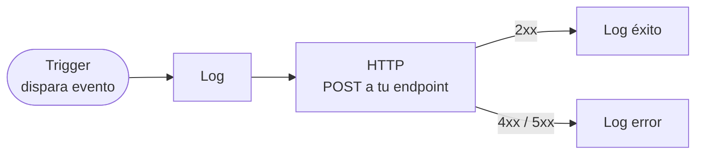

Un **Integration Flow** es el mecanismo de suscripción a eventos de Fire. En vez de una URL global de webhook, configuras uno o más flows en el dashboard, cada uno con scope a un account/vendor/tienda específicos y escuchando un trigger type específico. Cuando dispara un evento que matchea, Fire corre cada flow activo en paralelo.

Esta página cubre reglas de matching, cómo armas un flow, qué controla el nodo HTTP y cómo el body template referencia el trigger data.

## Cómo funciona el matching

Cuando dispara un evento de negocio dentro de Fire, se selecciona cada flow activo cuyos criterios matchean:



Un flow es seleccionado cuando **todo** lo siguiente es verdadero:

| Campo | Regla de match |
|---|---|
| `accountId` | Igual al account dueño de la entidad |
| `vendorId` | Igual al brand/vendor dueño de la tienda |
| `triggerType` | Igual al tipo de evento (`order.completed`, `order.cancelled`, `order.invoiced`, `order.reversed`) |
| `kind` | `'store'` (alcance por `storeCodes`) o `'channel'` (alcance por `channelCodes`) |
| `storeCodes` | Solo `kind='store'`: vacío (matchea todas las tiendas) o contiene el código de tienda del evento |
| `channelCodes` | Solo `kind='channel'`: contiene el código de canal de la orden del evento |
| `isActive` | `true` |

Puedes tener **múltiples flows activos para el mismo trigger** — corren independientes. Úsalo para distribuir eventos a varios servicios downstream sin cambios de código (p. ej. un flow por consumidor: ERP, analítica, cache fiscal, broker de mensajes).

## Alcance: tienda vs canal

Un mismo evento se publica por uno de **dos mecanismos de alcance**, según el `kind` del flow:

- **Flujo de tienda (`kind='store'`)** — matchea por `storeCodes` (vacío = todas las tiendas del vendor). Es el clásico para integraciones de backoffice: ERP, analítica, impresión, fiscal.
- **Flujo de canal (`kind='channel'`)** — matchea por `channelCodes`, el canal de origen de la orden. Sirve para **eco al canal/agregador**: cuando una orden de un canal (un kiosko, un marketplace) cambia de estado, el evento vuelve al endpoint de ese canal.



Ambos usan el mismo motor de flows; solo cambia **cómo se selecciona** el flow (por tienda o por canal) y a quién entrega. Un flujo de canal típicamente usa el **nodo Webhook firmado** (abajo) porque el receptor es un tercero que necesita verificar el origen.

## Armando un flow

Un flow corre como un pequeño pipeline: el trigger lo arranca cuando dispara un evento que matchea, y de ahí cada nodo conectado corre por turno — registrar un paso, llamar tu endpoint por HTTP, ramificar según una condición o reformatear data — hasta que el flow termina.

Armas un flow visualmente en el dashboard: partes de un nodo trigger y conectas los nodos que deben correr después. Cada nodo tiene un tipo y su propia configuración, y los nodos siguientes pueden leer el trigger context.



### Nodo trigger

El punto de partida. Su único config relevante es `triggerType`:

```json
{
  "id": "trigger",
  "type": "trigger",
  "data": { "triggerType": "order.completed" }
}
```

### Nodo HTTP

Este es el nodo que llega a tu endpoint. Su config controla la petición entera:

```json
{
  "id": "send_to_webhook",
  "type": "http",
  "data": {
    "method": "POST",
    "url": "https://your-service.example.com/fire/events",
    "headers": {
      "Content-Type": "application/json",
      "Authorization": "Bearer {{secret.fire_webhook_token}}"
    },
    "body": "{{tu body template}}",
    "auth": { "type": "bearer", "token": "..." },
    "timeout": 30000,
    "retryOnFailure": true,
    "retryCount": 3,
    "statusRoutes": [
      { "id": "ok",  "statusCode": 200, "label": "OK",   "responseMapping": [...] },
      { "id": "err", "statusCode": 5,   "label": "Server error" }
    ]
  }
}
```

Cada campo es opcional excepto `method` y `url`. `body`, `headers` y `auth` se evalúan como templates contra el [trigger context](#trigger-context).

### Nodo Webhook firmado (HMAC)

El nodo **Webhook** es un nodo HTTP que además **firma el body** con HMAC-SHA256. Úsalo cuando el receptor (típicamente un canal/agregador) necesita verificar que el payload viene de Fire y no fue manipulado. Tiene la misma configuración que el nodo HTTP (URL, método, headers, body, status routes, auth de transporte) más un **secreto compartido**.

La firma es **independiente** del auth de transporte (Bearer / API key / OAuth2): la auth identifica el transporte; la firma HMAC garantiza la integridad del body y el anti-replay. Son complementarios.

**Headers que agrega Fire:**

| Header | Valor |
|---|---|
| `X-Fire-Signature` | `v1=` + `hex(HMAC-SHA256(secret, "{timestamp}.{rawBody}"))` |
| `X-Fire-Timestamp` | Timestamp Unix en **segundos** |

**Cómo verificar (de tu lado):**

<Steps>
  <Step title="Lee los headers">Toma `X-Fire-Timestamp` y `X-Fire-Signature`.</Step>
  <Step title="Anti-replay">Rechaza si `abs(now - timestamp)` supera 300 segundos (ventana de 5 minutos).</Step>
  <Step title="Recalcula">Computa `v1=hex(HMAC-SHA256(secret, timestamp + "." + rawBody))` sobre el **body crudo** (no re-serialices el JSON).</Step>
  <Step title="Compara">Usa comparación de **tiempo constante** (`crypto.timingSafeEqual`), nunca `===`.</Step>
</Steps>

```js
import crypto from "crypto";

function verifyFireSignature(rawBody, signatureHeader, timestampHeader, secret, toleranceSec = 300) {
  const ts = parseInt(timestampHeader, 10);
  if (!Number.isFinite(ts)) return false;
  if (Math.abs(Math.floor(Date.now() / 1000) - ts) > toleranceSec) return false; // anti-replay

  const m = /^v1=([a-f0-9]+)$/i.exec(signatureHeader || "");
  if (!m) return false;

  const expected = crypto
    .createHmac("sha256", secret)
    .update(`${ts}.${rawBody}`)
    .digest("hex");

  const a = Buffer.from(m[1], "hex");
  const b = Buffer.from(expected, "hex");
  return a.length === b.length && crypto.timingSafeEqual(a, b);
}
```

<Warning>
  Firma sobre el **body crudo exacto** que recibiste (los mismos bytes). Si parseas y re-serializas el JSON antes de verificar, la firma no va a coincidir.
</Warning>

<Note>
  El secreto se comparte fuera de banda: lo configuras en el nodo del flow y en tu receptor. Ante firma inválida, responde `401`; ante éxito, `200`.
</Note>

### Otros tipos de nodo

Más allá de trigger y HTTP, los flows pueden incluir:

| Tipo | Propósito |
|---|---|
| `condition` | Ramifica con una expresión `{{trigger.data.*}}` — paths distintos para casos distintos |
| `log` | Emite una línea de log para trazabilidad (visible en **Settings → Integration Flows → Executions**) |
| `transform` | Reformatea data con JavaScript antes de pasársela a un nodo siguiente |

Un flow típico de "send to webhook" tiene: trigger → log → HTTP → log (success/error). Consulta el ejemplo **Webhook Test — Full Order Data** del dashboard para un punto de partida ejecutable.

## Trigger context

Cada template de nodo puede referenciar el **trigger context**, disponible cuando el flow corre:

```ts
{
  trigger: {
    event: {
      id: string,         // UUID de ejecución del flow — tu llave de idempotencia
      type: string,       // "order.completed" | "order.cancelled" | "order.invoiced" | "order.reversed"
      createdAt: string,  // ISO 8601 UTC
    },
    data: V4Snapshot,     // payload específico del evento — ver cada página de referencia
  },
  execution: { id: string, /* metadata de ejecución */ },
  flow:      { id: string, name: string },
  queue:     { id, attempt, triggerEntityId, triggerType },
}
```

Referencias cualquier path con la sintaxis mustache `{{}}`: `{{trigger.event.id}}`, `{{trigger.data.orderId}}`, `{{trigger.data.store.code}}`, `{{flow.name}}`, `{{queue.attempt}}`.

La resolución de paths recorre el trigger context como un objeto JavaScript. Indexar arrays funciona (`{{trigger.data.payments.totals[0].total}}`). Para arrays de longitud desconocida, usa `{{trigger.data.orderLines.length}}`.

## Body templates

El campo `body` en el nodo HTTP es lo **único** que determina lo que tu endpoint recibe. Fire sustituye los paths `{{...}}` desde el trigger context y hace POST del resultado.

**No hay envelope Fire fijo** forzado por el sistema. Pero el dashboard incluye un template canónico de ejemplo del que la mayoría de equipos parte:

```json
{
  "event": {
    "id":        "{{trigger.event.id}}",
    "type":      "{{trigger.event.type}}",
    "createdAt": "{{trigger.event.createdAt}}"
  },
  "data": "{{trigger.data}}",
  "_meta": {
    "executionId":     "{{execution.id}}",
    "flowId":          "{{flow.id}}",
    "flowName":        "{{flow.name}}",
    "attempt":         "{{queue.attempt}}",
    "triggerEntityId": "{{queue.triggerEntityId}}"
  }
}
```

Si usas este template, tu endpoint recibe exactamente el body documentado en [Resumen de eventos](/es/events/overview) y en cada página de referencia. Si lo customizas, el body es lo que tu template renderice.

<Note>
  Cuando un path de template resuelve a un objeto o array (p. ej. `"{{trigger.data}}"`), el runtime preserva el tipo JSON en vez de serializar a string. Así que `"data": "{{trigger.data}}"` produce un objeto JSON anidado real en el wire, no un blob string.
</Note>

## Autenticación

Autentica configurando credenciales en el nodo HTTP del flow:

| Tipo de auth | Cuándo usarlo |
|---|---|
| `bearer` | Un Bearer token estático o rotativo que tu endpoint valida. |
| `api_key` | Un API key por header (p. ej. `x-api-key`). |
| `oauth2_client_credentials` | Tu endpoint está detrás de OAuth2; Fire obtiene y cachea access tokens automáticamente, refrescando al expirar. |
| `none` | Sin auth (solo aceptable si tu endpoint está protegido de otra forma, p. ej. mTLS, VPC). |

Consulta [Entrega y reintentos](/es/events/delivery#autenticacion) para el setup.

## Status routes

El nodo HTTP puede distribuir a distintos nodos siguientes según el status de la respuesta:

```json
"statusRoutes": [
  { "id": "ok",  "statusCode": 200, "label": "OK",
    "responseMapping": [ { "responsePath": "status", "outputField": "webhookStatus", "type": "string" } ] },
  { "id": "client", "statusCode": 4, "label": "Client error" },
  { "id": "server", "statusCode": 5, "label": "Server error" }
]
```

`statusCode` matchea por prefijo de dígito: `2` matchea todos los `2xx`, `4` matchea todos los `4xx`, `200` matchea solo `200`. Cada route puede sacar valores del body de respuesta vía `responseMapping` y exponerlos a nodos siguientes.

## Aislamiento por tenant

Cada flow tiene scope a tu account y vendor. Fire nunca corre un flow a través de tenants — cuando configuras un flow, queda vinculado a tu tenant por default, y no puedes suscribirte a eventos de otro account.

## Activación, versionado y dry-run

- Los flows se pueden activar o desactivar — pausa o reanuda la recepción de eventos sin borrar el flow.
- Cada save crea una nueva versión; las versiones pasadas se conservan para auditoría, y solo la última versión activa corre.
- El botón **Probar Flujo** del dashboard corre un flow contra un payload sintético de ejemplo (un escenario por país) sin afectar data real — perfecto para verificar body templates antes de pasar a producción.

## Patrones comunes

- **Un flow por consumidor.** Si tienes tres servicios downstream (ERP, analítica, broker), usa tres flows con el mismo trigger y tres nodos HTTP apuntando a cada uno. Agregar/remover un consumidor se vuelve un cambio de dashboard, no de código.
- **Fan-out condicional.** Usa un nodo `condition` después del trigger para ramificar por `{{trigger.data.store.locationInfo.country.code}}` y enrutar órdenes brasileñas a un endpoint fiscal-aware mientras envías otros países a uno genérico.
- **Routing por tienda.** Setea `storeCodes` en el flow para limitarlo a tiendas específicas, o usa el filtro de tiendas del dashboard para limitar el firing.
- **Mapeo de eventos.** Si tu sistema usa otros nombres de evento, transforma el type en el body template: `"event_name": "fire.{{trigger.event.type}}"`.

## Próximo

<CardGroup cols={2}>
  <Card title="Resumen de eventos" icon="bell" href="/es/events/overview">
    El modelo event-driven completo y el envelope.
  </Card>
  <Card title="Entrega y reintentos" icon="repeat" href="/es/events/delivery">
    Timeouts, reintentos, dead-letter, idempotencia.
  </Card>
  <Card title="Manejar eventos de orden" icon="bolt" href="/es/guides/handle-order-events">
    Walkthrough: construir un handler de webhook en 10 minutos.
  </Card>
  <Card title="order.completed" icon="receipt" href="/es/events/order-completed">
    La referencia completa del snapshot V4 de la orden.
  </Card>
</CardGroup>
