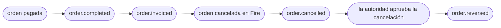

import FiscalEventBlock from '/snippets/fiscal-event-block.es.mdx';

<Tabs>
  <Tab title="v3 · actual">
    Estás viendo el contrato **actual (v3)** de `order.cancelled`. **v3 es un cambio que rompe solo en el contexto fiscal**: `cancellation.metadata.fiscal` pasa a ser **`cancellation.fiscal`**, estructurado como `{ status, authority }`, y ahora aplica a todo país con un documento autorizado, no solo a Brasil. `cancellation.metadata` ya no se emite. El resto del evento no cambia. Ver [Rutas que cambian respecto del contrato anterior](#rutas-que-cambian-respecto-del-contrato-anterior).
  </Tab>
  <Tab title="v2.2 · deprecado">
    <Warning>El contrato **v2.2** está **deprecado** — se mantiene como referencia histórica. Ábrelo acá: [`order.cancelled` — v2.2](/es/events-v2/order-cancelled).</Warning>
  </Tab>
  <Tab title="v1 · deprecado">
    <Warning>El contrato **v1** está **deprecado**. Ábrelo acá: [order-cancelled — v1](/es/events-v1/order-cancelled).</Warning>
  </Tab>
  <Tab title="v0 · deprecado">
    <Warning>El contrato **v0** está **deprecado**. Ábrelo acá: [order-cancelled — v0](/es/events-v0/order-cancelled).</Warning>
  </Tab>
</Tabs>

`order.cancelled` dispara cuando se cancela una orden previamente inyectada — desde el backoffice de Fire (`cancellationSource: backoffice`), o por un adaptador o la API de cancelación (`cancellationSource: adapter`). **No** retrae un `order.completed` previo de la misma orden; ambos eventos se emiten independientes.

<Warning>
  **Este evento no significa que el documento fiscal esté anulado.** Se emite cuando se cancela la **orden**, antes de consultar a la autoridad. Cuando la orden tenía un documento autorizado, `cancellation.fiscal` describe ese documento **tal como estaba en ese momento** — todavía `SALE_INVOICE`, con `cancelledAt: null`. La confirmación de la autoridad llega después en [`order.reversed`](/es/events/order-reversed).
</Warning>

## Condición de disparo

Fire emite `order.cancelled` una vez cuando una orden transiciona a `CANCELLED`, sin importar su estado de pago previo, con contexto completo de auditoría.

| | |
|---|---|
| Cobertura | Global — todos los países, todos los canales |
| Llave de idempotencia | `event.id` |
| Dispara más de una vez | Una vez por cada Integration Flow activo suscrito al evento; se reintenta ante fallas de entrega |
| Orden | No garantizado contra `order.completed` — ordena por timestamps si lo necesitas |
| Contexto fiscal | `cancellation.fiscal` cuando la orden tenía un documento autorizado |

## Qué hay en `trigger.data`

El mismo snapshot V4 de orden que [`order.completed`](/es/events/order-completed), con cuatro diferencias:

1. `status` es **`"CANCELLED"`**.
2. `paymentStatus` queda igual (típicamente `"SUCCEEDED"` si la orden había sido pagada).
3. Un bloque top-level **`cancellation`** lleva la metadata de auditoría y, cuando aplica, el documento fiscal.
4. **No hay `data.fiscal` en la raíz.** En este evento el documento del ente vive solo en `cancellation.fiscal`.

`policy` y `lastKnown` viajan exactamente igual que en `order.completed`. `fiscalRepresentation` tiene la misma forma, pero si para la cancelación se numeró una nota de crédito, trae esa nota arriba y la factura en `history`. En Brasil (PlugNotas) `fiscalRepresentation` es `null`: no hay paso de numeración. `authority.providerIdentity` y `authority.providerMetadata` aparecen en los documentos guardados bajo este contrato; en órdenes anteriores las claves pueden faltar — trata la clave ausente como `null`.

## Ejemplo — Brasil, con un documento autorizado (sanitizado)

```json
{
  "event": { "id": "…", "type": "order.cancelled", "createdAt": "2026-09-15T05:06:45.562Z" },
  "data": {
    "orderId": "15801bd1-83d3-4d70-bb1b-793fd30b7bec",
    "orderCode": "OC-br-001",
    "status": "CANCELLED",
    "paymentStatus": "SUCCEEDED",
    "store": { /* igual que order.completed */ },
    "orderLines": [ /* igual que order.completed */ ],
    "policy": { "deferredPayment": { "eligible": false, "resolvedAt": "2026-09-15T05:00:45.760Z", "configVersion": "fnv1a:a0c02d27", "resolvedFrom": { "channelCode": "KIOSK", "fulfillmentCode": "DINE-IN", "paymentMethod": null } } },
    "lastKnown": { "kds": { "status": "preparing", "sourceEvent": "order.status_updated" }, "fiscal": { "status": "authorized", "sourceEvent": "order.invoiced" } },
    "fiscalRepresentation": null,

    "cancellation": {
      "cancellationId": "6fcb0a30-cfde-4ffe-96ef-545dde3fa87c",
      "cancelledAt": "2026-09-15T05:06:44.359Z",
      "cancelledBy": "4fadc5f3-d9da-4756-978d-5a8cffc25d40",
      "cancellationType": "OTHER",
      "cancellationGroup": "Other",
      "cancellationReason": "Customer requested cancellation",
      "cancellationNote": null,
      "cancellationSource": "backoffice",

      "fiscal": {
        "status": "authorized",
        "authority": {
          "documentType": "SALE_INVOICE",
          "docSubtype": "nfce",
          "documentNumber": "12388",
          "issuedAt": "2026-09-15T05:00:48.003Z",
          "authorizedAt": "2026-09-15T03:00:00.000Z",
          "cancelledAt": null,
          "authorizationMode": "ONLINE",
          "providerDocId": "6aa8d10117b687522d90ae0a",
          "pdfUrl": "https://api.fiscal-provider.example/nfce/6aa8d10117b687522d90ae0a/pdf",
          "xmlUrl": "https://api.fiscal-provider.example/nfce/6aa8d10117b687522d90ae0a/xml",
          "amounts": { "total": 11.9, "tax": 1.65, "currencyCode": "BRL" },
          "countryData": {
            "chaveAcesso": "41201008187168000160558050010000131609769080",
            "numero": "12388",
            "serie": "2",
            "modelo": 65,
            "protocolo": "135266298552102",
            "cStat": "135"
          },
          "graphic": { "qr": "41201008187168000160558050010000131609769080" },
          "providerIdentity": null,
          "providerMetadata": null
        }
      }
    }
  },
  "_meta": { "executionId": "…", "flowId": "…", "attempt": "1" }
}
```

## Ejemplo — sin un documento autorizado

Cuando la orden no tenía un documento autorizado (el ente todavía no había respondido, la tienda no emite documentos, o el documento no tiene id de proveedor), **la clave `fiscal` está ausente** — no en `null`. Acá, una tienda que no numera en la caja, cancelada antes de que el ente respondiera: `fiscalRepresentation` es `null`, `lastKnown.fiscal` todavía dice `processing` y `cancellation` no tiene `fiscal`. No sigue ningún `order.reversed`.

En los países que numeran en la caja, una orden no se puede cancelar mientras su factura siga vigente: Fire responde `409` (`FISCAL_REPRESENTATION_NOT_VOIDED`) hasta que se pida la nota de crédito. Una vez pedida, el evento trae `fiscalRepresentation` con la `CREDIT_NOTE` arriba y la factura en `history`.

```json
{
  "event": { "id": "…", "type": "order.cancelled", "createdAt": "2026-09-15T14:12:03.114Z" },
  "data": {
    "orderId": "…",
    "orderCode": "OC-cl-001",
    "status": "CANCELLED",
    "paymentStatus": "SUCCEEDED",
    "store": { /* igual que order.completed */ },
    "orderLines": [ /* igual que order.completed */ ],
    "policy": { /* igual que order.completed */ },
    "lastKnown": { "kds": null, "fiscal": { "status": "processing", "sourceEvent": "order.injected" } },
    "fiscalRepresentation": null,

    "cancellation": {
      "cancellationId": "abcf3781-c327-4df1-84ef-5efbacc1d387",
      "cancelledAt": "2026-09-15T14:12:02.870Z",
      "cancelledBy": "4fadc5f3-d9da-4756-978d-5a8cffc25d40",
      "cancellationType": "CUSTOMER_CALLED_TO_CANCEL",
      "cancellationGroup": "Cliente",
      "cancellationReason": "Cliente pidió cancelar",
      "cancellationNote": null,
      "cancellationSource": "backoffice"
    }
  },
  "_meta": { "executionId": "…", "flowId": "…", "attempt": "1" }
}
```

Compruébalo con `if (data.cancellation.fiscal)`.

<Note>Los bloques elididos como *igual que `order.completed`* son exactamente el snapshot que lleva `order.completed`. Ver la [referencia de campos de `order.completed`](/es/events/order-completed#referencia-de-campos).</Note>

## Referencia de `data.cancellation`

<ResponseField name="cancellation" type="object">
  Bloque de auditoría que describe cómo, cuándo y por quién se canceló la orden.

  <Expandable title="cancellation">
    <ResponseField name="cancellationId" type="string">
      UUID de esta cancelación. Estable a través de reintentos, y compartido con el `order.reversed` de la misma cancelación.
    </ResponseField>
    <ResponseField name="cancelledAt" type="string">
      Timestamp ISO 8601 UTC de la cancelación de la orden en Fire. No es el `authority.cancelledAt` de la autoridad.
    </ResponseField>
    <ResponseField name="cancelledBy" type="string">
      Quién canceló la orden: el UUID del usuario cuando `cancellationSource` es `backoffice`; `api-key:<keyId>` cuando es `adapter`. Nunca `null`.
    </ResponseField>
    <ResponseField name="cancellationType" type="string | null">
      Código estable del motivo: catálogo interno (`ITEM_OUT_OF_STOCK`, `OTHER`) o código de agregador (`1010`). **Siempre presente** — `null` si no se fijó un motivo estructurado.
    </ResponseField>
    <ResponseField name="cancellationGroup" type="string | null">
      Categoría del motivo, interna o de agregador (`SAG (IFOOD)`). **Siempre presente** — `null` si no se fijó.
    </ResponseField>
    <ResponseField name="cancellationReason" type="string">
      Razón en texto libre capturada al cancelar.
    </ResponseField>
    <ResponseField name="cancellationNote" type="string | null">
      Nota opcional en texto libre. **Siempre presente** — `null` si no hay.
    </ResponseField>
    <ResponseField name="cancellationSource" type="string">
      Dónde se originó la cancelación: `backoffice` o `adapter`.
    </ResponseField>
    <ResponseField name="fiscal" type="object">
      **Presente solo cuando la orden tenía un documento autorizado** con id de proveedor. Lleva `status` (`authorized`, o `cancelling` si ya había una anulación en curso) y `authority` — ver [El bloque fiscal](#el-bloque-fiscal). En este evento **no** lleva `history`, `compensates`, `countryCode`, `providerCode` ni `occurredAt`; esos llegan con `order.reversed`.
    </ResponseField>
  </Expandable>
</ResponseField>

<FiscalEventBlock />

## Lifecycle relativo a otros eventos



- `order.cancelled` se emite **inmediatamente**, antes de contactar a la autoridad.
- `order.reversed` sigue una vez que la autoridad confirma — segundos o minutos después.
- Sin un documento autorizado, solo dispara `order.cancelled`.

## Handler de ejemplo

```js
async function onOrderCancelled(data) {
  const { orderId, cancellation } = data;

  await db.orders.update({
    where: { fireOrderId: orderId },
    data: {
      status: "CANCELLED",
      cancelledAt: new Date(cancellation.cancelledAt),
      cancellationType: cancellation.cancellationType,
    },
  });

  // Existía un documento autorizado: la anulación fiscal sigue pendiente.
  if (cancellation.fiscal) {
    await reconciliation.open({
      orderId,
      document: cancellation.fiscal.authority,
      pendingAuthorityCancel: true, // lo cierra order.reversed
    });
  }

  await downstream.rollback(orderId);
}
```

## Errores comunes

- **Lee `cancellation.fiscal`, no `cancellation.metadata.fiscal`.** La ruta anterior viene vacía en v3.
- **`cancellation.fiscal` es el documento antes de la anulación.** Para la confirmación de la autoridad, escucha [`order.reversed`](/es/events/order-reversed).
- **Ausente, no `null`.** Verifica la presencia de la clave; no compares contra `null`.
- **`order.cancelled` no es un refund.** El refund, si lo hay, lo inicia el canal o el procesador.
- **No asumas que `order.completed` llegó primero.** Tolera un `order.cancelled` de una orden que aún no conoces.

## Eventos relacionados

<CardGroup cols={2}>
  <Card title="order.completed" icon="receipt" href="/es/events/order-completed">
    El evento que verás para la misma orden antes de la cancelación.
  </Card>
  <Card title="order.reversed" icon="file-circle-xmark" href="/es/events/order-reversed">
    Dispara cuando la autoridad confirma la cancelación del documento.
  </Card>
</CardGroup>

## `data.fiscalRepresentation`

Sin cambios en v3. Es la numeración fiscal impresa en la caja, un bloque distinto de `cancellation.fiscal`: nunca dice que el documento esté autorizado. Cuando una cancelación numera una nota de crédito, esa nota queda arriba y la factura baja a `fiscalRepresentation.history`. Es el mismo bloque que en `order.completed` — referencia de campos en [`order.completed` → `data.fiscalRepresentation`](/es/events/order-completed#data-fiscalrepresentation).

## `data.policy` y `data.lastKnown`

Sin cambios en v3 e iguales en todos los eventos de orden. `lastKnown.fiscal.status` es el estado fiscal actual de la orden y es orientativo — nunca condiciones una acción irreversible a él. Referencia en [`order.completed` → `data.policy` y `data.lastKnown`](/es/events/order-completed#data-policy-y-data-lastknown).
