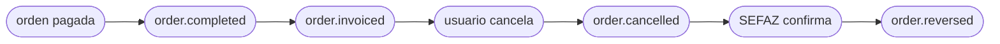

<Tabs>
  <Tab title="v2.2 · actual">
    Estás viendo el contrato **actual (v2.2)** de `order.cancelled`. **v2.2 agrega** `data.fiscalRepresentation`: la numeración fiscal que el punto de venta obtuvo antes de inyectar la orden. Viaja **siempre**: en `null` cuando no se intentó numerar, y con contenido cuando sí —`numberingStatus` dice cómo terminó—. Que traiga contenido **no** significa que el comprobante esté autorizado. Solo aditivo — nada de lo que ya leías cambió.

    El bloque lleva el documento fiscal **vigente** de la orden: los campos que significan lo mismo en todo país arriba, los identificadores del ente dentro de `countryData` con el vocabulario de su país, y los documentos anteriores en `history`. Cuando una anulación numera, la nota de crédito pasa arriba y la factura baja al histórico — con `compensates` apuntando a ella.
  </Tab>
  <Tab title="v2.1 · anterior">
    El contrato **v2.1** sigue siendo válido: v2.2 solo suma un bloque, no cambia nada de lo anterior.
  </Tab>
  <Tab title="v2 · deprecado">
    <Warning>El contrato **v2** está **deprecado** — se mantiene como referencia histórica. Abrilo acá: [`order.cancelled` — v2](/es/events-v2/order-cancelled).</Warning>
  </Tab>
  <Tab title="v1 · descontinuada">
    <Warning>El contrato **v1** está **descontinuado**. Abrilo acá: [order-cancelled — v1](/es/events-v1/order-cancelled).</Warning>
  </Tab>
  <Tab title="v0 · descontinuada">
    <Warning>El contrato **v0** está **descontinuado**. Abrilo acá: [order-cancelled — v0](/es/events-v0/order-cancelled).</Warning>
  </Tab>
</Tabs>

`order.cancelled` dispara cuando se cancela una orden previamente inyectada — desde la UI del backoffice de Fire, un adaptador externo o una llamada a la API de cancelación. **No** retrae un `order.completed` previo de la misma orden; ambos eventos se emiten independientes.

## Condición de disparo

Fire emite `order.cancelled` una vez cuando el status de una orden transiciona a `CANCELLED`, sin importar el estado de pago previo. La cancelación se registra con contexto completo de auditoría (quién, cuándo, por qué, fuente).

| | |
|---|---|
| Cobertura | Global (todos los países, todos los canales) |
| Llave de idempotencia | `event.id` |
| Dispara más de una vez | No, salvo en reintentos |
| Orden | No garantizado contra `order.completed` para la misma orden — ordena por timestamps si necesitas |
| Reintentos | Hasta 5 intentos con backoff exponencial (cuando `retryOnFailure` está habilitado) |
| Contexto fiscal brasileño | Incluye datos fiscales originales en `cancellation.metadata.fiscal` si la orden había sido autorizada fiscalmente |

## Qué hay en `trigger.data`

Mismo snapshot V4 que [`order.completed`](/es/events/order-completed) — todos los campos documentados ahí están presentes acá, con tres diferencias:

1. `status` es **`"CANCELLED"`** (no `"COMPLETED"`).
2. `paymentStatus` queda igual a cuando la orden se completó (típicamente `"SUCCEEDED"` si la orden había sido pagada antes de cancelar).
3. Un bloque top-level nuevo **`cancellation`** lleva la metadata de auditoría.

## Ejemplo — payload real de producción (BR, sanitizado)

```json
{
  "event": {
    "id": "abcf3781-c327-4df1-84ef-5efbacc1d387",
    "type": "order.cancelled",
    "createdAt": "2026-05-05T23:06:08.883Z"
  },
  "data": {
    "orderId": "e98f5725-0d1e-4f93-ac18-40f1068cae89",
    "orderCode": "OC-br-001",
    "businessDayDate": "2026-03-31",
    "externalOrderId": "ac331b68-66fb-48ee-b110-a40181bfb379",
    "status": "CANCELLED",
    "paymentStatus": "SUCCEEDED",
    "redeemPoints": false,
    "accumulatePoints": false,
    "discount": false,
    "createdAt": "2026-05-05T23:05:00.438Z",
    "orderComment": "Comentario de prueba orden",
    "marketing": null,  /* igual que order.completed — lleva coupons[] cuando la orden tuvo alguno */
    "store": { /* igual que order.completed — ver /es/events/order-completed */ },
    "device": { /* ... */ },
    "channel": { /* ... */ },
    "operator": { /* ... */ },
    "client": { /* ... */ },
    "payments": { /* ... */ },
    "kds": { /* ... */ },
    "metadata": {},
    "orderLines": [ /* igual que order.completed — incluye rewardId por línea y por modificador seleccionado */ ],
    "fulfillment": { /* ... */ },

    "cancellation": {
      "cancellationId": "abcf3781-c327-4df1-84ef-5efbacc1d387",
      "cancelledAt": "2026-05-05T23:06:08.883Z",
      "cancelledBy": "00000000-0000-0000-0000-000000000000",
      "cancellationReason": "Cliente solicitó cancelación",
      "cancellationType": "CUSTOMER_REQUESTED",
      "cancellationGroup": "Cliente",
      "cancellationNote": "cliente pidió cancelar",
      "cancellationSource": "backoffice",
      "metadata": {
        "fiscal": {
          "numero": "1000013",
          "pdfUrl":   "https://api.fiscal-provider.example/nfce/<docId>/pdf",
          "xmlUrl":   "https://api.fiscal-provider.example/nfce/<docId>/xml",
          "protocolo": "141200000956123",
          "docSubtype": "nfce",
          "chaveAcesso": "41201008187168000160558050010000131609769080",
          "providerDocId": "69fa77aa2a48c20329be4604",
          "dataAutorizacao": "2026-05-05T23:05:15.590Z"
        }
      }
    }
  },
  "_meta": { "executionId": "...", "flowId": "...", "attempt": "1" }
}
```

<Note>Todo bloque de arriba que aparezca elidido o marcado como *igual que `order.completed`* —`orderLines`, `marketing`, `payments`, `client`, `store`, `fulfillment`, `kds`, `device`, `channel`, `operator`— es exactamente el snapshot que lleva `order.completed`, porque todos los eventos de orden se arman del mismo snapshot v4. Eso incluye **`orderLines[].rewardId`** y **`marketing.coupons[]`**. Ver la [referencia de campos de `order.completed`](/es/events/order-completed#field-reference).</Note>


## Referencia de `data.cancellation`

<ResponseField name="cancellation" type="object">
  Bloque de auditoría que describe cómo, cuándo y por quién se canceló la orden.

  <Expandable title="cancellation">
    <ResponseField name="cancellationId" type="string">
      UUID para este evento de cancelación. Estable a través de reintentos.
    </ResponseField>
    <ResponseField name="cancelledAt" type="string">
      Timestamp ISO 8601 UTC de la cancelación.
    </ResponseField>
    <ResponseField name="cancelledBy" type="string | null">
      UUID del operador/usuario que canceló la orden. `null` para cancelaciones iniciadas por el sistema (p. ej. un flow automatizado).
    </ResponseField>
    <ResponseField name="cancellationReason" type="string | null">
      Razón free-text capturada en el momento de cancelación. Puede ser empty o `null`.
    </ResponseField>
    <ResponseField name="cancellationSource" type="string">
      Dónde originó la cancelación. Valores incluyen `backoffice`, `adapter`, `api`. Úsalo para ramificar la lógica del handler.
    </ResponseField>
    <ResponseField name="cancellationType" type="string | null">
      Código estable del motivo. Catálogo interno (ej. `ITEM_OUT_OF_STOCK`) o código numérico de agregador/SAG (ej. `1010`). **Siempre presente** — `null` si no se fijó un motivo estructurado.
    </ResponseField>
    <ResponseField name="cancellationGroup" type="string | null">
      Categoría del motivo. Interno (ej. `Inventario`, `Cliente`) o agregador (ej. `SAG (KEETA)`, `SAG (IFOOD)`). **Siempre presente** — `null` si no se fijó un motivo estructurado.
    </ResponseField>
    <ResponseField name="cancellationNote" type="string | null">
      Nota de texto libre opcional ingresada al cancelar. **Siempre presente** — `null` si no se ingresó nota.
    </ResponseField>
    <ResponseField name="metadata" type="object">
      Contexto extra. Hoy solo incluye `fiscal` (cuando aplica).

      <Expandable title="metadata">
        <ResponseField name="fiscal" type="object | null">
          **Solo Brasil — presente cuando la orden había sido fiscalmente autorizada antes de cancelar.** Contiene el contexto del documento fiscal original para que tu sistema downstream pueda reconciliar contra el documento previamente emitido.

          Campos: `serie`, `numero`, `pdfUrl`, `xmlUrl`, `protocolo`, `docSubtype` (p. ej. `nfce`, `nfe`), `chaveAcesso` (chave de acceso SEFAZ de 44 dígitos), `providerDocId` (ID interno de tu proveedor fiscal), `dataAutorizacao` (ISO 8601 UTC de la autorización original).

          <Note>
            Esta es la data fiscal **original** en el momento de cancelación, **no** el resultado de cancelación SEFAZ. El resultado SEFAZ llega en un evento separado [`order.reversed`](/es/events/order-reversed) con `cancellation.metadata.fiscal.sefazCancellation` populado.
          </Note>
        </ResponseField>
      </Expandable>
    </ResponseField>
  </Expandable>
</ResponseField>

## Lifecycle relativo a otros eventos

Para una orden brasileña fiscal-enabled que se cancela, espera esta secuencia:



- `order.cancelled` se emite **inmediatamente** cuando ocurre la cancelación, antes de contactar cualquier autoridad fiscal externa.
- `order.reversed` se emite **después** — una vez que SEFAZ confirma vía tu proveedor fiscal. Puede llegar segundos o minutos después de `order.cancelled`, según el tiempo de respuesta de SEFAZ.
- Para órdenes no brasileñas o tiendas sin emisión fiscal, solo dispara `order.cancelled`.

## Variaciones por país

`order.cancelled` es **global** — dispara para todos los países y todos los canales cuando una orden se cancela (Argentina, Brasil, Chile, Colombia, Ecuador, Venezuela y cualquier otro país con Integration Flows activos). El bloque de auditoría de cancelación (`cancellation.{cancellationId, cancelledAt, cancelledBy, cancellationReason, cancellationSource}`) es idéntico para todos los países.

El único campo específico por país es `cancellation.metadata.fiscal`, que se popula **solo para tiendas brasileñas que tenían un documento fiscal previamente autorizado** (es decir, se emitió un `order.invoiced` para esta orden antes). Para todos los demás países — y para órdenes BR canceladas antes de la autorización fiscal — `cancellation.metadata.fiscal` es `null` y no seguirá ningún evento [`order.reversed`](/es/events/order-reversed).

Para tiendas no-BR (Argentina, Chile, Colombia, Ecuador, Venezuela, otros), el bloque cancellation se ve así:

```json Cancelación no-BR
{
  "cancellation": {
    "cancellationId": "abcf3781-c327-4df1-84ef-5efbacc1d387",
    "cancelledAt": "2026-05-05T23:06:08.883Z",
    "cancelledBy": "00000000-0000-0000-0000-000000000000",
    "cancellationReason": "Cliente solicitó cancelación",
    "cancellationType": "CUSTOMER_REQUESTED",
    "cancellationGroup": "Cliente",
    "cancellationNote": "cliente pidió cancelar",
    "cancellationSource": "backoffice",
    "metadata": { "fiscal": null }
  }
}
```

Los identificadores a nivel tienda en `data.store` sí varían por país — consulta [`order.completed` → Variaciones por país](/es/events/order-completed#variaciones-por-pais) para `country.code`, `currencyCode` y `storeFiscalConfig.govIdType` (`CNPJ` / `CUIT` / `RUT` / `NIT` / `RUC` / `RIF`) por país.

## Handler de ejemplo

```js
async function onOrderCancelled(data) {
  const { orderId, store, cancellation } = data;

  // 1. Marca la orden cancelada en tu sistema (idempotente)
  await db.orders.update({
    where: { fireOrderId: orderId },
    data: {
      status: "CANCELLED",
      cancelledAt: new Date(cancellation.cancelledAt),
      cancellationReason: cancellation.cancellationReason,
      cancellationSource: cancellation.cancellationSource,
    },
  });

  // 2. Si la tienda tiene fiscal habilitado y había un doc fiscal,
  //    abre un ticket de reconciliación — la cancelación SEFAZ
  //    seguirá en order.reversed.
  if (cancellation.metadata?.fiscal) {
    await reconciliation.open({
      orderId,
      country: store.locationInfo.country.code,
      originalDoc: cancellation.metadata.fiscal,
      pendingSefazCancel: true,
    });
  }

  // 3. Revierte side-effects downstream (libera stock, refund, etc.)
  await downstream.rollback(orderId);
}
```

## `data.policy` y `data.lastKnown`

Todos los eventos de orden llevan estos dos bloques, no solo este. Se agregaron
junto con el ciclo de pago diferido y son **agregados en v2.1**, aditivos: los consumidores
existentes siguen funcionando sin cambios.

| Bloque | Qué es | ¿Confiar? |
|---|---|---|
| `policy.deferredPayment` | Si la orden puede trabajarse **antes** del pago. Se resuelve una vez al inyectar y se estampa inmutable — todos los eventos posteriores repiten el mismo valor. | Sí. Es una decisión, no un estado. |
| `lastKnown` | Foto orientativa del estado de cocina (`kds`) y fiscal al emitir el evento. Puede venir `null` o viejo. | **No.** Nunca condiciones una acción irreversible a esto. |

```json
"policy": { "deferredPayment": { "eligible": true, "resolvedAt": "2026-08-02T15:55:42.407Z",
    "configVersion": "fnv1a:3144c6fb",
    "resolvedFrom": { "channelCode": "APP", "fulfillmentCode": "DELIVERY", "paymentMethod": "CASH" } } },
"lastKnown": { "kds": null, "fiscal": { "status": "processing", "sourceEvent": "fiscal.callback" } }
```

El detalle campo por campo está en [`order.opened`](/es/events/order-opened#política-de-pago-diferido),
el evento donde estos bloques más importan.

## Errores comunes

- **`status === "CANCELLED"`, no `paymentStatus`.** Las órdenes pagadas canceladas mantienen `paymentStatus === "SUCCEEDED"`; la cancelación vive en el campo `status` más el bloque `cancellation`.
- **`order.cancelled` ≠ refund.** Fire reporta la cancelación; el refund (si lo hay) lo inicia el canal/procesador y no está en este payload.
- **No asumas que `order.completed` llegó primero.** Es posible la entrega fuera de orden — tu handler debería tolerar recibir `order.cancelled` para un `orderId` que aún no conoce (p. ej. log + crea un placeholder; reconcilia cuando llegue `order.completed`).
- **`cancellation.metadata.fiscal` es el doc original, no el resultado de cancelación.** Para la confirmación SEFAZ, escucha [`order.reversed`](/es/events/order-reversed).

## Eventos relacionados

<CardGroup cols={2}>
  <Card title="order.completed" icon="receipt" href="/es/events/order-completed">
    El evento que verás para la misma orden antes de la cancelación.
  </Card>
  <Card title="order.reversed" icon="file-circle-xmark" href="/es/events/order-reversed">
    Solo Brasil — dispara cuando SEFAZ confirma la cancelación.
  </Card>
</CardGroup>

## `data.fiscalRepresentation`

La **numeración fiscal** que el punto de venta obtuvo *antes* de inyectar la orden:
cobra, pide los identificadores, imprime el comprobante y recién después inyecta.
Por eso viaja en la orden y no en un evento fiscal aparte — cuando la orden nace,
esto ya ocurrió.

<Warning>
  **Que este bloque exista NO significa que el comprobante esté autorizado.** Son
  los números que se imprimieron en la caja; el veredicto del ente lo da
  `lastKnown.fiscal.status`. Un ticket que diga "autorizado" solo porque el bloque
  está presente declara algo que puede no haber pasado.
</Warning>

**La clave viaja siempre.** Llega en `null` cuando no se intentó numerar
—agregadores, países sin representación fiscal, o comercios con la numeración
desactivada— y con el bloque cuando sí se intentó.

Que traiga bloque significa **que se intentó numerar, no que se numeró**:
`numberingStatus` dice cómo terminó el intento, y `failure` por qué cuando no
terminó bien.

Ramificá por valor, no por presencia de la clave:

```js
if (data.fiscalRepresentation) {
  // se intentó numerar — mirá numberingStatus para saber cómo salió
}
```

| Campo | Qué es |
|---|---|
| `numberingStatus` | Cómo terminó el **acto de numerar**: `GENERATED`, `PENDING`, `FAILED_RETRYABLE`, `FAILED_FINAL`, `UNAVAILABLE`. **No es el veredicto del ente** — ese está en `lastKnown.fiscal.status`. |
| `documentNumber` | Número visible del comprobante, compuesto según el país (`005-004-000000042`). Es presentación y **lo arma Fire**, no el ente: para conciliar usá `countryData`. |
| `issuedAt` | Cuándo se **numeró**. No es la fecha de autorización. |
| `authorizationMode` | `ONLINE`, `OFFLINE` o `BATCH`. Concepto del proveedor, no universal. |
| `providerCode` | Identificador del adaptador que numeró. |
| `countryData` | Los identificadores del ente, con el vocabulario del **país que numeró** y solo los de ese país. Ecuador: `numeroComprobante` (el número visible del comprobante, ya armado por el proveedor), `claveAcceso`, `establecimiento`, `puntoEmision`, `secuencial`, `ambiente`. Venezuela: `numeroControl`, `numeroFactura`, `serie`. **Recorrelo; no lo indexes a ciegas** — que aparezca una clave nueva no es un cambio que rompa. Es el mismo bloque que devuelve el endpoint de numeración y que trae el callback del ente. La referencia por país, con las claves de cada régimen, está en [`countryData` por país](/es/api-reference/fiscal-documents#countrydata-por-país). |
| `graphic` | El artefacto imprimible que entregó el proveedor (QR y demás), tal cual vino. `null` si no entregó ninguno. |
| `failure` | Por qué **no** hay comprobante. `null` cuando la numeración salió bien. |
| `providerIdentity` | **Quién numeró, del lado del proveedor**: `{ "name": "hio.fiscalization", "version": "2026.08.1", "reference": "HIO-91f3c2" }`. A diferencia de la bolsa de abajo, **tiene forma**: los tres campos están en el contrato y siempre vienen, con `null` cuando no aplica. `reference` es **la referencia de soporte del proveedor** — el identificador que se le cita a él para que encuentre la operación en sus registros; no es la `Idempotency-Key` que mandó el canal. No lleva `providerCode`: ese es nuestro y viaja arriba. |
| `providerMetadata` | **La bolsa de diagnóstico del proveedor**, tal como la devolvió: en Ecuador con HIO llega `{ "deviceUid": "4B8E…", "externalStoreCode": "K000" }`. Es **opaca** — las claves las pone el proveedor y pueden cambiar sin aviso, así que no programes contra ellas; sirve para pegar en un ticket, no para ramificar. **Es exactamente el mismo campo que devuelve el endpoint de numeración**, con el mismo nombre y el mismo contenido: los tres campos del proveedor se leen igual en los dos extremos. |
| `environment` | En qué ambiente numeró **Fire**: `SANDBOX` o `PRODUCTION`. Es nuestro, no del ente — el del ente viaja dentro de `countryData` con el código del país. |
| `compensates` | A qué documento anula este. Presente **solo** cuando `documentType` es `CREDIT_NOTE`. Es un **puntero**, no una copia: buscá su `documentNumber` en `history` si querés el documento entero. `reason` es el código canónico — el texto impreso lo redacta cada empresa y se resuelve en la respuesta del endpoint de numeración. |
| `history` | Los documentos **anteriores** de la orden, del más viejo al más nuevo. Vacío mientras hubo uno solo; cuando una anulación numera, la factura baja acá y la nota queda arriba. Cada entrada tiene **la misma forma** que el bloque de arriba, así que se leen igual. Solo documentos: un intento que falló no entra. |

```json
"fiscalRepresentation": {
  "numberingStatus": "GENERATED",
  "documentType": "CREDIT_NOTE",
  "documentNumber": "005-004-000000004",
  "countryData": {
    "numeroComprobante": "005-004-000000004",
    "claveAcceso": "1208202604000000000000110050040000000041234567816",
    "establecimiento": "005",
    "puntoEmision": "004",
    "secuencial": "000000004",
    "ambiente": "2"
  },
  "authorizationMode": "ONLINE",
  "issuedAt": "2026-08-13T09:02:11.318Z",
  "providerCode": "hio",
  "graphic": { "qr": "1208202604000000000000110050040000000041234567816" },
  "failure": null,
  "providerIdentity": { "name": "hio.fiscalization", "version": "2026.08.1", "reference": "HIO-91f3c2" },
  "providerMetadata": { "deviceUid": "4B8E21F9A0D35C7A", "externalStoreCode": "K004" },
  "environment": "PRODUCTION",
  "compensates": {
    "documentNumber": "005-004-000000042",
    "issuedAt": "2026-08-13T08:11:29.744Z",
    "reason": "ORDER_CANCELLATION"
  },
  "history": [
    {
      "numberingStatus": "GENERATED",
      "documentType": "SALE_INVOICE",
      "documentNumber": "005-004-000000042",
      "countryData": {
        "numeroComprobante": "005-004-000000042",
        "claveAcceso": "1208202601000000000000110050040000000421234567810",
        "establecimiento": "005",
        "puntoEmision": "004",
        "secuencial": "000000042",
        "ambiente": "2"
      },
      "authorizationMode": "ONLINE",
      "issuedAt": "2026-08-13T08:11:29.744Z",
      "providerCode": "hio",
      "graphic": { "qr": "1208202601000000000000110050040000000421234567810" },
      "failure": null,
      "providerIdentity": { "name": "hio.fiscalization", "version": "2026.08.1", "reference": "HIO-91f3c2" },
      "providerMetadata": { "deviceUid": "4B8E21F9A0D35C7A", "externalStoreCode": "K004" },
      "environment": "PRODUCTION",
      "compensates": null
    }
  ]
}
```

**El veredicto del ente no lo altera.** Lo que el cliente se llevó impreso no
cambia porque el organismo después autorice o rechace; para eso está
`lastKnown.fiscal`, que es lo que sí se mueve.

**Lo que sí lo reemplaza es un documento nuevo.** El bloque lleva el documento
fiscal **vigente** de la orden. Mientras solo hubo uno, era siempre la factura;
cuando una anulación produce una nota de crédito, arriba queda la nota —
`documentType` dice cuál es— y la factura **baja a `history`**, entera y con sus
propios identificadores del ente. No se pierde: se mueve. `compensates` apunta a
ella por su número, así que la relación entre los dos queda explícita.

### Cuando la numeración falla

Una venta puede cobrarse y quedarse **sin comprobante fiscal**. Ese caso también
viaja, y hay que contemplarlo: los identificadores vienen en `null` y el motivo
en `failure`.

```json
"fiscalRepresentation": {
  "numberingStatus": "FAILED_FINAL",
  "documentNumber": null,
  "issuedAt": null,
  "providerCode": "hio",
  "graphic": null,
  "failure": { "code": "RUC_INVALIDO", "scope": "FUNCTIONAL", "message": "RUC no habilitado" }
}
```

Ramificá por `failure.scope`:

- **`TECHNICAL`** — imprimí "en trámite" y seguí. Puede resolverse solo.
- **`FUNCTIONAL`** — hay un dato mal y reintentar no lo arregla. Requiere corrección.

<Note>
  **`lastKnown.fiscal.sourceEvent` ahora informa la procedencia real.** Antes se
  deducía del estado, y un `processing` sembrado al inyectar se reportaba como
  `fiscal.callback` sin que ningún callback hubiera ocurrido. Ahora ese caso dice
  `order.injected`. Si ramificás por este campo, contemplá el valor nuevo.
</Note>
