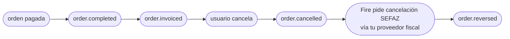

<Tabs>
  <Tab title="v2 · actual">
    Estás viendo el contrato **actual (v2)**. Agrega el motivo estructurado al bloque `cancellation` — `cancellationType` (código estable), `cancellationGroup` (categoría) y `cancellationNote` (texto libre), **siempre presentes** (`null` si vacío) — sobre el snapshot v1.
  </Tab>
  <Tab title="v1 · descontinuada">
    <Warning>El contrato **v1** está **descontinuado**. Abrilo acá: [order-reversed — v1](/es/events-v1/order-reversed).</Warning>
  </Tab>
  <Tab title="v0 · descontinuada">
    <Warning>El contrato **v0** está **descontinuado**. Abrilo acá: [order-reversed — v0](/es/events-v0/order-reversed).</Warning>
  </Tab>
</Tabs>

`order.reversed` dispara cuando SEFAZ confirma la cancelación de un documento fiscal (NFC-e o NF-e) que había sido previamente autorizado. Es la contraparte SEFAZ-confirmada de [`order.cancelled`](/es/events/order-cancelled): la orden se cancela primero dentro de Fire (disparando `order.cancelled`), Fire después pide la cancelación en SEFAZ vía tu proveedor fiscal, y `order.reversed` dispara solo cuando SEFAZ estampa el protocolo de cancelación.

## Condición de disparo

Fire emite `order.reversed` una vez por cancelación fiscal, la primera vez que **todo** lo siguiente es verdadero:

- La orden está en una tienda con facturación fiscal habilitada (`storeFiscalConfig.enabled === true`)
- Un documento fiscal había sido previamente autorizado (es decir, `order.invoiced` se emitió antes)
- Se envió una solicitud de cancelación a tu proveedor fiscal
- tu proveedor fiscal reporta que la autoridad fiscal confirmó la cancelación

| | |
|---|---|
| Cobertura | **Todos los países** — el país viaja en `fiscal.countryCode` |
| Llave de idempotencia | `event.id` |
| Dispara más de una vez | No, salvo en reintentos |
| Latencia relativa a `order.cancelled` | Usualmente segundos; puede ser minutos si la autoridad fiscal está degradada |
| Precondición | Un `order.invoiced` previo para el mismo `orderId` |

## Qué hay en `trigger.data`

Mismo snapshot V4 que [`order.cancelled`](/es/events/order-cancelled) — incluyendo el mismo bloque `cancellation` de auditoría — con un sub-objeto extra **`sefazCancellation`** dentro de `cancellation.metadata.fiscal`. Esa es la única diferencia estructural.

`status` es `"CANCELLED"`. La orden es la misma referenciada por el evento `order.cancelled` previo del mismo `orderId`.

## Ejemplo — payload real de producción (BR, sanitizado)

```json
{
  "event": {
    "id": "...",
    "type": "order.reversed",
    "createdAt": "2026-05-05T23:08:42.123Z"
  },
  "data": {
    "orderId": "e98f5725-0d1e-4f93-ac18-40f1068cae89",
    "orderCode": "OC-br-001",
    "status": "CANCELLED",
    "paymentStatus": "SUCCEEDED",
    "store": { /* igual que order.completed */ },
    "client": { /* ... */ },
    "payments": { /* ... */ },
    "orderLines": [ /* ... */ ],
    "fulfillment": { /* ... */ },
    "device": { /* ... */ },
    "channel": { /* ... */ },
    "operator": { /* ... */ },
    "kds": { /* ... */ },
    "marketing": null,
    "metadata": {},

    "cancellation": {
      "cancellationId": "abcf3781-c327-4df1-84ef-5efbacc1d387",
      "cancelledAt": "2026-05-05T23:06:08.883Z",
      "cancelledBy": "00000000-0000-0000-0000-000000000000",
      "cancellationReason": "Cliente solicitó cancelación",
      "cancellationType": "CUSTOMER_REQUESTED",
      "cancellationGroup": "Cliente",
      "cancellationNote": "cliente pidió cancelar",
      "cancellationSource": "backoffice",
      "metadata": {
        "fiscal": {
          "numero": "1000013",
          "pdfUrl":   "https://api.fiscal-provider.example/nfce/<docId>/pdf",
          "xmlUrl":   "https://api.fiscal-provider.example/nfce/<docId>/xml",
          "protocolo": "141200000956123",
          "docSubtype": "nfce",
          "chaveAcesso": "41201008187168000160558050010000131609769080",
          "providerDocId": "69fa77aa2a48c20329be4604",
          "dataAutorizacao": "2026-05-05T23:05:15.590Z",

          "sefazCancellation": {
            "date": "2026-05-05T23:08:30.000Z",
            "cStat": "135",
            "protocolo": "141201234567890",
            "xmlUrl": "https://api.fiscal-provider.example/nfce/<docId>/cancelamento/xml",
            "justificativa": "Cancelamento por solicitação do cliente — pedido não retirado"
          }
        }
      }
    }
  },
  "_meta": { "executionId": "...", "flowId": "...", "attempt": "1" }
}
```

## Referencia de `data.cancellation.metadata.fiscal.sefazCancellation`

Este es el único bloque que es único de `order.reversed`. Cada otro campo se comparte con [`order.cancelled`](/es/events/order-cancelled) — consulta esa página para los campos de auditoría de cancelación.

<ResponseField name="sefazCancellation" type="object">
  Confirmación SEFAZ de la cancelación. Presente solo después de que SEFAZ haya estampado el protocolo de cancelación.

  <Expandable title="sefazCancellation">
    <ResponseField name="date" type="string | null">
      Timestamp ISO 8601 UTC de cuando SEFAZ estampó la cancelación. Puede ser `null` para flows sandbox que no propagan el timestamp.
    </ResponseField>
    <ResponseField name="cStat" type="string | null">
      Código de status raw SEFAZ para el evento de cancelación. `135` es el código canónico "cancelación aceptada" para NFC-e/NF-e. Puede ser `null` cuando el proveedor no lo expone.
    </ResponseField>
    <ResponseField name="protocolo" type="string | null">
      Número de protocolo de cancelación SEFAZ — distinto del protocolo de autorización original. Requerido para cualquier referencia de auditoría a la cancelación.
    </ResponseField>
    <ResponseField name="xmlUrl" type="string">
      URL para descargar el XML canónico SEFAZ del evento de cancelación (el XML "cancelamento", separado del XML de autorización).
    </ResponseField>
    <ResponseField name="justificativa" type="string | null">
      Texto de razón enviado a SEFAZ. Debe ser de al menos 15 caracteres por reglas SEFAZ. Puede ser `null` solo para flows sandbox.
    </ResponseField>
  </Expandable>
</ResponseField>

## Lifecycle



Para una orden brasileña fiscal-enabled, espera los cuatro eventos arriba. Para órdenes brasileñas **sin** autorización fiscal (porque la orden se canceló antes de la emisión fiscal, o fiscal estaba deshabilitado), solo dispara `order.cancelled` — no `order.reversed`.

## Handler de ejemplo

```js
async function onFiscalCancelled(data) {
  const { orderId, cancellation } = data;
  const fiscal = cancellation.metadata?.fiscal;
  const sefaz = fiscal?.sefazCancellation;

  if (!sefaz) {
    // Defensivo: el evento implica que sefazCancellation está presente,
    // pero tu handler no debería crashear si tu proveedor fiscal alguna vez
    // envía una forma null.
    return;
  }

  // 1. Actualiza el registro del doc fiscal con la confirmación SEFAZ
  await db.fiscalDocs.update({
    where: { providerDocId: fiscal.providerDocId },
    data: {
      status: "cancelled",
      cancellationProtocolo: sefaz.protocolo,
      cancelledAtSefaz: sefaz.date ? new Date(sefaz.date) : null,
      cancellationXmlUrl: sefaz.xmlUrl,
    },
  });

  // 2. Archiva el XML de cancelación (legalmente requerido en BR)
  if (sefaz.xmlUrl) {
    const xml = await fetch(sefaz.xmlUrl).then(r => r.text());
    await archive.put(`xml-cancel/${fiscal.providerDocId}.xml`, xml);
  }

  // 3. Cierra el ticket de reconciliación abierto por order.cancelled
  await reconciliation.close(orderId);
}
```

## Errores comunes

- **No proceses `order.reversed` sin `order.cancelled` primero.** Disparan en orden en flujo normal, pero entrega fuera de orden es posible. Si recibes `order.reversed` para un `orderId` que no tienes registrado como cancelado, loguéalo y crea el registro desde el bloque `cancellation` de este evento — no botes el evento.
- **`sefazCancellation.date` y `cStat` pueden ser `null` en sandbox.** No hagas que la production-readiness dependa de que estén presentes en entornos dev.
- **El XML URL de cancelación es distinto del XML del documento original.** Asegúrate que tu lógica de archivado guarde ambos — los necesitarás para auditoría.
- **Mismo `cancellation.cancellationId` que `order.cancelled`.** Ambos eventos para la misma cancelación comparten el cancellation ID — útil como llave de join cuando correlacionas los dos eventos en tu sistema.
- **No hay evento para cancelación SEFAZ fallida.** Si SEFAZ rechaza la solicitud de cancelación, no dispara evento. Monitorea el log de ejecuciones del dashboard para esos casos.

## Eventos relacionados

<CardGroup cols={2}>
  <Card title="order.cancelled" icon="ban" href="/es/events/order-cancelled">
    Dispara antes de este evento — la cancelación misma.
  </Card>
  <Card title="order.invoiced" icon="file-invoice" href="/es/events/order-invoiced">
    El evento previo que estableció el documento fiscal que se cancela acá.
  </Card>
</CardGroup>

## `data.fiscalRepresentation`

<Note>
  En `order.reversed` este bloque es especialmente relevante: son los números del
  comprobante **que se está anulando**. La anulación no los cambia — lo que cambia
  es `lastKnown.fiscal.status`, que pasa a `cancelled`.
</Note>


La **numeración fiscal** que el punto de venta obtuvo *antes* de inyectar la orden:
cobra, pide los identificadores, imprime el comprobante y recién después inyecta.
Por eso viaja en la orden y no en un evento fiscal aparte — cuando la orden nace,
esto ya ocurrió.

<Warning>
  **Que este bloque exista NO significa que el comprobante esté autorizado.** Son
  los números que se imprimieron en la caja; el veredicto del ente lo da
  `lastKnown.fiscal.status`. Un ticket que diga "autorizado" solo porque el bloque
  está presente declara algo que puede no haber pasado.
</Warning>

**La clave viaja siempre.** Llega en `null` cuando no se intentó numerar
—agregadores, países sin representación fiscal, o comercios con la numeración
desactivada— y con el bloque cuando sí se intentó.

Que traiga bloque significa **que se intentó numerar, no que se numeró**:
`numberingStatus` dice cómo terminó el intento, y `failure` por qué cuando no
terminó bien.

Ramificá por valor, no por presencia de la clave:

```js
if (data.fiscalRepresentation) {
  // se intentó numerar — mirá numberingStatus para saber cómo salió
}
```

| Campo | Qué es |
|---|---|
| `numberingStatus` | Cómo terminó el **acto de numerar**: `GENERATED`, `PENDING`, `FAILED_RETRYABLE`, `FAILED_FINAL`, `UNAVAILABLE`. **No es el veredicto del ente** — ese está en `lastKnown.fiscal.status`. |
| `documentNumber` | Número visible del comprobante, compuesto según el país (`005-004-000000042`). Es presentación y **lo arma Fire**, no el ente: para conciliar usá `countryData`. |
| `issuedAt` | Cuándo se **numeró**. No es la fecha de autorización. |
| `authorizationMode` | `ONLINE`, `OFFLINE` o `BATCH`. Concepto del proveedor, no universal. |
| `providerCode` | Identificador del adaptador que numeró. |
| `countryData` | Los identificadores del ente, con el vocabulario del **país que numeró** y solo los de ese país. Ecuador: `claveAcceso`, `establecimiento`, `puntoEmision`, `secuencial`, `ambiente`. Venezuela: `numeroControl`, `numeroFactura`, `serie`. **Recorrelo; no lo indexes a ciegas** — que aparezca una clave nueva no es un cambio que rompa. Es el mismo bloque que devuelve el endpoint de numeración y que trae el callback del ente. La referencia por país, con las claves de cada régimen, está en [`countryData` por país](/es/api-reference/fiscal-documents#countrydata-por-país). |
| `graphic` | El artefacto imprimible que entregó el proveedor (QR y demás), tal cual vino. `null` si no entregó ninguno. |
| `failure` | Por qué **no** hay comprobante. `null` cuando la numeración salió bien. |
| `providerIdentity` | **Quién numeró, del lado del proveedor**: `{ "name": "hio.fiscalization", "version": "2026.08.1", "reference": "HIO-91f3c2" }`. A diferencia de la bolsa de abajo, **tiene forma**: los tres campos están en el contrato y siempre vienen, con `null` cuando no aplica. `reference` es **la referencia de soporte del proveedor** — el identificador que se le cita a él para que encuentre la operación en sus registros; no es la `Idempotency-Key` que mandó el canal. No lleva `providerCode`: ese es nuestro y viaja arriba. |
| `providerMetadata` | **La bolsa de diagnóstico del proveedor**, tal como la devolvió: en Ecuador con HIO llega `{ "deviceUid": "4B8E…", "externalStoreCode": "K000" }`. Es **opaca** — las claves las pone el proveedor y pueden cambiar sin aviso, así que no programes contra ellas; sirve para pegar en un ticket, no para ramificar. **Es exactamente el mismo campo que devuelve el endpoint de numeración**, con el mismo nombre y el mismo contenido: los tres campos del proveedor se leen igual en los dos extremos. |
| `environment` | En qué ambiente numeró **Fire**: `SANDBOX` o `PRODUCTION`. Es nuestro, no del ente — el del ente viaja dentro de `countryData` con el código del país. |
| `compensates` | A qué documento anula este. Presente **solo** cuando `documentType` es `CREDIT_NOTE`. Es un **puntero**, no una copia: buscá su `documentNumber` en `history` si querés el documento entero. `reason` es el código canónico — el texto impreso lo redacta cada empresa y se resuelve en la respuesta del endpoint de numeración. |
| `history` | Los documentos **anteriores** de la orden, del más viejo al más nuevo. Vacío mientras hubo uno solo; cuando una anulación numera, la factura baja acá y la nota queda arriba. Cada entrada tiene **la misma forma** que el bloque de arriba, así que se leen igual. Solo documentos: un intento que falló no entra. |

```json
"fiscalRepresentation": {
  "numberingStatus": "GENERATED",
  "documentNumber": "005-004-000000042",
  "countryData": {
    "claveAcceso": "1208202601000000000000110050040000000421234567810",
    "establecimiento": "005",
    "puntoEmision": "004",
    "secuencial": "000000042",
    "ambiente": "2"
  },
  "authorizationMode": "ONLINE",
  "issuedAt": "2026-08-13T08:11:29.744Z",
  "providerCode": "hio",
  "graphic": { "qr": "1208202601000000000000110050040000000421234567810" },
  "failure": null,
  "providerIdentity": { "name": "hio.fiscalization", "version": "2026.08.1", "reference": "HIO-91f3c2" },
  "providerMetadata": { "deviceUid": "4B8E21F9A0D35C7A", "externalStoreCode": "K004" },
  "environment": "PRODUCTION",
  "compensates": null,
  "history": []
}
```

**El veredicto del ente no lo altera.** Lo que el cliente se llevó impreso no
cambia porque el organismo después autorice o rechace; para eso está
`lastKnown.fiscal`, que es lo que sí se mueve.

**Lo que sí lo reemplaza es un documento nuevo.** El bloque lleva el documento
fiscal **vigente** de la orden. Mientras solo hubo uno, era siempre la factura;
cuando una anulación produce una nota de crédito, arriba queda la nota —
`documentType` dice cuál es— y la factura **baja a `history`**, entera y con sus
propios identificadores del ente. No se pierde: se mueve. `compensates` apunta a
ella por su número, así que la relación entre los dos queda explícita.

### Cuando la numeración falla

Una venta puede cobrarse y quedarse **sin comprobante fiscal**. Ese caso también
viaja, y hay que contemplarlo: los identificadores vienen en `null` y el motivo
en `failure`.

```json
"fiscalRepresentation": {
  "numberingStatus": "FAILED_FINAL",
  "documentNumber": null,
  "issuedAt": null,
  "providerCode": "hio",
  "graphic": null,
  "failure": { "code": "RUC_INVALIDO", "scope": "FUNCTIONAL", "message": "RUC no habilitado" }
}
```

Ramificá por `failure.scope`:

- **`TECHNICAL`** — imprimí "en trámite" y seguí. Puede resolverse solo.
- **`FUNCTIONAL`** — hay un dato mal y reintentar no lo arregla. Requiere corrección.

<Note>
  **`lastKnown.fiscal.sourceEvent` ahora informa la procedencia real.** Antes se
  deducía del estado, y un `processing` sembrado al inyectar se reportaba como
  `fiscal.callback` sin que ningún callback hubiera ocurrido. Ahora ese caso dice
  `order.injected`. Si ramificás por este campo, contemplá el valor nuevo.
</Note>

