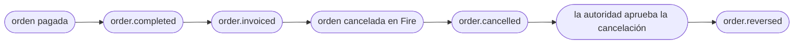

import FiscalEventBlock from '/snippets/fiscal-event-block.es.mdx';

<Tabs>
  <Tab title="v3 · actual">
    Estás viendo el contrato **actual (v3)** de `order.reversed`. **v3 es un cambio que rompe solo en el bloque fiscal**: pasa de `cancellation.metadata.fiscal` a **`cancellation.fiscal`**, se vuelve estructurado (`authority`, `history`, `compensates`) y `sefazCancellation` ya no se emite. Los campos de auditoría de `cancellation` agregados en v2 (`cancellationType`, `cancellationGroup`, `cancellationNote`) no cambian. Ver [Rutas que cambian respecto del contrato anterior](#rutas-que-cambian-respecto-del-contrato-anterior).
  </Tab>
  <Tab title="v2 · deprecado">
    <Warning>El contrato **v2** está **deprecado**. Ábrelo acá: [order-reversed — v2](/es/events-v2/order-reversed).</Warning>
  </Tab>
  <Tab title="v1 · deprecado">
    <Warning>El contrato **v1** está **deprecado**. Ábrelo acá: [order-reversed — v1](/es/events-v1/order-reversed).</Warning>
  </Tab>
</Tabs>

`order.reversed` dispara cuando la **autoridad fiscal confirma la cancelación** de un documento que había autorizado previamente. Es el resultado fiscal de [`order.cancelled`](/es/events/order-cancelled): la orden se cancela primero dentro de Fire (`order.cancelled`), la cancelación se pide ante la autoridad vía tu proveedor fiscal, y `order.reversed` dispara solo cuando la autoridad la aprueba.

<Warning>
  **Si necesitas saber que el documento está anulado ante la autoridad, escucha este evento — no `order.cancelled`.** `order.cancelled` se emite cuando se cancela la orden, antes de que la autoridad responda: su bloque fiscal todavía describe la factura autorizada. En un caso real de Brasil, `order.cancelled` salió a las `05:06:45`, SEFAZ aprobó a las `05:06:51` y `order.reversed` salió a las `05:08:12`.
</Warning>

## Condición de disparo

Fire emite `order.reversed` cuando un documento fiscal de la orden llega a `cancelled` — por su integración nativa con el proveedor o por el [callback fiscal](/es/api-reference/fiscal-callback) con `eventType: "cancelled"` — **y** la orden tiene un registro operativo de cancelación en Fire. Sin ese registro el evento no se emite: el bloque `cancellation` es lo que le dice a los consumidores que esto es una anulación y no una venta.

| | |
|---|---|
| Cobertura | **Todos los países** — el país viaja en `cancellation.fiscal.countryCode` |
| Llave de idempotencia | `event.id` |
| Dispara más de una vez | Una vez por cada Integration Flow activo suscrito al evento; se reintenta ante fallas de entrega |
| Latencia respecto de `order.cancelled` | Normalmente segundos; minutos si la autoridad está degradada |
| Precondición | Un documento autorizado previo para el mismo `orderId` |

## Qué hay en `trigger.data`

El mismo snapshot V4 de orden que [`order.completed`](/es/events/order-completed), con `status: "CANCELLED"`, más el bloque **`cancellation`**: los mismos campos de auditoría que `order.cancelled` y, dentro, el **bloque fiscal** con el documento cancelado.

## Ejemplo — Brasil (NFC-e, sanitizado)

```json
{
  "event": { "id": "…", "type": "order.reversed", "createdAt": "2026-09-15T05:08:12.359Z" },
  "data": {
    "orderId": "15801bd1-83d3-4d70-bb1b-793fd30b7bec",
    "orderCode": "OC-br-001",
    "status": "CANCELLED",
    "paymentStatus": "SUCCEEDED",
    "store": { /* igual que order.completed */ },
    "orderLines": [ /* igual que order.completed */ ],

    "cancellation": {
      "cancellationId": "6fcb0a30-cfde-4ffe-96ef-545dde3fa87c",
      "cancelledAt": "2026-09-15T05:06:44.359Z",
      "cancelledBy": "4fadc5f3-d9da-4756-978d-5a8cffc25d40",
      "cancellationType": "OTHER",
      "cancellationGroup": "Other",
      "cancellationReason": "Customer requested cancellation",
      "cancellationNote": null,
      "cancellationSource": "backoffice",

      "fiscal": {
        "status": "cancelled",
        "countryCode": "BR",
        "providerCode": "plugnotas",
        "occurredAt": "2026-09-15T05:08:11.702Z",
        "authority": {
          "documentType": "CREDIT_NOTE",
          "docSubtype": "nfce",
          "documentNumber": "12388",
          "issuedAt": "2026-09-15T05:00:48.003Z",
          "authorizedAt": "2026-09-15T03:00:00.000Z",
          "cancelledAt": "2026-09-15T05:06:51.603Z",
          "authorizationMode": "ONLINE",
          "providerDocId": "6aa8d10117b687522d90ae0a",
          "pdfUrl": "https://api.fiscal-provider.example/nfce/6aa8d10117b687522d90ae0a/pdf",
          "xmlUrl": "https://api.fiscal-provider.example/nfce/6aa8d10117b687522d90ae0a/xml",
          "amounts": { "total": 11.9, "tax": 1.65, "currencyCode": "BRL" },
          "countryData": {
            "chaveAcesso": "41201008187168000160558050010000131609769080",
            "numero": "12388",
            "serie": "2",
            "modelo": 65,
            "protocolo": "135266298552102",
            "cStat": "135"
          },
          "graphic": { "qr": "41201008187168000160558050010000131609769080" },
          "providerIdentity": null,
          "providerMetadata": null
        },
        "history": [
          {
            "status": "authorized",
            "occurredAt": "2026-09-15T05:00:48.003Z",
            "providerCode": "plugnotas",
            "authority": { /* la factura: documentType SALE_INVOICE, cancelledAt null */ }
          },
          {
            "status": "cancelled",
            "occurredAt": "2026-09-15T05:08:11.702Z",
            "providerCode": "plugnotas",
            "authority": { /* idéntico a authority de arriba */ }
          }
        ],
        "compensates": {
          "documentNumber": "12388",
          "issuedAt": "2026-09-15T05:00:48.003Z"
        }
      }
    }
  },
  "_meta": { "executionId": "…", "flowId": "…", "attempt": "1" }
}
```

<Note>Fíjate que en Brasil `authority.documentNumber` y `compensates.documentNumber` son iguales (`12388`): SEFAZ anula el documento en vez de emitir uno nuevo. En regímenes donde una cancelación es una nota de crédito separada, difieren.</Note>

## Referencia de `data.cancellation`

Los campos de auditoría son los mismos que en [`order.cancelled`](/es/events/order-cancelled#referencia-de-data-cancellation) — incluido `cancellationId`, que ambos eventos comparten para la misma cancelación y puedes usar como llave de unión. El bloque fiscal se documenta abajo.

<FiscalEventBlock />

## Lifecycle



Una orden cancelada **antes** de que su documento fuera autorizado dispara solo `order.cancelled`: no hay nada que revertir ante la autoridad.

## Handler de ejemplo

```js
async function onOrderReversed(data) {
  const { orderId, cancellation } = data;
  const fiscal = cancellation.fiscal;
  const doc = fiscal.authority;

  await db.fiscalDocs.update({
    where: { providerDocId: doc.providerDocId },
    data: {
      status: "cancelled",
      documentType: doc.documentType,
      cancelledAt: doc.cancelledAt,
      reason: cancellation.cancellationType,
    },
  });

  // El documento reemplazado, entero, está en history.
  const replaced = fiscal.history.find(
    (e) => e.authority.documentNumber === fiscal.compensates?.documentNumber
      && e.status !== "cancelled",
  );

  await reconciliation.close(orderId, { original: replaced?.authority });
}
```

## Errores comunes

- **Lee `cancellation.fiscal`, no `cancellation.metadata.fiscal`.** La ruta anterior viene vacía en v3.
- **`sefazCancellation` ya no está.** La fecha de cancelación es `authority.cancelledAt`; los identificadores del ente están en `authority.countryData`.
- **Es posible la entrega fuera de orden.** Si llega `order.reversed` de una orden para la que no tienes cancelación, créala a partir del bloque `cancellation` de este evento en vez de descartar el evento.
- **No hay evento para una cancelación fallida.** Si la autoridad rechaza la cancelación, no dispara ningún evento.

## Eventos relacionados

<CardGroup cols={2}>
  <Card title="order.cancelled" icon="ban" href="/es/events/order-cancelled">
    Dispara antes que este evento — la cancelación de la orden en sí.
  </Card>
  <Card title="order.invoiced" icon="file-invoice" href="/es/events/order-invoiced">
    El evento que reportó el documento que acá se cancela.
  </Card>
  <Card title="Callback fiscal" icon="arrow-right-to-bracket" href="/es/api-reference/fiscal-callback">
    Cómo un proveedor reporta la cancelación que dispara este evento.
  </Card>
</CardGroup>

## `data.fiscalRepresentation`

Sin cambios en v3. Tiene los números del comprobante impreso en la caja — el que **se está anulando** — y es un bloque distinto de `cancellation.fiscal`: `fiscalRepresentation` es lo que se numeró, `authority` es lo que decidió el ente. La referencia de campos está en la [página v2](/es/events-v2/order-reversed#data-fiscalrepresentation).
