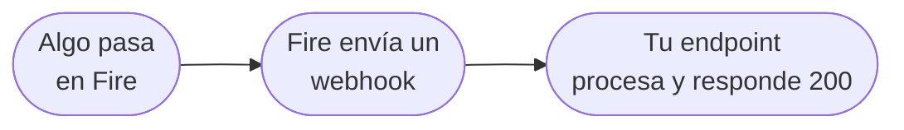

Fire emite **eventos** cada vez que ocurre una transición de negocio relevante — una orden se completa, una orden se cancela, un documento fiscal es autorizado por la autoridad tributaria. Cada evento se entrega a tu endpoint por un **Integration Flow** que configuras en el dashboard de Fire.

<Note>
  Fire emite **cuatro** tipos de evento en producción hoy: [`order.completed`](/es/events/order-completed), [`order.cancelled`](/es/events/order-cancelled), [`fiscal.authorized.br`](/es/events/fiscal-authorized-br) y [`fiscal.cancelled.br`](/es/events/fiscal-cancelled-br). No se emiten otros tipos de evento.
</Note>

## Cómo funciona



Cuando ocurre un evento de negocio relevante, Fire lo despacha a través de un flow que configuraste en el dashboard. El flow renderiza un body de petición HTTP y la hace POST a tu endpoint. Tú confirmas con una respuesta `2xx`.

La mecánica interna (queues, reintentos, resolución de templates) está en [Entrega y reintentos](/es/events/delivery). El modelo de configuración de flows está en [Integration Flows](/es/events/integration-flows).

## Qué recibe tu endpoint

Cuando dispara un flow, tu endpoint recibe un `POST` HTTP. El body tiene **tres campos top-level** — `event`, `data` y `_meta`:

```json
{
  "event": {
    "id": "0d6e8a1c-1e7a-4b4f-8a3a-74ab0e9a9b21",
    "type": "order.completed",
    "createdAt": "2026-05-06T13:42:11.812Z"
  },
  "data": {
    /* snapshot V4 específico del evento — ver cada referencia */
  },
  "_meta": {
    "executionId":     "0d6e8a1c-1e7a-4b4f-8a3a-74ab0e9a9b21",
    "flowId":          "9a2b3c4d-7e8f-4a1b-9c2d-3e4f5a6b7c8d",
    "flowName":        "Integración ERP",
    "attempt":         "1",
    "triggerEntityId": "f1e2d3c4-b5a6-4789-9012-3456789abcde"
  }
}
```

### `event`

<ResponseField name="event" type="object">
  Identifica esta entrega.

  <Expandable title="event">
    <ResponseField name="id" type="string">
      Identificador único de esta entrega (el ID de ejecución del flow). **Úsalo como llave de idempotencia** — Fire puede entregar el mismo evento más de una vez en reintentos.
    </ResponseField>
    <ResponseField name="type" type="string">
      Tipo de evento. Uno de: `order.completed`, `order.cancelled`, `fiscal.authorized.br`, `fiscal.cancelled.br`.
    </ResponseField>
    <ResponseField name="createdAt" type="string">
      Timestamp ISO 8601 UTC del momento en que el evento se materializó dentro de Fire (no el momento en que llegó a tu endpoint).
    </ResponseField>
  </Expandable>
</ResponseField>

### `data`

<ResponseField name="data" type="object">
  Payload específico del evento. La forma varía por evento:
</ResponseField>

| Evento | Qué hay en `data` |
|---|---|
| [`order.completed`](/es/events/order-completed) | Snapshot V4 de la orden — order, store (con `storeFiscalConfig` opcional), customer, payments, fulfillment, KDS, lines |
| [`order.cancelled`](/es/events/order-cancelled) | Snapshot V4 + bloque `cancellation` de auditoría |
| [`fiscal.authorized.br`](/es/events/fiscal-authorized-br) | Snapshot V4 con `order.fiscal` (chave, protocolo, número…) + `storeFiscalConfig` |
| [`fiscal.cancelled.br`](/es/events/fiscal-cancelled-br) | Snapshot V4 + `xmlCancelamento` + `sefazCancellation` |

### `_meta`

<ResponseField name="_meta" type="object">
  Trazabilidad a nivel de ejecución. Loguéalo junto al evento para debuggear problemas de entrega y correlacionar reintentos.

  <Expandable title="_meta">
    <ResponseField name="executionId" type="string">
      ID interno de ejecución del flow. Espeja `event.id`.
    </ResponseField>
    <ResponseField name="flowId" type="string">
      UUID del Integration Flow que produjo esta entrega.
    </ResponseField>
    <ResponseField name="flowName" type="string">
      Nombre legible del flow (tal como está en el dashboard).
    </ResponseField>
    <ResponseField name="attempt" type="string">
      Número de intento de entrega, empezando en `"1"`. Incrementa con cada reintento.
    </ResponseField>
    <ResponseField name="triggerEntityId" type="string">
      ID de la entidad de negocio que originó el evento (típicamente el UUID de la orden, mismo que `data.orderId`).
    </ResponseField>
  </Expandable>
</ResponseField>

<Note>
  Las claves `event`, `data` y `_meta` vienen del **template canónico de body** que trae el dashboard de Fire. Son una convención, no un envelope Fire fijo — si el nodo HTTP de tu flow define otro template, la forma del wire cambia. Ver [Customizando el body](#customizando-el-body) más abajo.
</Note>

## Entrega HTTP por defecto

| Campo | Default |
|---|---|
| Método | `POST` (configurable por flow) |
| `Content-Type` | `application/json` (lo setean los headers del nodo HTTP de tu flow) |
| Timeout | 30 segundos (configurable, 1–60s) |
| Auth | None / `Bearer` / `x-api-key` / OAuth2 client credentials — se elige por flow |
| Firma | HMAC-SHA256 **opcional** (nodo Webhook) — `X-Fire-Signature` + `X-Fire-Timestamp` |
| Reintentos | Hasta 5 con backoff exponencial |
| Dead letter | Después de los reintentos, la ejecución cae en `flow_dead_letter` |

<Note>
  Las peticiones salientes pueden ir **firmadas con HMAC** si tu flow usa el **nodo Webhook**: Fire agrega `X-Fire-Signature` (`v1=hex(HMAC-SHA256(secret, "{timestamp}.{body}"))`) y `X-Fire-Timestamp` (Unix seconds). La firma es opcional y **complementa** al auth de transporte (Bearer / API key / OAuth2). Detalle y verificación en [el nodo Webhook firmado](/es/events/integration-flows#nodo-webhook-firmado-hmac).
</Note>

## Recibiendo eventos

```js
import express from "express";

const app = express();
const seen = new Map(); // reemplaza por Redis / DB en producción

app.post("/fire/events", express.json(), async (req, res) => {
  const { event, data, _meta } = req.body ?? {};
  if (!event?.id || !event?.type) return res.status(400).end();

  // 1. Confirma primero para liberar la conexión de Fire
  res.status(200).end();

  // 2. Deduplica por event.id (el ID de ejecución del flow)
  if (seen.has(event.id)) return;
  seen.set(event.id, Date.now());

  // 3. Loggea _meta para trazabilidad — invaluable al debuggear
  console.log("Evento Fire", { eventId: event.id, type: event.type, _meta });

  // 4. Despacha por type
  switch (event.type) {
    case "order.completed":     return onOrderCompleted(data);
    case "order.cancelled":     return onOrderCancelled(data);
    case "fiscal.authorized.br":return onFiscalAuthorized(data);
    case "fiscal.cancelled.br": return onFiscalCancelled(data);
    default: console.warn("Tipo de evento Fire desconocido", event.type);
  }
});

app.listen(8080);
```

<Steps>
  <Step title="Confirma rápido">
    Devuelve `200 OK` (o cualquier `2xx`) en menos de 30 segundos — idealmente bajo 1 segundo. Confirma **antes** de hacer trabajo pesado.
  </Step>
  <Step title="Autentica la petición">
    Valida la credencial de auth que envía el flow (Bearer token, API key u OAuth2 access token). Rechaza cualquier petición que no haga match.
  </Step>
  <Step title="Deduplica">
    Busca `event.id` en un store de TTL corto (Redis con expiración de 24 horas funciona). Si ya lo procesaste, salta.
  </Step>
  <Step title="Valida el payload">
    Chequea que `event.type` sea lo que esperas y que el bloque `data` tenga los campos esperados. Devuelve `400` ante inputs malformados para que no entren en tu cola de retry desde Fire.
  </Step>
  <Step title="Procesa y persiste">
    Aplica tu lógica de negocio, persiste el resultado por `event.id` para trazabilidad. Devuelve `5xx` para errores transitorios (Fire reintenta); devuelve `4xx` para input malo no recuperable (Fire lo manda a dead letter).
  </Step>
</Steps>

## Customizando el body

El body que Fire entrega a tu endpoint es **lo que renderice el template del body del nodo HTTP de tu flow**. El template canónico (arriba) es el default recomendado, pero puedes escribir cualquier template JSON válido que referencie el **trigger context** del runtime:

```ts
{
  trigger: {
    event: { id, type, createdAt },
    data: V4Snapshot,         // payload específico del evento
  },
  execution: { id, ... },     // metadata de ejecución
  flow:      { id, name },    // identidad de tu flow
  queue:     { id, attempt, triggerEntityId },
}
```

El template canónico usa estos paths:

```json
{
  "event": {
    "id":        "{{trigger.event.id}}",
    "type":      "{{trigger.event.type}}",
    "createdAt": "{{trigger.event.createdAt}}"
  },
  "data": "{{trigger.data}}",
  "_meta": {
    "executionId":     "{{execution.id}}",
    "flowId":          "{{flow.id}}",
    "flowName":        "{{flow.name}}",
    "attempt":         "{{queue.attempt}}",
    "triggerEntityId": "{{queue.triggerEntityId}}"
  }
}
```

Puedes escribir otro template que omita `_meta`, aplane `data`, renombre claves, envíe solo campos específicos, etc. Consulta [Integration Flows](/es/events/integration-flows) para la referencia completa.

## Próximo

<CardGroup cols={2}>
  <Card title="Integration Flows" icon="diagram-project" href="/es/events/integration-flows">
    Cómo tu sistema se suscribe a eventos a través de flows configurados en el dashboard.
  </Card>
  <Card title="Entrega y reintentos" icon="repeat" href="/es/events/delivery">
    Política de retry, comportamiento de dead-letter, idempotencia y garantías de orden.
  </Card>
  <Card title="order.completed" icon="receipt" href="/es/events/order-completed">
    El evento más común — snapshot V4 completo de la orden.
  </Card>
  <Card title="fiscal.authorized.br" icon="file-invoice" href="/es/events/fiscal-authorized-br">
    Autorización fiscal brasileña vía tu proveedor fiscal.
  </Card>
</CardGroup>
