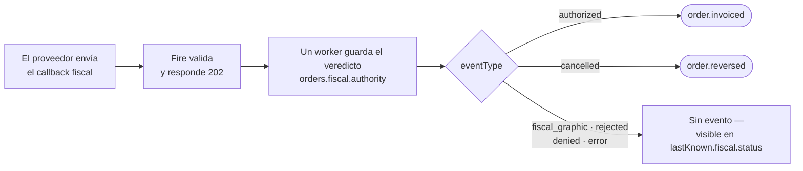

El callback fiscal hace una sola cosa: **escribe el veredicto del ente fiscal en la orden**. Los eventos no se arman a partir del callback — se arman a partir de lo que guarda la orden. Por eso la pregunta "¿qué recibe mi consumidor?" siempre tiene la misma respuesta: `fiscal.authority`, con la forma que se describe acá.

Si todavía no la leíste, [Cómo funciona lo fiscal en Fire](/es/fiscal/overview) explica los dos actos y los dos bloques que esta página da por conocidos.

## Qué pasa, paso a paso



1. Tu proveedor hace POST del [callback fiscal](/es/api-reference/fiscal-callback). Fire lo valida y responde `202 Accepted`. **Un `202` significa encolado, no procesado**, y nunca significa que se envió un evento.
2. Un worker en segundo plano guarda el veredicto en la orden, normalmente en un par de segundos.
3. Según el `eventType`, Fire emite un evento a tus Integration Flows — o no.

## Qué evento sale

| `eventType` del callback | Estado fiscal de la orden | Evento emitido |
|---|---|---|
| `authorized` | `authorized` | [`order.invoiced`](/es/events/order-invoiced) |
| `cancelled` | `cancelled` | [`order.reversed`](/es/events/order-reversed) — solo si la orden tiene una cancelación registrada en Fire; si no, no se emite nada |
| `fiscal_graphic` | `fiscal_graphic` | ninguno — se guarda la gráfica imprimible; el documento todavía no está autorizado |
| `rejected`, `denied`, `error` | `rejected`, `denied`, `error` | ninguno — en los eventos, visible solo en `lastKnown.fiscal.status` del siguiente evento de esa orden |

Solo se emite un evento cuando el callback realmente cambió el documento. Un reenvío de un estado ya aplicado (`idempotent`), un callback que haría retroceder el documento (`regression`) o uno que no coincide con ningún documento (`notFound`) igual se responde con `202`, y no emite nada.

<Warning>
  **`order.cancelled` no viene del callback.** Sale cuando la orden se cancela en Fire, antes de consultar al ente. La confirmación del ente llega después como un callback `cancelled`, que produce `order.reversed`.
</Warning>

## Dónde cae cada campo del callback

Todo lo de abajo cae en `orders.fiscal.authority`, y de ahí en los eventos.

| Callback fiscal (body) | `authority` (orden y eventos) |
|---|---|
| `documentType`, `docSubtype`, `documentNumber` | mismos nombres |
| `issuedAt`, `authorizedAt`, `cancelledAt`, `authorizationMode` | mismos nombres |
| `pdfUrl`, `xmlUrl`, `providerDocId` | mismos nombres |
| `totalAmount`, `taxAmount`, `currencyCode` | `amounts.total`, `amounts.tax`, `amounts.currencyCode` |
| `document.<clave>` | `countryData.<clave>` — misma clave, mismo valor |
| `graphic` | `graphic` |
| `provider` | `providerIdentity` — `{ name, version, reference }`; `null` si está ausente o vacío |
| `metadata` | `providerMetadata` — opaco; `null` si está ausente o es `{}` |
| `country` | `fiscal.countryCode` (fuera de `authority`); si la orden ya tenía uno, se conserva |
| `occurredAt` | `fiscal.occurredAt` (fuera de `authority`) |
| `eventType`, `eventId`, `orderId`, `providerEventId`, `failure` | no pasan a `authority` |

Tres reglas explican la tabla:

- **`document` pasa a ser `countryData`.** Fire no guarda una lista de las claves de cada país: todo lo que viene en `document` llega intacto a `countryData`. Un identificador nuevo que tu ente empiece a exigir viaja sin ningún cambio del lado de Fire.
- **`provider` y `metadata` conservan los nombres de la numeración.** Del lado de la numeración el proveedor también envía `provider` y `metadata`, y Fire los expone como `providerIdentity` y `providerMetadata`. El callback hace lo mismo, así que los dos bloques de la orden se leen igual. `providerIdentity.reference` es lo que le citas al proveedor para encontrar la operación en sus registros.
- **Vacío significa `null`, no ausente.** Un callback sin `provider` o `metadata` (o con `{}`) guarda `providerIdentity: null` y `providerMetadata: null`.

## Dónde aparece en cada evento

| Evento | Ruta | Lleva |
|---|---|---|
| `order.invoiced` | `data.fiscal` | `status`, `countryCode`, `providerCode`, `occurredAt`, `authority`, `history`, `compensates` |
| `order.cancelled` | `data.cancellation.fiscal` | solo `status` y `authority` — el documento **tal como estaba antes** de la cancelación. Presente solo si la orden tenía un documento `authorized` o `cancelling` con `providerDocId`; si no, la clave no está |
| `order.reversed` | `data.cancellation.fiscal` | el bloque completo, con el documento cancelado, `history` y `compensates` |

La referencia campo por campo de ese bloque está en [el bloque fiscal](/es/events/order-invoiced#el-bloque-fiscal).

## El camino sin callback: Brasil (PlugNotas)

En Brasil no hay callback fiscal: Fire conoce el veredicto de SEFAZ directamente por PlugNotas. **El bloque que recibe tu consumidor tiene la misma forma**, con estas diferencias:

| | Callback fiscal | PlugNotas |
|---|---|---|
| `fiscal.providerCode` | `generic` | `plugnotas` |
| `authority.providerIdentity` | desde `provider` | `null` — PlugNotas nunca lo envía; una anulación conserva el valor del documento previo |
| `authority.providerMetadata` | desde `metadata` | `null` — PlugNotas nunca lo envía; una anulación conserva el valor del documento previo |
| `authority.countryData` | desde `document` | `chaveAcesso`, `numero`, `serie`, `modelo`, `protocolo`, `cStat` |
| `data.fiscalRepresentation` | poblado si la caja numeró primero | `null` — no hay paso de numeración |
| `authority.authorizedAt` | tal como lo reporta el proveedor | la fecha de SEFAZ, con una hora convencional de medianoche |

## Una orden, de punta a punta

La misma orden brasileña por el callback fiscal, recortada a las partes fiscales.

<Steps>
  <Step title="Callback: authorized">
    ```json
    {
      "country": "BR",
      "eventType": "authorized",
      "orderId": "d2c66234-546d-414f-9b22-095402a68e33",
      "eventId": "ca7ffb66-3c5d-4346-8a1e-7663e82ed2d2",
      "occurredAt": "2026-09-15T16:30:56.000Z",
      "documentType": "SALE_INVOICE",
      "docSubtype": "nfce",
      "documentNumber": "7",
      "providerDocId": "BR-E2E-007",
      "issuedAt": "2026-09-15T16:30:55.921Z",
      "totalAmount": 55.5, "taxAmount": 7.2, "currencyCode": "BRL",
      "pdfUrl": "https://api.fiscal-provider.example/br-e2e.pdf",
      "xmlUrl": "https://api.fiscal-provider.example/br-e2e.xml",
      "document": { "chaveAcesso": "35260229062609000177650500000000071000000070", "protocolo": "141210001176999", "numero": 7, "serie": 50, "modelo": 65 },
      "provider": { "name": "hio.fiscalization", "version": "2026.09.1", "reference": "HIO-E2E-AUTH-007" },
      "metadata": { "providerTraceId": "e2e-auth-trace-007", "deviceUid": "POS-BR-01" }
    }
    ```
  </Step>
  <Step title="Fire responde 202 y después guarda el veredicto">
    ```json
    "authority": {
      "documentType": "SALE_INVOICE",
      "docSubtype": "nfce",
      "documentNumber": "7",
      "issuedAt": "2026-09-15T16:30:55.921Z",
      "authorizedAt": null,
      "cancelledAt": null,
      "providerDocId": "BR-E2E-007",
      "pdfUrl": "https://api.fiscal-provider.example/br-e2e.pdf",
      "xmlUrl": "https://api.fiscal-provider.example/br-e2e.xml",
      "amounts": { "total": 55.5, "tax": 7.2, "currencyCode": "BRL" },
      "countryData": { "chaveAcesso": "35260229062609000177650500000000071000000070", "protocolo": "141210001176999", "numero": "7", "serie": "50", "modelo": 65 },
      "graphic": null,
      "providerIdentity": { "name": "hio.fiscalization", "version": "2026.09.1", "reference": "HIO-E2E-AUTH-007" },
      "providerMetadata": { "providerTraceId": "e2e-auth-trace-007", "deviceUid": "POS-BR-01" }
    }
    ```
  </Step>
  <Step title="order.invoiced lo lleva">
    ```json
    "fiscal": {
      "status": "authorized",
      "countryCode": "BR",
      "providerCode": "generic",
      "occurredAt": "2026-09-15T16:30:56.000Z",
      "authority": { /* exactamente el bloque de arriba */ },
      "history": [
        { "status": "authorized", "occurredAt": "2026-09-15T16:30:56.000Z", "providerCode": "generic", "authority": { /* mismo bloque */ } }
      ],
      "compensates": null
    }
    ```
  </Step>
  <Step title="La orden se cancela en Fire">
    `order.cancelled` sale de inmediato con `data.cancellation.fiscal = { "status": "authorized", "authority": { … } }` — la factura tal como estaba. Todavía no se le consultó nada al ente.
  </Step>
  <Step title="Callback: cancelled, y después order.reversed">
    El proveedor envía `eventType: "cancelled"` con **su propio `eventId`** (reusar el de la autorización devuelve `409`). Fire emite `order.reversed` con `authority.documentType: "CREDIT_NOTE"`, `cancelledAt` completado, los dos documentos en `history` y `compensates` apuntando a la factura.
  </Step>
</Steps>

## Lo que no pasa

- **No hay evento para `rejected`, `denied` ni `error`.** Se guardan; tu consumidor solo los ve en `lastKnown.fiscal.status` de un evento posterior.
- **Un `202` no es un evento.** Consulta el [endpoint de resultado](/es/api-reference/fiscal-callback#comprobar-el-resultado) si necesitas saber que el callback se procesó.
- **El callback no cambia `fiscalRepresentation`.** Lo que se imprimió en la caja queda como estaba.
- **No hay guard por proveedor.** Una orden tiene un solo documento. Cuando la orden ya tiene un documento, un `authorized` cuyo `eventId` no coincide termina en `notFound` y no cambia nada; si la orden no tiene documento, el `authorized` lo crea. Un `eventId` que Fire no emitió para esa orden se rechaza con `400` antes del `202`. Un `cancelled` resuelve el documento más reciente de la orden y lo actualiza, sin importar qué proveedor lo emitió — PlugNotas incluido.
