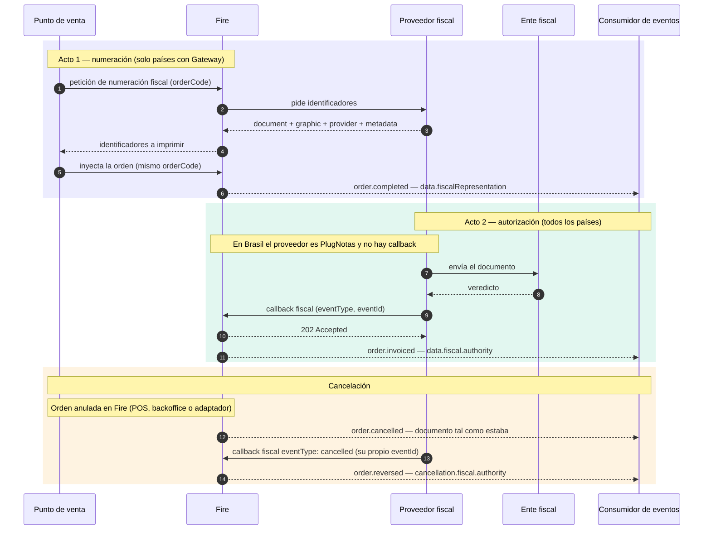

Todo documento fiscal en Fire pasa por **dos actos separados**, en momentos distintos, y cada uno deja su propio bloque en la orden. La mayor parte de la confusión viene de mezclarlos, así que esta página los nombra una vez y todas las demás páginas fiscales se apoyan en ella.

## Los dos actos

| | Acto 1 — Numeración | Acto 2 — Autorización |
|---|---|---|
| **Cuándo** | Antes de que exista la orden, en la caja | Segundos o minutos después de la venta |
| **Quién lo inicia** | El punto de venta le pide identificadores a Fire | El proveedor fiscal reporta el veredicto del ente fiscal |
| **Cómo llega a Fire** | Petición de [numeración fiscal](/es/api-reference/fiscal-documents-v2) | [Callback fiscal](/es/api-reference/fiscal-callback) (o PlugNotas, en Brasil) |
| **Bloque en la orden** | `data.fiscalRepresentation` | `data.fiscal.authority` |
| **Pregunta que responde** | *¿Qué se imprimió?* | *¿Qué decidió el ente?* |
| **¿Cambia después?** | Solo cuando se numera un documento nuevo (una nota de crédito) | Sí: autorizado, luego cancelado |

<Warning>
  **`fiscalRepresentation` nunca dice que el documento fue autorizado.** Guarda los números impresos en la caja. El veredicto del ente es `fiscal.authority`, y el estado actual es `fiscal.status` en los eventos fiscales y `lastKnown.fiscal.status` en todos los demás. Los tres pueden discrepar legítimamente durante un tiempo.
</Warning>

## Dos formas en que un documento llega a Fire

<Tabs>
  <Tab title="Países con gateway (hoy Ecuador y Colombia)">
    Ocurren los dos actos. La caja numera primero a través de Fire, imprime, inyecta la orden, y el proveedor reporta después el veredicto por el callback fiscal.

    - `data.fiscalRepresentation` está poblado desde el momento en que existe la orden.
    - `data.fiscal.authority` aparece cuando llega el callback.
    - `fiscal.providerCode` es `generic`.
  </Tab>
  <Tab title="PlugNotas (Brasil)">
    **No hay Acto 1.** Fire emite la NFC-e / NF-e a través de PlugNotas después de la venta y conoce el veredicto de SEFAZ directamente por PlugNotas — sin callback fiscal ni petición de numeración.

    - `data.fiscalRepresentation` es `null`.
    - `data.fiscal.authority` aparece cuando SEFAZ autoriza.
    - `fiscal.providerCode` es `plugnotas`.
    - `authority.providerIdentity` y `authority.providerMetadata` son `null`: PlugNotas no envía ninguno de los dos. Una anulación conserva los valores del documento previo.
  </Tab>
</Tabs>

Otros países también pueden reportar por el callback fiscal sin numerar antes. Lo que le importa a un consumidor es lo mismo en todos los casos: **el veredicto es siempre `fiscal.authority`, con la misma forma**, sin importar por qué camino entró.

## El ciclo completo

Lo que pasa entre el callback y los eventos — qué evento sale para cada resultado y cómo viaja cada campo — está en [Del callback a los eventos](/es/fiscal/callback-to-events).

## Cuatro palabras para "estado"

El mismo hecho se nombra distinto según dónde lo leas. No son intercambiables:

| Dónde | Campo | Valores | Describe |
|---|---|---|---|
| Respuesta de numeración fiscal | `numberingStatus` | `GENERATED`, `PENDING`, `FAILED_RETRYABLE`, `FAILED_FINAL`, `NOT_APPLICABLE`, `BLOCKED_BY_POLICY` | Si la **numeración** funcionó |
| Respuesta de numeración fiscal | `documentStatus` | `PENDING`, `AUTHORIZED`, `REJECTED`, `CANCELLED` | El documento, según lo último que supo el gateway |
| Callback fiscal (lo envías tú) | `eventType` | `fiscal_graphic`, `authorized`, `cancelled`, `rejected`, `denied`, `error` | Lo que acaba de pasar en el ente |
| Eventos fiscales (`order.invoiced`, `order.cancelled`, `order.reversed`) | `fiscal.status` | `awaiting_payment`, `not_issued`, `pending`, `processing`, `fiscal_graphic`, `authorized`, `cancelling`, `cancelled`, `rejected`, `denied`, `error` | El estado fiscal de la orden guardado con el documento |
| Todos los demás eventos de orden | `lastKnown.fiscal.status` | `pending`, `processing`, `fiscal_graphic`, `authorized`, `cancelling`, `cancelled`, `rejected`, `denied`, `error` | El estado fiscal **actual** de la orden |

## Adónde seguir

<CardGroup cols={2}>
  <Card title="Del callback a los eventos" icon="arrow-right-arrow-left" href="/es/fiscal/callback-to-events">
    Qué evento sale para cada callback y dónde cae cada campo.
  </Card>
  <Card title="Callback fiscal" icon="arrow-right-to-bracket" href="/es/api-reference/fiscal-callback">
    El contrato que envía tu proveedor.
  </Card>
  <Card title="Numeración desde la caja" icon="cash-register" href="/es/guides/fiscal-integration">
    El Acto 1, paso a paso, para puntos de venta y kioscos.
  </Card>
  <Card title="Convertirse en proveedor fiscal" icon="plug" href="/es/fiscal-providers/overview">
    Lo que un proveedor implementa en ambos actos.
  </Card>
</CardGroup>
