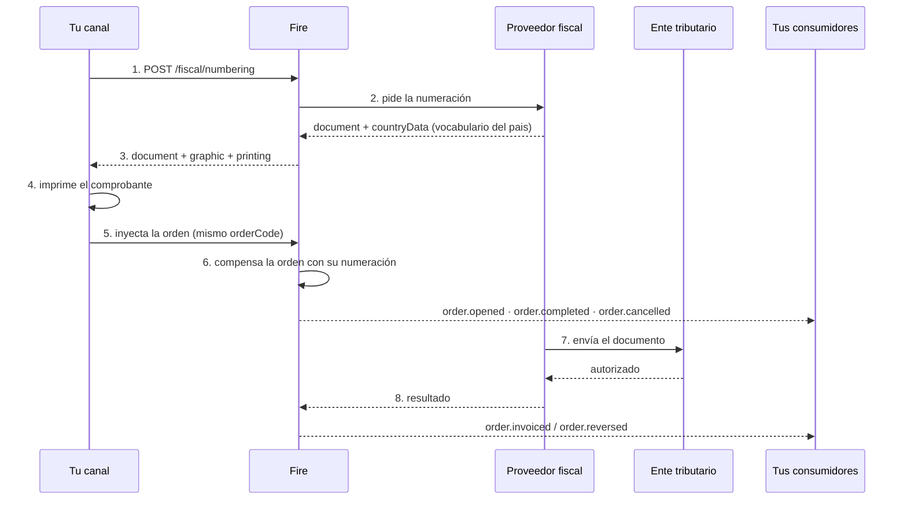

Fire no emite comprobantes: **los numera**. Esa distinción explica casi todas las decisiones
del diseño, así que vale empezar por ahí.

## Quién hace qué

<CardGroup cols={2}>
  <Card title="Tu canal" icon="cash-register">
    Cobra, pide la numeración, imprime e inyecta la orden. No conoce reglas fiscales de
    ningún país.
  </Card>
  <Card title="Fire" icon="server">
    Resuelve la tienda, el emisor y el proveedor. Guarda la solicitud, pide los números y te
    responde qué se puede imprimir.
  </Card>
  <Card title="El proveedor fiscal" icon="stamp">
    Traduce a los códigos del ente, numera con el vocabulario de su país, y envía el
    documento a la autoridad.
  </Card>
  <Card title="El ente tributario" icon="landmark">
    Autoriza o rechaza. Su veredicto llega **después** de que el cliente se fue con su
    comprobante.
  </Card>
</CardGroup>

<Info>
  **Un solo contrato, todos los países.** Fire resuelve por dentro qué proveedor corresponde
  a cada país. Tu integración es la misma en Ecuador, Brasil o Venezuela: lo que cambia es
  qué campos vienen llenos en la respuesta, no la forma de pedirla.
</Info>

## La línea de tiempo



Los pasos 1 al 5 ocurren **con el cliente esperando en la caja**: son segundos. Del 6 en
adelante tu canal ya no participa.

## Dónde aparecen los datos fiscales

La numeración no se queda encerrada en este endpoint. Recorre el ciclo de vida de la orden en
**dos momentos distintos**, y conviene no mezclarlos.

### 1. Lo que compensamos al inyectar

Cuando inyectás la orden, Fire la enriquece con la numeración que ya obtuviste. Esos datos
viajan en los eventos del ciclo de vida normal:

| Evento | Cuándo |
|---|---|
| [`order.opened`](/es/events/order-opened) | La orden se abrió — lleva su numeración si ya se pidió |
| [`order.completed`](/es/events/order-completed) | El cobro saldó el total |
| [`order.cancelled`](/es/events/order-cancelled) | La orden se anuló antes o después del pago |

Acá **todavía no hay veredicto del ente**: hay números impresos y una venta registrada.

### 2. Lo que compensa el callback fiscal

Minutos después, el proveedor le avisa a Fire qué resolvió la autoridad. Ese callback es lo
que dispara los dos eventos del desenlace:

| Evento | Cuándo |
|---|---|
| [`order.invoiced`](/es/events/order-invoiced) | El ente **autorizó** el documento — llega con clave y protocolo |
| [`order.reversed`](/es/events/order-reversed) | El ente **confirmó la anulación** de un documento ya autorizado |

<Info>
  Esa es la separación que hay que tener clara de punta a punta: **la numeración la pedís vos
  y compensa la orden; la autorización llega sola y compensa el desenlace.** Un documento
  numerado puede no llegar nunca a `order.invoiced` si el ente lo rechaza.
</Info>

Si ya consumís eventos de orden, **no tenés que consultar nada**: los datos fiscales llegan
por el mismo camino que el resto de la venta. La consulta directa queda para soporte y para
cuando perdés la respuesta síncrona.

### El campo que hay que leer: `data.fiscalRepresentation`

La numeración llega en ese bloque, en **todos** los eventos de la orden — los cinco de las dos
tablas de arriba.

**La clave viaja siempre.** Llega en `null` cuando no se intentó numerar —agregadores, países
sin representación fiscal, o comercios con la numeración desactivada— y con el bloque cuando
sí. Ramificá por valor, nunca por presencia de la clave:

```js
if (data.fiscalRepresentation) {
  // se intentó numerar — numberingStatus dice cómo salió
  print(data.fiscalRepresentation.documentNumber)
}
```

Que traiga bloque significa **que se intentó numerar, no que se numeró**. Una venta cobrada
que quedó **sin comprobante fiscal** llega con los identificadores en `null` y el motivo en
`failure` — ese caso hay que contemplarlo, porque antes era invisible.

Y que traiga bloque **tampoco** significa que el comprobante esté autorizado: eso lo dice
`lastKnown.fiscal.status`, que es el único de los dos que se actualiza.

#### Qué trae el bloque

Tres capas, y conviene no mezclarlas:

| Capa | Qué hay | Cómo se lee |
|---|---|---|
| **Canónica** | `documentType`, `documentNumber`, `issuedAt`, `authorizationMode`, `numberingStatus`, `environment` | Significan lo mismo en todo país. Es contra esto que programás |
| **Del país** | `countryData` | El vocabulario del ente que numeró: `claveAcceso` en Ecuador, `numeroControl` en Venezuela. **Recorrelo, no lo indexes** |
| **Del proveedor** | `providerCode`, `providerIdentity`, `providerMetadata` | Diagnóstico. Ver abajo |

<Warning>
  **El número que va impreso es `documentNumber`. No lo compongas vos.**

  Llega ya armado por el proveedor, que es quien conoce la regla de su país —en Ecuador, el
  art. 18 del Reglamento de Comprobantes de Venta: quince dígitos en tres tramos—. En el bloque
  del país viaja el mismo valor con el nombre que usa el ente (`numeroComprobante` en Ecuador).

  Armarlo a mano juntando `establecimiento`, `puntoEmision` y `secuencial` parece equivalente y
  no lo es: el Reglamento permite omitir los ceros a la izquierda del secuencial, así que
  `001-020-123` puede ser tan legal como `001-020-000000123`. Si lo componés vos, imprimís un
  número con **tu** convención, no con la del comprobante que se emitió.
</Warning>

Los tres campos del proveedor **no son lo mismo**, y por eso viajan separados:

- **`providerCode`** es **nuestro** identificador de adaptador (`hio`). Dice con qué
  integración se numeró.
- **`providerIdentity`** es del proveedor y **tiene forma**: `name`, `version` y `reference`.
  Esa `reference` es la que le citás a él cuando hay que escalar un caso — no es tu
  `Idempotency-Key`.
- **`providerMetadata`** es una **bolsa opaca**: sin forma garantizada, las claves las pone el
  proveedor y pueden cambiar sin aviso. Sirve para pegar en un ticket de soporte.

<Warning>
  **No ramifiques por las claves de `providerMetadata`.** Programar contra ellas ata tu
  integración al proveedor que numera hoy, y cambian sin versionar el contrato. Si un dato es
  lo bastante importante como para decidir con él, va a estar en la capa canónica o en
  `countryData`.
</Warning>

Además, el bloque lleva **el documento vigente de la orden**, no el primero: si hubo una
anulación, arriba está la nota de crédito, `compensates` apunta a la factura que anula, y la
factura entera queda en `history`. Cada entrada de `history` tiene **exactamente las mismas
claves** que el bloque de arriba, así que se leen igual.

La referencia completa del bloque, campo por campo, está en
[`order.opened`](/es/events/order-opened#data-fiscalrepresentation).

## Las tres reglas que hay que entender

<AccordionGroup>
  <Accordion title="Numerado no es autorizado" icon="scale-balanced">
    La respuesta trae **dos estados y nunca se fusionan**:

    - `requestStatus` — ¿conseguí números para imprimir?
    - `documentStatus` — ¿el ente lo autorizó?

    Cuando hay documento, el segundo es **siempre** `PENDING`. Eso no es un problema: en la
    mayoría de los países se entrega el comprobante antes de que la autoridad lo vea. Si tu
    integración colapsa los dos en un solo campo, en algún momento le vas a decir a un
    cliente que su factura está autorizada cuando solo tiene número.

    Cuando no hay documento del cual esperar veredicto —una tienda que no numera— viaja en
    `null`. `PENDING` significa "hay documento y el ente no contestó todavía", así que
    devolverlo ahí describiría una espera que nunca va a terminar.
  </Accordion>

  <Accordion title="Fire no te frena, pero la cuenta puede" icon="shield-check">
    Fire **nunca** devuelve un error que te deje sin saber qué hacer. Falle lo que falle, la
    respuesta trae una decisión explícita en `policy.numberingFailure.action`.

    Lo que cambió: esa decisión **no siempre es seguir**. La cuenta configura, por vendor, qué
    pasa cuando no se pudo numerar.

    - **`CONTINUE`** — el default, y el comportamiento de siempre. Imprimís según
      `printing.mode` —normalmente un ticket no fiscal— e inyectás la orden igual. El
      comprobante se resuelve después.
    - **`REFUND`** — devolvés el cobro en el mostrador y **no inyectás la orden**. Esa venta no
      ocurrió; hay que [reportarla](/es/api-reference/lost-sales) o no queda rastro de que
      hubo plata de por medio.

    **En los dos casos: no retengas la venta ni reintentes en bucle con el cliente enfrente.**
    El dinero ya se cobró.

    <Warning>
      **Con `CONTINUE`, nadie la completa sola.** Para conseguir el comprobante hay que volver
      a llamar con el **mismo `orderCode`** — Fire retoma la solicitud y le vuelve a preguntar
      al proveedor. Un `202` que nadie reintenta se queda así para siempre.

      Con `REFUND` es al revés: **no reintentes**. Numerar una venta que devolviste generaría
      un comprobante de algo que no ocurrió.
    </Warning>
  </Accordion>

  <Accordion title="Fire decide qué se imprime, no vos" icon="print">
    El bloque `printing` no es una deducción de si hay documento: es una **regla legal del
    país**. En Ecuador con contingencia el comprobante existe y se imprime aunque el SRI
    todavía no lo haya visto; en un país que prohíba imprimir antes de autorizar, `printable`
    vendría en `false` con el documento presente.

    Si cada canal dedujera esa regla por su cuenta, alguno la implementaría mal — y el error
    solo se descubre en una auditoría.
  </Accordion>
</AccordionGroup>

## Idempotencia: tres capas

Una venta cobrada dos veces es un problema de dinero; **una venta numerada dos veces es un
problema fiscal**, y no se corrige con un deploy. Por eso hay tres barreras:

<Steps>
  <Step title="Tu Idempotency-Key">
    La generás vos, una por venta, y la reusás en cada reintento de esa misma venta. Es lo
    que hace que un corte de red no consuma un segundo secuencial.

    Si la reusás con un cuerpo distinto, Fire responde `409`: son dos operaciones diferentes.
  </Step>
  <Step title="La clave natural">
    `país + orderCode + operación`. Protege incluso si tu canal regenera la
    `Idempotency-Key` en cada intento — que es el error de implementación más común.

    Es también la razón por la que el `orderCode` **tiene que ser único por cuenta y país**:
    si dos tiendas usan el mismo, Fire corta antes de emitir.
  </Step>
  <Step title="La del proveedor">
    Es la misma terna, del otro lado. Que las dos claves sean idénticas es lo que hace que
    una colisión se detecte en ambos extremos a la vez, en vez de aparecer meses después
    como dos comprobantes para una venta.
  </Step>
</Steps>

## Anular

Se pide con `operation: "CANCEL"` y **el mismo `orderCode` de la venta original**. Nada más.

Tu punto de venta **no necesita guardar ningún identificador nuestro**: Fire encuentra el
documento original por la clave natural. Eso es deliberado — un kiosco que se reinstala o una
caja que se reemplaza perderían ese dato, y esa venta no se podría anular nunca más. El
`orderCode`, en cambio, está impreso en el ticket.

Con qué instrumento se materializa la anulación lo decide el país: en Ecuador es una nota de
crédito con su propio secuencial; en Brasil, un evento de cancelamento que no genera
documento nuevo.

**Y a partir de ahí la orden lleva la nota de crédito arriba.** Los eventos siguientes traen
`documentType: "CREDIT_NOTE"` en `fiscalRepresentation`, con `compensates` apuntando a la
factura anulada y la factura entera en `history`.

<Warning>
  **Si tu conciliación asume que `documentNumber` es siempre el de la venta, se rompe acá.** El
  número de arriba pasa a ser el de la nota. Lo que el cliente se llevó impreso no se pierde
  —está en `history`— pero hay que ir a buscarlo ahí.
</Warning>

## Si perdés la respuesta

Pasa: la red se cae justo después de que Fire numeró. El comprobante existe y vos no lo
tenés.

```
GET /api/v1/external/fiscal/numbering?orderCode=EC-K004-42-1786579046934
```

Devuelve `items[]` con todos los documentos de esa orden — pueden ser dos, la factura y su
anulación. Es la razón por la que el `orderCode` tiene que ser el mismo string en la
numeración y en la inyección: es lo único que te queda en la mano.

## Antes de salir a producción

<Check>Tu `orderCode` es único por cuenta y país, y es el mismo en la numeración y en la inyección.</Check>
<Check>Guardás la `Idempotency-Key` junto con la orden y la reusás en los reintentos.</Check>
<Check>Cada dispositivo declara su `device.externalId` — dos cajas de la misma tienda no lo comparten.</Check>
<Check>Ramificás por `printing.mode` y no por el código HTTP.</Check>
<Check>Imprimís `documentNumber` tal como llega, sin recomponerlo desde `establecimiento`, `puntoEmision` y `secuencial`.</Check>
<Check>Recorrés `countryData` en vez de indexar claves fijas: las pone el país que numeró, y en Venezuela no hay `claveAcceso`.</Check>
<Check>Recorrés las claves de `graphic` en vez de buscar campos fijos.</Check>
<Check>No ramificás por las claves de `providerMetadata`: es una bolsa opaca del proveedor y cambia sin aviso.</Check>
<Check>Tu conciliación contempla que, tras una anulación, el documento de arriba es la nota de crédito y la factura está en `history`.</Check>
<Check>Ante `202` imprimís provisional e inyectás igual, sin reintentar en bucle en la caja.</Check>
<Check>Tenés cómo reintentar un `202` después, con el mismo `orderCode`: nadie lo completa solo.</Check>

<CardGroup cols={2}>
  <Card title="Referencia del endpoint" icon="code" href="/es/api-reference/fiscal-documents">
    Campos, respuestas y ejemplos por país.
  </Card>
  <Card title="¿Sos un proveedor fiscal?" icon="plug" href="/es/fiscal-providers/overview">
    Esta guía es para quien **consume** la numeración. Si vas a **proveerla**, el contrato
    que tenés que implementar es otro.
  </Card>
</CardGroup>
