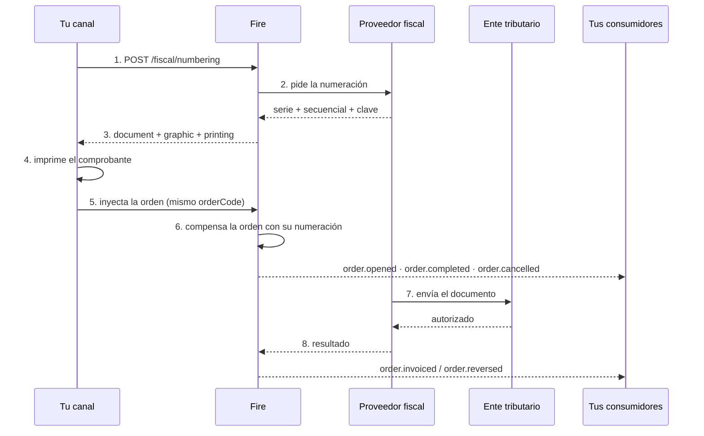

Fire no emite comprobantes: **los numera**. Esa distinción explica casi todas las decisiones
del diseño, así que vale empezar por ahí.

## Quién hace qué

<CardGroup cols={2}>
  <Card title="Tu canal" icon="cash-register">
    Cobra, pide la numeración, imprime e inyecta la orden. No conoce reglas fiscales de
    ningún país.
  </Card>
  <Card title="Fire" icon="server">
    Resuelve la tienda, el emisor y el proveedor. Guarda la solicitud, pide los números y te
    responde qué se puede imprimir.
  </Card>
  <Card title="El proveedor fiscal" icon="stamp">
    Traduce a los códigos del ente, asigna serie y secuencial, y envía el documento a la
    autoridad.
  </Card>
  <Card title="El ente tributario" icon="landmark">
    Autoriza o rechaza. Su veredicto llega **después** de que el cliente se fue con su
    comprobante.
  </Card>
</CardGroup>

<Info>
  **Un solo contrato, todos los países.** Fire resuelve por dentro qué proveedor corresponde
  a cada país. Tu integración es la misma en Ecuador, Brasil o Venezuela: lo que cambia es
  qué campos vienen llenos en la respuesta, no la forma de pedirla.
</Info>

## La línea de tiempo



Los pasos 1 al 5 ocurren **con el cliente esperando en la caja**: son segundos. Del 6 en
adelante tu canal ya no participa.

## Dónde aparecen los datos fiscales

La numeración no se queda encerrada en este endpoint. Recorre el ciclo de vida de la orden en
**dos momentos distintos**, y conviene no mezclarlos.

### 1. Lo que compensamos al inyectar

Cuando inyectás la orden, Fire la enriquece con la numeración que ya obtuviste. Esos datos
viajan en los eventos del ciclo de vida normal:

| Evento | Cuándo |
|---|---|
| [`order.opened`](/es/events/order-opened) | La orden se abrió — lleva su numeración si ya se pidió |
| [`order.completed`](/es/events/order-completed) | El cobro saldó el total |
| [`order.cancelled`](/es/events/order-cancelled) | La orden se anuló antes o después del pago |

Acá **todavía no hay veredicto del ente**: hay números impresos y una venta registrada.

### 2. Lo que compensa el callback fiscal

Minutos después, el proveedor le avisa a Fire qué resolvió la autoridad. Ese callback es lo
que dispara los dos eventos del desenlace:

| Evento | Cuándo |
|---|---|
| [`order.invoiced`](/es/events/order-invoiced) | El ente **autorizó** el documento — llega con clave y protocolo |
| [`order.reversed`](/es/events/order-reversed) | El ente **confirmó la anulación** de un documento ya autorizado |

<Info>
  Esa es la separación que hay que tener clara de punta a punta: **la numeración la pedís vos
  y compensa la orden; la autorización llega sola y compensa el desenlace.** Un documento
  numerado puede no llegar nunca a `order.invoiced` si el ente lo rechaza.
</Info>

Si ya consumís eventos de orden, **no tenés que consultar nada**: los datos fiscales llegan
por el mismo camino que el resto de la venta. La consulta directa queda para soporte y para
cuando perdés la respuesta síncrona.

<Note>
  La compensación de la orden y el enriquecimiento de estos eventos están **en
  implementación**. Hoy la numeración se obtiene y se guarda; consultarla por `orderCode` o
  por `fiscalRequestId` ya funciona.
</Note>

## Las tres reglas que hay que entender

<AccordionGroup>
  <Accordion title="Numerado no es autorizado" icon="scale-balanced">
    La respuesta trae **dos estados y nunca se fusionan**:

    - `requestStatus` — ¿conseguí números para imprimir?
    - `documentStatus` — ¿el ente lo autorizó?

    Al numerar, el segundo es **siempre** `PENDING`. Eso no es un problema: en la mayoría de
    los países se entrega el comprobante antes de que la autoridad lo vea. Si tu integración
    colapsa los dos en un solo campo, en algún momento le vas a decir a un cliente que su
    factura está autorizada cuando solo tiene número.
  </Accordion>

  <Accordion title="La venta nunca se bloquea" icon="shield-check">
    Si el proveedor no responde a tiempo, Fire **no** devuelve un error: devuelve `202` con
    `printing.mode: "PROVISIONAL_RECEIPT"`. Imprimís un ticket no fiscal, inyectás la orden
    igual y Fire completa la numeración por su cuenta.

    **No reintentes la llamada en bucle ni retengas la venta.** El dinero ya se cobró; el
    comprobante se resuelve después.
  </Accordion>

  <Accordion title="Fire decide qué se imprime, no vos" icon="print">
    El bloque `printing` no es una deducción de si hay documento: es una **regla legal del
    país**. En Ecuador con contingencia el comprobante existe y se imprime aunque el SRI
    todavía no lo haya visto; en un país que prohíba imprimir antes de autorizar, `printable`
    vendría en `false` con el documento presente.

    Si cada canal dedujera esa regla por su cuenta, alguno la implementaría mal — y el error
    solo se descubre en una auditoría.
  </Accordion>
</AccordionGroup>

## Idempotencia: tres capas

Una venta cobrada dos veces es un problema de dinero; **una venta numerada dos veces es un
problema fiscal**, y no se corrige con un deploy. Por eso hay tres barreras:

<Steps>
  <Step title="Tu Idempotency-Key">
    La generás vos, una por venta, y la reusás en cada reintento de esa misma venta. Es lo
    que hace que un corte de red no consuma un segundo secuencial.

    Si la reusás con un cuerpo distinto, Fire responde `409`: son dos operaciones diferentes.
  </Step>
  <Step title="La clave natural">
    `país + orderCode + operación`. Protege incluso si tu canal regenera la
    `Idempotency-Key` en cada intento — que es el error de implementación más común.

    Es también la razón por la que el `orderCode` **tiene que ser único por cuenta y país**:
    si dos tiendas usan el mismo, Fire corta antes de emitir.
  </Step>
  <Step title="La del proveedor">
    Es la misma terna, del otro lado. Que las dos claves sean idénticas es lo que hace que
    una colisión se detecte en ambos extremos a la vez, en vez de aparecer meses después
    como dos comprobantes para una venta.
  </Step>
</Steps>

## Anular

Se pide con `operation: "CANCEL"` y **el mismo `orderCode` de la venta original**. Nada más.

Tu punto de venta **no necesita guardar ningún identificador nuestro**: Fire encuentra el
documento original por la clave natural. Eso es deliberado — un kiosco que se reinstala o una
caja que se reemplaza perderían ese dato, y esa venta no se podría anular nunca más. El
`orderCode`, en cambio, está impreso en el ticket.

Con qué instrumento se materializa la anulación lo decide el país: en Ecuador es una nota de
crédito con su propio secuencial; en Brasil, un evento de cancelamento que no genera
documento nuevo.

## Si perdés la respuesta

Pasa: la red se cae justo después de que Fire numeró. El comprobante existe y vos no lo
tenés.

```
GET /api/v1/external/fiscal/numbering?orderCode=EC-K004-42-1786579046934
```

Devuelve `items[]` con todos los documentos de esa orden — pueden ser dos, la factura y su
anulación. Es la razón por la que el `orderCode` tiene que ser el mismo string en la
numeración y en la inyección: es lo único que te queda en la mano.

## Antes de salir a producción

<Check>Tu `orderCode` es único por cuenta y país, y es el mismo en la numeración y en la inyección.</Check>
<Check>Guardás la `Idempotency-Key` junto con la orden y la reusás en los reintentos.</Check>
<Check>Cada dispositivo declara su `device.externalId` — dos cajas de la misma tienda no lo comparten.</Check>
<Check>Ramificás por `printing.mode` y no por el código HTTP.</Check>
<Check>No asumís que `countryIdentifiers.accessKey` siempre viene: en Venezuela no existe.</Check>
<Check>Recorrés las claves de `graphic` en vez de buscar campos fijos.</Check>
<Check>Ante `202` imprimís provisional e inyectás igual, sin reintentar en bucle.</Check>

<Card title="Referencia del endpoint" icon="code" href="/es/api-reference/fiscal-documents">
  Campos, respuestas y ejemplos por país.
</Card>
