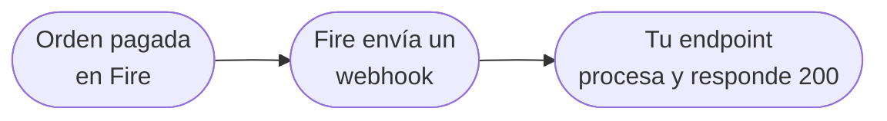

Esta guía te lleva desde "nada" a un handler de webhook funcionando que recibe un evento `order.completed` real de Fire. Vas a configurar un endpoint HTTPS, configurar un Integration Flow en el dashboard de Fire y verificar end to end.

Al final vas a tener:

- Un flow de Fire que dispara en cada orden completada
- Un endpoint HTTPS recibiendo el body del evento
- Procesamiento idempotente con respuesta rápida

<Note>
  Esta guía aplica a los cuatro eventos que Fire emite en producción: `order.completed`, `order.cancelled`, `fiscal.authorized.br`, `fiscal.cancelled.br`. El walkthrough usa `order.completed`; los otros tres siguen el mismo patrón con distintas formas de `data`.
</Note>

## Lo que vas a construir



Un solo endpoint, un solo Integration Flow. Una vez que funciona para `order.completed`, el mismo endpoint maneja todos los demás eventos de Fire ramificando por `event.type`.

## Prerrequisitos

- Una cuenta Fire con acceso al dashboard (**Settings → Integration Flows**)
- Una URL HTTPS accesible públicamente (usa [ngrok](https://ngrok.com) para dev local)
- Algo para correr un servicio Node/Python/Go — cualquier cosa que pueda servir `POST` y parsear JSON

## Paso 1 — Levanta un endpoint mínimo

Empieza con el handler más chico posible. Las preocupaciones de producción (auth, dedup, persistencia) se agregan en el paso 5.

```js Node.js
import express from "express";

const app = express();

app.post("/fire/events", express.json(), (req, res) => {
  console.log("evento recibido:", req.body?.event);
  res.status(200).end();
});

app.listen(8080, () => console.log("escuchando en :8080"));
```

Expónlo públicamente:

```bash
ngrok http 8080
```

Copia la URL HTTPS que ngrok te da (`https://<random>.ngrok.app`). La pegas en el flow de Fire en el siguiente paso.

## Paso 2 — Configura un Integration Flow

En el dashboard de Fire, ve a **Settings → Integration Flows → New flow**.

<Steps>
  <Step title="Elige el trigger">
    Selecciona `order.completed` desde el dropdown de trigger.
  </Step>
  <Step title="Define el scope">
    Elige el account, vendor y (opcionalmente) tiendas específicas para las que debe disparar este flow. Deja tiendas vacío para matchear todas las tiendas del vendor.
  </Step>
  <Step title="Agrega un nodo HTTP">
    Arrastra un nodo HTTP al canvas. Conéctalo desde el trigger.
    - **Método:** `POST`
    - **URL:** la URL de ngrok del paso 1 más el path `/fire/events`
    - **Headers:** `Content-Type: application/json`
    - **Auth:** déjalo en blanco por ahora — lo agregamos en el paso 5
  </Step>
  <Step title="Usa el template canónico de body">
    Pega el template canónico del body en el campo **Body**. Produce el envelope estándar `{ event, data, _meta }` que tu handler espera.

    ```json
    {
      "event": {
        "id":        "{{trigger.event.id}}",
        "type":      "{{trigger.event.type}}",
        "createdAt": "{{trigger.event.createdAt}}"
      },
      "data": "{{trigger.data}}",
      "_meta": {
        "executionId":     "{{execution.id}}",
        "flowId":          "{{flow.id}}",
        "flowName":        "{{flow.name}}",
        "attempt":         "{{queue.attempt}}",
        "triggerEntityId": "{{queue.triggerEntityId}}"
      }
    }
    ```

    La mayoría de equipos parten del template **Webhook Test — Full Order Data** que viene en el dashboard — es la misma forma con cada campo de `data.*` expandido explícitamente.
  </Step>
  <Step title="Activa el flow">
    Guarda y pasa el flow a **Active**.
  </Step>
</Steps>

## Paso 3 — Dispara un evento de prueba

Dos formas de verificar el cableado:

**Opción A — Probar Flujo (dry run).** En el editor del flow, click en **Probar Flujo** y elige un escenario de muestra. Fire despacha un evento sintético a través de tu flow vivo. Tu endpoint debería loguearlo en segundos.

**Opción B — Orden real.** Inyecta una orden de prueba real por tu pipeline normal (POS, kiosko, o `POST /v1/orders`). Una vez que llegue a `status=COMPLETED` y `paymentStatus=SUCCEEDED`, el flow corre y vas a ver la petición en tu endpoint.

Si nada llega en 30 segundos, revisa **Settings → Integration Flows → Executions** para ver ejecuciones fallidas y el mensaje de error.

## Paso 4 — Lee el payload

Tu handler ahora recibe una petición cuyo body se ve así:

```json
{
  "event": {
    "id": "0d6e8a1c-1e7a-4b4f-8a3a-74ab0e9a9b21",
    "type": "order.completed",
    "createdAt": "2026-05-06T01:22:59.902Z"
  },
  "data": {
    "orderId": "21ec1f6c-c301-4528-b999-7836c1d21c6c",
    "orderCode": "OC-br-001",
    "status": "COMPLETED",
    "paymentStatus": "SUCCEEDED",
    "store": { /* ... */ },
    "client": { /* ... */ },
    "payments": { /* ... */ },
    "orderLines": [ /* ... */ ],
    "fulfillment": { /* ... */ }
    /* snapshot V4 completo de la orden */
  },
  "_meta": {
    "executionId": "...",
    "flowId": "...",
    "flowName": "...",
    "attempt": "1",
    "triggerEntityId": "..."
  }
}
```

El objeto `data` es el **snapshot V4 de la orden** — el registro completo de la orden. Consulta [`order.completed`](/es/events/order-completed) para la referencia campo por campo.

## Paso 5 — Hazlo production-ready

El handler mínimo del paso 1 funciona para el demo. Para producción necesitas tres cosas más.

### Confirma rápido, procesa async

Fire hace timeout a los **30 segundos**. Confirma primero; procesa en background.

```js
app.post("/fire/events", express.json(), async (req, res) => {
  // 1. Ack inmediatamente
  res.status(200).end();

  // 2. Procesa async — nunca await antes de res.end()
  queue.push(req.body).catch(console.error);
});
```

### Deduplica por event.id

Fire reintenta ante cualquier respuesta no-`2xx`. Usa `event.id` (el ID de ejecución del flow) para saltarte duplicados.

```js
const seen = new Map(); // reemplaza por Redis/DB en producción

async function process({ event, data }) {
  if (seen.has(event.id)) return;
  seen.set(event.id, Date.now());

  switch (event.type) {
    case "order.completed":      return onOrderCompleted(data);
    case "order.cancelled":      return onOrderCancelled(data);
    case "fiscal.authorized.br": return onFiscalAuthorized(data);
    case "fiscal.cancelled.br":  return onFiscalCancelled(data);
  }
}
```

### Autentica la petición

Fire actualmente no firma webhooks salientes con HMAC. Autentica agregando una credencial al nodo HTTP de tu flow y validándola de tu lado. Tres opciones:

- **Bearer token** — pon `Authorization: Bearer <secret>` en los headers del flow; valídalo en tu handler.
- **API key** — pon `x-api-key: <secret>` en los headers del flow; valídalo.
- **OAuth2 client credentials** — para tenants que necesitan tokens rotativos; el flow obtiene el token automáticamente.

```js
app.post("/fire/events", express.json(), (req, res) => {
  const auth = req.header("authorization");
  if (auth !== `Bearer ${process.env.FIRE_WEBHOOK_SECRET}`) {
    return res.status(401).end();
  }
  // ... resto del handler
});
```

<Note>
  La firma HMAC (`X-Fire-Signature`) está en el roadmap y será opt-in cuando salga. Por ahora, un secret compartido en el header del flow es el mecanismo canónico de autenticación.
</Note>

## Errores comunes

- **Los valores monetarios son strings × 10000.** `payments.totals[0].total === "229000"` significa 22.9. Parsea con una librería decimal; nunca con `parseFloat`.
- **`event.id` es el ID de ejecución del flow, no el ID de la orden.** Usa `event.id` como llave de idempotencia; usa `data.orderId` como llave de negocio.
- **`fulfillment.delivery` puede estar presente incluso en órdenes dine-in / pickup** con ceros placeholder. Ramifica por `fulfillment.service.code`, no por `delivery !== null`.
- **`payments.totals[]` y `paymentMethods[]` mezclan camelCase y snake_case.** Lee tanto `currencyCode` como `currency_code` defensivamente en esos objetos.

## Próximos pasos

<CardGroup cols={2}>
  <Card title="Referencia order.completed" icon="receipt" href="/es/events/order-completed">
    Referencia completa del payload, incluyendo bloques fiscales BR.
  </Card>
  <Card title="Referencia order.cancelled" icon="ban" href="/es/events/order-cancelled">
    Payload de cancelación con metadata de auditoría.
  </Card>
  <Card title="Integration Flows" icon="diagram-project" href="/es/events/integration-flows">
    Cobertura más profunda de scoping, body templates y tipos de nodo.
  </Card>
  <Card title="Entrega y reintentos" icon="repeat" href="/es/events/delivery">
    Política de retry, dead-letter y modelo de idempotencia.
  </Card>
</CardGroup>
