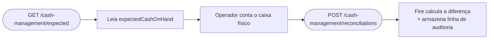

<Warning>
  **API de parceiro.** Este endpoint é destinado a integradores de plataforma. Clientes padrão do Fire não têm acesso direto — entre em contato com seu account manager se precisar desta integração.
</Warning>

Retorna o relatório de vendas e caixa rastreado pelo sistema para uma loja/dia, usado para determinar o que o caixa **deveria** conter antes do operador fazer a contagem. A resposta é densa — cobre todas as moedas, todos os métodos de pagamento (com valores específicos para dinheiro: tendered/change/expected-on-hand), totais por canal e serviço, detalhamentos por operador e dispositivo, e um resumo de cancelamentos.

Este é o input principal para [POST conciliações de caixa](/pt/api-reference/cash-reconciliations) — chame isto primeiro, apresente `expectedCashOnHand` ao operador, depois registre sua contagem declarada.

## Autenticação

<ParamField header="x-api-key" type="string" required>
  Sua API key do Fire com scope `cash-management:read`. A key **deve ser vendor-scoped** — keys system-only são rejeitadas com `403`.
</ParamField>

## Query parameters

<ParamField query="storeId" type="string" required>
  UUID da loja. Deve pertencer ao account/vendor da sua API key.
</ParamField>

<ParamField query="businessDayDate" type="string">
  `YYYY-MM-DD`. O dia de negócio sobre o qual reportar. Default é o dia operacional atual da loja no seu fuso horário.
</ParamField>

<ParamField query="operatorUid" type="string">
  Filtra o relatório para um único caixa/operador. Quando omitido, o relatório cobre todos os operadores do dia.
</ParamField>

<RequestExample>
```http
GET https://app.fire.rest/api/v1/adapters/xmart/cash-management/expected?storeId=550e8400-e29b-41d4-a716-446655440000&businessDayDate=2026-05-06
x-api-key: <sua_api_key>
```
</RequestExample>

## Resposta

<ResponseField name="store" type="object">
  Metadata a nível de loja.

  <Expandable title="store">
    <ResponseField name="storeId" type="string">UUID.</ResponseField>
    <ResponseField name="storeCode" type="string | null">Código de loja (ex.: `BR-SP-001`).</ResponseField>
    <ResponseField name="storeName" type="string | null">Nome de exibição.</ResponseField>
    <ResponseField name="accountId" type="string">Account dono da loja.</ResponseField>
    <ResponseField name="vendorId" type="string | null">Escopo de vendor.</ResponseField>
    <ResponseField name="timezone" type="string | null">Fuso horário IANA — usado para calcular o dia de negócio.</ResponseField>
  </Expandable>
</ResponseField>

<ResponseField name="businessDay" type="object">
  Status do dia de negócio que este relatório cobre.

  <Expandable title="businessDay">
    <ResponseField name="date" type="string | null">`YYYY-MM-DD`.</ResponseField>
    <ResponseField name="state" type="string">`OPEN` ou `CLOSED`.</ResponseField>
    <ResponseField name="openedAt" type="string | null">ISO 8601 UTC.</ResponseField>
    <ResponseField name="closedAt" type="string | null">ISO 8601 UTC. `null` enquanto aberto.</ResponseField>
  </Expandable>
</ResponseField>

<ResponseField name="generatedAt" type="string">
  ISO 8601 UTC de quando este relatório foi calculado. Snapshot — chame de novo para atualizar.
</ResponseField>

<ResponseField name="summary" type="object">
  Contagens de pedidos rapidamente.

  <Expandable title="summary">
    <ResponseField name="totalOrders" type="number">Todos os pedidos do escopo.</ResponseField>
    <ResponseField name="completedOrders" type="number">`status=COMPLETED && paymentStatus=SUCCEEDED`.</ResponseField>
    <ResponseField name="openOrders" type="number">`status=OPEN`.</ResponseField>
    <ResponseField name="cancelledOrders" type="number">`status=CANCELLED`.</ResponseField>
    <ResponseField name="forceClosedOrders" type="number">Pedidos force-closed no fechamento do dia (system-driven).</ResponseField>
  </Expandable>
</ResponseField>

<ResponseField name="currencies" type="object[]">
  Uma entrada por moeda observada no dia. A maioria das lojas tem uma moeda; lojas multi-moeda têm uma entrada por cada.

  <Expandable title="currencies[n]">
    <ResponseField name="currency" type="string">ISO 4217.</ResponseField>
    <ResponseField name="sales" type="object">
      Revenue agregado.
      <Expandable title="sales">
        <ResponseField name="gross" type="number">Revenue total antes de descontos/impostos.</ResponseField>
        <ResponseField name="net" type="number">Após descontos.</ResponseField>
        <ResponseField name="taxes" type="number">Valor de impostos.</ResponseField>
        <ResponseField name="discounts" type="number">Valor total de descontos.</ResponseField>
        <ResponseField name="orderCount" type="number">Número de pedidos completados contribuindo.</ResponseField>
      </Expandable>
    </ResponseField>
    <ResponseField name="byPaymentMethod" type="object[]">
      Uma entrada por processador de pagamento usado no dia.
      <Expandable title="byPaymentMethod[n]">
        <ResponseField name="processor" type="string">ex.: `cash`, `Kushki`, `MASTERCARD`, `voucher`.</ResponseField>
        <ResponseField name="transactionCount" type="number">Todas as tentativas.</ResponseField>
        <ResponseField name="approvedCount" type="number">`transactionStatus = APPROVED`.</ResponseField>
        <ResponseField name="rejectedCount" type="number">Recusadas / falhas.</ResponseField>
        <ResponseField name="pendingCount" type="number">Em voo.</ResponseField>
        <ResponseField name="totalBilled" type="number">Soma de `totalBill` em transações aprovadas.</ResponseField>
        <ResponseField name="cashTendered" type="number | null">**Apenas cash** — total de dinheiro entregue pelos clientes.</ResponseField>
        <ResponseField name="changeGiven" type="number | null">**Apenas cash** — total de troco devolvido.</ResponseField>
        <ResponseField name="expectedCashOnHand" type="number | null">
          **Apenas cash** — `cashTendered - changeGiven`. É o valor canônico para comparar contra a contagem declarada do operador.
        </ResponseField>
      </Expandable>
    </ResponseField>
    <ResponseField name="byChannelAndService" type="object[]">
      Vendas detalhadas por canal (`KIOSK`, `IFOOD`, `RAPPI`, `APP`, …) com sub-detalhamentos por serviço de fulfillment (`DELIVERY`, `DINE_IN`, `TAKEAWAY`, `PICKUP`).
    </ResponseField>
    <ResponseField name="byOperator" type="object[]">
      Por caixa/operador: `operatorUid`, `operatorName`, `orderCount`, `total`. Útil para relatórios de fim de turno.
    </ResponseField>
    <ResponseField name="byDevice" type="object[]">
      Por dispositivo: `deviceUid`, `deviceName`, `orderCount`, `total`.
    </ResponseField>
    <ResponseField name="byOperatorAndPaymentMethod" type="object[]">
      Cross-cut: por operador, o mesmo formato `byPaymentMethod`. Use para calcular o caixa esperado **por caixa** ao rodar uma conciliação multi-caixa.
    </ResponseField>
    <ResponseField name="cancelled" type="object">
      `count`, `totalLost` (revenue perdido por cancelamentos), e array `byReason` (`reason`, `count`, `total`).
    </ResponseField>
    <ResponseField name="pendingRisk" type="object">
      Indicadores de risco: `openOrdersTotal`, `paymentPendingTotal`, `paymentFailedTotal`. Use para sinalizar revenue incerto no fechamento.
    </ResponseField>
  </Expandable>
</ResponseField>

<ResponseExample>
```json 200 — abreviado
{
  "store": {
    "storeId": "550e8400-e29b-41d4-a716-446655440000",
    "storeCode": "BR-SP-001",
    "storeName": "Loja Centro - SP",
    "accountId": "100",
    "vendorId": "v_blueco_br",
    "timezone": "America/Sao_Paulo"
  },
  "businessDay": {
    "date": "2026-05-06",
    "state": "OPEN",
    "openedAt": "2026-05-06T06:00:00.000Z",
    "closedAt": null
  },
  "generatedAt": "2026-05-06T16:50:00.000Z",
  "summary": {
    "totalOrders": 157,
    "completedOrders": 152,
    "openOrders": 3,
    "cancelledOrders": 2,
    "forceClosedOrders": 0
  },
  "currencies": [
    {
      "currency": "BRL",
      "sales": {
        "gross": 4523.50,
        "net": 4350.25,
        "taxes": 623.75,
        "discounts": 173.25,
        "orderCount": 152
      },
      "byPaymentMethod": [
        {
          "processor": "cash",
          "transactionCount": 95,
          "approvedCount": 95,
          "rejectedCount": 0,
          "pendingCount": 0,
          "totalBilled": 2250.00,
          "cashTendered": 2350.00,
          "changeGiven": 100.00,
          "expectedCashOnHand": 2250.00
        },
        {
          "processor": "MASTERCARD",
          "transactionCount": 57,
          "approvedCount": 55,
          "rejectedCount": 1,
          "pendingCount": 1,
          "totalBilled": 2100.25,
          "cashTendered": null,
          "changeGiven": null,
          "expectedCashOnHand": null
        }
      ],
      "byChannelAndService": [
        {
          "channel": "KIOSK",
          "orderCount": 95,
          "total": 2850.50,
          "services": [{ "service": "DINE_IN", "orderCount": 95, "total": 2850.50 }]
        }
      ],
      "byOperator": [
        { "operatorUid": "op-cashier-123", "operatorName": "Operator Name", "orderCount": 75, "total": 2200.00 }
      ],
      "byDevice": [
        { "deviceUid": "device-uuid-1", "deviceName": "Terminal 1", "orderCount": 152, "total": 4350.25 }
      ],
      "byOperatorAndPaymentMethod": [
        {
          "operatorUid": "op-cashier-123",
          "operatorName": "Operator Name",
          "byPaymentMethod": [
            {
              "processor": "cash",
              "transactionCount": 75,
              "approvedCount": 75,
              "rejectedCount": 0,
              "pendingCount": 0,
              "totalBilled": 2200.00,
              "cashTendered": 2300.00,
              "changeGiven": 100.00,
              "expectedCashOnHand": 2200.00
            }
          ]
        }
      ],
      "cancelled": {
        "count": 2,
        "totalLost": 95.50,
        "byReason": [
          { "reason": "Customer Request", "count": 1, "total": 45.00 },
          { "reason": "System Error",     "count": 1, "total": 50.50 }
        ]
      },
      "pendingRisk": {
        "openOrdersTotal": 189.75,
        "paymentPendingTotal": 150.00,
        "paymentFailedTotal": 39.75
      }
    }
  ]
}
```

```json 400 — storeId inválido
{
  "error": {
    "code": "validation_error",
    "message": "storeId must be a UUID"
  }
}
```

```json 403 — key system-only (falta binding de account)
{
  "error": {
    "code": "forbidden",
    "message": "cash-management endpoints require a vendor-scoped API key"
  }
}
```

```json 404 — loja não encontrada / não no seu escopo
{
  "error": {
    "code": "not_found",
    "message": "Store not found"
  }
}
```
</ResponseExample>

## Como usar com conciliação



O `expectedCashOnHand` canônico para comparar é por moeda, por método de pagamento `cash`. Para fechamentos por caixa, entre em `byOperatorAndPaymentMethod[i].byPaymentMethod` e encontre a entrada `cash` — esse é o esperado específico do operador.

## Padrões comuns

- **Dashboard de fim de turno em tempo real.** Pollee este endpoint a cada poucos minutos durante um dia movimentado para mostrar totais correndo; congele o snapshot no fechamento do turno.
- **Fechamento por caixa.** Filtre com `operatorUid=...` para obter apenas os totais desse caixa; registre sua conciliação contra `byOperatorAndPaymentMethod[].byPaymentMethod[cash].expectedCashOnHand`.
- **Lojas multi-moeda.** Itere sobre `currencies[]` — cada entrada é independente; concilie cada moeda separadamente.
- **Risco pendente.** Mostre `pendingRisk.paymentFailedTotal` e `pendingRisk.openOrdersTotal` aos operadores antes do fechamento — são valores que o sistema não pode confirmar.

## Relacionado

<CardGroup cols={2}>
  <Card title="Conciliações de caixa" icon="abacus" href="/pt/api-reference/cash-reconciliations">
    Registre a contagem do operador após ler o caixa esperado aqui.
  </Card>
  <Card title="Autenticação" icon="lock" href="/pt/authentication">
    API keys vendor-scoped e o scope `cash-management:read`.
  </Card>
</CardGroup>
