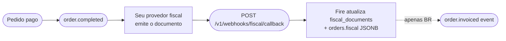

Este endpoint é **inbound** — seu provedor fiscal faz POST nele sempre que um documento fiscal é autorizado, rejeitado, denegado, cancelado ou falha. É a **API canônica multi-país de fiscal callback** que aceita payloads de BR, CO, EC, CL, AR, VE. O Fire valida o payload, atualiza o estado fiscal do pedido em `fiscal_documents` e `orders.fiscal`, e — para o Brasil — despacha eventos outbound `order.invoiced` / `order.reversed` para seus Integration Flows.

<Note>
  **Este endpoint é assíncrono.** O Fire autentica, roda o guard de source-of-truth + tenancy, deduplica, pré-marca o pedido como `processing` e **enfileira** o callback — depois retorna **`202 Accepted`** com um `webhookEventId` (tipicamente em menos de 100&nbsp;ms). A atualização de `fiscal_documents` / `orders.fiscal` acontece um instante depois em um worker em segundo plano (normalmente em ~2&nbsp;segundos). Para ver o resultado do processamento, consulte [`GET /v1/webhooks/events/{webhookEventId}`](#verificar-o-resultado). Problemas corrigíveis pelo cliente (payload inválido, `eventId` errado, tenant errado, uma ação reusando o evento de outra) são rejeitados **sincronamente** com `4xx` **antes** do `202`.
</Note>

## Como complementa `order.completed` e `order.cancelled`

`order.completed` e `order.cancelled` carregam o **estado de negócio** de um pedido. O callback fiscal carrega o **estado fiscal** (autorização SEFAZ / DIAN / SRI / SII / AFIP / SENIAT). Juntos formam este lifecycle:



Após processar o callback, o **próximo** `order.completed` ou `order.cancelled` para o mesmo `orderId` reflete o estado fiscal atualizado em:

- `data.store.storeFiscalConfig` — contexto do emissor (CNPJ / NIT / RUC / RUT / CUIT / RIF…)
- `data.payments.metadata.fiscal` — agregados fiscais totais (BR populado; outros países `null`)
- `data.orderLines[].metadata.fiscal` — classificação fiscal por linha (BR populado; outros `null`)

Para o Brasil especificamente, também é emitido um evento `order.invoiced` (ou `order.reversed`) separado com as referências do documento SEFAZ em `data.fiscal`.

<Note>
  **Hoje, apenas `order.invoiced` e `order.reversed` estão cabeados como eventos outbound (Brasil).** O endpoint valida e armazena callbacks para os 6 países (CO, EC, CL, AR, VE, BR), e o estado fiscal atualizado aparece no próximo evento `order.completed` / `order.cancelled` independentemente do país. Os eventos outbound para CO/EC/CL/AR/VE estão a caminho.
</Note>

## Autenticação

Este endpoint requer uma **API key com scope `webhooks:fiscal`**, vendor-scoped ao account dono do pedido. Keys sem scope ou apenas a nível account são rejeitadas com `403 Forbidden`.

<ParamField header="x-api-key" type="string" required>
  Sua API key do Fire. Gere uma no dashboard em **Settings → API Keys → Developer keys**, com scope `webhooks:fiscal` e um binding de vendor para o account cujos pedidos esta key pode atualizar.
</ParamField>

<ParamField header="Authorization" type="string">
  Opcional `Bearer <token>`. Não exigido para este endpoint hoje, mas reservado para futuros tokens emitidos pelo provedor.
</ParamField>

## Corpo da requisição

O body é um objeto JSON com estes campos top-level. **Tudo o que é canônico vive aqui em cima**; `document` leva SOMENTE o vocabulário do ente do seu país, escolhido por `country` — veja [Documento por país](#documento-por-pais) abaixo.

<ParamField body="country" type="string" required>
  Código de país ISO 3166-1 alpha-2. Um de `BR`, `CO`, `EC`, `CL`, `AR`, `VE`. Determina as regras de validação do objeto `document`.

  **Antes se chamava `countryCode`.**
</ParamField>

<ParamField body="eventType" type="string" required>
  Estado do documento. Um de:
  - `fiscal_graphic` — o provedor está entregando a **representação gráfica** (o artefato imprimível) do documento. **Não é uma aprovação** nem um estado terminal — veja [O estado `fiscal_graphic`](#o-estado-fiscal_graphic) abaixo.
  - `authorized` — a autoridade fiscal aprovou o documento
  - `cancelled` — um documento previamente autorizado foi cancelado
  - `rejected` — o documento foi rejeitado (validação, schema, assinatura)
  - `denied` — a autoridade negou a solicitação (tipicamente falha permanente de regra de negócio)
  - `error` — ocorreu um erro não recuperável no provedor ou autoridade

  Quando `eventType` é `fiscal_graphic`, `authorized` ou `cancelled`, o campo `document` é **obrigatório**. Quando é `rejected`, `denied` ou `error`, o campo `error` é **obrigatório**.
</ParamField>

<ParamField body="providerEventId" type="string" required>
  O id próprio do seu provedor para esta entrega. Armazenado para auditoria/forense — **não é a chave de idempotência**. O Fire deduplica por `(orderId, eventId)`, então você pode enviar um `providerEventId` novo a cada retentativa sem criar duplicatas. Use o ID nativo do evento do provedor se disponível; caso contrário, um UUID.
</ParamField>

<ParamField body="occurredAt" type="string" required>
  Timestamp ISO 8601 UTC de quando o evento ocorreu na autoridade fiscal (não quando o provedor enviou o callback).
</ParamField>

<ParamField body="orderId" type="string" required>
  UUID do pedido no Fire. Coincide com `data.orderId` nos eventos `order.completed` e `order.cancelled`. O Fire o usa para encontrar o documento fiscal existente.
</ParamField>

<ParamField body="eventId" type="string" required>
  UUID de correlação **e chave de idempotência** (junto com `orderId`). Deve ser o `event.id` de um envelope V4 que **o Fire emitiu para este pedido** — ecoe-o exato; nunca o invente.

  - **Verificação de fonte da verdade.** Um `eventId` que não referencie um evento do Fire para esse pedido é rejeitado com `400` antes do `202`.
  - **Cada ação carrega seu próprio evento.** Ecoe o `event.id` do evento que disparou *esta* ação — a emissão `order.invoiced` para um callback `authorized`, o evento de cancelamento/estorno para um callback `cancelled`. Reusar o `eventId` de uma ação para outro `eventType` (ex. um `cancelled` que ecoa o `eventId` do `authorized`) é rejeitado com **`409`** — um cancelamento deve referenciar seu **próprio** evento, não se pendurar no da autorização. Veja [Idempotência e cenários](#idempotência-e-cenários).
</ParamField>

<ParamField body="document" type="object">
  O vocabulário do ente do seu país, e **nada mais**: `claveAcceso`, `cufe`, `chaveAcesso`, `folio`, `cae`… **Obrigatório** quando `eventType` é `authorized` ou `cancelled`. Veja [Documento por país](#documento-por-pais).

  Os campos comuns —`docType`, as URLs, os valores, as datas— **não vão mais aqui dentro**: subiram para a raiz.
</ParamField>

### Campos canônicos (raiz)

Significam a mesma coisa nos seis países, então vivem na **raiz** do payload e não dentro de `document`. É a mesma regra da resposta de numeração fiscal, para que o mesmo fato não seja procurado em duas profundidades distintas segundo por onde entrou.

<ParamField body="docType" type="string">
  `invoice` ou `cancellation`. **Obrigatório quando há comprovante** (`authorized` / `cancelled`); uma rejeição não tem documento a tipificar.
</ParamField>

<ParamField body="docSubtype" type="string">
  Como o seu regime o chama: `nfce`, `nfe`, `factura`, `boleta`, `factura_a`. Aberto: não o validamos contra uma lista e **não ramifica nada** do nosso lado — é referencial. **Obrigatório quando há comprovante.**
</ParamField>

<ParamField body="issuedAt" type="string">
  Data/hora UTC (ISO 8601) em que o documento foi emitido. Mesmo nome que na numeração fiscal.
</ParamField>

<ParamField body="cancelledAt" type="string">
  Data/hora UTC do cancelamento — relevante quando `eventType` é `cancelled`.
</ParamField>

<ParamField body="authorizationMode" type="string">
  `ONLINE`, `OFFLINE` ou `BATCH`. `OFFLINE` é contingência: o comprovante vale mas foi emitido sem conseguir consultar o ente, e há regimes que exigem que o ticket o diga (o RIDE equatoriano imprime `EMISION POR CONTINGENCIA`).
</ParamField>

<ParamField body="pdfUrl" type="string">
  Link de download do PDF (DANFE / RIDE / representação gráfica). **Obrigatório** para `authorized`, `cancelled` e `fiscal_graphic`.
</ParamField>

<ParamField body="xmlUrl" type="string">
  Link de download do XML canônico do ente. **Obrigatório** para `authorized` e `cancelled`.
</ParamField>

<ParamField body="totalAmount" type="number">
  Valor total bruto do documento, em decimais reais.
</ParamField>

<ParamField body="taxAmount" type="number">
  Valor total de impostos.
</ParamField>

<ParamField body="currencyCode" type="string">
  Código ISO 4217 — exatamente 3 letras (`BRL`, `COP`, `USD`).
</ParamField>

<ParamField body="providerDocId" type="string">
  O id do documento no seu sistema. É por ele que o PDF e o XML são buscados.
</ParamField>

<ParamField body="orderCode" type="string">
  O código VISÍVEL do pedido, o que se lê no ticket. Não substitui `orderId` —esse é o UUID que resolve o pedido— serve para conciliar contra o seu sistema, que quase nunca conhece nossos UUIDs.
</ParamField>

<ParamField body="provider" type="object">
  Quem emitiu e com qual versão.

  <Expandable title="provider">
    <ParamField body="name" type="string">Nome do provedor (`hio.fiscalization`, `plugnotas`).</ParamField>
    <ParamField body="version" type="string">Versão do emissor.</ParamField>
    <ParamField body="reference" type="string">Referência livre.</ParamField>
  </Expandable>
</ParamField>

<ParamField body="failure" type="object">
  Por que NÃO há comprovante. **Obrigatório** quando `eventType` é `rejected`, `denied` ou `error`.

  **Antes se chamava `error`**, e agora leva a mesma forma que a resposta de numeração fiscal.

  <Expandable title="failure">
    <ParamField body="code" type="string">
      Código de erro opcional do provedor/autoridade (p. ex. `DIAN_42`, `cStat_204`).
    </ParamField>
    <ParamField body="scope" type="string">
      `TECHNICAL` ou `FUNCTIONAL`. É o que o canal ramifica: com `TECHNICAL` o comprovante ainda pode sair e o ticket imprime «em trâmite»; com `FUNCTIONAL` o ente o rejeitou pelo conteúdo e não vai sair.
    </ParamField>
    <ParamField body="message" type="string" required>
      Mensagem legível. Mínimo 1 caractere.
    </ParamField>
    <ParamField body="details" type="array">
      Detalhe campo a campo, quando o ente fornece.
    </ParamField>
  </Expandable>
</ParamField>

<ParamField body="metadata" type="object">
  Bag free-form para extras específicos do provedor (resposta raw, IDs internos, etc.). Não validado; chega ao log de auditoria e **não** é guardado junto ao documento.

  **Antes se chamava `providerSpecific`.**
</ParamField>

## Documento por país

A forma exigida de `document` depende de `country`. **`document` leva SOMENTE os identificadores do ente desse país** — os campos comuns aos seis vivem na raiz do payload, acima.

<Warning>
  **`document` mudou de conteúdo**

  Até agora `document` misturava duas coisas: o que significa o mesmo em todos os países
  —`docType`, `pdfUrl`, `xmlUrl`, os valores, as datas— e o vocabulário do ente de cada um.
  Essa mistura se propagava para tudo o que lia o callback.

  Agora **o canônico vive na raiz** e `document` fica só com o do regime. É a mesma forma da
  resposta de numeração fiscal: o mesmo fato, no mesmo lugar, sem importar por onde entrou.

  Outras mudanças do mesmo pacote: `countryCode` → `country`, `error` → `failure` (com `scope`
  e `details`), `providerSpecific` → `metadata`, e `emittedAt` → `issuedAt`.
</Warning>

<Tabs>
  <Tab title="Brasil (BR)">
    Documentos fiscais brasileiros (NF-e / NFC-e). Use este código de país ao enviar callbacks do seu provedor fiscal ou de qualquer outro provedor BR.

    Além dos [campos base comuns](#campos-base-comuns) (`docType`, `docSubtype`, `pdfUrl`, `xmlUrl`, `issuedAt`, etc.), o BR exige estes identificadores específicos:

    | Campo | Tipo | Obrigatório | Notas |
    |---|---|---|---|
    | `chaveAcesso` | string | ✓ | Exatamente 44 dígitos — chave de acesso SEFAZ |
    | `protocolo` | string | ✓ | Protocolo de autorização SEFAZ |
    | `numero` | int / string | ✓ | Número do documento |
    | `serie` | int / string \| null | | Série do documento (codificada na chave) |
    | `modelo` | `55` / `65` \| null | | `55` = NF-e, `65` = NFC-e |
    | `cnpjEmitente` | string \| null | | CNPJ do emissor |

    O exemplo abaixo inclui os campos base opcionais (`pdfUrl`, `xmlUrl`, `issuedAt`, `totalAmount`, `taxAmount`, `currencyCode`) — todos podem ser omitidos, mas envie-os se seu provedor os tiver:

    ```json
    {
      "country": "BR",
      "eventType": "authorized",
      "providerEventId": "evt-br-1",
      "occurredAt": "2026-04-26T14:32:11.000Z",
      "orderId": "550e8400-e29b-41d4-a716-446655440000",
      "eventId": "7c9e6679-7425-40de-944b-e07fc1f90ae7",
      "docType": "invoice",
      "docSubtype": "nfce",
      "issuedAt": "2026-04-26T14:32:10.000Z",
      "totalAmount": 142.90,
      "taxAmount": 18.57,
      "currencyCode": "BRL",
      "pdfUrl": "https://api.fiscal-provider.example/nfce/69fa97fe427d1240856e1282/pdf",
      "xmlUrl": "https://api.fiscal-provider.example/nfce/69fa97fe427d1240856e1282/xml",
      "document": {
        "chaveAcesso": "35260229062609000177650500000000011000000010",
        "protocolo": "141210001176277",
        "numero": 1,
        "serie": 50,
        "modelo": 65,
        "cnpjEmitente": "29062609000177"
      }
    }
    ```
  </Tab>

  <Tab title="Colombia (CO)">
    Documentos fiscais colombianos (DIAN).

    | Campo | Tipo | Obrigatório | Notas |
    |---|---|---|---|
    | `cufe` | string | ✓ | Código fiscal único DIAN |
    | `prefijo` | string | ✓ | Prefixo do documento |
    | `numeroDian` | string | ✓ | Número de documento DIAN |
    | `qrCode` | string (URL) \| null | | QR para o documento impresso |
    | `numeroComprobante` | string \| null | | O número **visível**, já montado: `prefixo + consecutivo` |
    | `ambiente` | `"1"` \| `"2"` \| null | | **`1` produção · `2` homologação** — o contrário do SRI |

    ```json
    {
      "country": "CO",
      "eventType": "authorized",
      "providerEventId": "evt-co-1",
      "occurredAt": "2026-04-26T14:32:11.000Z",
      "orderId": "550e8400-e29b-41d4-a716-446655440000",
      "eventId": "7c9e6679-7425-40de-944b-e07fc1f90ae7",
      "docType": "invoice",
      "docSubtype": "factura",
      "issuedAt": "2026-04-26T14:32:10.000Z",
      "totalAmount": 95000.00,
      "taxAmount": 15170.17,
      "currencyCode": "COP",
      "pdfUrl": "https://api.fiscal-provider.example/dian/C012001/pdf",
      "xmlUrl": "https://api.fiscal-provider.example/dian/C012001/xml",
      "document": {
        "cufe": "633732c7a2a577bfa1828551e64d03f715f0",
        "prefijo": "C012",
        "numeroDian": "001",
        "numeroComprobante": "C012001",
        "ambiente": "1",
        "qrCode": "https://catalogo-vpfe.dian.gov.co/document/searchqr?documentkey=633732c7a2a577bfa1828551e64d03f715f0"
      }
    }
    ```

    <Note>
      **Os nomes são os mesmos da numeração**, de propósito: `cufe`, `prefijo`, `numeroDian`,
      `numeroComprobante`, `qrCode` e `ambiente` significam aqui exatamente o mesmo que na
      resposta do prekey. É o mesmo documento contado duas vezes, e se os nomes divergissem,
      conciliar os dois caminhos deixaria de ser comparar campos.

      **`numeroDian` vai sem o prefixo** (`990000001`, não `SETP990000001`). O número montado é
      `numeroComprobante`. Mandar o montado nos dois faz a conciliação comparar `SETP990000001`
      contra `990000001`, e nunca cruzam.

      Os dois campos novos são **opcionais**: quem já manda callbacks sem eles continua
      funcionando. O callback nunca é rejeitado por um campo que falte — quando chega, o
      documento já existe perante a DIAN.
    </Note>
  </Tab>

  <Tab title="Equador (EC)">
    Documentos fiscais equatorianos (SRI).

    | Campo | Tipo | Obrigatório | Notas |
    |---|---|---|---|
    | `claveAcceso` | string | ✓ | Exatamente 49 dígitos — chave de acesso SRI |
    | `numeroComprobante` | string \| null | | O número **visível**, já montado: `estab-ptoEmi-secuencial` |
    | `ambiente` | `'1'` / `'2'` \| null | | `1` = teste, `2` = produção |
    | `establecimiento` | string \| null | | Código do estabelecimento (`001`) |
    | `puntoEmision` | string \| null | | Código do ponto de emissão (`020`) |
    | `secuencial` | string \| null | | Sequencial do comprovante (`000000123`) |

    <Note>
      **`numeroAutorizacion` foi retirado do contrato.** No esquema de autorização on-line o
      SRI devolve como número de autorização **a própria chave de acesso**, então era o mesmo
      dado declarado duas vezes. Se o seu sistema continuar enviando não quebra nada —os
      campos não declarados são preservados— mas não o pedimos nem o interpretamos. Quem
      precisar do número de autorização lê `claveAcceso`.

      **As três peças do número** —`establecimiento`, `puntoEmision`, `secuencial`— agora
      existem nos dois caminhos: a numeração prévia e este callback. São **opcionais**: se o
      seu provedor não as emite, não as envie. A Fire não as deriva de `claveAcceso` —essa
      regra é do regime— e o comprovante é impresso sem elas.
    </Note>

    ```json
    {
      "country": "EC",
      "eventType": "authorized",
      "providerEventId": "evt-ec-1",
      "occurredAt": "2026-04-26T14:32:11.000Z",
      "orderId": "550e8400-e29b-41d4-a716-446655440000",
      "eventId": "7c9e6679-7425-40de-944b-e07fc1f90ae7",
      "docType": "invoice",
      "docSubtype": "factura",
      "issuedAt": "2026-04-26T14:32:10.000Z",
      "totalAmount": 24.50,
      "taxAmount": 3.15,
      "currencyCode": "USD",
      "pdfUrl": "https://api.fiscal-provider.example/sri/AUT-EC-001/pdf",
      "xmlUrl": "https://api.fiscal-provider.example/sri/AUT-EC-001/xml",
      "document": {
        "numeroComprobante": "001-020-000000123",
        "claveAcceso": "0102030405060708091011121314151617181920212223242",
        "establecimiento": "001",
        "puntoEmision": "020",
        "secuencial": "000000123",
        "ambiente": "2"
      }
    }
    ```
  </Tab>

  <Tab title="Chile (CL)">
    Documentos fiscais chilenos (SII DTE).

    | Campo | Tipo | Obrigatório | Notas |
    |---|---|---|---|
    | `folio` | int / string | ✓ | Número de folio do DTE |
    | `ted` | string | ✓ | TED (Timbre Electrónico) — base64 ou fragmento XML |
    | `tipoDte` | int / string | ✓ | Tipo DTE (ex.: `33` = factura electrónica) |
    | `trackId` | string \| null | | Track ID SII para queries de seguimento |

    ```json
    {
      "country": "CL",
      "eventType": "authorized",
      "providerEventId": "evt-cl-1",
      "occurredAt": "2026-04-26T14:32:11.000Z",
      "orderId": "550e8400-e29b-41d4-a716-446655440000",
      "eventId": "7c9e6679-7425-40de-944b-e07fc1f90ae7",
      "docType": "invoice",
      "docSubtype": "factura",
      "issuedAt": "2026-04-26T14:32:10.000Z",
      "totalAmount": 18900,
      "taxAmount": 3019,
      "currencyCode": "CLP",
      "pdfUrl": "https://api.fiscal-provider.example/sii/12345/pdf",
      "xmlUrl": "https://api.fiscal-provider.example/sii/12345/xml",
      "document": {
        "folio": 12345,
        "ted": "<TED>...base64-or-xml...</TED>",
        "tipoDte": 33,
        "trackId": "SII-TRK-998877"
      }
    }
    ```
  </Tab>

  <Tab title="Argentina (AR)">
    Documentos fiscais argentinos (AFIP).

    | Campo | Tipo | Obrigatório | Notas |
    |---|---|---|---|
    | `cae` | string | ✓ | Código de Autorização Eletrônico |
    | `fechaVtoCae` | string | ✓ | Data de vencimento do CAE |
    | `puntoVenta` | int / string | ✓ | Número do ponto de venda |
    | `numeroComprobante` | int / string | ✓ | Número do documento |
    | `tipoComprobante` | int / string | ✓ | Tipo de documento (`1` = factura A, …) |

    ```json
    {
      "country": "AR",
      "eventType": "authorized",
      "providerEventId": "evt-ar-1",
      "occurredAt": "2026-04-26T14:32:11.000Z",
      "orderId": "550e8400-e29b-41d4-a716-446655440000",
      "eventId": "7c9e6679-7425-40de-944b-e07fc1f90ae7",
      "docType": "invoice",
      "docSubtype": "factura_a",
      "issuedAt": "2026-04-26T14:32:10.000Z",
      "totalAmount": 12100.00,
      "taxAmount": 2100.00,
      "currencyCode": "ARS",
      "pdfUrl": "https://api.fiscal-provider.example/afip/0001-12345/pdf",
      "xmlUrl": "https://api.fiscal-provider.example/afip/0001-12345/xml",
      "document": {
        "cae": "74256178925412",
        "fechaVtoCae": "2026-05-31",
        "puntoVenta": 1,
        "numeroComprobante": 12345,
        "tipoComprobante": 1
      }
    }
    ```
  </Tab>

  <Tab title="Venezuela (VE)">
    Documentos fiscais venezuelanos (SENIAT).

    | Campo | Tipo | Obrigatório | Notas |
    |---|---|---|---|
    | `numeroControl` | string | ✓ | Número da faixa de controle emitida pela SENIAT |
    | `numeroFactura` | string | ✓ | Número da fatura |
    | `rifEmisor` | string \| null | | RIF do emissor |

    ```json
    {
      "country": "VE",
      "eventType": "authorized",
      "providerEventId": "evt-ve-1",
      "occurredAt": "2026-04-26T14:32:11.000Z",
      "orderId": "550e8400-e29b-41d4-a716-446655440000",
      "eventId": "7c9e6679-7425-40de-944b-e07fc1f90ae7",
      "docType": "invoice",
      "docSubtype": "factura",
      "issuedAt": "2026-04-26T14:32:10.000Z",
      "totalAmount": 480.00,
      "taxAmount": 76.80,
      "currencyCode": "VES",
      "pdfUrl": "https://api.fiscal-provider.example/seniat/00-00012345/pdf",
      "xmlUrl": "https://api.fiscal-provider.example/seniat/00-00012345/xml",
      "document": {
        "numeroControl": "00-00012345",
        "numeroFactura": "12345",
        "rifEmisor": "J-12345678-9"
      }
    }
    ```
  </Tab>
</Tabs>

## O estado `fiscal_graphic`

`fiscal_graphic` informa que o seu provedor está entregando a **representação gráfica** — o artefato imprimível (PDF / RIDE / DANFE) do documento. É um **estado próprio**, não um resultado:

- **Não é uma aprovação.** Receber `fiscal_graphic` não diz nada sobre a autoridade ter aprovado o documento. O Fire armazena a representação e o documento permanece em estado não terminal.
- **É opcional.** Se o seu provedor não tem representação gráfica para um documento, envie `authorized` (ou qualquer estado terminal) **diretamente** — não é necessário um `fiscal_graphic` antes. Ambos os fluxos são válidos.
- **Pode compartilhar o `eventId` com o seu desfecho.** A representação e o resultado terminal pertencem à mesma ação, então você pode enviar `fiscal_graphic` e depois `authorized` / `rejected` / `denied` / `cancelled` reutilizando o **mesmo** `eventId`. Isso não é um conflito e nunca retorna `409` — veja [Idempotência e cenários](#idempotência-e-cenários).
- **Exige `document` com `pdfUrl`.** O PDF *é* a representação, portanto é obrigatório. `xmlUrl` continua opcional aqui — o XML legal viaja com a autorização.
- **Não dispara nenhum evento de saída.** `order.invoiced` e `order.reversed` seguem atrelados a `authorized` e `cancelled` respectivamente. A representação apenas muda o estado do documento.

```json fiscal_graphic (CO)
{
  "country": "CO",
  "eventType": "fiscal_graphic",
  "providerEventId": "evt-co-graphic-1",
  "occurredAt": "2026-04-26T14:32:05.000Z",
  "orderId": "550e8400-e29b-41d4-a716-446655440000",
  "eventId": "7c9e6679-7425-40de-944b-e07fc1f90ae7",
  "document": {
    "docType": "invoice",
    "docSubtype": "factura",
    "cufe": "633732c7a2a577bfa1828551e64d03f715f0",
    "prefijo": "C012",
    "numeroDian": "001",
    "numeroComprobante": "C012001",
    "pdfUrl": "https://api.fiscal-provider.example/dian/C012001/pdf"
  }
}
```

### Resultados negativos (`rejected`, `denied`, `error`)

Para estados não autorizados, omita `document` e forneça `failure`. `country` ainda se aplica (valida o roteamento); o documento não é exigido porque não há artefato autorizado — e `docType`/`docSubtype` também não, já que não há comprovante a tipificar.

```json Rejeitado
{
  "country": "CO",
  "eventType": "rejected",
  "providerEventId": "evt-co-2",
  "occurredAt": "2026-04-26T14:32:11.000Z",
  "orderId": "550e8400-e29b-41d4-a716-446655440000",
  "eventId": "7c9e6679-7425-40de-944b-e07fc1f90ae7",
  "document": null,
  "failure": {
    "code": "DIAN_42",
    "message": "CUFE inválido"
  }
}
```

## Resposta

Em caso de sucesso o endpoint retorna **`202 Accepted`** — o evento foi autenticado, validado, deduplicado e **enfileirado**. Um `202` **não** significa que o documento fiscal já foi atualizado; isso acontece de forma assíncrona em um worker em segundo plano. Use o [endpoint de status](#verificar-o-resultado) para confirmar o resultado final.

O body traz **dois ids distintos** para não haver ambiguidade: `eventId` é o id que **você** enviou (devolvido como echo), `webhookEventId` é o id do **Fire** para o registro enfileirado.

<ResponseField name="received" type="boolean">
  Sempre `true` quando a requisição foi aceita e enfileirada.
</ResponseField>

<ResponseField name="duplicate" type="boolean">
  `true` quando este `(orderId, eventId)` já foi ingerido **com o mesmo `eventType`** — o registro existente é retornado e nada é re-enfileirado. `false` para um evento novo.
</ResponseField>

<ResponseField name="eventId" type="string">
  Echo do `eventId` que você enviou (o `event.id` da emissão do Fire). Use-o para correlacionar este acuse com a sua requisição.
</ResponseField>

<ResponseField name="webhookEventId" type="string">
  O id do Fire para o registro enfileirado em `webhook_events`. Passe para `GET /v1/webhooks/events/{webhookEventId}` para consultar o resultado do processamento. Em uma duplicata é o **mesmo** id retornado na primeira vez.
</ResponseField>

<ResponseField name="status" type="string">
  Status atual do registro na fila — `queued` → `processing` → `processed` (e `retry` / `failed` / `dead` / `ignored`).
</ResponseField>

<ResponseField name="firstReceivedAt" type="string">
  Timestamp ISO 8601 UTC de quando o Fire recebeu **pela primeira vez** este evento. Estável entre retentativas — útil como âncora de rastreamento.
</ResponseField>

<ResponseField name="message" type="string">
  Resumo legível do que aconteceu.
</ResponseField>

<ResponseExample>
```json 202 — aceito (novo, enfileirado)
{
  "received": true,
  "duplicate": false,
  "eventId": "1686fca1-0a26-4a89-b2f2-fe93b15a4434",
  "webhookEventId": "6d950243-6a0c-415c-b547-bddf9af8ad61",
  "status": "queued",
  "firstReceivedAt": "2026-06-11T15:00:34.729Z",
  "message": "Event accepted and queued for processing."
}
```

```json 202 — duplicado (mesmo orderId + eventId + eventType)
{
  "received": true,
  "duplicate": true,
  "eventId": "1686fca1-0a26-4a89-b2f2-fe93b15a4434",
  "webhookEventId": "6d950243-6a0c-415c-b547-bddf9af8ad61",
  "status": "processed",
  "firstReceivedAt": "2026-06-11T15:00:34.729Z",
  "message": "Event already received; no action needed."
}
```

```json 409 — eventId reusado para outra ação
{
  "success": false,
  "error": "CONFLICT",
  "message": "eventId \"1686fca1-…\" is already bound to event_type=\"authorized\" for this order. A \"cancelled\" callback must reference its own event (a distinct eventId emitted by Fire for that action), not reuse another event's id."
}
```

```json 400 — eventId incorreto / erro de validação
{
  "success": false,
  "error": "VALIDATION_ERROR",
  "message": "eventId does not reference an event emitted by Fire for this orderId. Echo the event.id from a V4 envelope you received for this order."
}
```

```json 401 — API key faltando ou inválida
{
  "success": false,
  "error": "UNAUTHORIZED",
  "message": "API key required. Use x-api-key: pk_live_... header"
}
```

```json 403 — scope incorreto / não é seu tenant
{
  "success": false,
  "error": "FORBIDDEN",
  "message": "webhooks:fiscal requires a vendor-scoped API key (account + vendor binding). Generate one from /developers/firepos-api-management."
}
```

```json 503 — auth store temporariamente inacessível (retente)
{
  "success": false,
  "error": "SERVICE_UNAVAILABLE",
  "message": "API key verification is temporarily unavailable (auth store unreachable). Retry the request."
}
```
</ResponseExample>

## Verificar o resultado

Como o processamento é assíncrono, o `202` só confirma que o evento foi **enfileirado**. Para ver se o documento fiscal foi atualizado, consulte o endpoint de status com o `webhookEventId` retornado pelo `202`:

```
GET https://app.fire.rest/api/v1/webhooks/events/{webhookEventId}
x-api-key: <sua key webhooks:fiscal>
```

<ResponseField name="status" type="string">
  Ciclo de vida na fila: `queued` → `processing` → `processed` (pronto) · `failed` / `dead` (esgotou as retentativas) · `retry` (aguardando a próxima tentativa) · `ignored`.
</ResponseField>
<ResponseField name="attempts" type="number">Tentativas de processamento até agora.</ResponseField>
<ResponseField name="result" type="object | null">Em sucesso, o resultado do worker — ex. `{ "kind": "updated", "documentId": "…", "receiptId": "…" }`.</ResponseField>
<ResponseField name="error" type="object | null">`{ "message": "…" }` quando a última tentativa falhou; `null` caso contrário.</ResponseField>

<ResponseExample>
```json 200 — processado
{
  "id": "9e6c8af8-af80-4967-9422-c096ab43c0e7",
  "source": "fiscal_generic",
  "eventType": "authorized",
  "status": "processed",
  "attempts": 1,
  "processedAt": "2026-04-26T14:32:13.000Z",
  "result": { "kind": "updated", "documentId": "1a2b3c4d-…", "receiptId": "9b2a3c4d-…" },
  "error": null
}
```
</ResponseExample>

Um `404` é retornado para ids desconhecidos — ou ids de outro tenant — sem vazar existência. Autentique com a mesma key `webhooks:fiscal` que usou no callback.

## Idempotência e cenários

O Fire deduplica callbacks por **`(orderId, eventId)`** — *não* por `providerEventId` (que você pode regenerar livremente). Um evento é único com o seu pedido: o mesmo `(orderId, eventId)` reenviado com o **mesmo** `eventType` é um replay benigno; o mesmo `(orderId, eventId)` com um `eventType` **diferente** é uma tentativa de pendurar uma ação no evento de outra, e o Fire rejeita.


**`fiscal_graphic` é a exceção.** É um passo da *mesma* ação, não um desfecho concorrente, então pode compartilhar o `eventId` com o estado terminal que vem depois — essa combinação é aceita, nunca retorna `409`.

Esta é a matriz completa de comportamento — cada combinação que você pode enviar:

| Cenário | Resultado |
|---|---|
| `(orderId, eventId)` novo | **`202`** · `duplicate: false` — enfileirado |
| Mesmo `(orderId, eventId, eventType)` reenviado (qualquer `providerEventId`) | **`202`** · `duplicate: true` — registro existente retornado, **não** re-enfileirado |
| `fiscal_graphic` e depois um estado terminal com o **mesmo `eventId`** | **`202`** nas duas vezes — a representação é um passo da mesma ação, não um conflito |
| Mesmo `(orderId, eventId)` mas **`eventType` diferente** (ex. `cancelled` com o `eventId` do `authorized`) | **`409`** — rejeitado. Use o evento que pertence a *esta* ação |
| `eventId` não emitido pelo Fire para esse `orderId` | **`400`** — `eventId` incorreto/inventado |
| Pedido/evento fora da conta + vendor da sua API key | **`403`** |
| Payload malformado (Zod), campos obrigatórios faltando | **`400`** |
| API key faltando / inválida | **`401`** |
| Auth store momentaneamente inacessível | **`503`** — transitório, **retente** |

<Warning>
  **Um cancelamento precisa do seu próprio evento.** Você não pode cancelar um documento reenviando o `eventId` da autorização com `eventType: "cancelled"` — isso retorna `409`. O Fire é a fonte da verdade: um cancelamento deve referenciar o **evento de cancelamento/estorno que o Fire emitiu** (um `eventId` distinto). Retornar um `202 duplicado` aqui diria erroneamente que o cancelamento foi aceito enquanto o Fire nunca cancelou — por isso o Fire o rejeita explicitamente.
</Warning>

<Note>
  **`409` vs `202`.** Um `409` é o único caso em que um callback *bem formado e autenticado* é recusado na camada de idempotência — porque aceitá-lo divergiria o estado. Um replay do mesmo tipo nunca é um erro: retorna `202` para que suas retentativas fiquem limpas. Um `503` é **nosso** (infra transitória), então é seguro e esperado retentar.
</Note>

## Concorrência

As transições de estado em `fiscal_documents` usam **locking otimista**. Se dois callbacks para o mesmo documento chegarem simultaneamente, um tem sucesso e o outro resolve para `idempotent` ou `regression` conforme a ordem. O merge de `orders.fiscal` JSONB é atômico.

## O que acontece após o 202

O `202` apenas enfileira o evento. Um worker em segundo plano então o pega — em ~2&nbsp;segundos via o wake-up instantâneo, ou no próximo ciclo de polling como fallback — e:

1. **A linha `fiscal_documents` é upsertada** com o novo status e referências do documento (`chaveAcesso`, `protocolo`, `cufe`, `cae`, etc., conforme o país).
2. **A coluna `orders.fiscal` JSONB é mergeada** com os mesmos dados — visível no próximo evento `order.completed` / `order.cancelled` para o mesmo `orderId`, independente do país.
3. **Um trigger outbound é despachado** — para o Brasil, `triggerType = 'order.invoiced'` (para `eventType=authorized`) ou `'order.reversed'` (para `eventType=cancelled`). Os Integration Flows ativos para esse trigger rodam e fazem POST para o seu endpoint.

  - **Hoje**, apenas `order.invoiced` e `order.reversed` estão cabeados. Disparam quando um callback authorized/cancelled para uma loja BR é processado.
  - **Para CO/EC/CL/AR/VE**, os eventos outbound equivalentes ainda não estão cabeados — os callbacks são validados e armazenados, e o estado fiscal se reflete no próximo `order.completed` / `order.cancelled` para o mesmo pedido.

## Relacionado

<CardGroup cols={2}>
  <Card title="order.completed" icon="receipt" href="/pt/events/order-completed">
    Veja onde o estado fiscal aterrissa dentro do snapshot V4 do pedido.
  </Card>
  <Card title="order.invoiced" icon="file-invoice" href="/pt/events/order-invoiced">
    Evento outbound BR-only disparado por este callback.
  </Card>
  <Card title="Injetar pedido" icon="paper-plane" href="/pt/api-reference/orders">
    O endpoint de injeção que cria o pedido que este callback atualiza.
  </Card>
  <Card title="Autenticação" icon="lock" href="/pt/authentication">
    Como funcionam API keys, scopes e vendor binding.
  </Card>
</CardGroup>
