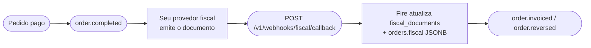

Este endpoint é **inbound** — seu provedor fiscal faz POST nele sempre que um documento fiscal é autorizado, rejeitado, denegado, cancelado ou falha. É a **API canônica multi-país de fiscal callback** que aceita payloads de BR, CO, EC, CL, AR, VE. O Fire valida o payload, guarda o veredito do ente no pedido e despacha `order.invoiced` / `order.reversed` para seus Integration Flows — para todos os países. O que você envia aqui é o que os consumidores dos eventos leem: veja [Do callback aos eventos](#do-callback-aos-eventos).

<Note>
  **Este endpoint é assíncrono.** O Fire autentica, roda o guard de source-of-truth + tenancy, deduplica, pré-marca o pedido como `processing` e **enfileira** o callback — depois retorna **`202 Accepted`** com um `webhookEventId` (tipicamente em menos de 100&nbsp;ms). A atualização de `fiscal_documents` / `orders.fiscal` acontece um instante depois em um worker em segundo plano (normalmente em ~2&nbsp;segundos). Para ver o resultado do processamento, consulte [`GET /v1/webhooks/events/{webhookEventId}`](#verificar-o-resultado). Problemas corrigíveis pelo cliente (payload inválido, `eventId` errado, tenant errado, uma ação reusando o evento de outra) são rejeitados **sincronamente** com `4xx` **antes** do `202`.
</Note>

## Como complementa `order.completed` e `order.cancelled`

`order.completed` e `order.cancelled` carregam o **estado de negócio** de um pedido. O callback fiscal carrega o **estado fiscal** (autorização SEFAZ / DIAN / SRI / SII / AFIP / SENIAT). Juntos formam este lifecycle:



Após processar um callback `authorized`, o Fire emite [`order.invoiced`](/pt/events/order-invoiced); após um `cancelled`, [`order.reversed`](/pt/events/order-reversed). Os dois disparam **para todos os países** — o país viaja no bloco fiscal do evento, não no nome. Os eventos seguintes do pedido para o mesmo `orderId` também refletem o novo estado em `data.lastKnown.fiscal`.

Para o panorama fiscal completo — numeração, callback e eventos, e como se encaixam — veja a [visão geral fiscal](/pt/fiscal/overview).

## Autenticação

Este endpoint requer uma **API key com scope `webhooks:fiscal`**, vendor-scoped ao account dono do pedido. Keys sem scope ou apenas a nível account são rejeitadas com `403 Forbidden`.

<ParamField header="x-api-key" type="string" required>
  Sua API key do Fire. Gere uma no dashboard em **Settings → API Keys → Developer keys**, com scope `webhooks:fiscal` e um binding de vendor para o account cujos pedidos esta key pode atualizar.
</ParamField>

<ParamField header="Authorization" type="string">
  Alias legado: a mesma API key do Fire, como `Bearer pk_live_...`. Prefira `x-api-key`; se os dois chegarem, é usado `x-api-key`.
</ParamField>

## Corpo da requisição

O body é um objeto JSON com estes campos top-level. **Tudo o que é canônico vive aqui em cima**; `document` leva SOMENTE o vocabulário do ente do seu país, escolhido por `country` — veja [Documento por país](#documento-por-país) abaixo.

<ParamField body="country" type="string" required>
  Código de país ISO 3166-1 alpha-2. Um de `BR`, `CO`, `EC`, `CL`, `AR`, `VE`. Determina as regras de validação do objeto `document`.

  **Antes se chamava `countryCode`.**
</ParamField>

<ParamField body="eventType" type="string" required>
  Estado do documento. Um de:
  - `fiscal_graphic` — o provedor está entregando a **representação gráfica** (o artefato imprimível) do documento. **Não é uma aprovação** nem um estado terminal — veja [O estado `fiscal_graphic`](#o-estado-fiscal_graphic) abaixo.
  - `authorized` — a autoridade fiscal aprovou o documento
  - `cancelled` — um documento previamente autorizado foi cancelado
  - `rejected` — o documento foi rejeitado (validação, schema, assinatura)
  - `denied` — a autoridade negou a solicitação (tipicamente falha permanente de regra de negócio)
  - `error` — ocorreu um erro não recuperável no provedor ou autoridade

  Quando `eventType` é `fiscal_graphic`, `authorized` ou `cancelled`, o campo `document` é **obrigatório**. Quando é `rejected`, `denied` ou `error`, o campo `failure` é **obrigatório**.
</ParamField>

<ParamField body="providerEventId" type="string" required>
  O id próprio do seu provedor para esta entrega. Armazenado para auditoria/forense — **não é a chave de idempotência**. O Fire deduplica por `(orderId, eventId)` — um `eventType` diferente no mesmo par retorna `409`, exceto `fiscal_graphic` — então você pode enviar um `providerEventId` novo a cada retentativa sem criar duplicatas. Use o ID nativo do evento do provedor se disponível; caso contrário, um UUID.
</ParamField>

<ParamField body="occurredAt" type="string" required>
  Timestamp ISO 8601 UTC de quando o evento ocorreu na autoridade fiscal (não quando o provedor enviou o callback).
</ParamField>

<ParamField body="orderId" type="string" required>
  UUID do pedido no Fire. Coincide com `data.orderId` nos eventos `order.completed` e `order.cancelled`. O Fire o usa para encontrar o documento fiscal existente.
</ParamField>

<ParamField body="eventId" type="string" required>
  UUID de correlação **e chave de idempotência** (junto com `orderId`). Deve ser o `event.id` de um envelope V4 que **o Fire emitiu para este pedido** — ecoe-o exato; nunca o invente.

  - **Verificação de fonte da verdade.** Um `eventId` que não referencie um evento do Fire para esse pedido é rejeitado com `400` antes do `202`.
  - **Cada ação carrega seu próprio evento.** Ecoe o `event.id` do evento que disparou *esta* ação — a emissão `order.invoiced` para um callback `authorized`, o evento de cancelamento/estorno para um callback `cancelled`. Reusar o `eventId` de uma ação para outro `eventType` (ex. um `cancelled` que ecoa o `eventId` do `authorized`) é rejeitado com **`409`** — um cancelamento deve referenciar seu **próprio** evento, não se pendurar no da autorização. Veja [Idempotência e cenários](#idempotência-e-cenários).
</ParamField>

<ParamField body="document" type="object">
  O vocabulário do ente do seu país, e **nada mais**: `claveAcceso`, `cufe`, `chaveAcesso`, `folio`, `cae`… **Obrigatório** quando `eventType` é `authorized`, `cancelled` ou `fiscal_graphic`. Veja [Documento por país](#documento-por-país).

  Os campos comuns —`documentType`, o número, as URLs, os valores, as datas— **não vão aqui dentro**: estão na raiz. Tudo o que vai em `document` chega aos eventos como `authority.countryData`, com os mesmos nomes de chave.
</ParamField>

### Campos canônicos (raiz)

Significam a mesma coisa nos seis países, então vivem na **raiz** do payload e não dentro de `document`. É a mesma regra da resposta de numeração fiscal, para que o mesmo fato não seja procurado em duas profundidades distintas segundo por onde entrou.

<ParamField body="documentType" type="string">
  `SALE_INVOICE` ou `CREDIT_NOTE` — o mesmo vocabulário da numeração fiscal. **Obrigatório quando há comprovante** (`authorized` / `cancelled`), e deve corresponder ao evento: `authorized` é um `SALE_INVOICE`, `cancelled` é um `CREDIT_NOTE`. Qualquer outra combinação retorna `400`.

  **Antes era `docType: "invoice" | "cancellation"`.** O nome antigo é **ignorado**, não traduzido: um payload `authorized` ou `cancelled` que traz só `docType` recebe `400` em `documentType`.
</ParamField>

<ParamField body="docSubtype" type="string">
  Como o seu regime o chama: `nfce`, `nfe`, `factura`, `boleta`, `factura_a`. Aberto: não o validamos contra uma lista e **não ramifica nada** do nosso lado — é referencial. **Obrigatório quando há comprovante.**
</ParamField>

### Tipos de documento

O Fire aceita **exatamente dois** valores em `documentType`. Não existe um terceiro tipo: qualquer outro valor retorna `400`.

| `documentType` | O que é | `eventType` do callback | Operação de numeração |
|---|---|---|---|
| `SALE_INVOICE` | O documento da venda: nota fiscal, NFC-e / NF-e, boleta… | `authorized` | `INVOICE` |
| `CREDIT_NOTE` | O documento que anula uma venda | `cancelled` | `CANCEL` |

Como cada regime chama seu documento vai em `docSubtype`, e esse campo é **aberto**: `nfce`, `nfe` (Brasil), `factura` (Equador, Colômbia), `boleta` (Chile), `factura_a` (Argentina) e qualquer outro nome que o seu órgão use. O Fire não o valida contra uma lista nem decide nada com ele.

<Note>
  Não confunda com o [catálogo de tipos de documento](/pt/api-reference/fiscal-document-types): esse endpoint lista os documentos de **identificação do comprador** (`CEDULA`, `CPF`, `NIT`…), não tipos de documento fiscal.
</Note>

<ParamField body="documentNumber" type="string">
  O número **visível** do comprovante, como o ente o compõe (`12388`, `001-020-000000123`, `C012001`). As peças que o formam continuam viajando em `document` com os nomes do país. **Obrigatório em `authorized`**: o Fire não o deduz mais.
</ParamField>

<ParamField body="issuedAt" type="string">
  Data/hora UTC (ISO 8601) em que o documento foi **emitido**. Mesmo nome que na numeração fiscal. **Obrigatório em `authorized`.**
</ParamField>

<ParamField body="authorizedAt" type="string">
  Data/hora UTC (ISO 8601) em que o ente **aprovou** o documento — um fato diferente de `issuedAt`. Podem distar segundos (autorização on-line) ou horas (contingência autorizada quando a conexão volta). Opcional; se ausente, os consumidores dos eventos veem `authority.authorizedAt: null`. Em um cancelamento use `cancelledAt`: um callback `cancelled` **mantém o `issuedAt` e o `authorizedAt` que o documento já tinha** —são os da fatura— e só usa os que você enviar se o Fire não tinha nenhum.
</ParamField>

<ParamField body="cancelledAt" type="string">
  Data/hora UTC em que o ente aprovou o cancelamento. Envie-o em `cancelled`.
</ParamField>

<ParamField body="authorizationMode" type="string">
  `ONLINE`, `OFFLINE` ou `BATCH`. `OFFLINE` é contingência: o comprovante vale mas foi emitido sem conseguir consultar o ente, e há regimes que exigem que o ticket o diga (o RIDE equatoriano imprime `EMISION POR CONTINGENCIA`).
</ParamField>

<ParamField body="pdfUrl" type="string">
  Link de download do PDF (DANFE / RIDE). HTTPS, baixável por GET direto, válido por pelo menos 24 h — o Fire o arquiva. **Obrigatório** para `authorized` e `cancelled`.
</ParamField>

<ParamField body="xmlUrl" type="string">
  Link de download do XML legal do ente. Mesmas condições que `pdfUrl`. **Obrigatório** para `authorized` e `cancelled`.
</ParamField>

<ParamField body="totalAmount" type="number">
  Total bruto do documento, em decimais reais (não escalados). **Obrigatório em `authorized`.**
</ParamField>

<ParamField body="taxAmount" type="number">
  Total de impostos do documento, em decimais reais. **Obrigatório em `authorized`.**
</ParamField>

<ParamField body="currencyCode" type="string">
  Código ISO 4217 — exatamente 3 letras (`BRL`, `COP`, `USD`). **Obrigatório em `authorized`.**
</ParamField>

<ParamField body="providerDocId" type="string">
  O id do documento no seu sistema. É por ele que o PDF e o XML são buscados e com ele se pede um cancelamento. **Obrigatório em `authorized`.**
</ParamField>

<ParamField body="graphic" type="object">
  O que se imprime: um mapa chave → string exata a codificar (`{ "qr": "…" }`, `{ "ted": "…" }`). A chave nomeia o propósito; como se desenha é decisão do template do ticket. Fica na raiz, ao lado de `document`, como na resposta de numeração fiscal. **Obrigatório e não vazio em `fiscal_graphic`**; opcional nos demais.
</ParamField>

<ParamField body="provider" type="object">
  Quem emitiu e com qual versão. Chega ao pedido e aos eventos como `authority.providerIdentity` — o mesmo nome da numeração fiscal — com as três chaves sempre presentes. Se você não enviar `provider`, ou enviá-lo vazio, `providerIdentity` é `null`.

  <Expandable title="provider">
    <ParamField body="name" type="string">Nome do provedor (`hio.fiscalization`, `plugnotas`).</ParamField>
    <ParamField body="version" type="string">Versão do emissor.</ParamField>
    <ParamField body="reference" type="string">Referência livre.</ParamField>
  </Expandable>
</ParamField>

<ParamField body="failure" type="object">
  Por que NÃO há comprovante. **Obrigatório** quando `eventType` é `rejected`, `denied` ou `error`.

  **Antes se chamava `error`**, e agora leva a mesma forma que a resposta de numeração fiscal.

  <Expandable title="failure">
    <ParamField body="code" type="string">
      Código de erro opcional do provedor/autoridade (p. ex. `DIAN_42`, `cStat_204`).
    </ParamField>
    <ParamField body="scope" type="string">
      `TECHNICAL` ou `FUNCTIONAL`. É o que o canal ramifica: com `TECHNICAL` o comprovante ainda pode sair e o ticket imprime «em trâmite»; com `FUNCTIONAL` o ente o rejeitou pelo conteúdo e não vai sair.
    </ParamField>
    <ParamField body="message" type="string" required>
      Mensagem legível. Mínimo 1 caractere.
    </ParamField>
    <ParamField body="details" type="array">
      Detalhe campo a campo, quando o ente fornece: uma lista de `{ "field": "…", "issue": "…" }`, ambos opcionais.
    </ParamField>
  </Expandable>
</ParamField>

<ParamField body="metadata" type="object">
  Bag free-form para extras específicos do provedor (resposta raw, IDs internos, etc.). Não validado. Chega ao pedido e aos eventos como `authority.providerMetadata`, tal como veio e opaco — igual à numeração fiscal. Ausente ou `{}` vira `null`. Não envie `null`: omita ou envie `{}` — `null` retorna `400`.

  **Antes se chamava `providerSpecific`.**
</ParamField>

<Warning>
  **A raiz não aceita chaves extras.** Só são lidos os campos acima; qualquer outra chave de raiz é **descartada em silêncio** — não é rejeitada. `orderCode` não faz parte do contrato — o pedido é resolvido por `orderId`.
</Warning>

### O que é obrigatório, por evento

| Campo | `authorized` | `cancelled` | `fiscal_graphic` | `rejected` · `denied` · `error` |
|---|---|---|---|---|
| `document` | obrigatório | obrigatório | obrigatório | — |
| `documentType` | `SALE_INVOICE` | `CREDIT_NOTE` | — | — |
| `docSubtype` | obrigatório | obrigatório | — | — |
| `pdfUrl`, `xmlUrl` | obrigatório | obrigatório | — | — |
| `documentNumber`, `providerDocId`, `issuedAt` | obrigatório | — | — | — |
| `totalAmount`, `taxAmount`, `currencyCode` | obrigatório | — | — | — |
| `graphic` | opcional | opcional | obrigatório, não vazio | — |
| `failure` | — | — | — | obrigatório |

`authorizedAt`, `cancelledAt`, `authorizationMode` e `provider` são sempre opcionais. Um campo obrigatório enviado como `null` conta como ausente.

## Documento por país

A forma exigida de `document` depende de `country`. **`document` leva SOMENTE os identificadores do ente desse país** — os campos comuns aos seis vivem na raiz do payload, acima.

<Warning>
  **`document` mudou de conteúdo**

  Até agora `document` misturava duas coisas: o que significa o mesmo em todos os países
  —`docType`, `pdfUrl`, `xmlUrl`, os valores, as datas— e o vocabulário do ente de cada um.
  Essa mistura se propagava para tudo o que lia o callback.

  Agora **o canônico vive na raiz** e `document` fica só com o do regime. É a mesma forma da
  resposta de numeração fiscal: o mesmo fato, no mesmo lugar, sem importar por onde entrou.

  Outras mudanças do mesmo pacote: `countryCode` → `country`, `docType` → `documentType`
  (`SALE_INVOICE` / `CREDIT_NOTE`, sem alias), `error` → `failure` (com `scope` e `details`),
  `providerSpecific` → `metadata`, e `emittedAt` → `issuedAt`. Novos na raiz:
  `documentNumber`, `authorizedAt` e `graphic`.
</Warning>

<Tabs>
  <Tab title="Brasil (BR)">
    Documentos fiscais brasileiros (NF-e / NFC-e). Use este código de país ao enviar callbacks do seu provedor fiscal ou de qualquer outro provedor BR.

    Além dos [campos canônicos da raiz](#campos-canônicos-raiz) (`documentType`, `docSubtype`, `documentNumber`, `pdfUrl`, `xmlUrl`, `issuedAt`, etc.), o BR exige estes identificadores específicos:

    | Campo | Tipo | Obrigatório | Notas |
    |---|---|---|---|
    | `chaveAcesso` | string | ✓ | Exatamente 44 dígitos — chave de acesso SEFAZ |
    | `protocolo` | string | ✓ | Protocolo de autorização SEFAZ |
    | `numero` | int / string | ✓ | Número do documento |
    | `serie` | int / string \| null | | Série do documento (codificada na chave) |
    | `modelo` | `55` / `65` \| null | | `55` = NF-e, `65` = NFC-e |

    O exemplo abaixo é um payload `authorized` completo: todo campo de raiz que ele mostra é **obrigatório** para esse evento, exceto `provider` e `metadata`, que são opcionais e chegam ao pedido como `authority.providerIdentity` e `authority.providerMetadata` — veja [O que é obrigatório, por evento](#o-que-é-obrigatório-por-evento).

    ```json
    {
      "country": "BR",
      "eventType": "authorized",
      "providerEventId": "evt-br-1",
      "occurredAt": "2026-04-26T14:32:11.000Z",
      "orderId": "550e8400-e29b-41d4-a716-446655440000",
      "eventId": "7c9e6679-7425-40de-944b-e07fc1f90ae7",
      "documentType": "SALE_INVOICE",
      "docSubtype": "nfce",
      "documentNumber": "1",
      "issuedAt": "2026-04-26T14:32:10.000Z",
      "totalAmount": 142.90,
      "taxAmount": 18.57,
      "currencyCode": "BRL",
      "pdfUrl": "https://api.fiscal-provider.example/nfce/69fa97fe427d1240856e1282/pdf",
      "xmlUrl": "https://api.fiscal-provider.example/nfce/69fa97fe427d1240856e1282/xml",
      "providerDocId": "69fa97fe427d1240856e1282",
      "provider": { "name": "fiscal-provider", "version": "2026.09.1", "reference": "REF-69fa97fe427d1240856e1282" },
      "metadata": { "providerTraceId": "trace-69fa97fe427d1240856e1282" },
      "document": {
        "chaveAcesso": "35260229062609000177650500000000011000000010",
        "protocolo": "141210001176277",
        "numero": 1,
        "serie": 50,
        "modelo": 65
      }
    }
    ```
  </Tab>

  <Tab title="Colombia (CO)">
    Documentos fiscais colombianos (DIAN).

    | Campo | Tipo | Obrigatório | Notas |
    |---|---|---|---|
    | `cufe` | string | ✓ | Código fiscal único DIAN |
    | `prefijo` | string | ✓ | Prefixo do documento |
    | `numeroDian` | string | ✓ | Número de documento DIAN |
    | `qrCode` | string (URL) \| null | | QR para o documento impresso |
    | `numeroComprobante` | string \| null | | O número **visível**, já montado: `prefixo + consecutivo` |
    | `ambiente` | `"1"` \| `"2"` \| null | | **`1` produção · `2` homologação** — o contrário do SRI |

    ```json
    {
      "country": "CO",
      "eventType": "authorized",
      "providerEventId": "evt-co-1",
      "occurredAt": "2026-04-26T14:32:11.000Z",
      "orderId": "550e8400-e29b-41d4-a716-446655440000",
      "eventId": "7c9e6679-7425-40de-944b-e07fc1f90ae7",
      "documentType": "SALE_INVOICE",
      "docSubtype": "factura",
      "documentNumber": "C012001",
      "issuedAt": "2026-04-26T14:32:10.000Z",
      "totalAmount": 95000.00,
      "taxAmount": 15170.17,
      "currencyCode": "COP",
      "pdfUrl": "https://api.fiscal-provider.example/dian/C012001/pdf",
      "xmlUrl": "https://api.fiscal-provider.example/dian/C012001/xml",
      "providerDocId": "C012001",
      "provider": { "name": "fiscal-provider", "version": "2026.09.1", "reference": "REF-C012001" },
      "metadata": { "providerTraceId": "trace-C012001" },
      "document": {
        "cufe": "633732c7a2a577bfa1828551e64d03f715f0",
        "prefijo": "C012",
        "numeroDian": "001",
        "numeroComprobante": "C012001",
        "ambiente": "1",
        "qrCode": "https://catalogo-vpfe.dian.gov.co/document/searchqr?documentkey=633732c7a2a577bfa1828551e64d03f715f0"
      }
    }
    ```

    <Note>
      **Os nomes são os mesmos da numeração**, de propósito: `cufe`, `prefijo`, `numeroDian`,
      `numeroComprobante`, `qrCode` e `ambiente` significam aqui exatamente o mesmo que na
      resposta do prekey. É o mesmo documento contado duas vezes, e se os nomes divergissem,
      conciliar os dois caminhos deixaria de ser comparar campos.

      **`numeroDian` vai sem o prefixo** (`990000001`, não `SETP990000001`). O número montado é
      `numeroComprobante`. Mandar o montado nos dois faz a conciliação comparar `SETP990000001`
      contra `990000001`, e nunca cruzam.

      Os dois campos são **opcionais dentro de `document`**: quem já manda callbacks sem eles
      continua funcionando. Isso não se estende à raiz: os campos listados em
      [O que é obrigatório, por evento](#o-que-é-obrigatório-por-evento) são obrigatórios, e um
      callback sem eles recebe `400`.
    </Note>
  </Tab>

  <Tab title="Equador (EC)">
    Documentos fiscais equatorianos (SRI).

    | Campo | Tipo | Obrigatório | Notas |
    |---|---|---|---|
    | `claveAcceso` | string | ✓ | Exatamente 49 dígitos — chave de acesso SRI |
    | `numeroComprobante` | string \| null | | O número **visível**, já montado: `estab-ptoEmi-secuencial` |
    | `ambiente` | `'1'` / `'2'` \| null | | `1` = teste, `2` = produção |
    | `establecimiento` | string \| null | | Código do estabelecimento (`001`) |
    | `puntoEmision` | string \| null | | Código do ponto de emissão (`020`) |
    | `secuencial` | string \| null | | Sequencial do comprovante (`000000123`) |

    <Note>
      **`numeroAutorizacion` foi retirado do contrato.** No esquema de autorização on-line o
      SRI devolve como número de autorização **a própria chave de acesso**, então era o mesmo
      dado declarado duas vezes. Se o seu sistema continuar enviando não quebra nada —os
      campos não declarados são preservados— mas não o pedimos nem o interpretamos. Quem
      precisar do número de autorização lê `claveAcceso`.

      **As três peças do número** —`establecimiento`, `puntoEmision`, `secuencial`— agora
      existem nos dois caminhos: a numeração prévia e este callback. São **opcionais**: se o
      seu provedor não as emite, não as envie. A Fire não as deriva de `claveAcceso` —essa
      regra é do regime— e o comprovante é impresso sem elas.
    </Note>

    ```json
    {
      "country": "EC",
      "eventType": "authorized",
      "providerEventId": "evt-ec-1",
      "occurredAt": "2026-04-26T14:32:11.000Z",
      "orderId": "550e8400-e29b-41d4-a716-446655440000",
      "eventId": "7c9e6679-7425-40de-944b-e07fc1f90ae7",
      "documentType": "SALE_INVOICE",
      "docSubtype": "factura",
      "documentNumber": "001-020-000000123",
      "issuedAt": "2026-04-26T14:32:10.000Z",
      "totalAmount": 24.50,
      "taxAmount": 3.15,
      "currencyCode": "USD",
      "pdfUrl": "https://api.fiscal-provider.example/sri/AUT-EC-001/pdf",
      "xmlUrl": "https://api.fiscal-provider.example/sri/AUT-EC-001/xml",
      "providerDocId": "AUT-EC-001",
      "provider": { "name": "fiscal-provider", "version": "2026.09.1", "reference": "REF-AUT-EC-001" },
      "metadata": { "providerTraceId": "trace-AUT-EC-001" },
      "document": {
        "numeroComprobante": "001-020-000000123",
        "claveAcceso": "0102030405060708091011121314151617181920212223242",
        "establecimiento": "001",
        "puntoEmision": "020",
        "secuencial": "000000123",
        "ambiente": "2"
      }
    }
    ```
  </Tab>

  <Tab title="Chile (CL)">
    Documentos fiscais chilenos (SII DTE).

    | Campo | Tipo | Obrigatório | Notas |
    |---|---|---|---|
    | `folio` | int / string | ✓ | Número de folio do DTE |
    | `ted` | string | ✓ | TED (Timbre Electrónico) — base64 ou fragmento XML |
    | `tipoDte` | int / string | ✓ | Tipo DTE (ex.: `33` = factura electrónica) |
    | `trackId` | string \| null | | Track ID SII para queries de seguimento |

    ```json
    {
      "country": "CL",
      "eventType": "authorized",
      "providerEventId": "evt-cl-1",
      "occurredAt": "2026-04-26T14:32:11.000Z",
      "orderId": "550e8400-e29b-41d4-a716-446655440000",
      "eventId": "7c9e6679-7425-40de-944b-e07fc1f90ae7",
      "documentType": "SALE_INVOICE",
      "docSubtype": "factura",
      "documentNumber": "12345",
      "issuedAt": "2026-04-26T14:32:10.000Z",
      "totalAmount": 18900,
      "taxAmount": 3019,
      "currencyCode": "CLP",
      "pdfUrl": "https://api.fiscal-provider.example/sii/12345/pdf",
      "xmlUrl": "https://api.fiscal-provider.example/sii/12345/xml",
      "providerDocId": "12345",
      "provider": { "name": "fiscal-provider", "version": "2026.09.1", "reference": "REF-12345" },
      "metadata": { "providerTraceId": "trace-12345" },
      "document": {
        "folio": 12345,
        "ted": "<TED>...base64-or-xml...</TED>",
        "tipoDte": 33,
        "trackId": "SII-TRK-998877"
      }
    }
    ```
  </Tab>

  <Tab title="Argentina (AR)">
    Documentos fiscais argentinos (AFIP).

    | Campo | Tipo | Obrigatório | Notas |
    |---|---|---|---|
    | `cae` | string | ✓ | Código de Autorização Eletrônico |
    | `fechaVtoCae` | string | ✓ | Data de vencimento do CAE |
    | `puntoVenta` | int / string | ✓ | Número do ponto de venda |
    | `numeroComprobante` | int / string | ✓ | Número do documento |
    | `tipoComprobante` | int / string | ✓ | Tipo de documento (`1` = factura A, …) |

    ```json
    {
      "country": "AR",
      "eventType": "authorized",
      "providerEventId": "evt-ar-1",
      "occurredAt": "2026-04-26T14:32:11.000Z",
      "orderId": "550e8400-e29b-41d4-a716-446655440000",
      "eventId": "7c9e6679-7425-40de-944b-e07fc1f90ae7",
      "documentType": "SALE_INVOICE",
      "docSubtype": "factura_a",
      "documentNumber": "0001-00012345",
      "issuedAt": "2026-04-26T14:32:10.000Z",
      "totalAmount": 12100.00,
      "taxAmount": 2100.00,
      "currencyCode": "ARS",
      "pdfUrl": "https://api.fiscal-provider.example/afip/0001-12345/pdf",
      "xmlUrl": "https://api.fiscal-provider.example/afip/0001-12345/xml",
      "providerDocId": "0001-12345",
      "provider": { "name": "fiscal-provider", "version": "2026.09.1", "reference": "REF-0001-12345" },
      "metadata": { "providerTraceId": "trace-0001-12345" },
      "document": {
        "cae": "74256178925412",
        "fechaVtoCae": "2026-05-31",
        "puntoVenta": 1,
        "numeroComprobante": 12345,
        "tipoComprobante": 1
      }
    }
    ```
  </Tab>

  <Tab title="Venezuela (VE)">
    Documentos fiscais venezuelanos (SENIAT).

    | Campo | Tipo | Obrigatório | Notas |
    |---|---|---|---|
    | `numeroControl` | string | ✓ | Número da faixa de controle emitida pela SENIAT |
    | `numeroFactura` | string | ✓ | Número da fatura |
    | `rifEmisor` | string \| null | | RIF do emissor |

    ```json
    {
      "country": "VE",
      "eventType": "authorized",
      "providerEventId": "evt-ve-1",
      "occurredAt": "2026-04-26T14:32:11.000Z",
      "orderId": "550e8400-e29b-41d4-a716-446655440000",
      "eventId": "7c9e6679-7425-40de-944b-e07fc1f90ae7",
      "documentType": "SALE_INVOICE",
      "docSubtype": "factura",
      "documentNumber": "12345",
      "issuedAt": "2026-04-26T14:32:10.000Z",
      "totalAmount": 480.00,
      "taxAmount": 76.80,
      "currencyCode": "VES",
      "pdfUrl": "https://api.fiscal-provider.example/seniat/00-00012345/pdf",
      "xmlUrl": "https://api.fiscal-provider.example/seniat/00-00012345/xml",
      "providerDocId": "00-00012345",
      "provider": { "name": "fiscal-provider", "version": "2026.09.1", "reference": "REF-00-00012345" },
      "metadata": { "providerTraceId": "trace-00-00012345" },
      "document": {
        "numeroControl": "00-00012345",
        "numeroFactura": "12345",
        "rifEmisor": "J-12345678-9"
      }
    }
    ```
  </Tab>
</Tabs>

## O estado `fiscal_graphic`

`fiscal_graphic` informa que o seu provedor está entregando a **representação gráfica** — o que o caixa imprime para o documento. É um **estado próprio**, não um resultado:

- **Não é uma aprovação.** Receber `fiscal_graphic` não diz nada sobre a autoridade ter aprovado o documento. O Fire armazena a representação e o documento permanece em estado não terminal.
- **É opcional.** Se o seu provedor não tem representação gráfica para um documento, envie `authorized` (ou qualquer estado terminal) **diretamente** — não é necessário um `fiscal_graphic` antes. Ambos os fluxos são válidos.
- **Pode compartilhar o `eventId` com o seu desfecho.** A representação e o resultado terminal pertencem à mesma ação, então você pode enviar `fiscal_graphic` e depois `authorized` / `rejected` / `denied` / `cancelled` reutilizando o **mesmo** `eventId`. Isso não é um conflito e nunca retorna `409` — veja [Idempotência e cenários](#idempotência-e-cenários).
- **Exige `document` e um `graphic` não vazio.** A representação gráfica é o que o caixa imprime — o QR, o TED, a chave de acesso codificada — e viaja no `graphic` da raiz. O PDF e o XML são os arquivos do documento autorizado e chegam com `authorized`.
- **Não dispara nenhum evento de saída.** `order.invoiced` e `order.reversed` seguem atrelados a `authorized` e `cancelled` respectivamente. A representação apenas muda o estado do documento.

```json fiscal_graphic (EC)
{
  "country": "EC",
  "eventType": "fiscal_graphic",
  "providerEventId": "evt-ec-graphic-1",
  "occurredAt": "2026-04-26T14:32:05.000Z",
  "orderId": "550e8400-e29b-41d4-a716-446655440000",
  "eventId": "7c9e6679-7425-40de-944b-e07fc1f90ae7",
  "documentType": "SALE_INVOICE",
  "docSubtype": "factura",
  "documentNumber": "001-020-000000123",
  "issuedAt": "2026-04-26T14:32:04.000Z",
  "providerDocId": "AUT-EC-001",
  "document": {
    "numeroComprobante": "001-020-000000123",
    "claveAcceso": "0102030405060708091011121314151617181920212223242",
    "establecimiento": "001",
    "puntoEmision": "020",
    "secuencial": "000000123",
    "ambiente": "2"
  },
  "graphic": {
    "qr": "0102030405060708091011121314151617181920212223242"
  },
  "provider": {
    "name": "hio.fiscalization",
    "version": "2026.09.1",
    "reference": "HIO-EC-GRAPHIC-001"
  },
  "metadata": {
    "providerTraceId": "ec-graphic-trace-001"
  }
}
```

### Resultados negativos (`rejected`, `denied`, `error`)

Para estados não autorizados, omita `document` (ou envie `null`) e forneça `failure`. `country` ainda se aplica (valida o roteamento); o documento não é exigido porque não há artefato autorizado — e `documentType`/`docSubtype` também não, já que não há comprovante a tipificar.

**Um resultado negativo não guarda dados de comprovante.** Se você enviar `documentNumber`, `providerDocId`, `issuedAt`, `authorizedAt`, valores, `pdfUrl`, `xmlUrl` ou `graphic` com `rejected`, `denied` ou `error`, o Fire os ignora: só são guardados `documentType`, `docSubtype`, as chaves do país em `document`, `failure`, `provider` e `metadata`. Um documento que já tinha dados de comprovante os mantém.

```json Rejeitado
{
  "country": "CO",
  "eventType": "rejected",
  "providerEventId": "evt-co-2",
  "occurredAt": "2026-04-26T14:32:11.000Z",
  "orderId": "550e8400-e29b-41d4-a716-446655440000",
  "eventId": "7c9e6679-7425-40de-944b-e07fc1f90ae7",
  "document": null,
  "failure": {
    "code": "DIAN_42",
    "message": "CUFE inválido"
  },
  "provider": { "name": "fiscal-provider", "version": "2026.09.1", "reference": "REF-CO-REJ-002" },
  "metadata": { "providerTraceId": "trace-co-rej-002" }
}
```

## Resposta

Em caso de sucesso o endpoint retorna **`202 Accepted`** — o evento foi autenticado, validado, deduplicado e **enfileirado**. Um `202` **não** significa que o documento fiscal já foi atualizado; isso acontece de forma assíncrona em um worker em segundo plano. Use o [endpoint de status](#verificar-o-resultado) para confirmar o resultado final.

O body traz **dois ids distintos** para não haver ambiguidade: `eventId` é o id que **você** enviou (devolvido como echo), `webhookEventId` é o id do **Fire** para o registro enfileirado.

<ResponseField name="received" type="boolean">
  Sempre `true` quando a requisição foi aceita e enfileirada.
</ResponseField>

<ResponseField name="duplicate" type="boolean">
  `true` quando este `(orderId, eventId)` já foi ingerido **com o mesmo `eventType`** — o registro existente é retornado e nada é re-enfileirado. `false` para um evento novo. Um `eventType` diferente no mesmo par nunca chega a este campo: retorna `409`, exceto `fiscal_graphic`.
</ResponseField>

<ResponseField name="eventId" type="string">
  Echo do `eventId` que você enviou (o `event.id` da emissão do Fire). Use-o para correlacionar este acuse com a sua requisição.
</ResponseField>

<ResponseField name="webhookEventId" type="string">
  O id do Fire para o registro enfileirado em `webhook_events`. Passe para `GET /v1/webhooks/events/{webhookEventId}` para consultar o resultado do processamento. Em uma duplicata é o **mesmo** id retornado na primeira vez.
</ResponseField>

<ResponseField name="status" type="string">
  Status atual do registro na fila — `queued` → `processing` → `processed` (e `retry` / `failed` / `dead` / `ignored`).
</ResponseField>

<ResponseField name="firstReceivedAt" type="string">
  Timestamp ISO 8601 UTC de quando o Fire recebeu **pela primeira vez** este evento. Estável entre retentativas — útil como âncora de rastreamento.
</ResponseField>

<ResponseField name="message" type="string">
  Resumo legível do que aconteceu.
</ResponseField>

<ResponseExample>
```json 202 — aceito (novo, enfileirado)
{
  "received": true,
  "duplicate": false,
  "eventId": "1686fca1-0a26-4a89-b2f2-fe93b15a4434",
  "webhookEventId": "6d950243-6a0c-415c-b547-bddf9af8ad61",
  "status": "queued",
  "firstReceivedAt": "2026-06-11T15:00:34.729Z",
  "message": "Event accepted and queued for processing."
}
```

```json 202 — duplicado (mesmo orderId + eventId + eventType)
{
  "received": true,
  "duplicate": true,
  "eventId": "1686fca1-0a26-4a89-b2f2-fe93b15a4434",
  "webhookEventId": "6d950243-6a0c-415c-b547-bddf9af8ad61",
  "status": "processed",
  "firstReceivedAt": "2026-06-11T15:00:34.729Z",
  "message": "Event already received; no action needed."
}
```

```json 409 — eventId reusado para outra ação
{
  "success": false,
  "error": "CONFLICT",
  "message": "eventId \"1686fca1-…\" is already bound to event_type=\"authorized\" for this order. A \"cancelled\" callback must reference its own event (a distinct eventId emitted by Fire for that action), not reuse another event's id."
}
```

```json 400 — eventId incorreto / erro de validação
{
  "success": false,
  "error": "VALIDATION_ERROR",
  "message": "eventId does not reference an event emitted by Fire for this orderId. Echo the event.id from a V4 envelope you received for this order."
}
```

```json 401 — API key faltando ou inválida
{
  "success": false,
  "error": "UNAUTHORIZED",
  "message": "API key required. Use x-api-key: pk_live_... header"
}
```

```json 403 — scope incorreto / não é seu tenant
{
  "success": false,
  "error": "FORBIDDEN",
  "message": "webhooks:fiscal requires a vendor-scoped API key (account + vendor binding). Generate one from /developers/firepos-api-management."
}
```

```json 503 — auth store temporariamente inacessível (retente)
{
  "success": false,
  "error": "SERVICE_UNAVAILABLE",
  "message": "API key verification is temporarily unavailable (auth store unreachable). Retry the request."
}
```
</ResponseExample>

## Verificar o resultado

Como o processamento é assíncrono, o `202` só confirma que o evento foi **enfileirado**. Para ver se o documento fiscal foi atualizado, consulte o endpoint de status com o `webhookEventId` retornado pelo `202`:

```
GET https://app.fire.rest/api/v1/webhooks/events/{webhookEventId}
x-api-key: <sua key webhooks:fiscal>
```

<ResponseField name="status" type="string">
  Ciclo de vida na fila: `queued` → `processing` → `processed` (pronto) · `failed` / `dead` (esgotou as retentativas) · `retry` (aguardando a próxima tentativa) · `ignored`.
</ResponseField>
<ResponseField name="attempts" type="number">Tentativas de processamento até agora.</ResponseField>
<ResponseField name="result" type="object | null">Em sucesso, o resultado do worker — ex. `{ "kind": "updated", "documentId": "…", "receiptId": "…" }`.</ResponseField>
<ResponseField name="error" type="object | null">`{ "message": "…" }` quando a última tentativa falhou; `null` caso contrário.</ResponseField>

<ResponseExample>
```json 200 — processado
{
  "id": "9e6c8af8-af80-4967-9422-c096ab43c0e7",
  "source": "fiscal_generic",
  "eventType": "authorized",
  "status": "processed",
  "attempts": 1,
  "processedAt": "2026-04-26T14:32:13.000Z",
  "result": { "kind": "updated", "documentId": "1a2b3c4d-…", "receiptId": "9b2a3c4d-…" },
  "error": null
}
```
</ResponseExample>

Um `404` é retornado para ids desconhecidos — ou ids de outro tenant — sem vazar existência. Autentique com a mesma key `webhooks:fiscal` que usou no callback.

## Idempotência e cenários

O Fire deduplica callbacks por **`(orderId, eventId)`** — *não* por `providerEventId` (que você pode regenerar livremente). O mesmo par reenviado com o **mesmo** `eventType` é um replay benigno; o mesmo par com um `eventType` **diferente** retorna `409` — uma tentativa de pendurar uma ação no evento de outra — exceto `fiscal_graphic`, que pode compartilhar o `eventId` com o seu resultado.


**`fiscal_graphic` é a exceção.** É um passo da *mesma* ação, não um desfecho concorrente, então pode compartilhar o `eventId` com o estado terminal que vem depois — essa combinação é aceita, nunca retorna `409`.

Esta é a matriz completa de comportamento — cada combinação que você pode enviar:

| Cenário | Resultado |
|---|---|
| `(orderId, eventId)` novo | **`202`** · `duplicate: false` — enfileirado |
| Mesmo `(orderId, eventId)` com o mesmo `eventType` reenviado (qualquer `providerEventId`) | **`202`** · `duplicate: true` — registro existente retornado, **não** re-enfileirado |
| `fiscal_graphic` e depois um estado terminal com o **mesmo `eventId`** | **`202`** nas duas vezes — a representação é um passo da mesma ação, não um conflito |
| Mesmo `(orderId, eventId)` mas **`eventType` diferente** (ex. `cancelled` com o `eventId` do `authorized`) | **`409`** — rejeitado. Use o evento que pertence a *esta* ação |
| `eventId` não emitido pelo Fire para esse `orderId` | **`400`** — `eventId` incorreto/inventado |
| Pedido/evento fora da conta + vendor da sua API key | **`403`** |
| Payload malformado (Zod), campos obrigatórios faltando | **`400`** |
| API key faltando / inválida | **`401`** |
| Auth store momentaneamente inacessível | **`503`** — transitório, **retente** |

<Warning>
  **Um cancelamento precisa do seu próprio evento.** Você não pode cancelar um documento reenviando o `eventId` da autorização com `eventType: "cancelled"` — isso retorna `409`. O Fire é a fonte da verdade: um cancelamento deve referenciar o **evento de cancelamento/estorno que o Fire emitiu** (um `eventId` distinto). Retornar um `202 duplicado` aqui diria erroneamente que o cancelamento foi aceito enquanto o Fire nunca cancelou — por isso o Fire o rejeita explicitamente.
</Warning>

<Note>
  **`409` vs `202`.** Um `409` é o único caso em que um callback *bem formado e autenticado* é recusado na camada de idempotência — porque aceitá-lo divergiria o estado. Um replay do mesmo tipo nunca é um erro: retorna `202` para que suas retentativas fiquem limpas. Um `503` é **nosso** (infra transitória), então é seguro e esperado retentar.
</Note>

## Concorrência

As transições de estado em `fiscal_documents` usam **locking otimista**. Se dois callbacks para o mesmo documento chegarem simultaneamente, um tem sucesso e o outro resolve para `idempotent` ou `regression` conforme a ordem. O merge de `orders.fiscal` JSONB é atômico.

Quando o pedido já tem documento, o callback é associado a ele pelo `eventId`. Um callback com outro `eventId` válido termina em `notFound`, não em `regression`; reenviar o `eventId` do documento com um estado anterior é um reenvio do mesmo par. Nenhum dos dois altera o documento.

## O que acontece após o 202

<CardGroup cols={2}>
  <Card title="Do callback aos eventos" icon="arrow-right-arrow-left" href="/pt/fiscal/callback-to-events">
    Como cada campo que você envia aqui chega a `order.invoiced` e `order.reversed`.
  </Card>
  <Card title="Visão geral fiscal" icon="file-invoice" href="/pt/fiscal/overview">
    Numeração, callback e eventos em uma só imagem.
  </Card>
</CardGroup>

O `202` apenas enfileira o evento. Um worker em segundo plano então o pega — em ~2&nbsp;segundos via o wake-up instantâneo, ou no próximo ciclo de polling como fallback — e:

1. **O documento fiscal é atualizado** com o novo estado e os identificadores do ente.
2. **O veredito é guardado no pedido**, estruturado: campos canônicos, `amounts`, `countryData` e `graphic` — e acrescentado ao histórico fiscal do pedido.
3. **Um evento outbound é despachado, para todos os países**: `order.invoiced` para `eventType=authorized`, `order.reversed` para `eventType=cancelled`. Os Integration Flows ativos para esse evento rodam e fazem POST para o seu endpoint. `fiscal_graphic`, `rejected`, `denied` e `error` atualizam o estado mas não emitem evento.

## Do callback aos eventos

Quem consome `order.invoiced` ou `order.reversed` lê **exatamente o que você enviou aqui**, reorganizado no bloco fiscal do evento. A referência completa desse bloco está em [`order.invoiced`](/pt/events/order-invoiced#o-bloco-fiscal).

Os campos da raiz caem em `fiscal.authority` (ou `cancellation.fiscal.authority`) com os mesmos nomes, exceto os três valores, que se agrupam em `authority.amounts`. `document` vira `authority.countryData`, e `provider` e `metadata` viram `providerIdentity` e `providerMetadata` (`null` se ausentes ou vazios). A tabela campo a campo está em [Do callback aos eventos](/pt/fiscal/callback-to-events#onde-cai-cada-campo-do-callback).

**`document` e `countryData` são o mesmo bloco.** O Fire não mantém uma lista das chaves de cada país: tudo o que vem em `document` e não é campo canônico chega intacto a `countryData`. Um identificador novo que o seu ente passe a exigir viaja até os eventos sem nenhuma mudança do lado do Fire.

### Por que este endpoint mantém o caminho `/v1`

As renomeações de campos acima (`docType` → `documentType`, `countryCode` → `country`, `error` → `failure`, `providerSpecific` → `metadata`) quebram um emissor que ainda use os nomes anteriores: ele recebe `400` indicando o campo. Mesmo assim o endpoint manteve o caminho. Quando o contrato mudou, este callback só levava tráfego de testes em produção, e o cliente de testes do próprio Fire mudou na mesma release, então um `/v2` paralelo teria mantido duas formas de dizer a mesma coisa sem nenhum emissor. O lado dos eventos é diferente — tem consumidores em produção — e os três eventos afetados publicaram cada um uma nova versão documentada.

## Relacionado

<CardGroup cols={2}>
  <Card title="order.completed" icon="receipt" href="/pt/events/order-completed">
    Veja onde o estado fiscal aterrissa dentro do snapshot V4 do pedido.
  </Card>
  <Card title="order.invoiced" icon="file-invoice" href="/pt/events/order-invoiced">
    Evento outbound disparado por um callback `authorized`, para todos os países.
  </Card>
  <Card title="Injetar pedido" icon="paper-plane" href="/pt/api-reference/orders">
    O endpoint de injeção que cria o pedido que este callback atualiza.
  </Card>
  <Card title="Autenticação" icon="lock" href="/pt/authentication">
    Como funcionam API keys, scopes e vendor binding.
  </Card>
</CardGroup>
