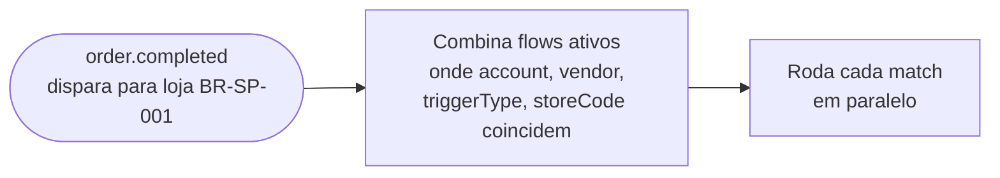
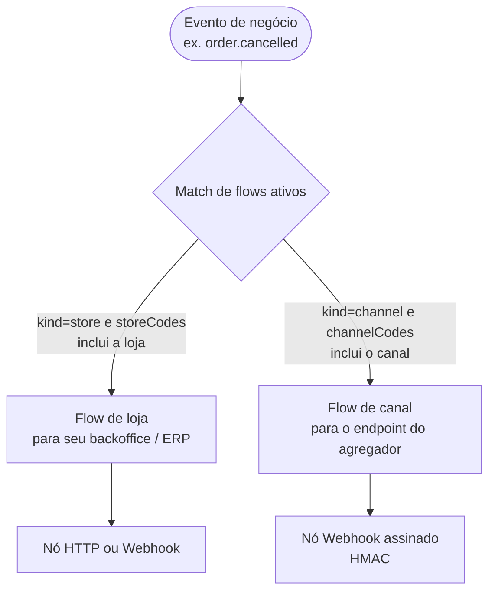
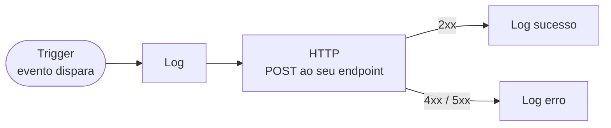

Um **Integration Flow** é o mecanismo de assinatura de eventos do Fire. Em vez de uma URL global de webhook, você configura um ou mais flows no dashboard, cada um com escopo de um account/vendor/loja específico e escutando um trigger type específico. Quando dispara um evento que combina, o Fire roda cada flow ativo em paralelo.

Esta página cobre regras de matching, como você monta um flow, o que o nó HTTP controla e como o body template referencia o trigger data.

## Como funciona o matching

Quando dispara um evento de negócio dentro do Fire, cada flow ativo cujos critérios combinam é selecionado:



Um flow é selecionado quando **tudo** o seguinte é verdade:

| Campo | Regra de match |
|---|---|
| `accountId` | Igual ao account dono da entidade |
| `vendorId` | Igual ao brand/vendor dono da loja |
| `triggerType` | Igual ao tipo de evento (`order.completed`, `order.cancelled`, `order.invoiced`, `order.reversed`) |
| `kind` | `'store'` (escopo por `storeCodes`) ou `'channel'` (escopo por `channelCodes`) |
| `storeCodes` | Só `kind='store'`: vazio (combina todas as lojas) ou contém o código da loja do evento |
| `channelCodes` | Só `kind='channel'`: contém o código do canal do pedido do evento |
| `isActive` | `true` |

Você pode ter **múltiplos flows ativos para o mesmo trigger** — eles rodam independentes. Use isso para distribuir eventos a vários serviços downstream sem mudanças de código (ex.: um flow por consumidor: ERP, analítica, cache fiscal, message broker).

## Escopo: loja vs canal

Um mesmo evento é publicado por um de **dois mecanismos de escopo**, conforme o `kind` do flow:

- **Flow de loja (`kind='store'`)** — combina por `storeCodes` (vazio = todas as lojas do vendor). É o clássico para integrações de backoffice: ERP, analítica, impressão, fiscal.
- **Flow de canal (`kind='channel'`)** — combina por `channelCodes`, o canal de origem do pedido. Serve para **eco ao canal/agregador**: quando um pedido de um canal (um quiosque, um marketplace) muda de estado, o evento volta ao endpoint daquele canal.



Ambos usam o mesmo motor de flows; só muda **como o flow é selecionado** (por loja ou por canal) e para quem entrega. Um flow de canal normalmente usa o **nó Webhook assinado** (abaixo) porque o receptor é um terceiro que precisa verificar a origem.

## Montando um flow

Um flow roda como um pequeno pipeline: o trigger o inicia quando dispara um evento que combina, e então cada nó conectado roda por vez — registrar um passo, chamar seu endpoint por HTTP, ramificar conforme uma condição ou reformatar data — até o flow terminar.

Você monta um flow visualmente no dashboard: parta de um nó trigger e conecte os nós que devem rodar depois dele. Cada nó tem um tipo e sua própria configuração, e os nós seguintes podem ler o trigger context.



### Nó trigger

O ponto de partida. Sua única config relevante é `triggerType`:

```json
{
  "id": "trigger",
  "type": "trigger",
  "data": { "triggerType": "order.completed" }
}
```

### Nó HTTP

Este é o nó que chega ao seu endpoint. Sua config controla a requisição inteira:

```json
{
  "id": "send_to_webhook",
  "type": "http",
  "data": {
    "method": "POST",
    "url": "https://your-service.example.com/fire/events",
    "headers": {
      "Content-Type": "application/json",
      "Authorization": "Bearer {{secret.fire_webhook_token}}"
    },
    "body": "{{seu body template}}",
    "auth": { "type": "bearer", "token": "..." },
    "timeout": 30000,
    "retryOnFailure": true,
    "retryCount": 3,
    "statusRoutes": [
      { "id": "ok",  "statusCode": 200, "label": "OK",   "responseMapping": [...] },
      { "id": "err", "statusCode": 5,   "label": "Server error" }
    ]
  }
}
```

Cada campo é opcional exceto `method` e `url`. `body`, `headers` e `auth` são avaliados como templates contra o [trigger context](#trigger-context).

### Webhook assinado (HMAC)

O nó **Webhook** é um nó HTTP que também **assina o body** com HMAC-SHA256. Use quando o receptor (tipicamente um canal/agregador) precisa verificar que o payload vem do Fire e não foi adulterado. Tem a mesma configuração do nó HTTP (URL, método, headers, body, status routes, auth de transporte) mais um **secret compartilhado**.

A assinatura é **independente** do auth de transporte (Bearer / API key / OAuth2): o auth identifica o transporte; a assinatura HMAC garante a integridade do body e o anti-replay. São complementares.

**Headers que o Fire adiciona:**

| Header | Valor |
|---|---|
| `X-Fire-Signature` | `v1=` + `hex(HMAC-SHA256(secret, "{timestamp}.{rawBody}"))` |
| `X-Fire-Timestamp` | Timestamp Unix em **segundos** |

**Como verificar (do seu lado):**

<Steps>
  <Step title="Leia os headers">Pegue `X-Fire-Timestamp` e `X-Fire-Signature`.</Step>
  <Step title="Anti-replay">Rejeite se `abs(now - timestamp)` passar de 300 segundos (janela de 5 minutos).</Step>
  <Step title="Recalcule">Compute `v1=hex(HMAC-SHA256(secret, timestamp + "." + rawBody))` sobre o **body cru** (não re-serialize o JSON).</Step>
  <Step title="Compare">Use comparação de **tempo constante** (`crypto.timingSafeEqual`), nunca `===`.</Step>
</Steps>

```js
import crypto from "crypto";

function verifyFireSignature(rawBody, signatureHeader, timestampHeader, secret, toleranceSec = 300) {
  const ts = parseInt(timestampHeader, 10);
  if (!Number.isFinite(ts)) return false;
  if (Math.abs(Math.floor(Date.now() / 1000) - ts) > toleranceSec) return false; // anti-replay

  const m = /^v1=([a-f0-9]+)$/i.exec(signatureHeader || "");
  if (!m) return false;

  const expected = crypto
    .createHmac("sha256", secret)
    .update(`${ts}.${rawBody}`)
    .digest("hex");

  const a = Buffer.from(m[1], "hex");
  const b = Buffer.from(expected, "hex");
  return a.length === b.length && crypto.timingSafeEqual(a, b);
}
```

<Warning>
  Assine sobre o **body cru exato** que você recebeu (os mesmos bytes). Se parsear e re-serializar o JSON antes de verificar, a assinatura não vai bater.
</Warning>

<Note>
  O secret é compartilhado fora de banda: você o configura no nó do flow e no seu receptor. Em assinatura inválida, responda `401`; em sucesso, `200`.
</Note>

### Outros tipos de nó

Além de trigger e HTTP, os flows podem incluir:

| Tipo | Propósito |
|---|---|
| `condition` | Ramifica com uma expressão `{{trigger.data.*}}` — paths distintos para casos distintos |
| `log` | Emite uma linha de log para rastreabilidade (visível em **Settings → Integration Flows → Executions**) |
| `transform` | Reformata data com JavaScript antes de passar para um nó seguinte |

Um flow típico de "send to webhook" tem: trigger → log → HTTP → log (sucesso/erro). Veja o exemplo **Webhook Test — Full Order Data** do dashboard para um ponto de partida executável.

## Trigger context

Cada template de nó pode referenciar o **trigger context**, disponível quando o flow roda:

```ts
{
  trigger: {
    event: {
      id: string,         // UUID de execução do flow — sua chave de idempotência
      type: string,       // "order.completed" | "order.cancelled" | "order.invoiced" | "order.reversed"
      createdAt: string,  // ISO 8601 UTC
    },
    data: V4Snapshot,     // payload específico do evento — veja cada página de referência
  },
  execution: { id: string, /* metadata de execução */ },
  flow:      { id: string, name: string },
  queue:     { id, attempt, triggerEntityId, triggerType },
}
```

Você referencia qualquer path com a sintaxe mustache `{{}}`: `{{trigger.event.id}}`, `{{trigger.data.orderId}}`, `{{trigger.data.store.code}}`, `{{flow.name}}`, `{{queue.attempt}}`.

A resolução de paths percorre o trigger context como um objeto JavaScript. Indexar arrays funciona (`{{trigger.data.payments.totals[0].total}}`). Para arrays de tamanho desconhecido, use `{{trigger.data.orderLines.length}}`.

## Body templates

O campo `body` no nó HTTP é a **única** coisa que determina o que seu endpoint recebe. O Fire substitui os paths `{{...}}` do trigger context e faz POST do resultado.

Não há **envelope Fire fixo** forçado pelo sistema. Mas o dashboard inclui um template canônico de exemplo do qual a maioria dos times parte:

```json
{
  "event": {
    "id":        "{{trigger.event.id}}",
    "type":      "{{trigger.event.type}}",
    "createdAt": "{{trigger.event.createdAt}}"
  },
  "data": "{{trigger.data}}",
  "_meta": {
    "executionId":     "{{execution.id}}",
    "flowId":          "{{flow.id}}",
    "flowName":        "{{flow.name}}",
    "attempt":         "{{queue.attempt}}",
    "triggerEntityId": "{{queue.triggerEntityId}}"
  }
}
```

Se você usar este template, seu endpoint recebe exatamente o body documentado em [Visão geral de eventos](/pt/events/overview) e em cada página de referência. Se customizar, o body é o que seu template renderizar.

<Note>
  Quando um path de template resolve para um objeto ou array (ex.: `"{{trigger.data}}"`), o runtime preserva o tipo JSON em vez de serializar para string. Então `"data": "{{trigger.data}}"` produz um objeto JSON aninhado real no wire, não um blob string.
</Note>

## Autenticação

Autentique configurando credenciais no nó HTTP do flow:

| Tipo de auth | Quando usar |
|---|---|
| `bearer` | Um Bearer token estático ou rotativo que seu endpoint valida. |
| `api_key` | Um API key por header (ex.: `x-api-key`). |
| `oauth2_client_credentials` | Seu endpoint está atrás de OAuth2; o Fire busca e cacheia access tokens automaticamente, refrescando ao expirar. |
| `none` | Sem auth (só aceitável se seu endpoint estiver protegido de outra forma, ex.: mTLS, VPC). |

Veja [Entrega e retentativas](/pt/events/delivery#autenticacao) para o setup.

## Status routes

O nó HTTP pode distribuir para diferentes nós seguintes baseado no status da resposta:

```json
"statusRoutes": [
  { "id": "ok",  "statusCode": 200, "label": "OK",
    "responseMapping": [ { "responsePath": "status", "outputField": "webhookStatus", "type": "string" } ] },
  { "id": "client", "statusCode": 4, "label": "Client error" },
  { "id": "server", "statusCode": 5, "label": "Server error" }
]
```

`statusCode` combina por prefixo de dígito: `2` combina todos os `2xx`, `4` combina todos os `4xx`, `200` combina apenas `200`. Cada route pode extrair valores do body de resposta via `responseMapping` e expô-los a nós seguintes.

## Isolamento por tenant

Cada flow tem escopo no seu account e vendor. O Fire nunca roda um flow entre tenants — quando você configura um flow, ele fica vinculado ao seu tenant por padrão, e você não pode assinar eventos de outro account.

## Ativação, versionamento e dry-run

- Os flows podem ser ativados ou desativados — pause ou retome o recebimento de eventos sem deletar o flow.
- Cada save cria uma nova versão; versões passadas são mantidas para auditoria, e apenas a última versão ativa roda.
- O botão **Probar Flujo** do dashboard roda um flow contra um payload sintético de exemplo (um cenário por país) sem afetar dados reais — perfeito para verificar body templates antes de ir para produção.

## Padrões comuns

- **Um flow por consumidor.** Se você tem três serviços downstream (ERP, analítica, broker), use três flows com o mesmo trigger e três nós HTTP apontando para cada um. Adicionar/remover um consumidor vira uma mudança de dashboard, não de código.
- **Fan-out condicional.** Use um nó `condition` depois do trigger para ramificar em `{{trigger.data.store.locationInfo.country.code}}` e rotear pedidos brasileiros para um endpoint fiscal-aware enquanto envia outros países a um genérico.
- **Routing por loja.** Defina `storeCodes` no flow para limitá-lo a lojas específicas, ou use o filtro de lojas do dashboard para limitar o firing.
- **Mapeamento de eventos.** Se seu sistema usa outros nomes de evento, transforme o type no body template: `"event_name": "fire.{{trigger.event.type}}"`.

## Próximo

<CardGroup cols={2}>
  <Card title="Visão geral de eventos" icon="bell" href="/pt/events/overview">
    O modelo event-driven completo e o envelope.
  </Card>
  <Card title="Entrega e retentativas" icon="repeat" href="/pt/events/delivery">
    Timeouts, retentativas, dead-letter, idempotência.
  </Card>
  <Card title="Tratar eventos de pedido" icon="bolt" href="/pt/guides/handle-order-events">
    Walkthrough: construir um handler de webhook em 10 minutos.
  </Card>
  <Card title="order.completed" icon="receipt" href="/pt/events/order-completed">
    A referência completa do snapshot V4 do pedido.
  </Card>
</CardGroup>
