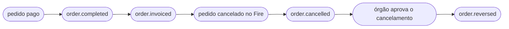

import FiscalEventBlock from '/snippets/fiscal-event-block.pt.mdx';

<Tabs>
  <Tab title="v3 · atual">
    Você está lendo o contrato **atual (v3)** de `order.cancelled`. **v3 é uma mudança incompatível apenas no contexto fiscal**: `cancellation.metadata.fiscal` passa a ser **`cancellation.fiscal`**, estruturado como `{ status, authority }`, e agora se aplica a todo país com um documento autorizado, não só ao Brasil. `cancellation.metadata` não é mais emitido. O resto do evento não muda. Veja [Mudanças de caminho em relação à versão anterior](#mudanças-de-caminho-em-relação-à-versão-anterior).
  </Tab>
  <Tab title="v2.2 · descontinuado">
    <Warning>O contrato **v2.2** está **descontinuado** — mantido como referência histórica. Abra aqui: [`order.cancelled` — v2.2](/pt/events-v2/order-cancelled).</Warning>
  </Tab>
  <Tab title="v1 · descontinuado">
    <Warning>O contrato **v1** está **descontinuado**. Abra aqui: [order-cancelled — v1](/pt/events-v1/order-cancelled).</Warning>
  </Tab>
  <Tab title="v0 · descontinuado">
    <Warning>O contrato **v0** está **descontinuado**. Abra aqui: [order-cancelled — v0](/pt/events-v0/order-cancelled).</Warning>
  </Tab>
</Tabs>

`order.cancelled` dispara quando um pedido previamente injetado é cancelado — pelo backoffice do Fire (`cancellationSource: backoffice`), ou por um adaptador ou a API de cancelamento (`cancellationSource: adapter`). **Não** retrai um `order.completed` anterior do mesmo pedido; ambos os eventos são emitidos independentes.

<Warning>
  **Este evento não significa que o documento fiscal foi anulado.** Ele é emitido quando o **pedido** é cancelado, antes de consultar o órgão. Quando o pedido tinha um documento autorizado, `cancellation.fiscal` descreve esse documento **como estava naquele momento** — ainda `SALE_INVOICE`, com `cancelledAt: null`. A confirmação do órgão chega depois em [`order.reversed`](/pt/events/order-reversed).
</Warning>

## Condição de disparo

O Fire emite `order.cancelled` uma vez quando um pedido transiciona para `CANCELLED`, independente do estado de pagamento anterior, com contexto completo de auditoria.

| | |
|---|---|
| Cobertura | Global — todos os países, todos os canais |
| Chave de idempotência | `event.id` |
| Dispara mais de uma vez | Uma vez por Integration Flow ativo inscrito no evento; com retentativa em falha de entrega |
| Ordem | Não garantida contra `order.completed` — ordene por timestamps se precisar |
| Contexto fiscal | `cancellation.fiscal` quando o pedido tinha um documento autorizado |

## O que tem em `trigger.data`

O mesmo snapshot V4 do pedido que [`order.completed`](/pt/events/order-completed), com quatro diferenças:

1. `status` é **`"CANCELLED"`**.
2. `paymentStatus` não muda (tipicamente `"SUCCEEDED"` se o pedido tinha sido pago).
3. Um bloco top-level **`cancellation`** carrega a metadata de auditoria e, quando aplicável, o documento fiscal.
4. **Não há `data.fiscal` na raiz.** Neste evento o documento do órgão vive só em `cancellation.fiscal`.

`policy` e `lastKnown` viajam exatamente como em `order.completed`. `fiscalRepresentation` tem a mesma forma, mas se para o cancelamento foi numerada uma nota de crédito, traz essa nota no topo e a fatura em `history`. No Brasil (PlugNotas) `fiscalRepresentation` é `null`: não há etapa de numeração. `authority.providerIdentity` e `authority.providerMetadata` aparecem nos documentos guardados sob este contrato; em pedidos anteriores as chaves podem faltar — trate a chave ausente como `null`.

## Exemplo — Brasil, com documento autorizado (sanitizado)

```json
{
  "event": { "id": "…", "type": "order.cancelled", "createdAt": "2026-09-15T05:06:45.562Z" },
  "data": {
    "orderId": "15801bd1-83d3-4d70-bb1b-793fd30b7bec",
    "orderCode": "OC-br-001",
    "status": "CANCELLED",
    "paymentStatus": "SUCCEEDED",
    "store": { /* igual a order.completed */ },
    "orderLines": [ /* igual a order.completed */ ],
    "policy": { "deferredPayment": { "eligible": false, "resolvedAt": "2026-09-15T05:00:45.760Z", "configVersion": "fnv1a:a0c02d27", "resolvedFrom": { "channelCode": "KIOSK", "fulfillmentCode": "DINE-IN", "paymentMethod": null } } },
    "lastKnown": { "kds": { "status": "preparing", "sourceEvent": "order.status_updated" }, "fiscal": { "status": "authorized", "sourceEvent": "order.invoiced" } },
    "fiscalRepresentation": null,

    "cancellation": {
      "cancellationId": "6fcb0a30-cfde-4ffe-96ef-545dde3fa87c",
      "cancelledAt": "2026-09-15T05:06:44.359Z",
      "cancelledBy": "4fadc5f3-d9da-4756-978d-5a8cffc25d40",
      "cancellationType": "OTHER",
      "cancellationGroup": "Other",
      "cancellationReason": "Customer requested cancellation",
      "cancellationNote": null,
      "cancellationSource": "backoffice",

      "fiscal": {
        "status": "authorized",
        "authority": {
          "documentType": "SALE_INVOICE",
          "docSubtype": "nfce",
          "documentNumber": "12388",
          "issuedAt": "2026-09-15T05:00:48.003Z",
          "authorizedAt": "2026-09-15T03:00:00.000Z",
          "cancelledAt": null,
          "authorizationMode": "ONLINE",
          "providerDocId": "6aa8d10117b687522d90ae0a",
          "pdfUrl": "https://api.fiscal-provider.example/nfce/6aa8d10117b687522d90ae0a/pdf",
          "xmlUrl": "https://api.fiscal-provider.example/nfce/6aa8d10117b687522d90ae0a/xml",
          "amounts": { "total": 11.9, "tax": 1.65, "currencyCode": "BRL" },
          "countryData": {
            "chaveAcesso": "41201008187168000160558050010000131609769080",
            "numero": "12388",
            "serie": "2",
            "modelo": 65,
            "protocolo": "135266298552102",
            "cStat": "135"
          },
          "graphic": { "qr": "41201008187168000160558050010000131609769080" },
          "providerIdentity": null,
          "providerMetadata": null
        }
      }
    }
  },
  "_meta": { "executionId": "…", "flowId": "…", "attempt": "1" }
}
```

## Exemplo — sem documento autorizado

Quando o pedido não tinha documento autorizado (o órgão ainda não tinha respondido, a loja não emite documentos, ou o documento não tem id do provedor), a **chave `fiscal` está ausente** — não `null`. Aqui, uma loja que não numera no caixa, cancelada antes de o órgão responder: `fiscalRepresentation` é `null`, `lastKnown.fiscal` ainda diz `processing` e `cancellation` não tem `fiscal`. Nenhum `order.reversed` vem depois.

Nos países que numeram no caixa, um pedido não pode ser cancelado enquanto a sua fatura estiver vigente: o Fire responde `409` (`FISCAL_REPRESENTATION_NOT_VOIDED`) até que a nota de crédito seja pedida. Depois disso, o evento traz `fiscalRepresentation` com a `CREDIT_NOTE` no topo e a fatura em `history`.

```json
{
  "event": { "id": "…", "type": "order.cancelled", "createdAt": "2026-09-15T14:12:03.114Z" },
  "data": {
    "orderId": "…",
    "orderCode": "OC-cl-001",
    "status": "CANCELLED",
    "paymentStatus": "SUCCEEDED",
    "store": { /* igual a order.completed */ },
    "orderLines": [ /* igual a order.completed */ ],
    "policy": { /* igual a order.completed */ },
    "lastKnown": { "kds": null, "fiscal": { "status": "processing", "sourceEvent": "order.injected" } },
    "fiscalRepresentation": null,

    "cancellation": {
      "cancellationId": "abcf3781-c327-4df1-84ef-5efbacc1d387",
      "cancelledAt": "2026-09-15T14:12:02.870Z",
      "cancelledBy": "4fadc5f3-d9da-4756-978d-5a8cffc25d40",
      "cancellationType": "CUSTOMER_CALLED_TO_CANCEL",
      "cancellationGroup": "Cliente",
      "cancellationReason": "Cliente solicitou cancelamento",
      "cancellationNote": null,
      "cancellationSource": "backoffice"
    }
  },
  "_meta": { "executionId": "…", "flowId": "…", "attempt": "1" }
}
```

Verifique com `if (data.cancellation.fiscal)`.

<Note>Os blocos omitidos como *igual a `order.completed`* são byte a byte o snapshot que `order.completed` carrega. Veja a [referência de campos de `order.completed`](/pt/events/order-completed#referência-de-campos).</Note>

## Referência de `data.cancellation`

<ResponseField name="cancellation" type="object">
  Bloco de auditoria que descreve como, quando e por quem o pedido foi cancelado.

  <Expandable title="cancellation">
    <ResponseField name="cancellationId" type="string">
      UUID deste cancelamento. Estável entre retentativas, e compartilhado com o `order.reversed` do mesmo cancelamento.
    </ResponseField>
    <ResponseField name="cancelledAt" type="string">
      Timestamp ISO 8601 UTC do cancelamento do pedido no Fire. Não é o `authority.cancelledAt` do órgão.
    </ResponseField>
    <ResponseField name="cancelledBy" type="string">
      Quem cancelou o pedido: o UUID do usuário quando `cancellationSource` é `backoffice`; `api-key:<keyId>` quando é `adapter`. Nunca `null`.
    </ResponseField>
    <ResponseField name="cancellationType" type="string | null">
      Código estável do motivo: catálogo interno (`ITEM_OUT_OF_STOCK`, `OTHER`) ou código do agregador (`1010`). **Sempre presente** — `null` quando não foi definido um motivo estruturado.
    </ResponseField>
    <ResponseField name="cancellationGroup" type="string | null">
      Categoria do motivo, interna ou do agregador (`SAG (IFOOD)`). **Sempre presente** — `null` quando não definida.
    </ResponseField>
    <ResponseField name="cancellationReason" type="string">
      Motivo em texto livre capturado no momento do cancelamento.
    </ResponseField>
    <ResponseField name="cancellationNote" type="string | null">
      Nota opcional em texto livre. **Sempre presente** — `null` quando não há.
    </ResponseField>
    <ResponseField name="cancellationSource" type="string">
      Onde o cancelamento se originou: `backoffice` ou `adapter`.
    </ResponseField>
    <ResponseField name="fiscal" type="object">
      **Presente apenas quando o pedido tinha um documento autorizado** com id do provedor. Carrega `status` (`authorized`, ou `cancelling` se já havia uma anulação em andamento) e `authority` — veja [O bloco fiscal](#o-bloco-fiscal). Neste evento **não** carrega `history`, `compensates`, `countryCode`, `providerCode` nem `occurredAt`; esses chegam com `order.reversed`.
    </ResponseField>
  </Expandable>
</ResponseField>

<FiscalEventBlock />

## Lifecycle relativo a outros eventos



- `order.cancelled` é emitido **imediatamente**, antes de contatar o órgão.
- `order.reversed` vem em seguida quando o órgão confirma — segundos ou minutos depois.
- Sem documento autorizado, só dispara `order.cancelled`.

## Handler de exemplo

```js
async function onOrderCancelled(data) {
  const { orderId, cancellation } = data;

  await db.orders.update({
    where: { fireOrderId: orderId },
    data: {
      status: "CANCELLED",
      cancelledAt: new Date(cancellation.cancelledAt),
      cancellationType: cancellation.cancellationType,
    },
  });

  // Existia um documento autorizado: a anulação fiscal ainda está pendente.
  if (cancellation.fiscal) {
    await reconciliation.open({
      orderId,
      document: cancellation.fiscal.authority,
      pendingAuthorityCancel: true, // fechado por order.reversed
    });
  }

  await downstream.rollback(orderId);
}
```

## Erros comuns

- **Leia `cancellation.fiscal`, não `cancellation.metadata.fiscal`.** O caminho anterior vem vazio na v3.
- **`cancellation.fiscal` é o documento antes da anulação.** Para a confirmação do órgão, escute [`order.reversed`](/pt/events/order-reversed).
- **Ausente, não `null`.** Teste a presença da chave; não compare com `null`.
- **`order.cancelled` não é um reembolso.** O reembolso, se houver, é iniciado pelo canal ou processador.
- **Não assuma que `order.completed` chegou primeiro.** Tolere um `order.cancelled` de um pedido que você ainda não conhece.

## Eventos relacionados

<CardGroup cols={2}>
  <Card title="order.completed" icon="receipt" href="/pt/events/order-completed">
    O evento que você verá para o mesmo pedido antes do cancelamento.
  </Card>
  <Card title="order.reversed" icon="file-circle-xmark" href="/pt/events/order-reversed">
    Dispara quando o órgão confirma o cancelamento do documento.
  </Card>
</CardGroup>

## `data.fiscalRepresentation`

Sem mudanças na v3. É a numeração fiscal impressa no caixa, um bloco diferente de `cancellation.fiscal`: nunca diz que o documento foi autorizado. Quando um cancelamento numera uma nota de crédito, essa nota fica no topo e a fatura desce para `fiscalRepresentation.history`. É o mesmo bloco de `order.completed` — referência de campos em [`order.completed` → `data.fiscalRepresentation`](/pt/events/order-completed#data-fiscalrepresentation).

## `data.policy` e `data.lastKnown`

Sem mudanças na v3 e iguais em todos os eventos de pedido. `lastKnown.fiscal.status` é o estado fiscal atual do pedido e é orientativo — nunca condicione uma ação irreversível a ele. Referência em [`order.completed` → `data.policy` e `data.lastKnown`](/pt/events/order-completed#data-policy-e-data-lastknown).
