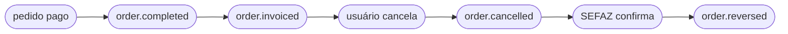

<Tabs>
  <Tab title="v2.1 · atual">
    Você está vendo o contrato **atual (v2.1)** de `order.cancelled`. **v2.1 adiciona** `data.policy.deferredPayment` (este pedido pode ser trabalhado antes do pagamento?) e `data.lastKnown` (estado orientativo de cozinha/fiscal), mais o novo evento [`order.opened`](/pt/events/order-opened). Apenas aditivo — nada do que você já lia mudou. Também carrega o motivo de cancelamento estruturado introduzido na v2 — `cancellationType`, `cancellationGroup` e `cancellationNote`, sempre presentes (`null` quando vazios).
  </Tab>
  <Tab title="v2 · descontinuado">
    <Warning>O contrato **v2** está **descontinuado** — mantido como referência histórica. Abra aqui: [`order.cancelled` — v2](/pt/events-v2/order-cancelled).</Warning>
  </Tab>
  <Tab title="v1 · descontinuada">
    <Warning>O contrato **v1** está **descontinuado**. Abra aqui: [order-cancelled — v1](/pt/events-v1/order-cancelled).</Warning>
  </Tab>
  <Tab title="v0 · descontinuada">
    <Warning>O contrato **v0** está **descontinuado**. Abra aqui: [order-cancelled — v0](/pt/events-v0/order-cancelled).</Warning>
  </Tab>
</Tabs>

`order.cancelled` dispara quando um pedido previamente injetado é cancelado — pela UI do backoffice do Fire, um adaptador externo ou uma chamada à API de cancelamento. **Não** retrai um `order.completed` anterior do mesmo pedido; ambos os eventos são emitidos independentes.

## Condição de disparo

O Fire emite `order.cancelled` uma vez quando o status de um pedido transiciona para `CANCELLED`, independente do estado de pagamento anterior. O cancelamento é registrado com contexto completo de auditoria (quem, quando, por quê, fonte).

| | |
|---|---|
| Cobertura | Global (todos os países, todos os canais) |
| Chave de idempotência | `event.id` |
| Dispara mais de uma vez | Não, salvo em retentativas |
| Ordem | Não garantida contra `order.completed` para o mesmo pedido — ordene por timestamps se precisar |
| Retentativas | Até 5 tentativas com backoff exponencial (quando `retryOnFailure` está habilitado) |
| Contexto fiscal brasileiro | Inclui dados fiscais originais em `cancellation.metadata.fiscal` se o pedido tinha sido fiscalmente autorizado |

## O que tem em `trigger.data`

Mesmo snapshot V4 que [`order.completed`](/pt/events/order-completed) — todos os campos documentados lá estão presentes aqui, com três diferenças:

1. `status` é **`"CANCELLED"`** (não `"COMPLETED"`).
2. `paymentStatus` permanece igual a quando o pedido foi completado (tipicamente `"SUCCEEDED"` se o pedido tinha sido pago antes do cancelamento).
3. Um novo bloco top-level **`cancellation`** carrega a metadata de auditoria.

## Exemplo — payload real de produção (BR, sanitizado)

```json
{
  "event": {
    "id": "abcf3781-c327-4df1-84ef-5efbacc1d387",
    "type": "order.cancelled",
    "createdAt": "2026-05-05T23:06:08.883Z"
  },
  "data": {
    "orderId": "e98f5725-0d1e-4f93-ac18-40f1068cae89",
    "orderCode": "OC-br-001",
    "businessDayDate": "2026-03-31",
    "externalOrderId": "ac331b68-66fb-48ee-b110-a40181bfb379",
    "status": "CANCELLED",
    "paymentStatus": "SUCCEEDED",
    "redeemPoints": false,
    "accumulatePoints": false,
    "discount": false,
    "createdAt": "2026-05-05T23:05:00.438Z",
    "orderComment": "Comentário de teste do pedido",
    "marketing": null,
    "store": { /* igual a order.completed — veja /pt/events/order-completed */ },
    "device": { /* ... */ },
    "channel": { /* ... */ },
    "operator": { /* ... */ },
    "client": { /* ... */ },
    "payments": { /* ... */ },
    "kds": { /* ... */ },
    "metadata": {},
    "orderLines": [ /* ... */ ],
    "fulfillment": { /* ... */ },

    "cancellation": {
      "cancellationId": "abcf3781-c327-4df1-84ef-5efbacc1d387",
      "cancelledAt": "2026-05-05T23:06:08.883Z",
      "cancelledBy": "00000000-0000-0000-0000-000000000000",
      "cancellationReason": "Cliente solicitou cancelamento",
      "cancellationType": "CUSTOMER_REQUESTED",
      "cancellationGroup": "Cliente",
      "cancellationNote": "cliente pidió cancelar",
      "cancellationSource": "backoffice",
      "metadata": {
        "fiscal": {
          "serie": null,
          "numero": "1000013",
          "pdfUrl":   "https://api.fiscal-provider.example/nfce/<docId>/pdf",
          "xmlUrl":   "https://api.fiscal-provider.example/nfce/<docId>/xml",
          "protocolo": "141200000956123",
          "docSubtype": "nfce",
          "chaveAcesso": "41201008187168000160558050010000131609769080",
          "providerDocId": "69fa77aa2a48c20329be4604",
          "dataAutorizacao": "2026-05-05T23:05:15.590Z"
        }
      }
    }
  },
  "_meta": { "executionId": "...", "flowId": "...", "attempt": "1" }
}
```

## Referência de `data.cancellation`

<ResponseField name="cancellation" type="object">
  Bloco de auditoria que descreve como, quando e por quem o pedido foi cancelado.

  <Expandable title="cancellation">
    <ResponseField name="cancellationId" type="string">
      UUID para este evento de cancelamento. Estável através de retentativas.
    </ResponseField>
    <ResponseField name="cancelledAt" type="string">
      Timestamp ISO 8601 UTC do cancelamento.
    </ResponseField>
    <ResponseField name="cancelledBy" type="string | null">
      UUID do operador/usuário que cancelou o pedido. `null` para cancelamentos iniciados pelo sistema (ex.: um flow automatizado).
    </ResponseField>
    <ResponseField name="cancellationReason" type="string | null">
      Razão free-text capturada no momento do cancelamento. Pode ser empty ou `null`.
    </ResponseField>
    <ResponseField name="cancellationSource" type="string">
      Onde o cancelamento se originou. Valores incluem `backoffice`, `adapter`, `api`. Use para ramificar a lógica do handler.
    </ResponseField>
    <ResponseField name="cancellationType" type="string | null">
      Código estável do motivo. Catálogo interno (ex. `ITEM_OUT_OF_STOCK`) ou código numérico de agregador/SAG (ex. `1010`). **Sempre presente** — `null` quando nenhum motivo estruturado foi definido.
    </ResponseField>
    <ResponseField name="cancellationGroup" type="string | null">
      Categoria do motivo. Interno (ex. `Inventario`, `Cliente`) ou agregador (ex. `SAG (KEETA)`, `SAG (IFOOD)`). **Sempre presente** — `null` quando nenhum motivo estruturado foi definido.
    </ResponseField>
    <ResponseField name="cancellationNote" type="string | null">
      Nota de texto livre opcional inserida no cancelamento. **Sempre presente** — `null` quando nenhuma nota foi inserida.
    </ResponseField>
    <ResponseField name="metadata" type="object">
      Contexto extra. Hoje só inclui `fiscal` (quando aplica).

      <Expandable title="metadata">
        <ResponseField name="fiscal" type="object | null">
          **Apenas Brasil — presente quando o pedido tinha sido fiscalmente autorizado antes do cancelamento.** Contém o contexto do documento fiscal original para que seu sistema downstream possa reconciliar contra o documento previamente emitido.

          Campos: `serie`, `numero`, `pdfUrl`, `xmlUrl`, `protocolo`, `docSubtype` (ex.: `nfce`, `nfe`), `chaveAcesso` (chave de acesso SEFAZ de 44 dígitos), `providerDocId` (ID interno do seu provedor fiscal), `dataAutorizacao` (ISO 8601 UTC da autorização original).

          <Note>
            Este é o dado fiscal **original** no momento do cancelamento, **não** o resultado do cancelamento SEFAZ. O resultado SEFAZ chega em um evento separado [`order.reversed`](/pt/events/order-reversed) com `cancellation.metadata.fiscal.sefazCancellation` populado.
          </Note>
        </ResponseField>
      </Expandable>
    </ResponseField>
  </Expandable>
</ResponseField>

## Lifecycle relativo a outros eventos

Para um pedido brasileiro fiscal-enabled que é cancelado, espere esta sequência:



- `order.cancelled` é emitido **imediatamente** quando o cancelamento acontece, antes de contatar qualquer autoridade fiscal externa.
- `order.reversed` é emitido **depois** — uma vez que a SEFAZ confirma via seu provedor fiscal. Pode chegar segundos ou minutos após `order.cancelled`, dependendo do tempo de resposta da SEFAZ.
- Para pedidos não brasileiros ou lojas sem emissão fiscal, apenas `order.cancelled` dispara.

## Variações por país

`order.cancelled` é **global** — dispara para todos os países e todos os canais quando um pedido é cancelado (Argentina, Brasil, Chile, Colômbia, Equador, Venezuela e qualquer outro país com Integration Flows ativos). O bloco de auditoria de cancelamento (`cancellation.{cancellationId, cancelledAt, cancelledBy, cancellationReason, cancellationSource}`) é idêntico em todos os países.

O único campo específico por país é `cancellation.metadata.fiscal`, que é populado **apenas para lojas brasileiras que tinham um documento fiscal previamente autorizado** (ou seja, um `order.invoiced` foi emitido para este pedido antes). Para todos os demais países — e para pedidos BR cancelados antes da autorização fiscal — `cancellation.metadata.fiscal` é `null` e nenhum evento [`order.reversed`](/pt/events/order-reversed) seguirá.

Para lojas não-BR (Argentina, Chile, Colômbia, Equador, Venezuela, outras), o bloco cancellation fica assim:

```json Cancelamento não-BR
{
  "cancellation": {
    "cancellationId": "abcf3781-c327-4df1-84ef-5efbacc1d387",
    "cancelledAt": "2026-05-05T23:06:08.883Z",
    "cancelledBy": "00000000-0000-0000-0000-000000000000",
    "cancellationReason": "Cliente solicitou cancelamento",
    "cancellationType": "CUSTOMER_REQUESTED",
    "cancellationGroup": "Cliente",
    "cancellationNote": "cliente pidió cancelar",
    "cancellationSource": "backoffice",
    "metadata": { "fiscal": null }
  }
}
```

Os identificadores a nível de loja em `data.store` variam por país — veja [`order.completed` → Variações por país](/pt/events/order-completed#variações-por-país) para `country.code`, `currencyCode` e `storeFiscalConfig.govIdType` (`CNPJ` / `CUIT` / `RUT` / `NIT` / `RUC` / `RIF`) por país.

## Handler de exemplo

```js
async function onOrderCancelled(data) {
  const { orderId, store, cancellation } = data;

  // 1. Marque o pedido como cancelado no seu sistema (idempotente)
  await db.orders.update({
    where: { fireOrderId: orderId },
    data: {
      status: "CANCELLED",
      cancelledAt: new Date(cancellation.cancelledAt),
      cancellationReason: cancellation.cancellationReason,
      cancellationSource: cancellation.cancellationSource,
    },
  });

  // 2. Se a loja tem fiscal habilitado e havia um doc fiscal,
  //    abra um ticket de reconciliação — o cancelamento SEFAZ
  //    seguirá em order.reversed.
  if (cancellation.metadata?.fiscal) {
    await reconciliation.open({
      orderId,
      country: store.locationInfo.country.code,
      originalDoc: cancellation.metadata.fiscal,
      pendingSefazCancel: true,
    });
  }

  // 3. Reverta side-effects downstream (libera estoque, refund, etc.)
  await downstream.rollback(orderId);
}
```

## `data.policy` e `data.lastKnown`

Todos os eventos de pedido carregam estes dois blocos, não só este. Foram
adicionados junto com o ciclo de pagamento diferido e são **adicionados na v2.1**, aditivos:
consumidores existentes continuam funcionando sem alteração.

| Bloco | O que é | Confiar? |
|---|---|---|
| `policy.deferredPayment` | Se o pedido pode ser trabalhado **antes** do pagamento. Resolvido uma vez na injeção e carimbado imutável — todos os eventos seguintes repetem o mesmo valor. | Sim. É uma decisão, não um estado. |
| `lastKnown` | Foto orientativa do estado de cozinha (`kds`) e fiscal na emissão do evento. Pode vir `null` ou desatualizado. | **Não.** Nunca condicione uma ação irreversível a isto. |

```json
"policy": { "deferredPayment": { "eligible": true, "resolvedAt": "2026-08-02T15:55:42.407Z",
    "configVersion": "fnv1a:3144c6fb",
    "resolvedFrom": { "channelCode": "APP", "fulfillmentCode": "DELIVERY", "paymentMethod": "CASH" } } },
"lastKnown": { "kds": null, "fiscal": { "status": "processing", "sourceEvent": "fiscal.callback" } }
```

O detalhe campo a campo está em [`order.opened`](/pt/events/order-opened#política-de-pagamento-diferido),
o evento onde estes blocos mais importam.

## Erros comuns

- **`status === "CANCELLED"`, não `paymentStatus`.** Pedidos pagos cancelados mantêm `paymentStatus === "SUCCEEDED"`; o cancelamento vive no campo `status` mais o bloco `cancellation`.
- **`order.cancelled` ≠ refund.** O Fire reporta o cancelamento; o refund (se houver) é iniciado pelo canal/processador e não está neste payload.
- **Não assuma que `order.completed` chegou primeiro.** Entrega fora de ordem é possível — seu handler deveria tolerar receber `order.cancelled` para um `orderId` que ainda não conhece (ex.: log + cria um placeholder; reconcilia quando `order.completed` chegar).
- **`cancellation.metadata.fiscal` é o doc original, não o resultado do cancelamento.** Para a confirmação SEFAZ, escute [`order.reversed`](/pt/events/order-reversed).

## Eventos relacionados

<CardGroup cols={2}>
  <Card title="order.completed" icon="receipt" href="/pt/events/order-completed">
    O evento que você verá para o mesmo pedido antes do cancelamento.
  </Card>
  <Card title="order.reversed" icon="file-circle-xmark" href="/pt/events/order-reversed">
    Apenas Brasil — dispara quando a SEFAZ confirma o cancelamento.
  </Card>
</CardGroup>
