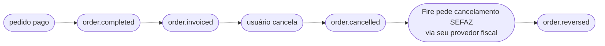

<Tabs>
  <Tab title="v2 · atual">
    Você está vendo o contrato **atual (v2)**. Adiciona o motivo estruturado ao bloco `cancellation` — `cancellationType` (código estável), `cancellationGroup` (categoria) e `cancellationNote` (texto livre), **sempre presentes** (`null` quando vazio) — sobre o snapshot v1.
  </Tab>
  <Tab title="v1 · descontinuada">
    <Warning>O contrato **v1** está **descontinuado**. Abra aqui: [order-reversed — v1](/pt/events-v1/order-reversed).</Warning>
  </Tab>
  <Tab title="v0 · descontinuada">
    <Warning>O contrato **v0** está **descontinuado**. Abra aqui: [order-reversed — v0](/pt/events-v0/order-reversed).</Warning>
  </Tab>
</Tabs>

`order.reversed` dispara quando a SEFAZ confirma o cancelamento de um documento fiscal (NFC-e ou NF-e) que tinha sido previamente autorizado. É a contraparte SEFAZ-confirmada de [`order.cancelled`](/pt/events/order-cancelled): o pedido é cancelado primeiro dentro do Fire (disparando `order.cancelled`), o Fire então pede o cancelamento na SEFAZ via seu provedor fiscal, e `order.reversed` dispara apenas quando a SEFAZ carimba o protocolo de cancelamento.

## Condição de disparo

O Fire emite `order.reversed` uma vez por cancelamento fiscal, na primeira vez em que **tudo** o seguinte é verdade:

- O pedido está em uma loja com faturamento fiscal habilitado (`storeFiscalConfig.enabled === true`)
- Um documento fiscal tinha sido previamente autorizado (ou seja, `order.invoiced` foi emitido antes)
- Uma solicitação de cancelamento foi enviada ao seu provedor fiscal
- O seu provedor fiscal reporta que a autoridade fiscal confirmou o cancelamento

| | |
|---|---|
| Cobertura | **Todos os países** — o país viaja em `fiscal.countryCode` |
| Chave de idempotência | `event.id` |
| Dispara mais de uma vez | Não, salvo em retentativas |
| Latência relativa a `order.cancelled` | Geralmente segundos; pode ser minutos se a autoridade fiscal estiver degradada |
| Pré-condição | Um `order.invoiced` anterior para o mesmo `orderId` |

## O que tem em `trigger.data`

Mesmo snapshot V4 que [`order.cancelled`](/pt/events/order-cancelled) — incluindo o mesmo bloco `cancellation` de auditoria — com um sub-objeto extra **`sefazCancellation`** dentro de `cancellation.metadata.fiscal`. Essa é a única diferença estrutural.

`status` é `"CANCELLED"`. O pedido é o mesmo referenciado pelo evento `order.cancelled` anterior do mesmo `orderId`.

## Exemplo — payload real de produção (BR, sanitizado)

```json
{
  "event": {
    "id": "...",
    "type": "order.reversed",
    "createdAt": "2026-05-05T23:08:42.123Z"
  },
  "data": {
    "orderId": "e98f5725-0d1e-4f93-ac18-40f1068cae89",
    "orderCode": "OC-br-001",
    "status": "CANCELLED",
    "paymentStatus": "SUCCEEDED",
    "store": { /* igual a order.completed */ },
    "client": { /* ... */ },
    "payments": { /* ... */ },
    "orderLines": [ /* ... */ ],
    "fulfillment": { /* ... */ },
    "device": { /* ... */ },
    "channel": { /* ... */ },
    "operator": { /* ... */ },
    "kds": { /* ... */ },
    "marketing": null,
    "metadata": {},

    "cancellation": {
      "cancellationId": "abcf3781-c327-4df1-84ef-5efbacc1d387",
      "cancelledAt": "2026-05-05T23:06:08.883Z",
      "cancelledBy": "00000000-0000-0000-0000-000000000000",
      "cancellationReason": "Cliente solicitou cancelamento",
      "cancellationType": "CUSTOMER_REQUESTED",
      "cancellationGroup": "Cliente",
      "cancellationNote": "cliente pidió cancelar",
      "cancellationSource": "backoffice",
      "metadata": {
        "fiscal": {
          "serie": null,
          "numero": "1000013",
          "pdfUrl":   "https://api.fiscal-provider.example/nfce/<docId>/pdf",
          "xmlUrl":   "https://api.fiscal-provider.example/nfce/<docId>/xml",
          "protocolo": "141200000956123",
          "docSubtype": "nfce",
          "chaveAcesso": "41201008187168000160558050010000131609769080",
          "providerDocId": "69fa77aa2a48c20329be4604",
          "dataAutorizacao": "2026-05-05T23:05:15.590Z",

          "sefazCancellation": {
            "date": "2026-05-05T23:08:30.000Z",
            "cStat": "135",
            "protocolo": "141201234567890",
            "xmlUrl": "https://api.fiscal-provider.example/nfce/<docId>/cancelamento/xml",
            "justificativa": "Cancelamento por solicitação do cliente — pedido não retirado"
          }
        }
      }
    }
  },
  "_meta": { "executionId": "...", "flowId": "...", "attempt": "1" }
}
```

## Referência de `data.cancellation.metadata.fiscal.sefazCancellation`

Este é o único bloco que é único de `order.reversed`. Cada outro campo é compartilhado com [`order.cancelled`](/pt/events/order-cancelled) — veja essa página para os campos de auditoria de cancelamento.

<ResponseField name="sefazCancellation" type="object">
  Confirmação SEFAZ do cancelamento. Presente apenas após a SEFAZ ter carimbado o protocolo de cancelamento.

  <Expandable title="sefazCancellation">
    <ResponseField name="date" type="string | null">
      Timestamp ISO 8601 UTC de quando a SEFAZ carimbou o cancelamento. Pode ser `null` para flows sandbox que não propagam o timestamp.
    </ResponseField>
    <ResponseField name="cStat" type="string | null">
      Código de status raw SEFAZ para o evento de cancelamento. `135` é o código canônico "cancelamento aceito" para NFC-e/NF-e. Pode ser `null` quando o provedor não o expõe.
    </ResponseField>
    <ResponseField name="protocolo" type="string | null">
      Número de protocolo de cancelamento SEFAZ — distinto do protocolo de autorização original. Necessário para qualquer referência de auditoria ao cancelamento.
    </ResponseField>
    <ResponseField name="xmlUrl" type="string">
      URL para baixar o XML canônico SEFAZ do evento de cancelamento (o XML "cancelamento", separado do XML de autorização).
    </ResponseField>
    <ResponseField name="justificativa" type="string | null">
      Texto de razão enviado à SEFAZ. Deve ter pelo menos 15 caracteres por regras SEFAZ. Pode ser `null` apenas para flows sandbox.
    </ResponseField>
  </Expandable>
</ResponseField>

## Lifecycle



Para um pedido brasileiro fiscal-enabled, espere os quatro eventos acima. Para pedidos brasileiros **sem** autorização fiscal (porque o pedido foi cancelado antes da emissão fiscal, ou o fiscal estava desabilitado), apenas `order.cancelled` dispara — não `order.reversed`.

## Handler de exemplo

```js
async function onFiscalCancelled(data) {
  const { orderId, cancellation } = data;
  const fiscal = cancellation.metadata?.fiscal;
  const sefaz = fiscal?.sefazCancellation;

  if (!sefaz) {
    // Defensivo: o evento implica que sefazCancellation está presente,
    // mas seu handler não deveria crashear se o seu provedor fiscal algum dia
    // enviar um formato null.
    return;
  }

  // 1. Atualize o registro do doc fiscal com a confirmação SEFAZ
  await db.fiscalDocs.update({
    where: { providerDocId: fiscal.providerDocId },
    data: {
      status: "cancelled",
      cancellationProtocolo: sefaz.protocolo,
      cancelledAtSefaz: sefaz.date ? new Date(sefaz.date) : null,
      cancellationXmlUrl: sefaz.xmlUrl,
    },
  });

  // 2. Arquive o XML de cancelamento (legalmente exigido em BR)
  if (sefaz.xmlUrl) {
    const xml = await fetch(sefaz.xmlUrl).then(r => r.text());
    await archive.put(`xml-cancel/${fiscal.providerDocId}.xml`, xml);
  }

  // 3. Feche o ticket de reconciliação aberto pelo order.cancelled
  await reconciliation.close(orderId);
}
```

## Erros comuns

- **Não processe `order.reversed` sem `order.cancelled` primeiro.** Eles disparam em ordem em fluxo normal, mas entrega fora de ordem é possível. Se você receber `order.reversed` para um `orderId` que não tem como cancelado registrado, logue e crie o registro a partir do bloco `cancellation` deste evento — não jogue o evento fora.
- **`sefazCancellation.date` e `cStat` podem ser `null` em sandbox.** Não faça com que a production-readiness dependa de eles estarem presentes em ambientes dev.
- **A URL do XML de cancelamento é distinta do XML do documento original.** Garanta que sua lógica de arquivamento salve ambos — você precisará deles para auditoria.
- **Mesmo `cancellation.cancellationId` que `order.cancelled`.** Ambos os eventos para o mesmo cancelamento compartilham o cancellation ID — útil como chave de join ao correlacionar os dois eventos no seu sistema.
- **Não há evento para cancelamento SEFAZ falho.** Se a SEFAZ rejeita a solicitação de cancelamento, nenhum evento dispara. Monitore o log de execuções do dashboard para esses casos.

## Eventos relacionados

<CardGroup cols={2}>
  <Card title="order.cancelled" icon="ban" href="/pt/events/order-cancelled">
    Dispara antes deste evento — o cancelamento em si.
  </Card>
  <Card title="order.invoiced" icon="file-invoice" href="/pt/events/order-invoiced">
    O evento anterior que estabeleceu o documento fiscal sendo cancelado aqui.
  </Card>
</CardGroup>

## `data.fiscalRepresentation`

<Note>
  Em `order.reversed` este bloco é especialmente relevante: são os números do
  comprovante **que está sendo anulado**. A anulação não os altera — o que muda é
  `lastKnown.fiscal.status`, que passa a `cancelled`.
</Note>


A **numeração fiscal** que o ponto de venda obteve *antes* de injetar o pedido:
cobra, pede os identificadores, imprime o comprovante e só então injeta. Por isso
viaja no pedido e não em um evento fiscal separado — quando o pedido nasce, isso
já aconteceu.

<Warning>
  **A presença deste bloco NÃO significa que o comprovante esteja autorizado.**
  São os números impressos no caixa; o veredito do órgão está em
  `lastKnown.fiscal.status`. Um ticket que diga "autorizado" só porque o bloco
  está presente declara algo que pode não ter acontecido.
</Warning>

**A chave viaja sempre.** Chega em `null` quando não se tentou numerar
— agregadores, países sem representação fiscal, ou comércios com a numeração
desativada — e traz o bloco quando houve tentativa.

Trazer o bloco significa **que se tentou numerar, não que foi numerado**:
`numberingStatus` diz como a tentativa terminou, e `failure` por quê quando não
terminou bem.

Ramifique pelo valor, não pela presença da chave:

```js
if (data.fiscalRepresentation) {
  // houve tentativa de numeração — veja numberingStatus para saber como saiu
}
```

| Campo | O que é |
|---|---|
| `numberingStatus` | Como terminou o **ato de numerar**: `GENERATED`, `PENDING`, `FAILED_RETRYABLE`, `FAILED_FINAL`, `UNAVAILABLE`. **Não é o veredito do órgão** — esse está em `lastKnown.fiscal.status`. |
| `documentNumber` | Número visível do comprovante, composto conforme o país (`005-004-000000042`). É apresentação: para conciliar use `serie` + `sequential`. |
| `sequential` | Sequencial atribuído pelo órgão. |
| `serie` | Série do comprovante. `null` onde o país não a usa. |
| `issuedAt` | Quando foi **numerado**. Não é a data de autorização. |
| `authorizationMode` | `ONLINE`, `OFFLINE` ou `BATCH`. Conceito do provedor, não universal. |
| `providerCode` | Identificador do adaptador que numerou. |
| `claveAcceso` | Chave de acesso do órgão. Ausente onde o país não a emite. |
| `numeroControl` | Número de controle. Substitui a chave de acesso onde se aplica. |
| `graphic` | O artefato imprimível que o provedor devolveu (QR e afins), tal como veio. `null` se não devolveu nenhum. |
| `failure` | Por que **não** há comprovante. `null` quando a numeração deu certo. |
| `providerMetadata` | **Opaco.** Definido pelo provedor; não programe contra suas chaves. |

```json
"fiscalRepresentation": {
  "numberingStatus": "GENERATED",
  "serie": "005004",
  "sequential": "000000042",
  "documentNumber": "005-004-000000042",
  "claveAcceso": "1208202601000000000000110050040000000421234567810",
  "authorizationMode": "ONLINE",
  "issuedAt": "2026-08-13T08:11:29.744Z",
  "providerCode": "hio",
  "graphic": { "qr": "1208202601000000000000110050040000000421234567810" },
  "failure": null,
  "providerMetadata": { "externalDeviceId": "1", "externalStoreCode": "K004" }
}
```

**Nunca muda.** O mesmo bloco viaja idêntico em todos os eventos do pedido: o que
o cliente levou impresso não se altera porque o órgão depois autorize ou rejeite.

### Quando a numeração falha

Uma venda pode ser cobrada e ficar **sem comprovante fiscal**. Esse caso também
viaja, e precisa ser tratado: os identificadores vêm `null` e o motivo em
`failure`.

```json
"fiscalRepresentation": {
  "numberingStatus": "FAILED_FINAL",
  "documentNumber": null,
  "sequential": null,
  "issuedAt": null,
  "providerCode": "hio",
  "graphic": null,
  "failure": { "code": "RUC_INVALIDO", "scope": "FUNCTIONAL", "message": "CNPJ não habilitado" }
}
```

Ramifique por `failure.scope`:

- **`TECHNICAL`** — imprima "em trâmite" e siga. Pode se resolver sozinho.
- **`FUNCTIONAL`** — há um dado errado e repetir não resolve. Precisa correção.
O que muda é `lastKnown.fiscal`.

<Note>
  **`lastKnown.fiscal.sourceEvent` agora informa a procedência real.** Antes era
  deduzida do status, e um `processing` semeado na injeção era reportado como
  `fiscal.callback` sem que nenhum callback tivesse ocorrido. Esse caso agora diz
  `order.injected`. Se você ramifica por este campo, contemple o valor novo.
</Note>

