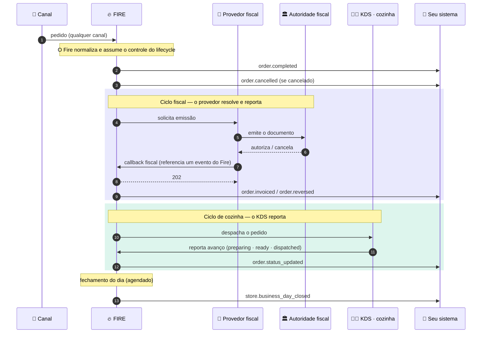
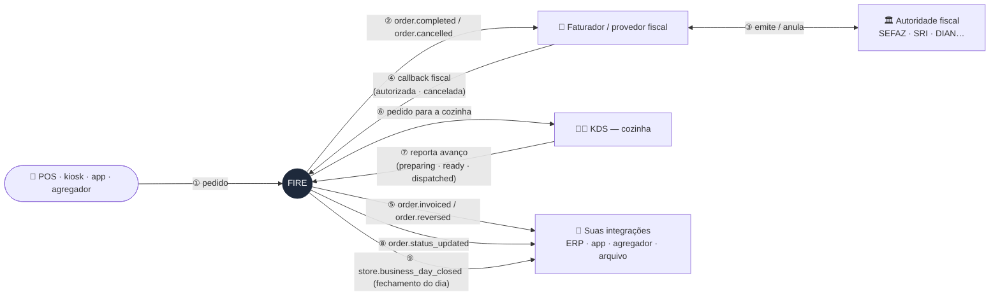
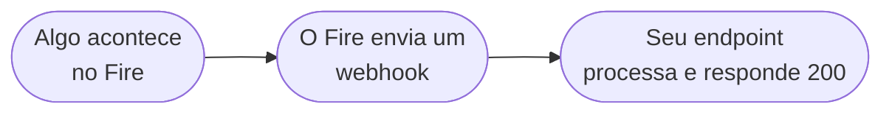

O Fire emite **eventos** sempre que ocorre uma transição de negócio relevante — um pedido é completado, um pedido é cancelado, um documento fiscal é autorizado pela autoridade tributária, a cozinha avança um pedido. Cada evento é entregue ao seu endpoint por um **Integration Flow** que você configura no dashboard do Fire.

<Note>
  O Fire emite **seis** tipos de evento de pedido hoje: [`order.opened`](/pt/events/order-opened), [`order.completed`](/pt/events/order-completed), [`order.cancelled`](/pt/events/order-cancelled), [`order.invoiced`](/pt/events/order-invoiced), [`order.reversed`](/pt/events/order-reversed) e [`order.status_updated`](/pt/events/order-status-updated), mais o evento agendado [`store.business_day_closed`](/pt/events/store-day-closed) no fechamento do dia.
</Note>

## O Fire é a fonte da verdade do ciclo de vida

Um pedido pode nascer em qualquer canal — POS, kiosk, app, agregador — mas a partir do momento em que entra, **o Fire o normaliza e assume o controle de todo o seu ciclo de vida**. Tudo o que acontece em torno desse pedido se centraliza no Fire: o pagamento o completa, a cozinha o avança, o provedor fiscal o fatura ou estorna, e o fechamento do dia o consolida. Cada um desses marcos chega aos seus sistemas como um evento com o mesmo snapshot canônico do pedido.

Essa centralização funciona em ambas as direções: sistemas externos **nunca escrevem estado por conta própria** — eles reportam ao Fire por webhooks de entrada, e **cada reporte deve referenciar um evento que o Fire emitiu** (o `eventId` do envelope que você recebeu). O Fire valida essa referência antes de aceitar o reporte; um callback que não aponte para um evento emitido pelo Fire para esse pedido é rejeitado com `400`. Assim, a linha do tempo de um pedido tem uma única fonte de verdade e nunca se bifurca.

<Note>
  O **diagrama de sequência** mostra o ciclo de vida no tempo — incluindo os dois *round-trips* em que o provedor fiscal e o KDS **resolvem e reportam de volta ao Fire**. O **diagrama estrutural** resume em quem fala com quem.
</Note>

### Ciclo de vida no tempo



### Quem fala com quem



Repare nos **dois circuitos de ida e volta**: o Fire avisa o faturador (②), o faturador resolve com a autoridade (③) e **responde ao Fire** pelo callback (④) — só então o Fire emite `order.invoiced` / `order.reversed` (⑤). O mesmo com a cozinha: o Fire despacha o pedido ao KDS (⑥), o KDS **reporta o avanço ao Fire** (⑦) e o Fire emite `order.status_updated` (⑧). Nada fica sabendo "por conta própria": tudo passa pelo Fire e sai do Fire — incluindo o `store.business_day_closed` (⑨) no fechamento do dia.

### Uma ação, um evento

Cada ação de negócio é seu **próprio** evento com seu **próprio** `event.id` — `order.invoiced` para uma autorização fiscal, `order.reversed` para um cancelamento, cada `order.status_updated` para uma transição de cozinha. Eles nunca são colapsados: autorizar um pedido e depois cancelá-lo são dois eventos distintos com dois ids distintos.

Isso define como o Fire faz o match dos **reportes inbound** que disparam essas ações:

- **Um reporte referencia o evento *daquela* ação.** Ao reportar um cancelamento ao Fire, ecoe o `event.id` do evento de cancelamento — não o da autorização. Cada `(orderId, eventId)` é ingerido exatamente uma vez.
- **Reenviar o mesmo reporte é seguro.** O mesmo `(orderId, eventId)` com o mesmo tipo é um replay idempotente — o Fire retorna o registro existente e não processa nada duas vezes (`202`, `duplicate: true`). Você pode regenerar seu próprio id de provedor livremente.
- **Você não pode pendurar uma ação no evento de outra.** Reportar um cancelamento reusando o `eventId` da autorização é rejeitado com **`409`** — aceitá-lo diria que o cancelamento teve sucesso enquanto o Fire nunca cancelou. Cada ação deve referenciar seu próprio evento emitido pelo Fire.

<Note>
  **Uma exceção — a jornada da cozinha.** O KDS reporta `preparing` → `ready` → `dispatched` contra **um** `eventId` (o do dispatch), distinguidos por `eventType` — então o mesmo `eventId` com um type diferente é um **passo novo**, não um conflito. A regra acima (um `eventId` por ação) vale para o fiscal (uma ação = um evento); a jornada do KDS compartilha um evento de dispatch entre seus passos. Em ambos os casos, um reporte deve referenciar um evento emitido pelo Fire, e a mesma `(orderId, eventId, eventType)` é ingerida uma vez.
</Note>

Veja o [callback fiscal](/pt/api-reference/fiscal-callback#idempotência-e-cenários) e o [endpoint KDS](/pt/api-reference/kds-order-status#idempotência-e-a-jornada) para as matrizes completas de comportamento inbound.

## Como funciona



Quando ocorre um evento de negócio relevante, o Fire o despacha através de um flow que você configurou no dashboard. O flow renderiza um body de requisição HTTP e faz POST para o seu endpoint. Você confirma com uma resposta `2xx`.

A mecânica interna (filas, retentativas, resolução de templates) está em [Entrega e retentativas](/pt/events/delivery). O modelo de configuração de flows está em [Integration Flows](/pt/events/integration-flows).

## O que seu endpoint recebe

Quando um flow dispara, seu endpoint recebe um `POST` HTTP. O body tem **três campos top-level** — `event`, `data` e `_meta`:

```json
{
  "event": {
    "id": "0d6e8a1c-1e7a-4b4f-8a3a-74ab0e9a9b21",
    "type": "order.completed",
    "createdAt": "2026-05-06T13:42:11.812Z"
  },
  "data": {
    /* snapshot V4 específico do evento — veja cada referência */
  },
  "_meta": {
    "executionId":     "0d6e8a1c-1e7a-4b4f-8a3a-74ab0e9a9b21",
    "flowId":          "9a2b3c4d-7e8f-4a1b-9c2d-3e4f5a6b7c8d",
    "flowName":        "Integração ERP",
    "attempt":         "1",
    "triggerEntityId": "f1e2d3c4-b5a6-4789-9012-3456789abcde"
  }
}
```

### `event`

<ResponseField name="event" type="object">
  Identifica esta entrega.

  <Expandable title="event">
    <ResponseField name="id" type="string">
      Identificador único desta entrega (o ID de execução do flow). **Use como sua chave de idempotência** — o Fire pode entregar o mesmo evento mais de uma vez em retentativas.
    </ResponseField>
    <ResponseField name="type" type="string">
      Tipo de evento. Um de: `order.completed`, `order.cancelled`, `order.invoiced`, `order.reversed`, `order.status_updated`, `store.business_day_closed`.
    </ResponseField>
    <ResponseField name="createdAt" type="string">
      Timestamp ISO 8601 UTC do momento em que o evento se materializou dentro do Fire (não o momento em que chegou ao seu endpoint).
    </ResponseField>
  </Expandable>
</ResponseField>

### `data`

<ResponseField name="data" type="object">
  Payload específico do evento. O formato varia por evento:
</ResponseField>

| Evento | O que tem em `data` |
|---|---|
| [`order.completed`](/pt/events/order-completed) | Snapshot V4 do pedido — order, store (com `storeFiscalConfig` opcional), customer, payments, fulfillment, KDS, lines |
| [`order.cancelled`](/pt/events/order-cancelled) | Snapshot V4 + bloco `cancellation` de auditoria |
| [`order.invoiced`](/pt/events/order-invoiced) | Snapshot V4 com `order.fiscal` (chave, protocolo, número…) + `storeFiscalConfig` |
| [`order.reversed`](/pt/events/order-reversed) | Snapshot V4 + `xmlCancelamento` + `sefazCancellation` |
| [`order.status_updated`](/pt/events/order-status-updated) | Snapshot V4 + bloco `kitchen` (status, previousStatus, history do percurso) |

### `_meta`

<ResponseField name="_meta" type="object">
  Rastreabilidade a nível de execução. Logue junto com o evento para debugar problemas de entrega e correlacionar retentativas.

  <Expandable title="_meta">
    <ResponseField name="executionId" type="string">
      ID interno de execução do flow. Espelha `event.id`.
    </ResponseField>
    <ResponseField name="flowId" type="string">
      UUID do Integration Flow que produziu esta entrega.
    </ResponseField>
    <ResponseField name="flowName" type="string">
      Nome legível do flow (como está no dashboard).
    </ResponseField>
    <ResponseField name="attempt" type="string">
      Número da tentativa de entrega, começando em `"1"`. Incrementa a cada retentativa.
    </ResponseField>
    <ResponseField name="triggerEntityId" type="string">
      ID da entidade de negócio que originou o evento (tipicamente o UUID do pedido, mesmo que `data.orderId`).
    </ResponseField>
  </Expandable>
</ResponseField>

<Note>
  As chaves `event`, `data` e `_meta` vêm do **template canônico de body** que o dashboard do Fire inclui. São uma convenção, não um envelope Fire fixo — se o nó HTTP do seu flow definir outro template, o formato do wire muda. Veja [Customizando o body](#customizando-o-body) abaixo.
</Note>

## Entrega HTTP padrão

| Campo | Default |
|---|---|
| Método | `POST` (configurável por flow) |
| `Content-Type` | `application/json` (definido pelos headers do nó HTTP do seu flow) |
| Timeout | 30 segundos (configurável, 1–60s) |
| Auth | None / `Bearer` / `x-api-key` / OAuth2 client credentials — escolhido por flow |
| Assinatura | HMAC-SHA256 **opcional** (nó Webhook) — `X-Fire-Signature` + `X-Fire-Timestamp` |
| Retentativas | Até 5 com backoff exponencial |
| Dead letter | Após as retentativas, a execução cai em `flow_dead_letter` |

<Note>
  As requisições de saída podem ser **assinadas com HMAC** se o seu flow usar o **nó Webhook**: o Fire adiciona `X-Fire-Signature` (`v1=hex(HMAC-SHA256(secret, "{timestamp}.{body}"))`) e `X-Fire-Timestamp` (Unix seconds). A assinatura é opcional e **complementa** o auth de transporte (Bearer / API key / OAuth2). Detalhe e verificação no [nó Webhook assinado](/pt/events/integration-flows#webhook-assinado-hmac).
</Note>

## Recebendo eventos

```js
import express from "express";

const app = express();
const seen = new Map(); // troque por Redis / DB em produção

app.post("/fire/events", express.json(), async (req, res) => {
  const { event, data, _meta } = req.body ?? {};
  if (!event?.id || !event?.type) return res.status(400).end();

  // 1. Confirme primeiro para liberar a conexão do Fire
  res.status(200).end();

  // 2. Deduplique por event.id (o ID de execução do flow)
  if (seen.has(event.id)) return;
  seen.set(event.id, Date.now());

  // 3. Logue _meta para rastreabilidade — inestimável ao debugar
  console.log("Evento Fire", { eventId: event.id, type: event.type, _meta });

  // 4. Despache por type
  switch (event.type) {
    case "order.completed":     return onOrderCompleted(data);
    case "order.cancelled":     return onOrderCancelled(data);
    case "order.invoiced":       return onOrderInvoiced(data);
    case "order.reversed":       return onOrderReversed(data);
    case "order.status_updated": return onKitchenAdvance(data);
    default: console.warn("Tipo de evento Fire desconhecido", event.type);
  }
});

app.listen(8080);
```

<Steps>
  <Step title="Confirme rápido">
    Retorne `200 OK` (ou qualquer `2xx`) em menos de 30 segundos — idealmente em menos de 1 segundo. Confirme **antes** de fazer trabalho pesado.
  </Step>
  <Step title="Autentique a requisição">
    Valide a credencial de auth que o flow envia (Bearer token, API key ou OAuth2 access token). Rejeite qualquer requisição que não bata.
  </Step>
  <Step title="Deduplique">
    Procure `event.id` em um store de TTL curto (Redis com expiração de 24 horas funciona). Se já processou, pule.
  </Step>
  <Step title="Valide o payload">
    Verifique que `event.type` é o que você espera e que o bloco `data` tem os campos esperados. Retorne `400` para entradas malformadas para que não entrem na sua fila de retry pelo Fire.
  </Step>
  <Step title="Processe e persista">
    Aplique sua lógica de negócio, persista o resultado por `event.id` para rastreabilidade. Retorne `5xx` para falhas transitórias (Fire faz retry); retorne `4xx` para entrada ruim irrecuperável (Fire manda para dead letter).
  </Step>
</Steps>

## Customizando o body

O body que o Fire entrega ao seu endpoint é **o que o template do body do nó HTTP do seu flow renderizar**. O template canônico (acima) é o default recomendado, mas você pode escrever qualquer template JSON válido que referencie o **trigger context** do runtime:

```ts
{
  trigger: {
    event: { id, type, createdAt },
    data: V4Snapshot,         // payload específico do evento
  },
  execution: { id, ... },     // metadata de execução
  flow:      { id, name },    // identidade do seu flow
  queue:     { id, attempt, triggerEntityId },
}
```

O template canônico usa estes paths:

```json
{
  "event": {
    "id":        "{{trigger.event.id}}",
    "type":      "{{trigger.event.type}}",
    "createdAt": "{{trigger.event.createdAt}}"
  },
  "data": "{{trigger.data}}",
  "_meta": {
    "executionId":     "{{execution.id}}",
    "flowId":          "{{flow.id}}",
    "flowName":        "{{flow.name}}",
    "attempt":         "{{queue.attempt}}",
    "triggerEntityId": "{{queue.triggerEntityId}}"
  }
}
```

Você pode escrever outro template que omita `_meta`, achata `data`, renomeia chaves, envia só campos específicos, etc. Veja [Integration Flows](/pt/events/integration-flows) para a referência completa.

## Próximo

<CardGroup cols={2}>
  <Card title="Integration Flows" icon="diagram-project" href="/pt/events/integration-flows">
    Como seu sistema assina eventos através de flows configurados no dashboard.
  </Card>
  <Card title="Entrega e retentativas" icon="repeat" href="/pt/events/delivery">
    Política de retry, comportamento de dead-letter, idempotência e garantias de ordem.
  </Card>
  <Card title="order.completed" icon="receipt" href="/pt/events/order-completed">
    O evento mais comum — snapshot V4 completo do pedido.
  </Card>
  <Card title="order.invoiced" icon="file-invoice" href="/pt/events/order-invoiced">
    Autorização fiscal brasileira via seu provedor fiscal.
  </Card>
</CardGroup>
