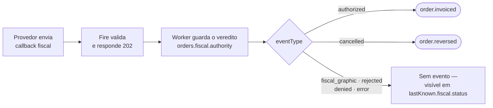

O callback fiscal faz uma coisa: ele **grava o veredito do órgão fiscal no pedido**. Os eventos não são montados a partir do callback — são montados a partir do que o pedido armazena. Por isso a pergunta "o que o meu consumidor recebe?" tem sempre a mesma resposta: `fiscal.authority`, com a forma descrita aqui.

Se ainda não leu, [Como o fiscal funciona no Fire](/pt/fiscal/overview) explica os dois atos e os dois blocos que esta página pressupõe.

## O que acontece, passo a passo



1. Seu provedor faz POST do [callback fiscal](/pt/api-reference/fiscal-callback). O Fire o valida e responde `202 Accepted`. **Um `202` significa enfileirado, não processado**, e nunca significa que um evento foi enviado.
2. Um worker em segundo plano guarda o veredito no pedido, normalmente em poucos segundos.
3. Dependendo do `eventType`, o Fire emite um evento para os seus Integration Flows — ou não.

## Qual evento dispara

| `eventType` do callback | Status fiscal do pedido | Evento emitido |
|---|---|---|
| `authorized` | `authorized` | [`order.invoiced`](/pt/events/order-invoiced) |
| `cancelled` | `cancelled` | [`order.reversed`](/pt/events/order-reversed) — só se o pedido tiver um cancelamento registrado no Fire; caso contrário nada é emitido |
| `fiscal_graphic` | `fiscal_graphic` | nenhum — o gráfico imprimível é guardado; o documento ainda não está autorizado |
| `rejected`, `denied`, `error` | `rejected`, `denied`, `error` | nenhum — visível apenas em `lastKnown.fiscal.status` do próximo evento daquele pedido |

Um evento só é emitido quando o callback realmente mudou o documento. Um reenvio de um estado já aplicado (`idempotent`), um callback que faria o documento retroceder (`regression`) ou um que não corresponde a nenhum documento (`notFound`) também recebe `202`, e não emite nada.

<Warning>
  **`order.cancelled` não vem do callback.** Ele dispara quando o pedido é cancelado no Fire, antes de o órgão ser consultado. A confirmação do órgão chega depois como um callback `cancelled`, que produz `order.reversed`.
</Warning>

## Onde cai cada campo do callback

Tudo abaixo cai em `orders.fiscal.authority`, e dali nos eventos.

| Callback fiscal (corpo) | `authority` (pedido e eventos) |
|---|---|
| `documentType`, `docSubtype`, `documentNumber` | mesmos nomes |
| `issuedAt`, `authorizedAt`, `cancelledAt`, `authorizationMode` | mesmos nomes |
| `pdfUrl`, `xmlUrl`, `providerDocId` | mesmos nomes |
| `totalAmount`, `taxAmount`, `currencyCode` | `amounts.total`, `amounts.tax`, `amounts.currencyCode` |
| `document.<chave>` | `countryData.<chave>` — mesma chave, mesmo valor |
| `graphic` | `graphic` |
| `provider` | `providerIdentity` — `{ name, version, reference }`; `null` se ausente ou vazio |
| `metadata` | `providerMetadata` — opaco; `null` se ausente ou `{}` |
| `country` | `fiscal.countryCode` (fora de `authority`); se o pedido já tinha um, ele é mantido |
| `occurredAt` | `fiscal.occurredAt` (fora de `authority`) |
| `eventType`, `eventId`, `orderId`, `providerEventId`, `failure` | não são levados para `authority` |

Três regras explicam a tabela:

- **`document` vira `countryData`.** O Fire não mantém uma lista das chaves de cada país: tudo o que vem em `document` chega intacto a `countryData`. Um identificador novo que o seu órgão passe a exigir viaja sem nenhuma mudança do lado do Fire.
- **`provider` e `metadata` mantêm os nomes da numeração.** Do lado da numeração o provedor também envia `provider` e `metadata`, e o Fire os expõe como `providerIdentity` e `providerMetadata`. O callback faz o mesmo, então os dois blocos do pedido se leem igual. `providerIdentity.reference` é o que você cita ao provedor para encontrar a operação nos registros dele.
- **Vazio significa `null`, não ausente.** Um callback sem `provider` ou `metadata` (ou com `{}`) guarda `providerIdentity: null` e `providerMetadata: null`.

## Onde aparece em cada evento

| Evento | Caminho | Carrega |
|---|---|---|
| `order.invoiced` | `data.fiscal` | `status`, `countryCode`, `providerCode`, `occurredAt`, `authority`, `history`, `compensates` |
| `order.cancelled` | `data.cancellation.fiscal` | apenas `status` e `authority` — o documento **como estava antes** do cancelamento. Presente só se o pedido tinha um documento `authorized` ou `cancelling` com `providerDocId`; caso contrário a chave não aparece |
| `order.reversed` | `data.cancellation.fiscal` | o bloco completo, com o documento cancelado, `history` e `compensates` |

A referência campo a campo desse bloco está em [o bloco fiscal](/pt/events/order-invoiced#o-bloco-fiscal).

## O caminho sem callback: Brasil (PlugNotas)

No Brasil não há callback fiscal: o Fire fica sabendo do veredito da SEFAZ diretamente pelo PlugNotas. **O bloco que o seu consumidor recebe tem a mesma forma**, com estas diferenças:

| | Callback fiscal | PlugNotas |
|---|---|---|
| `fiscal.providerCode` | `generic` | `plugnotas` |
| `authority.providerIdentity` | de `provider` | `null` — o PlugNotas nunca envia; um cancelamento mantém o valor do documento anterior |
| `authority.providerMetadata` | de `metadata` | `null` — o PlugNotas nunca envia; um cancelamento mantém o valor do documento anterior |
| `authority.countryData` | de `document` | `chaveAcesso`, `numero`, `serie`, `modelo`, `protocolo` |
| `data.fiscalRepresentation` | preenchido se o caixa numerou antes | `null` — não há etapa de numeração |
| `authority.authorizedAt` | como o provedor o reporta | a data da SEFAZ, com uma hora convencional de meia-noite |

## Um pedido, de ponta a ponta

O mesmo pedido brasileiro pelo callback fiscal, recortado às partes fiscais.

<Steps>
  <Step title="Callback: authorized">
    ```json
    {
      "country": "BR",
      "eventType": "authorized",
      "orderId": "d2c66234-546d-414f-9b22-095402a68e33",
      "eventId": "ca7ffb66-3c5d-4346-8a1e-7663e82ed2d2",
      "occurredAt": "2026-09-15T16:30:56.000Z",
      "documentType": "SALE_INVOICE",
      "docSubtype": "nfce",
      "documentNumber": "7",
      "providerDocId": "BR-E2E-007",
      "issuedAt": "2026-09-15T16:30:55.921Z",
      "totalAmount": 55.5, "taxAmount": 7.2, "currencyCode": "BRL",
      "pdfUrl": "https://api.fiscal-provider.example/br-e2e.pdf",
      "xmlUrl": "https://api.fiscal-provider.example/br-e2e.xml",
      "document": { "chaveAcesso": "35260229062609000177650500000000071000000070", "protocolo": "141210001176999", "numero": 7, "serie": 50, "modelo": 65 },
      "provider": { "name": "hio.fiscalization", "version": "2026.09.1", "reference": "HIO-E2E-AUTH-007" },
      "metadata": { "providerTraceId": "e2e-auth-trace-007", "deviceUid": "POS-BR-01" }
    }
    ```
  </Step>
  <Step title="O Fire responde 202 e depois guarda o veredito">
    ```json
    "authority": {
      "documentType": "SALE_INVOICE",
      "docSubtype": "nfce",
      "documentNumber": "7",
      "issuedAt": "2026-09-15T16:30:55.921Z",
      "authorizedAt": null,
      "cancelledAt": null,
      "providerDocId": "BR-E2E-007",
      "pdfUrl": "https://api.fiscal-provider.example/br-e2e.pdf",
      "xmlUrl": "https://api.fiscal-provider.example/br-e2e.xml",
      "amounts": { "total": 55.5, "tax": 7.2, "currencyCode": "BRL" },
      "countryData": { "chaveAcesso": "35260229062609000177650500000000071000000070", "protocolo": "141210001176999", "numero": "7", "serie": "50", "modelo": 65 },
      "graphic": null,
      "providerIdentity": { "name": "hio.fiscalization", "version": "2026.09.1", "reference": "HIO-E2E-AUTH-007" },
      "providerMetadata": { "providerTraceId": "e2e-auth-trace-007", "deviceUid": "POS-BR-01" }
    }
    ```
  </Step>
  <Step title="order.invoiced o carrega">
    ```json
    "fiscal": {
      "status": "authorized",
      "countryCode": "BR",
      "providerCode": "generic",
      "occurredAt": "2026-09-15T16:30:56.000Z",
      "authority": { /* exatamente o bloco acima */ },
      "history": [
        { "status": "authorized", "occurredAt": "2026-09-15T16:30:56.000Z", "providerCode": "generic", "authority": { /* mesmo bloco */ } }
      ],
      "compensates": null
    }
    ```
  </Step>
  <Step title="O pedido é cancelado no Fire">
    `order.cancelled` dispara imediatamente com `data.cancellation.fiscal = { "status": "authorized", "authority": { … } }` — a fatura como estava. Nada foi pedido ao órgão ainda.
  </Step>
  <Step title="Callback: cancelled, depois order.reversed">
    O provedor envia `eventType: "cancelled"` com **o seu próprio `eventId`** (reutilizar o da autorização retorna `409`). O Fire emite `order.reversed` com `authority.documentType: "CREDIT_NOTE"`, `cancelledAt` preenchido, os dois documentos em `history` e `compensates` apontando para a fatura.
  </Step>
</Steps>

## O que não acontece

- **Nenhum evento para `rejected`, `denied` ou `error`.** Eles são guardados; o seu consumidor só os vê em `lastKnown.fiscal.status` de um evento posterior.
- **Um `202` não é um evento.** Consulte o [endpoint de resultado](/pt/api-reference/fiscal-callback#verificar-o-resultado) se precisar saber que o callback foi processado.
- **O callback não altera `fiscalRepresentation`.** O que foi impresso no caixa fica como estava.
- **Não há guard por provedor.** Um pedido guarda um único documento. Um `authorized` cujo `eventId` não corresponde ao documento existente do pedido termina em `notFound` e não muda nada. Um `cancelled` resolve o documento mais recente do pedido e o atualiza, seja qual for o provedor que o emitiu — inclusive o PlugNotas.
