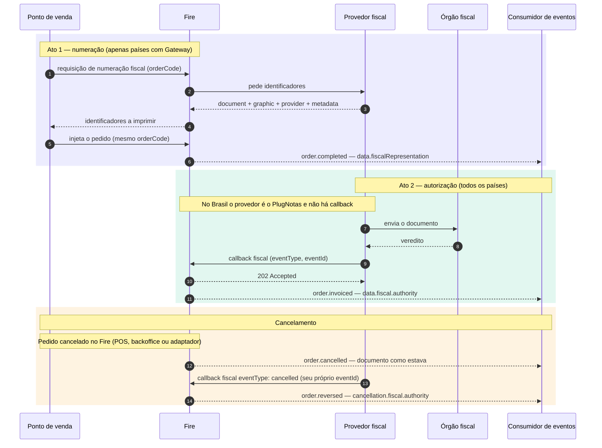

Todo documento fiscal no Fire passa por **dois atos separados**, em momentos diferentes, e cada um deixa o seu próprio bloco no pedido. A maior parte da confusão vem de misturá-los, então esta página os nomeia uma vez e todas as outras páginas fiscais partem dela.

## Os dois atos

| | Ato 1 — Numeração | Ato 2 — Autorização |
|---|---|---|
| **Quando** | Antes de o pedido existir, no caixa | Segundos ou minutos depois da venda |
| **Quem o inicia** | O ponto de venda pede identificadores ao Fire | O provedor fiscal reporta o veredito do órgão |
| **Como chega ao Fire** | Requisição de [numeração fiscal](/pt/api-reference/fiscal-documents-v2) | [Callback fiscal](/pt/api-reference/fiscal-callback) (ou PlugNotas, no Brasil) |
| **Bloco no pedido** | `data.fiscalRepresentation` | `data.fiscal.authority` |
| **Pergunta que responde** | *O que foi impresso?* | *O que o órgão decidiu?* |
| **Muda depois?** | Só quando um novo documento é numerado (uma nota de crédito) | Sim: autorizado, depois cancelado |

<Warning>
  **`fiscalRepresentation` nunca diz que o documento foi autorizado.** Ele guarda os números impressos no caixa. O veredito do órgão é `fiscal.authority`, e o status atual é `fiscal.status` nos eventos fiscais, `lastKnown.fiscal.status` nos demais eventos. Os três podem legitimamente discordar por um tempo.
</Warning>

## Duas formas de um documento chegar ao Fire

<Tabs>
  <Tab title="Países com gateway (hoje Equador e Colômbia)">
    Os dois atos acontecem. O caixa numera primeiro pelo Fire, imprime, injeta o pedido, e o provedor depois reporta o veredito pelo callback fiscal.

    - `data.fiscalRepresentation` fica preenchido desde o momento em que o pedido existe.
    - `data.fiscal.authority` aparece quando o callback chega.
    - `fiscal.providerCode` é `generic`.
  </Tab>
  <Tab title="PlugNotas (Brasil)">
    **Não há Ato 1.** O Fire emite a NFC-e / NF-e pelo PlugNotas depois da venda e fica sabendo do veredito da SEFAZ diretamente pelo PlugNotas — sem callback fiscal, sem requisição de numeração.

    - `data.fiscalRepresentation` é `null`.
    - `data.fiscal.authority` aparece quando a SEFAZ autoriza.
    - `fiscal.providerCode` é `plugnotas`.
    - `authority.providerIdentity` e `authority.providerMetadata` são `null`: o PlugNotas não envia nenhum dos dois. Um cancelamento mantém os valores do documento anterior.
  </Tab>
</Tabs>

Outros países também podem reportar pelo callback fiscal sem numerar antes. O que importa para um consumidor é o mesmo em todos os casos: **o veredito é sempre `fiscal.authority`, com a mesma forma**, seja qual for o caminho por onde entrou.

## O ciclo completo

O que acontece entre o callback e os eventos — qual evento dispara para cada resultado e como cada campo trafega — está em [Do callback aos eventos](/pt/fiscal/callback-to-events).

## Quatro palavras para "status"

O mesmo fato recebe nomes diferentes dependendo de onde você o lê. Eles não são intercambiáveis:

| Onde | Campo | Valores | Descreve |
|---|---|---|---|
| Resposta da numeração fiscal | `numberingStatus` | `GENERATED`, `PENDING`, `FAILED_RETRYABLE`, `FAILED_FINAL`, `NOT_APPLICABLE`, `BLOCKED_BY_POLICY` | Se a **numeração** funcionou |
| Resposta da numeração fiscal | `documentStatus` | `PENDING`, `AUTHORIZED`, `REJECTED`, `CANCELLED` | O documento, como o gateway o conheceu por último |
| Callback fiscal (você o envia) | `eventType` | `fiscal_graphic`, `authorized`, `cancelled`, `rejected`, `denied`, `error` | O que acabou de acontecer no órgão |
| Eventos fiscais (`order.invoiced`, `order.cancelled`, `order.reversed`) | `fiscal.status` | `awaiting_payment`, `not_issued`, `pending`, `processing`, `fiscal_graphic`, `authorized`, `cancelling`, `cancelled`, `rejected`, `denied`, `error` | O estado fiscal do pedido guardado com o documento |
| Todos os demais eventos de pedido | `lastKnown.fiscal.status` | `pending`, `processing`, `fiscal_graphic`, `authorized`, `cancelling`, `cancelled`, `rejected`, `denied`, `error` | O estado fiscal **atual** do pedido |

## Para onde ir agora

<CardGroup cols={2}>
  <Card title="Do callback aos eventos" icon="arrow-right-arrow-left" href="/pt/fiscal/callback-to-events">
    Qual evento dispara para cada callback e onde cada campo cai.
  </Card>
  <Card title="Callback fiscal" icon="arrow-right-to-bracket" href="/pt/api-reference/fiscal-callback">
    O contrato que o seu provedor envia.
  </Card>
  <Card title="Numeração a partir do caixa" icon="cash-register" href="/pt/guides/fiscal-integration">
    O Ato 1, passo a passo, para pontos de venda e quiosques.
  </Card>
  <Card title="Tornar-se provedor fiscal" icon="plug" href="/pt/fiscal-providers/overview">
    O que um provedor implementa nos dois atos.
  </Card>
</CardGroup>
