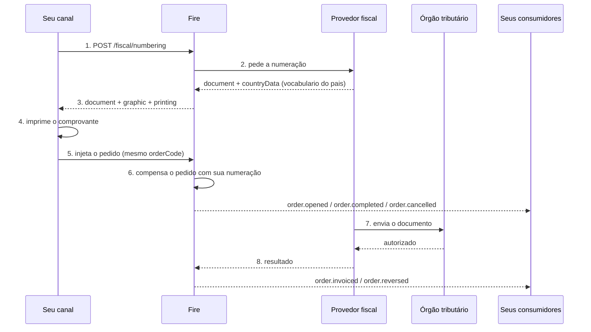

O Fire não emite comprovantes: ele os **numera**. Essa distinção explica quase todas as
decisões de desenho, então vale começar por aí.

## Quem faz o quê

<CardGroup cols={2}>
  <Card title="Seu canal" icon="cash-register">
    Cobra, pede a numeração, imprime e injeta o pedido. Não conhece regras fiscais de
    nenhum país.
  </Card>
  <Card title="Fire" icon="server">
    Resolve a loja, o emissor e o provedor. Grava a solicitação, pede os números e responde o
    que pode ser impresso.
  </Card>
  <Card title="O provedor fiscal" icon="stamp">
    Traduz para os códigos do órgão, numera com o vocabulário do seu país, e envia o
    documento à autoridade.
  </Card>
  <Card title="O órgão tributário" icon="landmark">
    Autoriza ou rejeita. O veredito chega **depois** de o cliente já ter ido embora com o
    comprovante.
  </Card>
</CardGroup>

<Info>
  **Um único contrato, todos os países.** O Fire resolve internamente qual provedor
  corresponde a cada país. Sua integração é a mesma no Equador, no Brasil ou na Venezuela: o
  que muda é quais campos vêm preenchidos na resposta, não a forma de pedir.
</Info>

## A linha do tempo



Os passos 1 a 5 acontecem **com o cliente esperando no caixa**: são segundos. Do 6 em diante o
seu canal já não participa.

## Onde aparecem os dados fiscais

A numeração não fica trancada neste endpoint. Ela percorre o ciclo de vida do pedido em **dois
momentos distintos**, e convém não misturá-los.

### 1. O que compensamos na injeção

Quando você injeta o pedido, o Fire o enriquece com a numeração que já obteve. Esses dados
viajam nos eventos do ciclo de vida normal:

| Evento | Quando |
|---|---|
| [`order.opened`](/pt/events/order-opened) | O pedido foi aberto — leva sua numeração se já foi solicitada |
| [`order.completed`](/pt/events/order-completed) | O pagamento liquidou o total |
| [`order.cancelled`](/pt/events/order-cancelled) | O pedido foi cancelado antes ou depois do pagamento |

Aqui **ainda não há veredito do órgão**: há números impressos e uma venda registrada.

### 2. O que o callback fiscal compensa

Minutos depois, o provedor avisa ao Fire o que a autoridade resolveu. Esse callback é o que
dispara os dois eventos do desfecho:

| Evento | Quando |
|---|---|
| [`order.invoiced`](/pt/events/order-invoiced) | O órgão **autorizou** o documento — chega com chave e protocolo |
| [`order.reversed`](/pt/events/order-reversed) | O órgão **confirmou o cancelamento** de um documento já autorizado |

<Info>
  Essa é a separação que precisa ficar clara de ponta a ponta: **a numeração você pede e ela
  compensa o pedido; a autorização chega sozinha e compensa o desfecho.** Um documento
  numerado pode nunca chegar a `order.invoiced` se o órgão o rejeitar.
</Info>

Se você já consome eventos de pedido, **não precisa consultar nada**: os dados fiscais chegam
pelo mesmo caminho que o resto da venda. A consulta direta fica para suporte e para quando
você perde a resposta síncrona.

### O campo que precisa ser lido: `data.fiscalRepresentation`

A numeração chega nesse bloco, em **todos** os eventos do pedido — os cinco das duas tabelas
acima.

**A chave viaja sempre.** Chega em `null` quando não se tentou numerar — agregadores, países
sem representação fiscal, ou comércios com a numeração desativada — e traz o bloco quando
houve tentativa. Ramifique pelo valor, nunca pela presença da chave:

```js
if (data.fiscalRepresentation) {
  // houve tentativa de numeração — numberingStatus diz como saiu
  print(data.fiscalRepresentation.documentNumber)
}
```

Trazer o bloco significa **que se tentou numerar, não que foi numerado**. Uma venda cobrada
que ficou **sem comprovante fiscal** chega com os identificadores em `null` e o motivo em
`failure` — esse caso precisa ser tratado, porque antes era invisível.

E trazer o bloco **também não** significa que o comprovante esteja autorizado: isso quem diz é
`lastKnown.fiscal.status`, o único dos dois que é atualizado.

#### O que o bloco traz

Três camadas, e convém não misturá-las:

| Camada | O que tem | Como se lê |
|---|---|---|
| **Canônica** | `documentType`, `documentNumber`, `issuedAt`, `authorizationMode`, `numberingStatus`, `environment` | Significam o mesmo em qualquer país. É contra isto que você programa |
| **Do país** | `countryData` | O vocabulário do órgão que numerou: `claveAcceso` no Equador, `numeroControl` na Venezuela. **Percorra, não indexe** |
| **Do provedor** | `providerCode`, `providerIdentity`, `providerMetadata` | Diagnóstico. Veja abaixo |

<Warning>
  **O número que vai impresso é `documentNumber`. Não o componha você mesmo.**

  Ele chega já montado pelo provedor, que é quem conhece a regra do seu país — no Equador, o
  art. 18 do Reglamento de Comprobantes de Venta: quinze dígitos em três trechos. No bloco do
  país viaja o mesmo valor com o nome que o órgão usa (`numeroComprobante` no Equador).

  Montá-lo à mão juntando `establecimiento`, `puntoEmision` e `secuencial` parece equivalente e
  não é: o Reglamento permite omitir os zeros à esquerda do sequencial, então `001-020-123`
  pode ser tão legal quanto `001-020-000000123`. Se você o compõe, imprime um número na **sua**
  convenção, não na do comprovante que foi emitido.
</Warning>

Os três campos do provedor **não são a mesma coisa**, e por isso viajam separados:

- **`providerCode`** é **nosso** identificador de adaptador (`hio`). Diz com qual integração
  se numerou.
- **`providerIdentity`** é do provedor e **tem forma**: `name`, `version` e `reference`. Essa
  `reference` é a que você cita a ele quando um caso precisa ser escalado — não é a sua
  `Idempotency-Key`.
- **`providerMetadata`** é uma **bolsa opaca**: sem forma garantida, as chaves são do provedor
  e podem mudar sem aviso. Serve para colar num ticket de suporte.

<Warning>
  **Não ramifique pelas chaves de `providerMetadata`.** Programar contra elas amarra a sua
  integração ao provedor que numera hoje, e elas mudam sem versionar o contrato. Se um dado é
  importante o bastante para decidir com ele, estará na camada canônica ou em `countryData`.
</Warning>

Além disso, o bloco leva **o documento vigente do pedido**, não o primeiro: se houve um
cancelamento, a nota de crédito está no topo, `compensates` aponta para a nota de venda que ela
cancela, e a nota de venda inteira fica em `history`. Cada entrada de `history` tem
**exatamente as mesmas chaves** que o bloco acima, então se leem igual.

A referência completa do bloco, campo a campo, está em
[`order.opened`](/pt/events/order-opened#data-fiscalrepresentation).

## As três regras que é preciso entender

<AccordionGroup>
  <Accordion title="Numerado não é autorizado" icon="scale-balanced">
    A resposta traz **dois estados, e eles nunca se fundem**:

    - `requestStatus` — consegui números para imprimir?
    - `documentStatus` — o órgão autorizou?

    Na numeração, o segundo é **sempre** `PENDING`. Isso não é um problema: na maioria dos
    países o comprovante é entregue antes de a autoridade vê-lo. Se a sua integração juntar os
    dois num campo só, em algum momento você vai dizer a um cliente que a nota está autorizada
    quando ela só tem número.
  </Accordion>

  <Accordion title="A venda nunca é bloqueada" icon="shield-check">
    Se o provedor não responder a tempo, o Fire **não** devolve erro: devolve `202` com
    `printing.mode: "PROVISIONAL_RECEIPT"`. Você imprime um ticket não fiscal, injeta o pedido
    do mesmo jeito e o Fire completa a numeração por conta própria.

    **Não repita a chamada em loop nem segure a venda.** O dinheiro já foi cobrado; o
    comprovante se resolve depois.
  </Accordion>

  <Accordion title="Quem decide o que se imprime é o Fire, não você" icon="print">
    O bloco `printing` não é uma dedução de haver ou não documento: é uma **regra legal do
    país**. No Equador, em contingência, o comprovante existe e é impresso mesmo sem o órgão
    tê-lo visto; num país que proíba imprimir antes da autorização, `printable` viria `false`
    com o documento presente.

    Se cada canal deduzisse essa regra por conta própria, algum a implementaria errado — e
    esse erro só aparece numa auditoria.
  </Accordion>
</AccordionGroup>

## Idempotência: três camadas

Uma venda cobrada duas vezes é um problema de dinheiro; **uma venda numerada duas vezes é um
problema fiscal**, e não se corrige com um deploy. Por isso há três barreiras:

<Steps>
  <Step title="Sua Idempotency-Key">
    Você a gera, uma por venda, e a reutiliza em cada nova tentativa daquela mesma venta. É o
    que impede que uma queda de rede consuma um segundo sequencial.

    Se reutilizá-la com um corpo diferente, o Fire responde `409`: são duas operações
    distintas.
  </Step>
  <Step title="A chave natural">
    `país + orderCode + operação`. Protege mesmo que o seu canal gere uma `Idempotency-Key`
    nova a cada tentativa — o erro de implementação mais comum.

    É também a razão pela qual o `orderCode` **precisa ser único por conta e país**: se duas
    lojas usarem o mesmo, o Fire corta antes de emitir.
  </Step>
  <Step title="A do provedor">
    A mesma trinca, do outro lado. As duas chaves serem idênticas é o que faz uma colisão
    aparecer nas duas pontas ao mesmo tempo, em vez de surgir meses depois como dois
    comprovantes para uma venda.
  </Step>
</Steps>

## Cancelar

Pede-se com `operation: "CANCEL"` e **o mesmo `orderCode` da venda original**. Nada mais.

Seu ponto de venda **não precisa guardar nenhum identificador nosso**: o Fire encontra o
documento original pela chave natural. Isso é deliberado — um quiosque reinstalado ou um caixa
substituído perderiam esse dado, e a venda nunca mais poderia ser cancelada. Já o `orderCode`
está impresso no ticket.

Com qual instrumento o cancelamento se materializa é decisão do país: no Equador é uma nota de
crédito com sequencial próprio; no Brasil, um evento de cancelamento que não gera documento
novo.

**E a partir daí o pedido leva a nota de crédito no topo.** Os eventos seguintes trazem
`documentType: "CREDIT_NOTE"` em `fiscalRepresentation`, com `compensates` apontando para a nota
de venda cancelada e a nota de venda inteira em `history`.

<Warning>
  **Se a sua conciliação assume que `documentNumber` é sempre o da venda, ela quebra aqui.** O
  número do topo passa a ser o da nota de crédito. O que o cliente levou impresso não se perde
  —está em `history`— mas é preciso ir buscá-lo lá.
</Warning>

## Se você perder a resposta

Acontece: a rede cai logo depois de o Fire numerar. O comprovante existe e você não o tem.

```
GET /api/v1/external/fiscal/numbering?orderCode=EC-K004-42-1786579046934
```

Devolve `items[]` com todos os documentos daquele pedido — podem ser dois, a nota e o
cancelamento. É por isso que o `orderCode` precisa ser a mesma string na numeração e na
injeção: é a única coisa que sobra na sua mão.

## Antes de ir para produção

<Check>Seu `orderCode` é único por conta e país, e é o mesmo na numeração e na injeção.</Check>
<Check>Você guarda a `Idempotency-Key` junto com o pedido e a reutiliza nas tentativas.</Check>
<Check>Cada dispositivo declara seu `device.externalId` — dois caixas da mesma loja não o compartilham.</Check>
<Check>Você ramifica por `printing.mode`, e não pelo código HTTP.</Check>
<Check>Você imprime `documentNumber` tal como chega, sem recompô-lo a partir de `establecimiento`, `puntoEmision` e `secuencial`.</Check>
<Check>Você percorre `countryData` em vez de indexar chaves fixas: quem as define é o país que numerou, e na Venezuela não há `claveAcceso`.</Check>
<Check>Você percorre as chaves de `graphic` em vez de procurar campos fixos.</Check>
<Check>Você não ramifica pelas chaves de `providerMetadata`: é a bolsa opaca do provedor e muda sem aviso.</Check>
<Check>Sua conciliação contempla que, após um cancelamento, o documento do topo é a nota de crédito e a nota de venda está em `history`.</Check>
<Check>Diante de `202` você imprime provisório e injeta assim mesmo, sem repetir em loop.</Check>

<Card title="Referência do endpoint" icon="code" href="/pt/api-reference/fiscal-documents">
  Campos, respostas e exemplos por país.
</Card>
