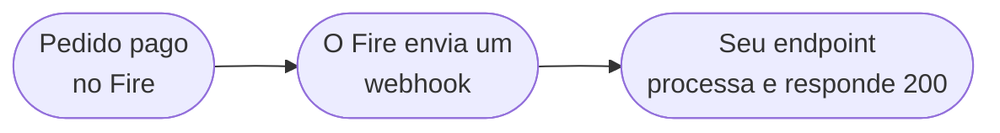

Este guia te leva desde "nada" até um handler de webhook funcionando que recebe um evento `order.completed` real do Fire. Você vai configurar um endpoint HTTPS, configurar um Integration Flow no dashboard do Fire e verificar de ponta a ponta.

Ao final você terá:

- Um flow do Fire que dispara em cada pedido completado
- Um endpoint HTTPS recebendo o body do evento
- Processamento idempotente com resposta rápida

<Note>
  Este guia se aplica aos quatro eventos que o Fire emite em produção: `order.completed`, `order.cancelled`, `order.invoiced`, `order.reversed`. O walkthrough usa `order.completed`; os outros três seguem o mesmo padrão com formatos distintos de `data`.
</Note>

## O que você vai construir



Um só endpoint, um só Integration Flow. Quando funciona para `order.completed`, o mesmo endpoint trata todos os outros eventos do Fire ramificando por `event.type`.

## Pré-requisitos

- Uma conta Fire com acesso ao dashboard (**Settings → Integration Flows**)
- Uma URL HTTPS acessível publicamente (use [ngrok](https://ngrok.com) para dev local)
- Algo para rodar um serviço Node/Python/Go — qualquer coisa que sirva `POST` e parseie JSON

## Passo 1 — Suba um endpoint mínimo

Comece com o handler menor possível. As preocupações de produção (auth, dedup, persistência) entram no passo 5.

```js Node.js
import express from "express";

const app = express();

app.post("/fire/events", express.json(), (req, res) => {
  console.log("evento recebido:", req.body?.event);
  res.status(200).end();
});

app.listen(8080, () => console.log("escutando em :8080"));
```

Exponha publicamente:

```bash
ngrok http 8080
```

Copie a URL HTTPS que o ngrok te dá (`https://<random>.ngrok.app`). Você cola no flow do Fire no próximo passo.

## Passo 2 — Configure um Integration Flow

No dashboard do Fire, vá em **Settings → Integration Flows → New flow**.

<Steps>
  <Step title="Escolha o trigger">
    Selecione `order.completed` no dropdown de trigger.
  </Step>
  <Step title="Defina o escopo">
    Escolha o account, vendor e (opcionalmente) lojas específicas para as quais este flow deve disparar. Deixe lojas vazio para combinar todas as lojas do vendor.
  </Step>
  <Step title="Adicione um nó HTTP">
    Arraste um nó HTTP no canvas. Conecte-o ao trigger.
    - **Método:** `POST`
    - **URL:** a URL do ngrok do passo 1 mais o path `/fire/events`
    - **Headers:** `Content-Type: application/json`
    - **Auth:** deixe em branco por enquanto — adicionamos no passo 5
  </Step>
  <Step title="Use o template canônico de body">
    Cole o template canônico do body no campo **Body**. Ele produz o envelope padrão `{ event, data, _meta }` que seu handler espera.

    ```json
    {
      "event": {
        "id":        "{{trigger.event.id}}",
        "type":      "{{trigger.event.type}}",
        "createdAt": "{{trigger.event.createdAt}}"
      },
      "data": "{{trigger.data}}",
      "_meta": {
        "executionId":     "{{execution.id}}",
        "flowId":          "{{flow.id}}",
        "flowName":        "{{flow.name}}",
        "attempt":         "{{queue.attempt}}",
        "triggerEntityId": "{{queue.triggerEntityId}}"
      }
    }
    ```

    A maioria das equipes parte do template **Webhook Test — Full Order Data** que vem no dashboard — é o mesmo formato com cada campo de `data.*` expandido explicitamente.
  </Step>
  <Step title="Ative o flow">
    Salve e troque o flow para **Active**.
  </Step>
</Steps>

## Passo 3 — Dispare um evento de teste

Duas formas de verificar a fiação:

**Opção A — Probar Flujo (dry run).** No editor do flow, clique em **Probar Flujo** e escolha um cenário de exemplo. O Fire despacha um evento sintético através do seu flow vivo. Seu endpoint deve registrá-lo em segundos.

**Opção B — Pedido real.** Injete um pedido de teste real pelo seu pipeline normal (POS, quiosque ou `POST /v1/orders`). Quando ele alcançar `status=COMPLETED` e `paymentStatus=SUCCEEDED`, o flow roda e você verá a requisição no seu endpoint.

Se nada chegar em 30 segundos, confira **Settings → Integration Flows → Executions** para ver execuções com falha e a mensagem de erro.

## Passo 4 — Leia o payload

Seu handler agora recebe uma requisição cujo body fica assim:

```json
{
  "event": {
    "id": "0d6e8a1c-1e7a-4b4f-8a3a-74ab0e9a9b21",
    "type": "order.completed",
    "createdAt": "2026-05-06T01:22:59.902Z"
  },
  "data": {
    "orderId": "21ec1f6c-c301-4528-b999-7836c1d21c6c",
    "orderCode": "OC-br-001",
    "status": "COMPLETED",
    "paymentStatus": "SUCCEEDED",
    "store": { /* ... */ },
    "client": { /* ... */ },
    "payments": { /* ... */ },
    "orderLines": [ /* ... */ ],
    "fulfillment": { /* ... */ }
    /* snapshot V4 completo do pedido */
  },
  "_meta": {
    "executionId": "...",
    "flowId": "...",
    "flowName": "...",
    "attempt": "1",
    "triggerEntityId": "..."
  }
}
```

O objeto `data` é o **snapshot V4 do pedido** — o registro completo do pedido. Veja [`order.completed`](/pt/events/order-completed) para a referência campo a campo.

## Passo 5 — Deixe pronto para produção

O handler mínimo do passo 1 funciona para o demo. Para produção você precisa de mais três coisas.

### Confirme rápido, processe async

O Fire dá timeout em **30 segundos**. Confirme primeiro; processe em background.

```js
app.post("/fire/events", express.json(), async (req, res) => {
  // 1. Ack imediato
  res.status(200).end();

  // 2. Processa async — nunca await antes de res.end()
  queue.push(req.body).catch(console.error);
});
```

### Deduplique por event.id

O Fire faz retry em qualquer resposta não-`2xx`. Use `event.id` (o ID de execução do flow) para pular duplicatas.

```js
const seen = new Map(); // troque por Redis/DB em produção

async function process({ event, data }) {
  if (seen.has(event.id)) return;
  seen.set(event.id, Date.now());

  switch (event.type) {
    case "order.completed":      return onOrderCompleted(data);
    case "order.cancelled":      return onOrderCancelled(data);
    case "order.invoiced": return onFiscalAuthorized(data);
    case "order.reversed":  return onFiscalCancelled(data);
  }
}
```

### Autentique a requisição

O Fire não assina webhooks de saída com HMAC hoje. Autentique adicionando uma credencial ao nó HTTP do seu flow e validando do seu lado. Três opções:

- **Bearer token** — defina `Authorization: Bearer <secret>` nos headers do flow; valide no seu handler.
- **API key** — defina `x-api-key: <secret>` nos headers do flow; valide.
- **OAuth2 client credentials** — para tenants que precisam de tokens rotativos; o flow busca o token automaticamente.

```js
app.post("/fire/events", express.json(), (req, res) => {
  const auth = req.header("authorization");
  if (auth !== `Bearer ${process.env.FIRE_WEBHOOK_SECRET}`) {
    return res.status(401).end();
  }
  // ... resto do handler
});
```

<Note>
  Assinatura HMAC (`X-Fire-Signature`) está no roadmap e será opt-in quando sair. Por enquanto, um secret compartilhado no header do flow é o mecanismo canônico de autenticação.
</Note>

## Erros comuns

- **Valores monetários são strings × 10000.** `payments.totals[0].total === "229000"` significa 22.9. Parseie com uma biblioteca decimal; nunca com `parseFloat`.
- **`event.id` é o ID de execução do flow, não o ID do pedido.** Use `event.id` como chave de idempotência; use `data.orderId` como chave de negócio.
- **`fulfillment.delivery` pode estar presente mesmo em pedidos dine-in / pickup** com zeros placeholder. Ramifique por `fulfillment.service.code`, não por `delivery !== null`.
- **`payments.totals[]` e `paymentMethods[]` misturam camelCase e snake_case.** Leia tanto `currencyCode` quanto `currency_code` defensivamente nesses objetos.

## Próximos passos

<CardGroup cols={2}>
  <Card title="Referência order.completed" icon="receipt" href="/pt/events/order-completed">
    Referência completa do payload, incluindo blocos fiscais BR.
  </Card>
  <Card title="Referência order.cancelled" icon="ban" href="/pt/events/order-cancelled">
    Payload de cancelamento com metadata de auditoria.
  </Card>
  <Card title="Integration Flows" icon="diagram-project" href="/pt/events/integration-flows">
    Cobertura mais profunda de scoping, body templates e tipos de nó.
  </Card>
  <Card title="Entrega e retentativas" icon="repeat" href="/pt/events/delivery">
    Política de retry, dead-letter e modelo de idempotência.
  </Card>
</CardGroup>
