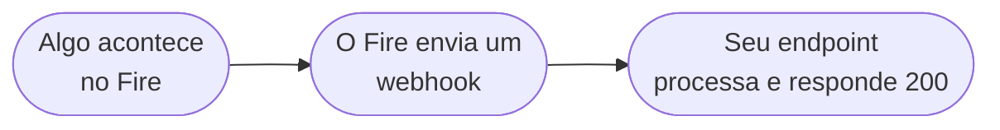

O Fire é um OS de gestão de restaurantes que cuida de lojas, menus, produtos e canais de venda — incluindo web, app, quiosques e agregadores de delivery (iFood, Keeta, 99, Rappi, entre outros).

## Modelo de integração

O Fire é event-driven e bidirecional:

- **O Fire emite eventos** quando ocorrem transições de negócio relevantes — um pedido é completado, um pedido é cancelado, um documento fiscal é autorizado. Você recebe esses eventos através de **Integration Flows** que você configura no dashboard do Fire.
- **O Fire recebe pedidos** injetados pelo seu sistema via API REST.

Hoje o Fire emite quatro tipos de evento em produção: [`order.completed`](/pt/events/order-completed), [`order.cancelled`](/pt/events/order-cancelled), [`order.invoiced`](/pt/events/order-invoiced) e [`order.reversed`](/pt/events/order-reversed).

<Note>
  Um caso de uso comum é um orquestrador de agregadores — um sistema que conecta o Fire a vários agregadores de delivery (iFood, Keeta, 99, Rappi, etc.) e gerencia o fluxo de pedidos entre eles. O modelo de integração funciona igual para qualquer outro tipo de cliente (POS, ERP, faturamento, analítica).
</Note>

## Como os eventos são entregues

O Fire **não** é um único endpoint de webhook global. Cada cliente configura um ou mais **Integration Flows** no dashboard, com escopo na sua account, vendor e (opcionalmente) lojas específicas. Quando ocorre um evento de negócio, o Fire executa cada flow ativo que combina. Cada flow é um grafo de nós que você define — tipicamente um nó HTTP que faz POST para o seu endpoint, mas também pode transformar, ramificar ou chamar serviços internos do Fire.

Veja [Visão geral de eventos](/pt/events/overview) para o modelo event-driven completo e [Integration Flows](/pt/events/integration-flows) para entender como funciona a assinatura.

## O que você constrói

Sua integração precisa:

| Responsabilidade | Direção |
|---|---|
| Configurar um Integration Flow com escopo na sua account/vendor/lojas | Dashboard |
| Expor um endpoint HTTPS para o qual o nó HTTP do flow faz POST | Fire → Seu sistema |
| Autenticar requisições recebidas (Bearer token, API key ou OAuth2 — configurado por flow) | Fire → Seu sistema |
| Processar os eventos que te interessam (`order.completed`, `order.cancelled`, fiscais) | Fire → Seu sistema |
| Injetar pedidos no Fire usando sua API key | Seu sistema → Fire |

Tanto receber eventos quanto chamar a API exigem autenticação. Veja [Autenticação](/pt/authentication) para saber como as credenciais são emitidas e usadas em cada lado.

## Próximos passos

<CardGroup cols={2}>
  <Card title="Conceitos-chave" icon="book" href="/pt/key-concepts">
    Entenda os blocos de construção da integração com o Fire.
  </Card>
  <Card title="Quickstart" icon="rocket" href="/pt/quickstart">
    Coloque sua integração no ar de ponta a ponta.
  </Card>
  <Card title="Tratar eventos de pedido" icon="bolt" href="/pt/guides/handle-order-events">
    Construa um handler de webhook em 10 minutos.
  </Card>
  <Card title="Visão geral de eventos" icon="bell" href="/pt/events/overview">
    O modelo de eventos completo — envelope, entrega, retentativas.
  </Card>
</CardGroup>
